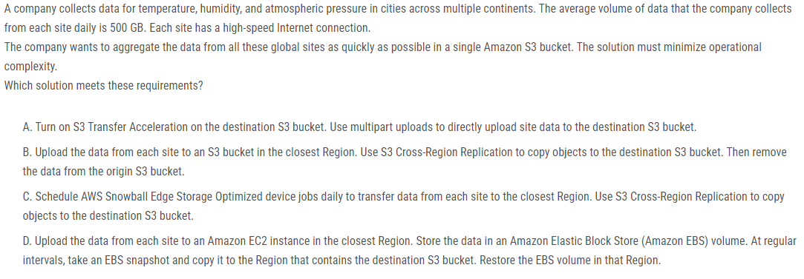
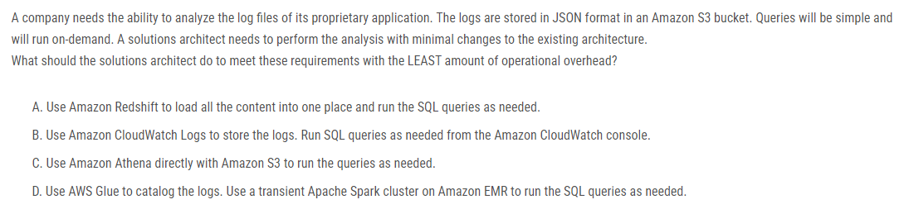
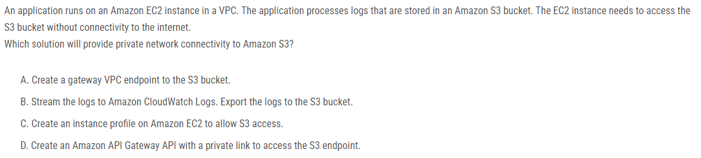
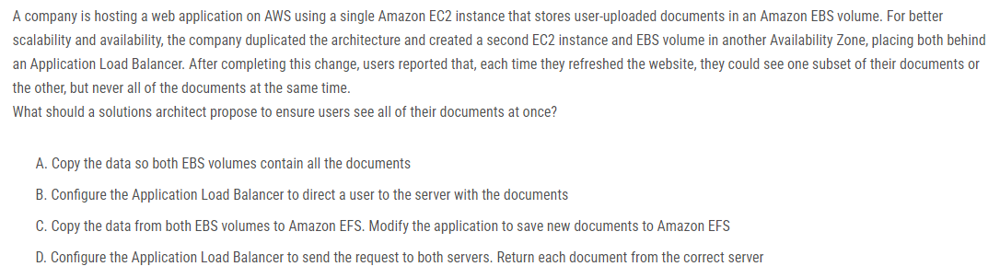
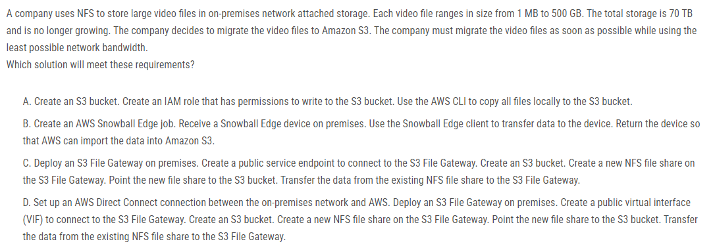
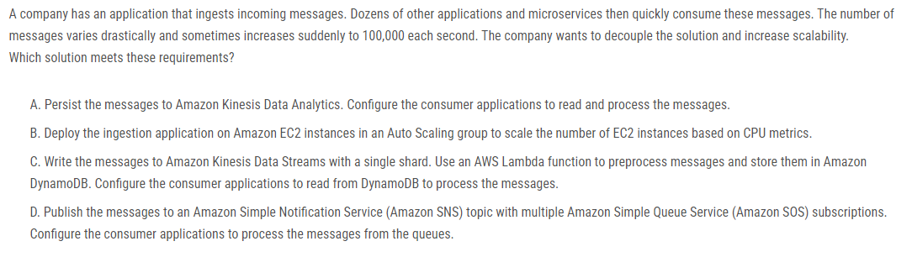
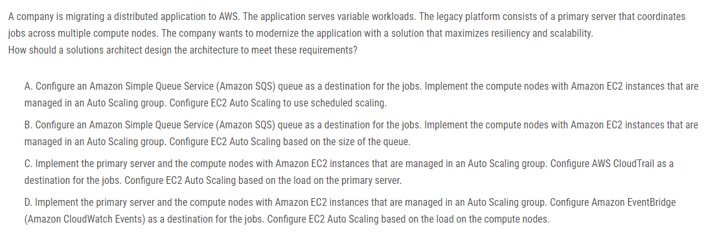
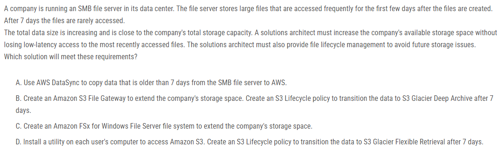
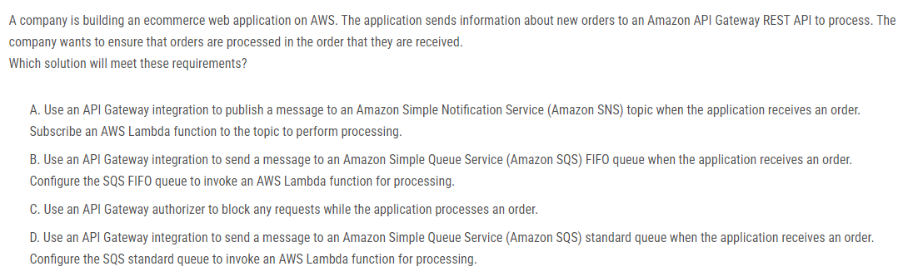

# 총평

정답율 10%

udemy에서 공부한 내용은 거의 안나왔다. 조금 다음번에 풀땐 안틀리길

# 1번

> 정답 A, 못 풀었음,  Udemy 강의 아직 S3 까지 안가서 S3 Transfer Acceleration를 아예 몰랐음

# 2번

> 정답 C, 못 풀었음, https://docs.aws.amazon.com/athena/latest/ug/what-is.html
Amazon Athena는 표준 SQL을 사용하여 Amazon Simple Storage Service(Amazon S3)에서 직접 데이터를 쉽게 분석할 수 있는 `대화형 쿼리 서비스`입니다. AWS Management Console에서 몇 가지 작업을 수행하면 Athena가 Amazon S3에 저장된 데이터를 가리키도록 하고 표준 SQL을 사용하여 임시 쿼리를 실행하고 몇 초 만에 결과를 얻을 수 있습니다.

# 3번

> 정답 A, 못 풀었음, aws:PrincipalOrgID 리소스에 액세스하는 보안 주체가 조직의 계정에 속해 있는지 확인합니다.
https://aws.amazon.com/blogs/security/control-access-to-aws-resources-by-using-the-aws-organization-of-iam-principals/

# 4번

> 정답 A, 못 풀었음, 게이트웨이 VPC 엔드포인트는 추가 비용 없이 S3 버킷에 비공개로 연결할 수 있습니다.

# 5번

> 정답 C, `맞췄음`, Elastic File System으로 알고 있었음

# 6번

> 정답 B, 못 맞춤, B. Snowball Edge 디바이스에서는 최대 100Gbps의 속도로 파일을 복사할 수 있습니다. 70TB는 약 5600초가 소요되므로 매우 빠르며 2시간도 채 걸리지 않습니다. 단점은 디바이스를 받는 데 영업일 기준 4-6일이 소요되고 다시 전송하고 AWS가 데이터를 S2에 도착하면 이동하는 데 영업일 기준 3-3일이 더 걸린다는 것입니다. 총 시간 : 6-9 일. 사용된 대역폭: 0.

# 7번

> 정답 D, 못 맞춤, A가 선택되는 유일한 이유는 들어오는 메시지 속도(100000) 때문입니다. 나는 그 문서를 참조하고 있었다. 표준 토픽 또는 표준 대기열인 경우 무제한 처리량을 지원합니다. 따라서 들어오는 메시지 속도는 옵션 A를 선택하는 기준이 될 수 없습니다

# 8번

> 정답 B, 못 맞춤, Amazon Simple Queue Service(Amazon SQS) 대기열을 작업의 대상으로 구성합니다. Auto Scaling 그룹에서 관리되는 Amazon EC2 인스턴스로 컴퓨팅 노드를 구현합니다. 대기열 크기에 따라 EC2 Auto Scaling을 구성합니다.

# 9번

> 정답 B, 못 맞춤, 짧은 대기 시간은 최신 파일에만 필요합니다. 또한 File GW는 자주 액세스하는 파일을 로컬로 캐싱하여 대기 시간이 짧은 액세스를 제공하므로 대답은 B입니다

# 10번

> 정답 B, 못 맞춤, SQS FIFO 대기열은 메시지 순서를 보장하므로 B여야 합니다.
>>>>>>> 6c78ac855248df699603b2bdaf1c249f54f59b95
