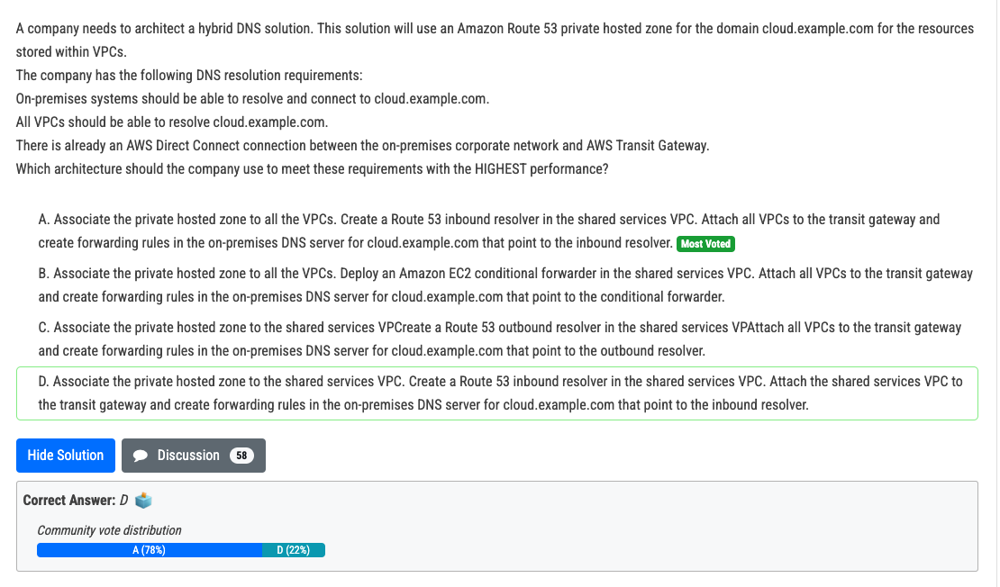
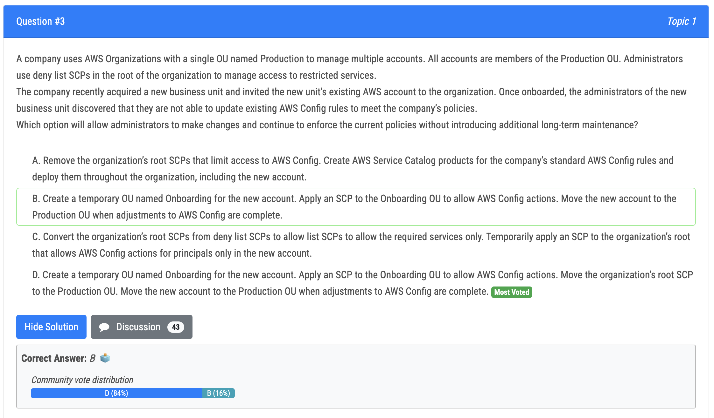
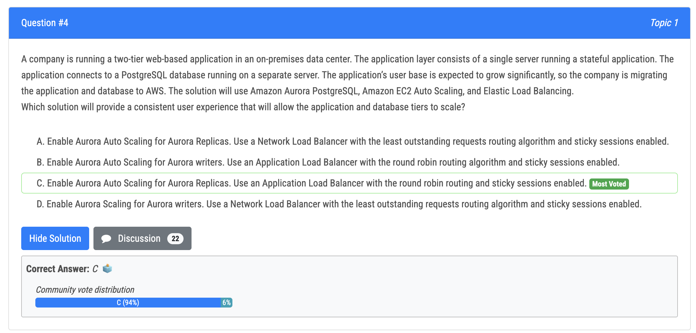
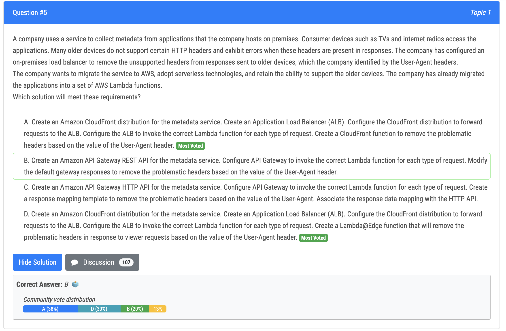
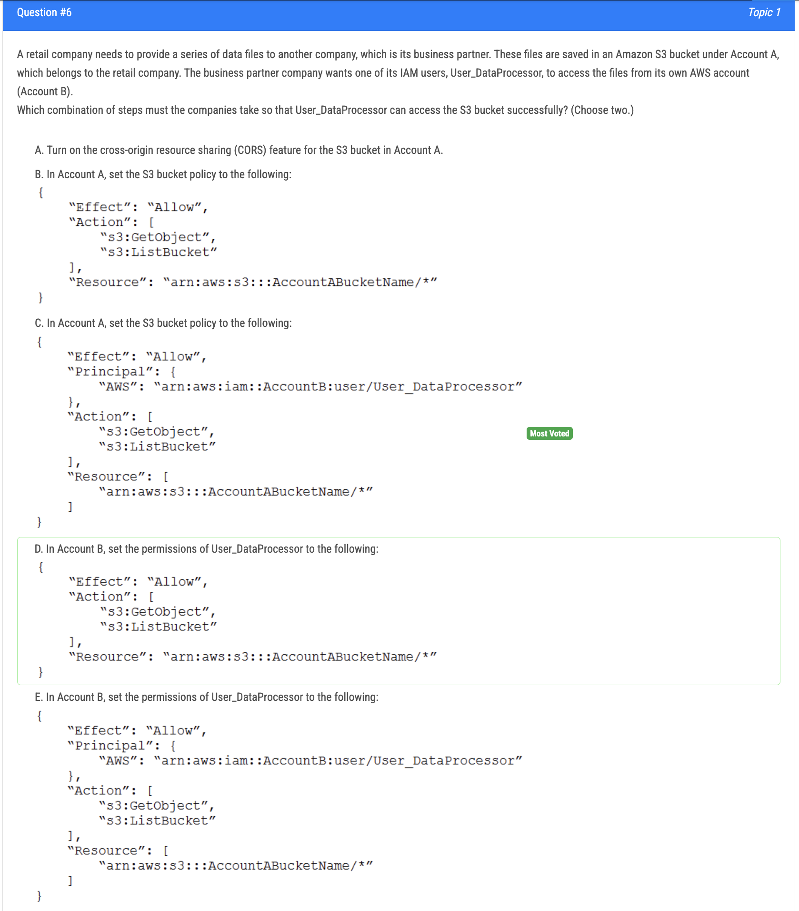
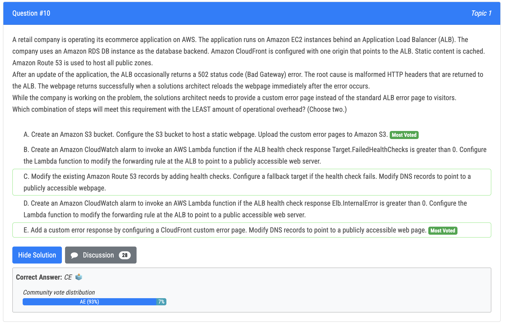

# 1번

- B : EC2 conditional forwarder 는 높은 성능을 낼 수 없음
- C, D : All VPC 를 private host zone 에 연결시켜야 함

# 2번

- 오답 : A - API Gateway 도 옮겨야 함. 그리고 edge-optimized API endpoint 로는 failover 불가능
- 정답 : C - Region failover 를 위해서는 API Gateway 와 Lambda 둘 다 다른 Region 으로 옮겨야 함

# 3번

- 오답 : B -  루트의 SCP 가 여전히 temporary OU 의 Config 를 거부함
- 정답 : D - 상위 레벨이 의해 한번 SCP 정책에 막히면 절대 허용될 수 없기 때문에, 새로운 OU 를 만들고, 루트 SCP 를 Production OU 로 보내야 함

# 4번

- 오답 : A - NLB 는 least outstanding 과 round robin 을 지원하지 않음. 또한 sticky sessions 도 지원하지 않음
- 정답 : C - 제일 이상적인 답변임
- 추가 : writers 는 distractor 보기

# 5번

- A, D 중 하나. CloudFront function 과 Lambda@Edge 둘 다 헤더 변경이 가능하지만 CloudFront function 이 좀 더 많은 처리 가능

# 6번

- 정답 : C, D
  - C : A 계정에서는 B 계정의 IAM 유저의 접근을 허용하는 S3 버킷 정책이 필요하다.
  - D : IAM user 가 필수 동작(getobject, listbucket) 을 수행하도록 하는 IAM Policy 를 생성한다. 이 정책은 S3 버킷의 ARN 을 언급하고 있어야 한다.

# 10번

- 에러 페이지 반환 : A(S3), E(CloudFront)
- 오답 : C - ?