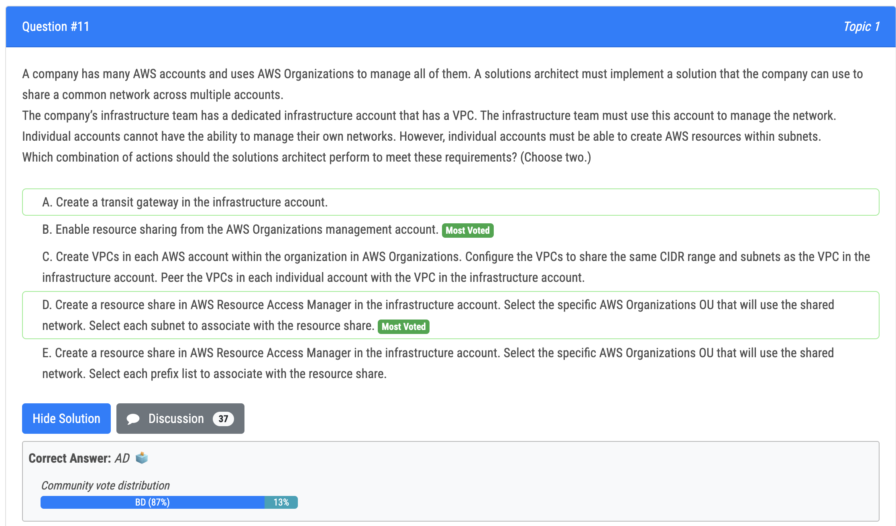
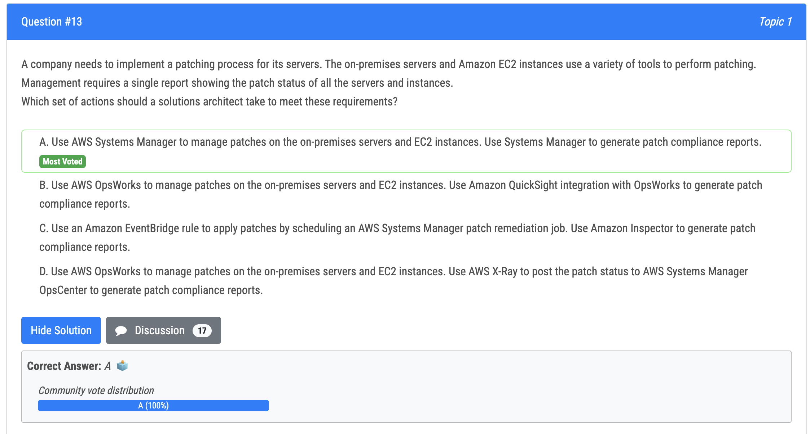
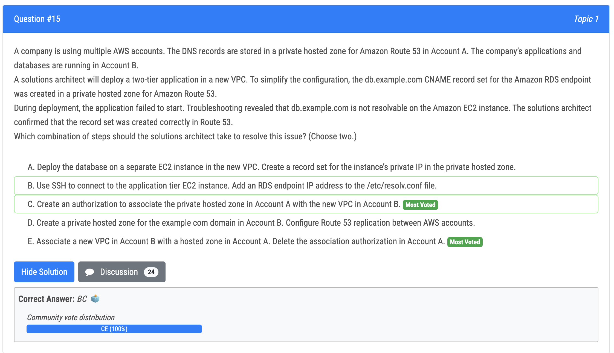
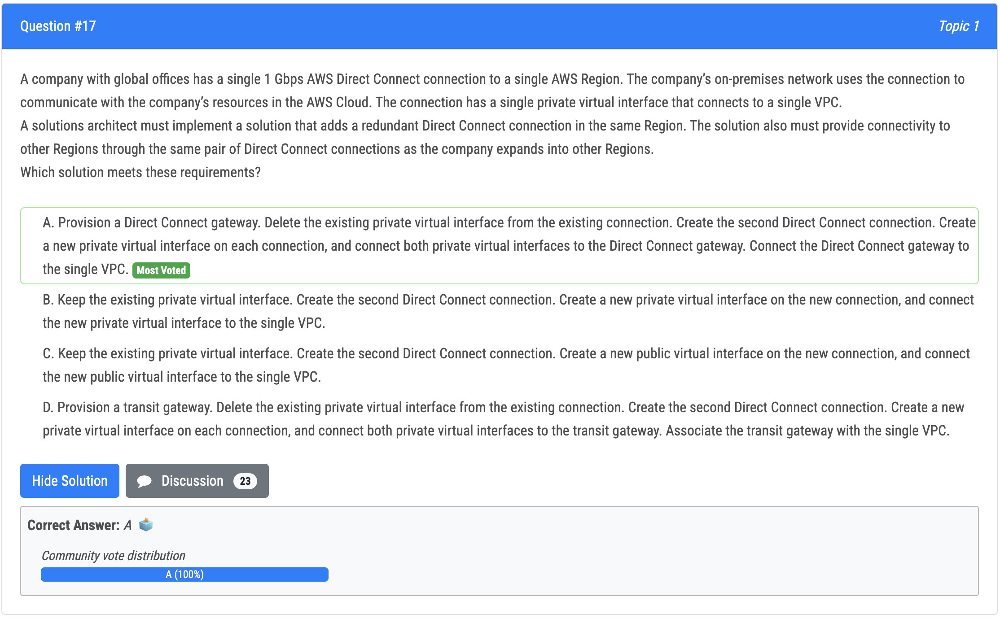
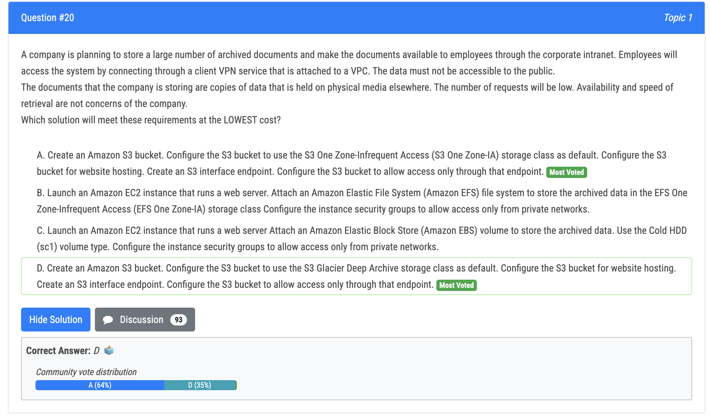

# 11번

- 정답
  - B : 조직에서 계정 간 자원 공유를 가능하게 함
  - D : 인프라의 계정이 조직에 있는 다른 계정과 특정 서브넷을 공유하게 해주고, 따라서 다른 계정들이 해당 서브넷에 네트워크 관리없이 리소스를 생성할 수 있음

# 13번

- 정답 - A : AWS Systems Manager 는 온프레미스 서버와 EC2 에서 패치를 관리할 수 있고 패치 준수 리포트를 만들 수 있음

# 15번

- 정답
  - C : 필수적인 단계로, Account B 의 VPC 는 DNS 레코드를 풀기 위해 Account A 의 private hosted zone 과 연관되어야 함
  - E : association authorization 은 association 이 끝난 후 제거되어야 함

# 17번

- This solution provides a redundant Direct Connect connection in the same Region by creating a new private virtual interface on each connection, and connecting both private virtual interfaces to a Direct Connect gateway. The Direct Connect gateway is then connected to the single VPC. This solution also allows the company to expand into other Regions while providing connectivity through the same pair of Direct Connect connections. The Direct Connect Gateway allows you to connect multiple VPCs and on-premises networks in different accounts and different regions to a single Direct Connect connection. It also provides automatic failover and routing capabilities.
- Option D is not the best solution because it uses a Transit Gateway, which is used to connect multiple VPCs and on-premises networks in different accounts and different regions, but it is not necessary in this scenario. The company only wants to add a redundant Direct Connect connection in the same Region and connect it to the same VPC. Additionally, using a Transit Gateway in this scenario would add more complexity and might not be necessary. Also, Transit Gateway does not provide automatic failover and routing capabilities, which is required in this scenario. The Direct Connect Gateway is a better choice in this scenario as it provides the necessary functionality of automatic failover and routing capabilities, and it is more suitable for connecting multiple Direct Connect connections to a single VPC.

# 20번

- 정답 - A
- 오답 - D : Glacier 는 website hosting 이 불가능