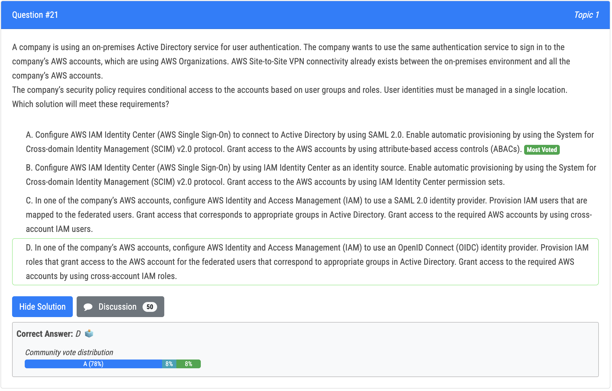
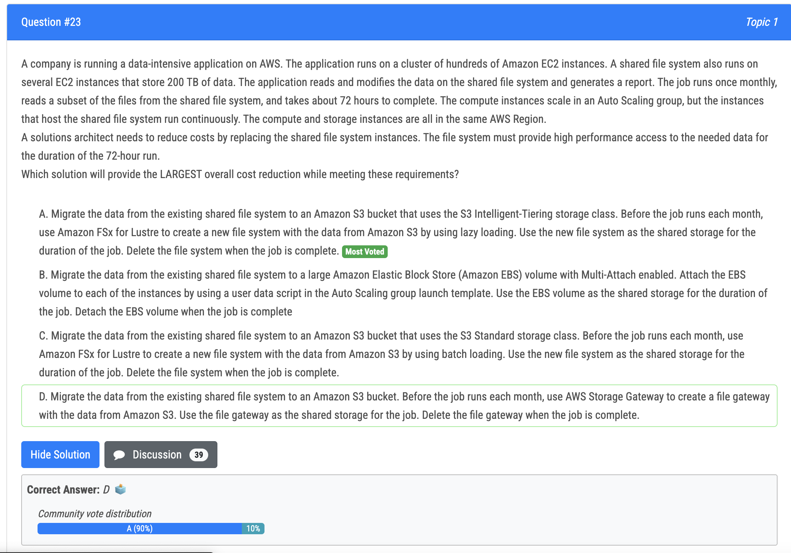
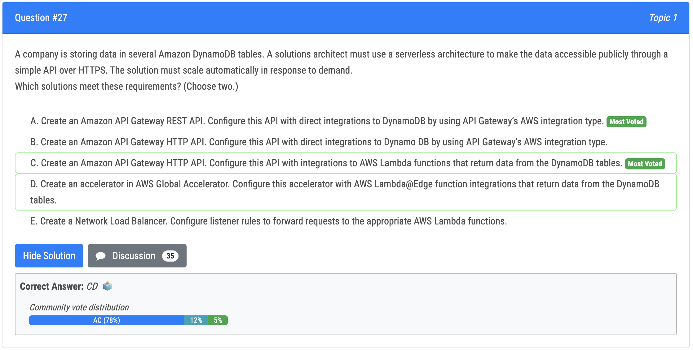
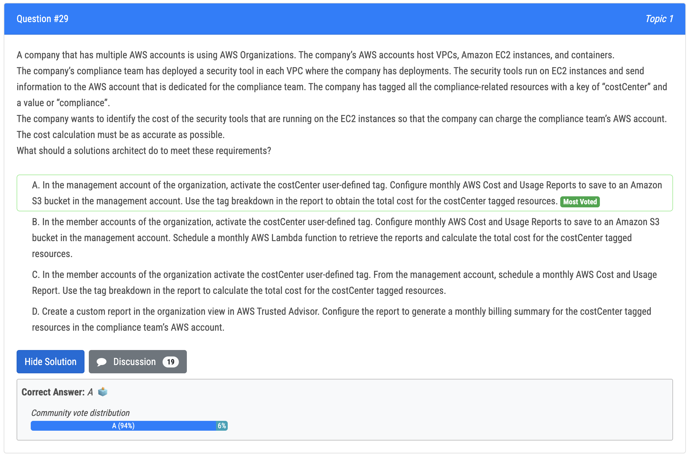
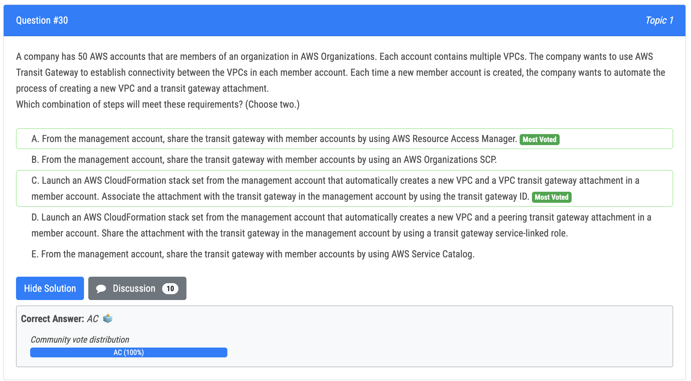

# 21번

- 정답 - A : ABAC(attribute-based access control) 은 유저, 리소스, 액션 속성을 기반으로 리소스에 대한 접근을 허락하는 방식임. 이것은 세분화된 접근 제어를 가능하게 하고, 유저 그룹과 역할을 기반으로 한 계정에 대한 조건부 접근을 요구하는 보안 정책을 이행하는데 유용함. AWS IAM Identity Center (AWS SSO) 는 SAML 2.0 을 이용하여 온프레미스 AD 서비스에 연결할 수 있게함. 이것으로 사용자는 SCIM v2.0 protocol 을 사용함으로써 자동적인 확장이 가능하고, 이를 통해 단일 위치에 대한 user identities 의 관리를 할 수 있게 됨
- 오답 - D : openID based, MS AD would not support this 

# 22번

- 정답 - B : API 스로틀링은 요청 비율을 조정할 수 있는 기술임. 이것은 적은 수의 클라이언트가 많은 요청을 할 때 유용함. 클라이언트 요청의 제한을 걸 수 있음. 클라이언트 애플리케이션은 429 코드를 에러없이 처리하는 게 중요한데, 이는 사용자 경험을 위해서임. 또한 API 의 평판을 보호함

# 23번

- A: Lazy loading is cost-effective because only a subset of data is used at every job 
- B: There are hundreds of EC2 instances using the volume which is not possible (one EBS volume is limited to 16 nitro instances attached) 
- C: Batching would load too much data 
- D: storage gateway is used for on premises data access, I don't know is you can install a gateway in AWS, but Amazon would never advise this

# 24번

- 정답 - C : static IP -> NLB / multi AZ 를 위해 IP 를 각 AZ 에 할당

# 27번

- 정답
  - A : REST API 는 직접적으로 dynamoDB 를 호출할 수 있음
  - C : HTTP API + Lambda + DynamoDB

# 29번

- 정답 - A : user 와 상관없이 management account 사용.

# 30번

- 정답 
  - A : management account 가 리소스를 멤버 account 와 공유하게 해주는 AWS Resource Access Manager 를 사용함으로써 transit gateway 를 공유할 수 있음
  - C : 멤버 계정 생성 시 새 VPC 생성과 transit gateway 부착을 자동적으로 하면서 운영적 이점을 얻을 수 있음

sharing the transit gateway with member accounts by using AWS Resource Access Manager, which allows the management account to share resources with member accounts. Option C is launching an AWS CloudFormation stack set from the management account that automatically creates a new VPC and a VPC transit gateway attachment in a member account, and associates the attachment with the transit gateway in the management account by using the transit gateway ID. This automation of creating a new VPC and transit gateway attachment in new member accounts can help to streamline the process and reduce operational effort.