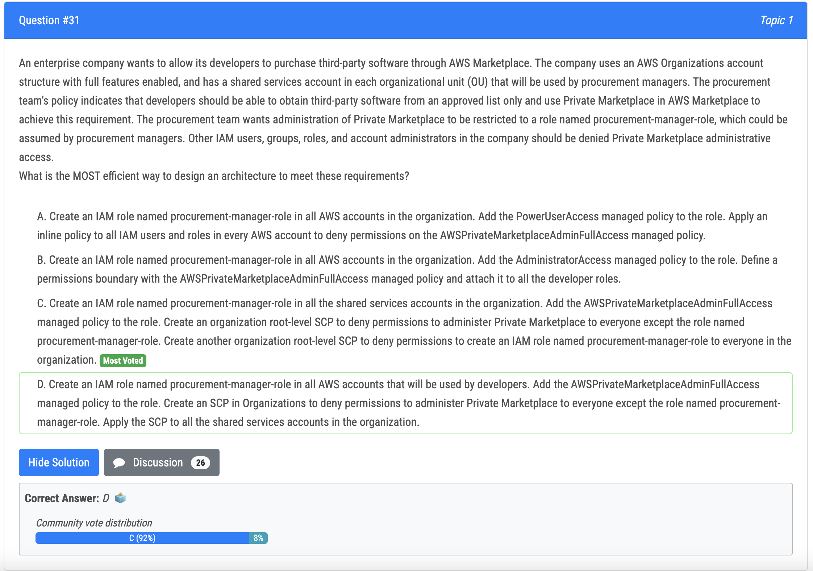
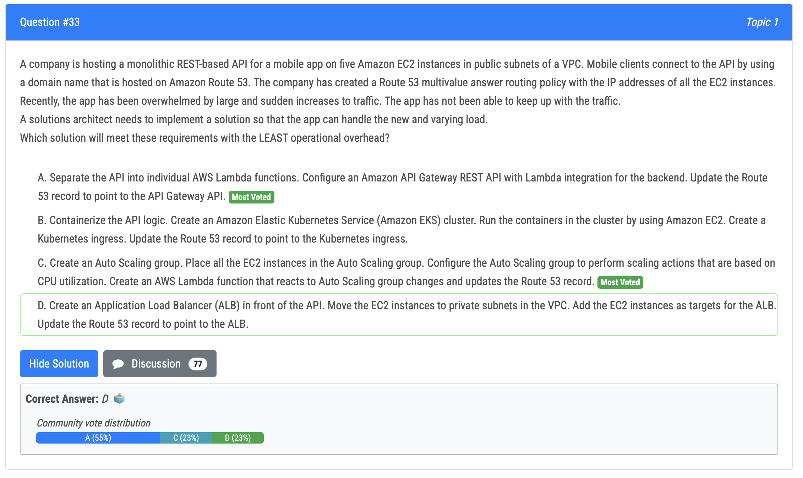
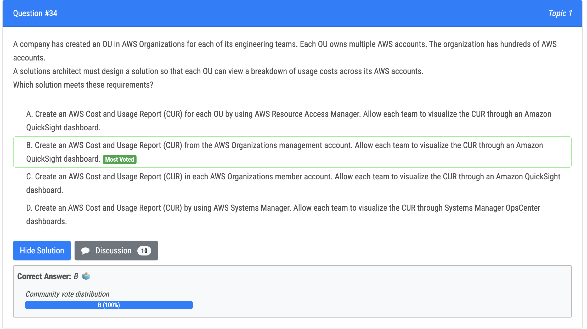
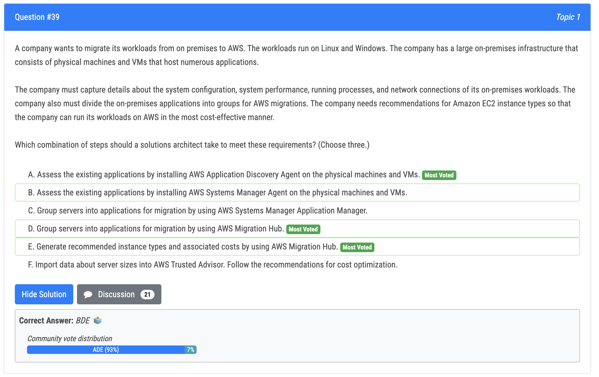

# 31번

- 정답 - C : shared service account 에서만 필요한 역할을 설정하고, procurement-manager-role 을 제외한 모두를 SCP 설정으로 private marketplace 를 허용하지 않음. 또한 procurement-manager-role 을 생성하지 못하게 함
- 오답
  - A : procurement mangers 가 각각의 조직 유닛에서 shared services 계정을 하용하도록 강제하는 요구사항을 이행하지 않음

Not A as it does not implement the requirement to enforce procurement managers to use the shared services account in each organizational unit Not B as this would allow developers to administer private market place not D as this would allow developers to administer private market place C is correct as it configure the required role (with required permission) only in the shared service account, uses an SCP to deny private market place management to to everyone except the role named procurement-manager-role and another SCP to prevent creating a role nmaed procurement-manager-role

# 33번

- 정답 - A : lambda 로 옮기는 게 개발적인 부담이 있을 수 있으나, 운영적 오버헤드는 줄어듦
- 오답 - D : EC2 에서 서버를 운영하는 게 운영적 부담은 큼

# 34번

- 정답 - B : AWS Organizations management account 에서 CUR 을 만들 수 있고, 이를 통해 모든 멤버들의 비용 사용량을 볼 수 있음

# 39번

- 정답
  - A : aws application discovery 가 필요함. 해당 서비스가 agent 제공
  - D : aws migration hub 를 통해 애플리케이션의 그룹 서버로 사용할 수 있음
  - E as AWS Migration Hub allows to generate recommendation for instance types

A vs B -> A because we need to use AWS Application Discovery and it provides its own agent https://docs.aws.amazon.com/application-discovery/latest/userguide/discovery-agent.html C vs D -> D because AWS Application Discovery is integrated with AWS Migration Hub and it can be used to group servers into applications https://aws.amazon.com/migration-hub/faqs/#:~:text=How%20do%20I%20group%20servers%20into%20an%20application%3F E vs. F -> E as AWS Migration Hub allows to generate recommendation for instance types https://docs.aws.amazon.com/migrationhub/latest/ug/ec2-recommendations.html

