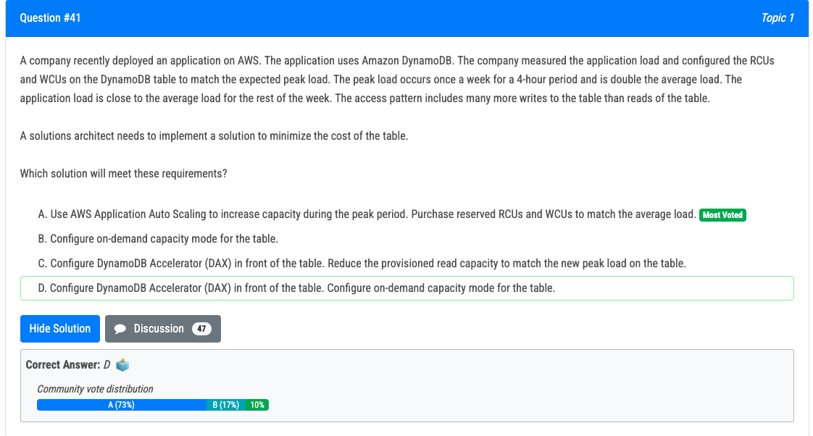
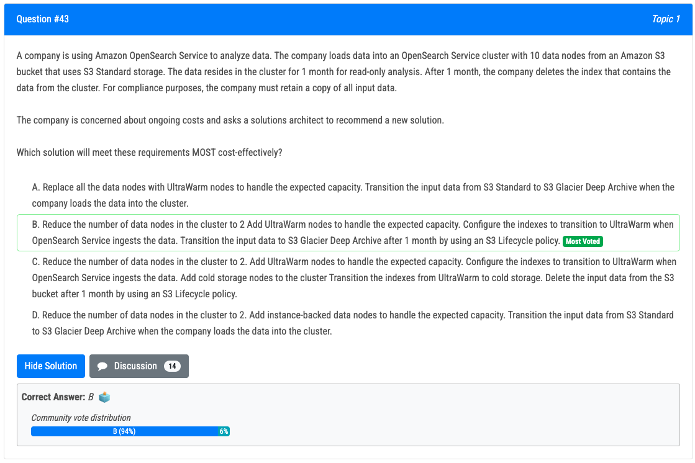
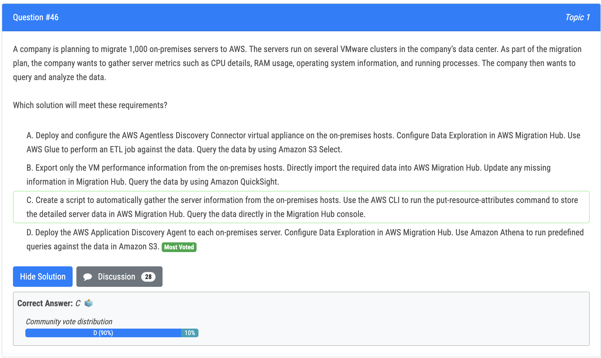
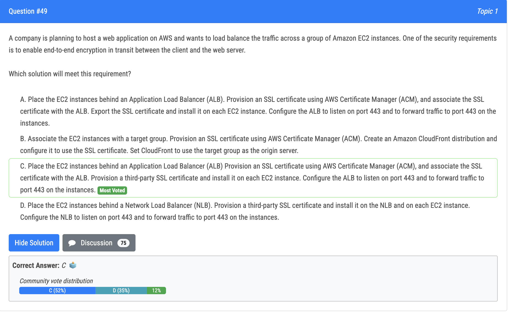

# 41번

- 정답 - A : 온디맨드 모드는 예측불가능한 load 패턴에서 사용하고, auto scaling 은 예측 가능할 때 스케줄링 등을 통해 사용

# 43번

- 정답 - B : 데이터 노드들의 수를 줄이고 UltraWarm 노드들을 예상되는 용량을 다루기 위해 추가한다는 점에서 비용 효율적임. opensearch service 가 데이터를 넣을 때 UltraWarm 으로 전환하는 인덱스를 구성함으로써 회사는 UltraWarm 의 낮은 스토리지 비용에서 이점을 얻을 수 있음. 그리고 1개월 후 데이터를 glacier 에 넣으면서 더 비용효율적임 
- 오답 - C : 요구사항을 만조가긴 하나, 다른 storage 티어 사이의 인덱스 전환 구성으로 인한 추가적인 복잡성때문에 cost-effective 하지 않음

# 46번

- 정답 - D
- The correct answer is D: Deploy the AWS Application Discovery Agent to each on-premises server. Configure Data Exploration in AWS Migration Hub. Use Amazon Athena to run predefined queries against the data in Amazon S3. 
- Here is why the other choices are not correct: 
  - A. AWS Agentless Discovery Connector will help in discovering and inventory servers but it does not provide the same level of detailed metrics as the AWS Application Discovery Agent, it also does not cover process information.
  - B. It does not cover process information and it's not the best way to collect the required data, it's not efficient and it might miss some important information. 
  - C.  this solution might not be very reliable and it does not cover process information, also it does not provide a way to query and analyze the data.

# 49번

- 정답 - C : ACM 은 ec2 에 설치될 수 없기 때문에 third-party SSL 을 설치해야 함. 그러면 C, D 중 하나인데, D 는 NLB 이기 때문에 C 를 선택

