# 1번

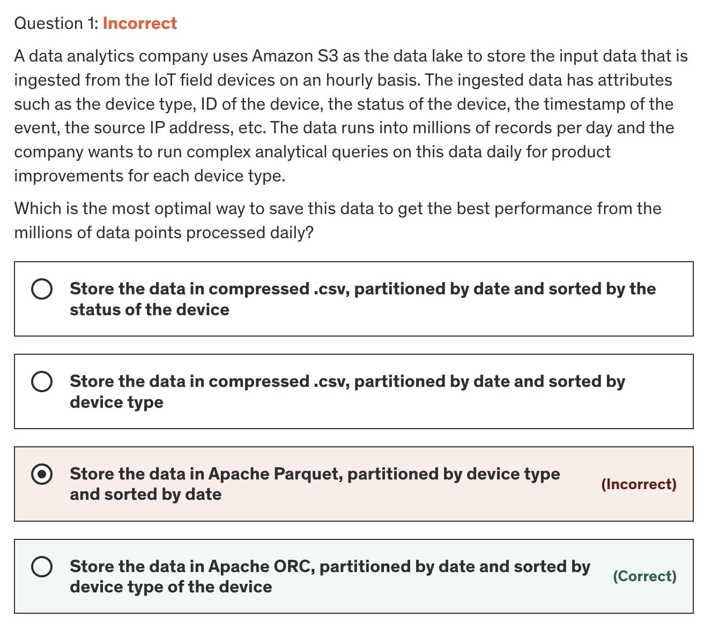

- Apache Parquet 과 ORC 는 컬럼 스토리지로, 데이터를 빠르게 얻는데 최적화되어 있으며 AWS 분석 애플리케이션으로 사용됨
- 데이터를 파티셔닝함으로써 각 쿼리에 의해 스캔되는 데이터량을 줄일 수 있음
- 예를 들어 매시간 들어오는 데이터를 가진 사용자는 년, 월, 일, 시간 단위로 파티셔닝할 수 있음 (muli-level partitioning 가능)
- 따라서 문제에서 일일 단위의 분석을 하므로 일 단위로 파티셔닝을 할 수 있음

# 2번

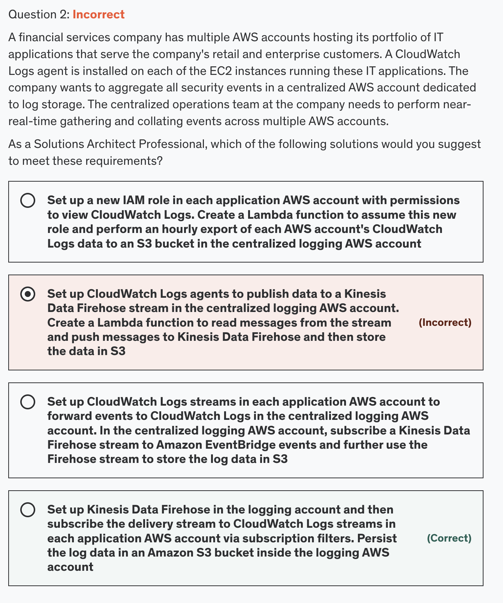

- 다른 aws 계정의 cloudwatch logs 를 모으고 합치기 위해 kinesis data firehose 를 구성할 수 있음
- 그리고 cloudwatch logs destination 을 사용하고 subscription filter 를 생성해서 중앙화된 로깅 aws account 로 로그 이벤트를 받을 수 있음
- 이 로그 이벤트 데이터는 중앙화된 kinesis firehose 스트림에서 처리와 분석으로 수행되며 읽어짐
- B 가 아닌 이유
  - cloudwatch logs agent 는 데이터를 firehose 스트림으로 넣을 수 없음

#  3번

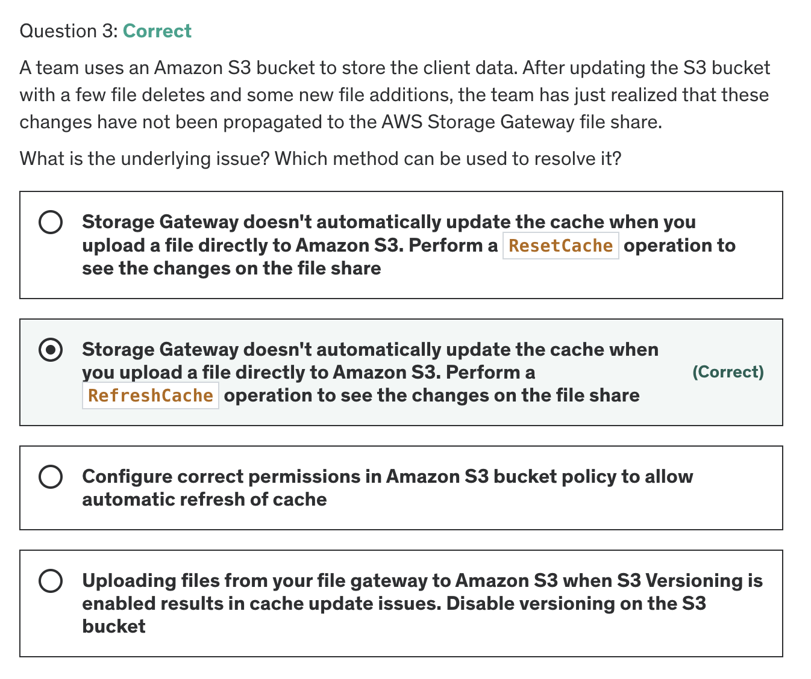

- storage gateway 는 file share 를 통해 file 을 write 할 때 자동적으로 캐시를 업데이트함.
- 하지만 s3 로 직접 올리면 캐시를 자동으로 업데이트하지 않음
- 이걸 할려면 `RefreshCache` 동작을 수행해야 함
- 이는 storage gateway 콘솔이나 aws CLI 로 가능함

# 4번

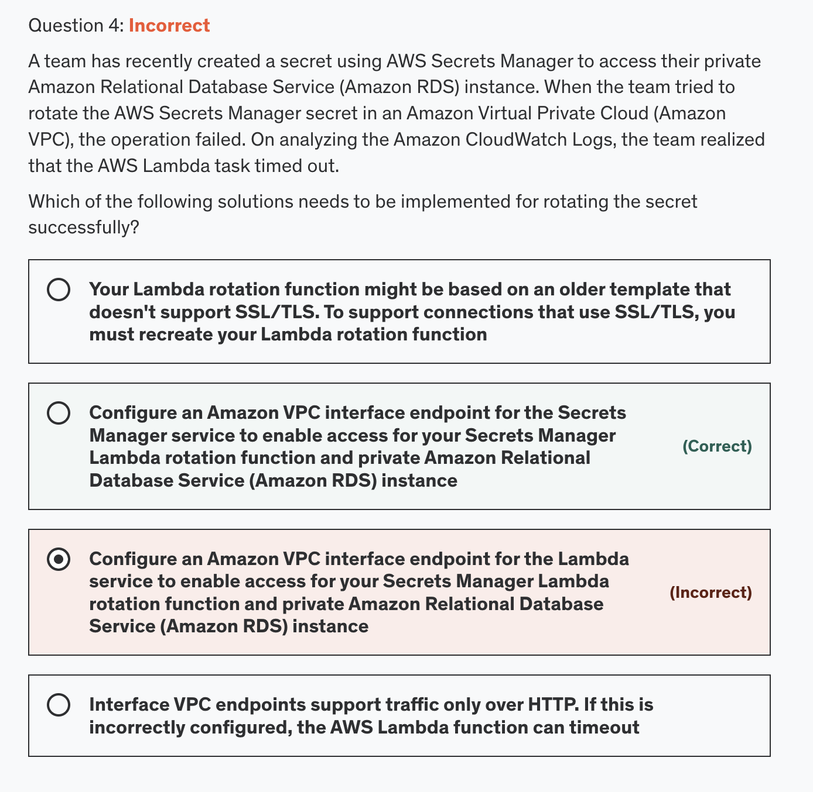

- secret manager 는 VPC private subnet 에 있는 aws 서비스는 인터넷 접근이 안되기 때문에 secret 을 rotate 할 수 없음
- 따라서 rotate 하려면 vpc interface endpoint 를 구성해서 secret manager lambda function 과 RDS 인스턴스에 접근 가능하도록 해야 함

# 6번

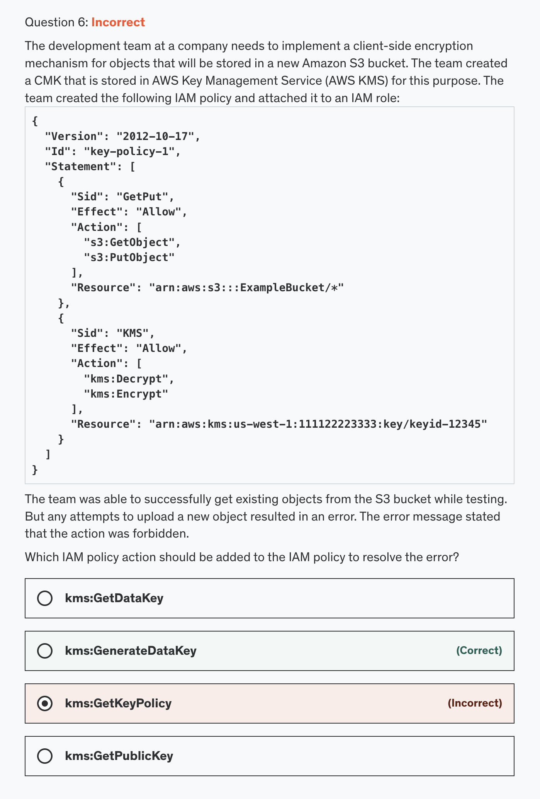

- kms:GenerateDataKey : aws kms 의 외부에서의 사용을 위해 고유한 symmetric data key 를 반환함
  - 이 동작은 data key 의 plaintext 복사본과 사용자가 지정한 symmetric encryption KMS 키로 암호화된 복사본을 반환함
  - plaintext key 안의 바이트들은 랜덤이며 caller 나 KMS 키와 관련없음
  - plaintext key 로 AWS KMS 외부의 데이터를 암호화하는 데 사용할 수 있고 encrypted data 로 encrypted data key 를 저장할 수 있음
- 오답
  - kms:GetPublicKey - This option returns the public key of an asymmetric KMS key. Unlike the private key of an asymmetric KMS key, which never leaves AWS KMS unencrypted, callers with kms:GetPublicKey permission can download the public key of an asymmetric KMS key. It cannot be used for a client-side encryption mechanism.
  - kms:GetKeyPolicy - This option gets a key policy attached to the specified KMS key. It cannot be used for a client-side encryption mechanism.
  - kms:GetDataKey - This is a made-up option that serves as a distractor.

# 8번

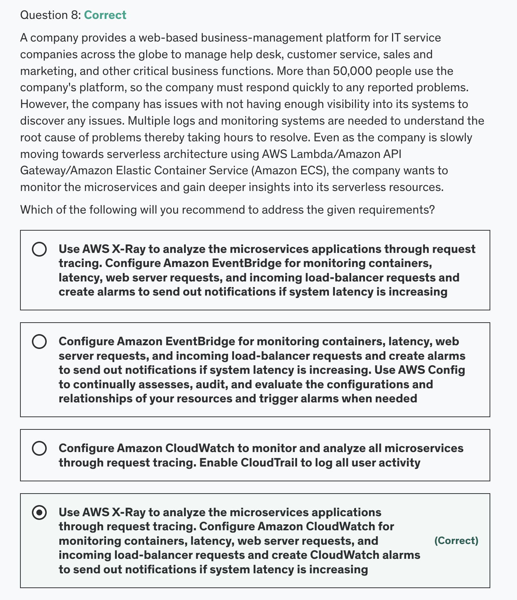

- x-ray 는 microservice architecture 에서 특정 서비스나 이슈를 분석하는 데 사용할 수 있는 데이터를 추적하는데 사용
- cloudwatch 는 인프라의 매트릭을 수집할 수 있게 함

# 9번

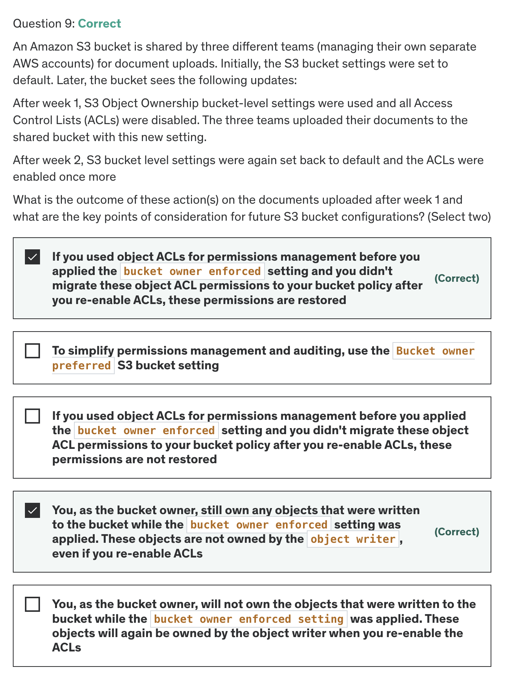

- You can re-enable ACLs by changing from the bucket owner-enforced setting to another Object Ownership setting at any time. If you used object ACLs for permissions management before you applied the bucket owner-enforced setting and you didn't migrate these object ACL permissions to your bucket policy, after you re-enable ACLs, these permissions are restored. Additionally, objects written to the bucket while the bucket owner enforced setting was applied are still owned by the bucket owner.

  For example, if you change from the bucket owner-enforced setting back to object writer, you, as the bucket owner, no longer own and have full control over objects that were previously owned by other AWS accounts. Instead, the uploading accounts again own these objects. Objects owned by other accounts use ACLs for permissions, so you can't use policies to grant permissions to these objects. However, you, as the bucket owner, still own any objects that were written to the bucket while the bucket owner-enforced setting was applied. These objects are not owned by the object writer, even if you re-enable ACLs.

# 10번

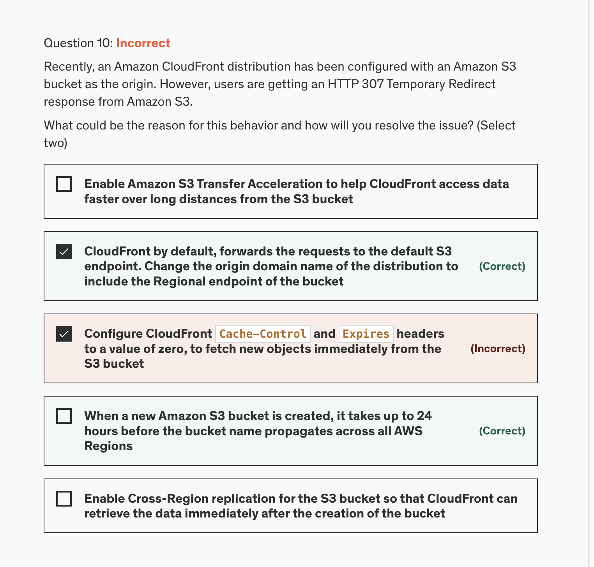

- After you create an Amazon S3 bucket, up to 24 hours can pass before the bucket name propagates across all AWS Regions. During this time, you might receive the 307 Temporary Redirect response for requests to Regional endpoints that aren't in the same Region as your bucket.

  To avoid the 307 Temporary Redirect response, send requests only to the Regional endpoint in the same Region as your S3 bucket. If you're using an Amazon CloudFront distribution with an Amazon S3 origin, CloudFront forwards requests to the default S3 endpoint ( s3.amazonaws.com). The default S3 endpoint is in the us-east-1 Region. If you must access Amazon S3 within the first 24 hours of creating the bucket, you can change the origin domain name of the distribution. The domain name must include the Regional endpoint of the bucket. For example, if the bucket is in us-west-2, you can change the origin domain name from awsexamplebucketname.s3.amazonaws.com to awsexamplebucket.s3.us-west-2.amazonaws.com.

# 11번

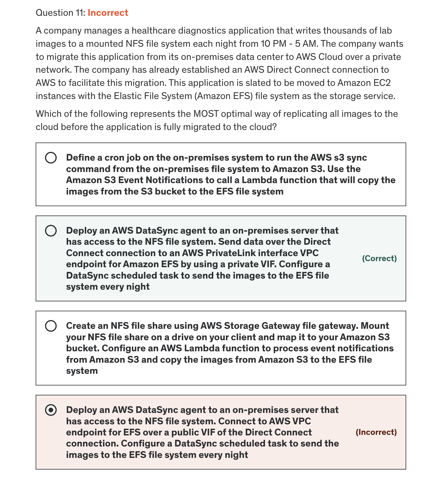

- ou can use VPC endpoints to ensure data transferred between your AWS DataSync agent, either deployed on-premises or in-cloud, doesn't traverse the public internet or need public IP addresses. Using VPC endpoints increases the security of your data by keeping network traffic within your Amazon Virtual Private Cloud (Amazon VPC). VPC endpoints for DataSync are powered by AWS PrivateLink, a highly available, scalable technology that enables you to privately connect your VPC to supported AWS services.

  The DataSync agent transfers data between your storage and AWS. In most situations, you deploy the agent as a virtual machine in the same local network as your source storage. This approach minimizes network overhead associated with transferring data by using network protocols such as Network File System (NFS) and Server Message Block (SMB) or when accessing your object storage that's compatible with the Amazon S3 API. This setup is common regardless of the endpoint type you use to connect your agent to AWS.

  When you use a VPC endpoint, your DataSync agent communicates directly with AWS without crossing the public internet. Data is transferred using AWS Direct Connect or a virtual private network (VPN). The private IP addresses that DataSync creates for the transfer are accessible only from inside your VPC.

  Reference architecture of using DataSync with VPC endpoints:

- 오답 - D : A VPC endpoint allows you to privately connect your VPC to supported AWS services without requiring an internet gateway or a NAT device, VPN connection, or AWS Direct Connect connection. A public virtual interface (VIF) can access all AWS public services using public IP addresses. You cannot leverage public VIF to access the VPC endpoint for EFS. Therefore this option is incorrect.

# 15번

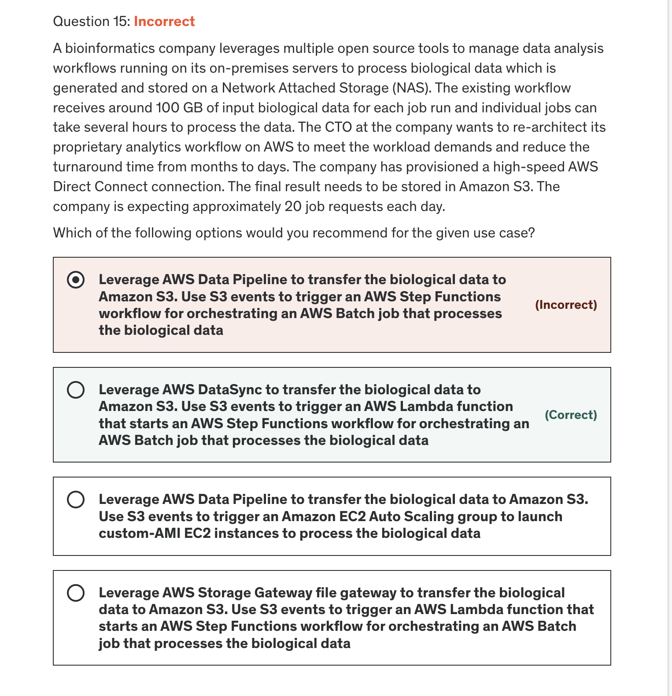

- AWS DataSync is an online data movement and discovery service that simplifies and accelerates data migrations to AWS as well as moving data between on-premises storage, edge locations, other clouds, and AWS Storage. You can use DataSync to migrate active data to AWS, archive data to free up on-premises storage capacity, replicate data to AWS for business continuity, or transfer data to the cloud for analysis and processing.
- For data transfer between on-premises and AWS Storage services, a single DataSync task is capable of fully utilizing a 10 Gbps network link. Since each workflow job consumes around 100GB of data and the company sees approximately 20 runs every day, DataSync can easily handle such active data transfer workloads. For the given use case, you can then configure an S3 event to trigger an AWS Lambda function that starts an AWS Step Functions workflow for orchestrating an AWS Batch job that processes the biological data.
- 오답 - A : You cannot trigger an AWS Step Function directly from an S3 event, so this option is incorrect.

# 18번

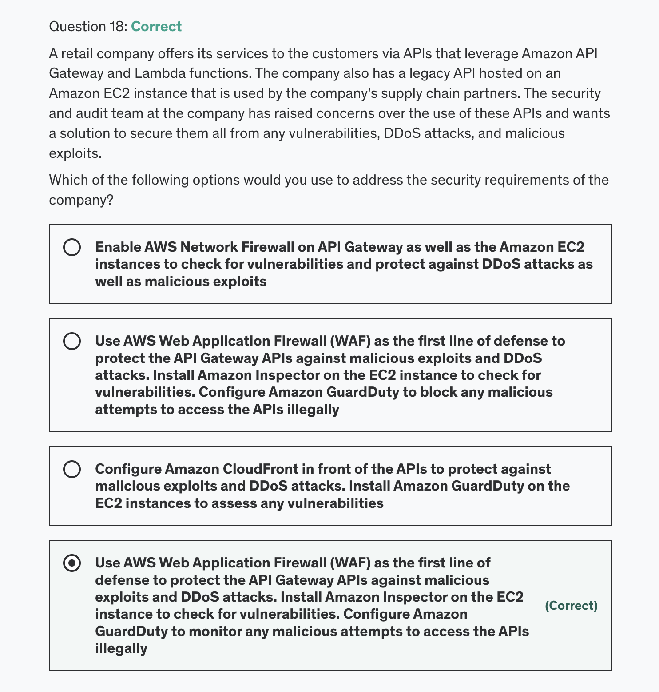

- AWS WAF is a web application firewall that helps protect web applications and APIs from attacks. It enables you to configure a set of rules (called a web access control list (web ACL)) that allow, block, or count web requests based on customizable web security rules and conditions that you define. You can protect the following resource types:

  1. Amazon CloudFront distribution
  2. Amazon API Gateway REST API
  3. Application Load Balancer
  4. AWS AppSync GraphQL API
  5. Amazon Cognito user pool

  You can use AWS WAF to protect your API Gateway API from common web exploits, such as SQL injection and cross-site scripting (XSS) attacks. These could affect API availability and performance, compromise security, or consume excessive resources. For example, you can create rules to allow or block requests from specified IP address ranges, requests from CIDR blocks, requests that originate from a specific country or region, requests that contain malicious SQL code, or requests that contain malicious scripts.

  DDoS attacks are attempts by an attacker to disrupt the availability of targeted systems. For infrastructure layer attacks, you can use AWS services such as Amazon CloudFront and Elastic Load Balancing (ELB) to provide automatic DDoS protection. For application layer attacks, you can use AWS WAF as the primary mitigation. AWS WAF web access control lists (web ACLs) minimize the effects of a DDoS attack at the application layer.

- GuardDuty is an intelligent threat detection service that continuously monitors your AWS accounts, Amazon Elastic Compute Cloud (EC2) instances, Amazon Elastic Kubernetes Service (EKS) clusters, and data stored in Amazon Simple Storage Service (S3) for malicious activity without the use of security software or agents. If potential malicious activity, such as anomalous behavior, credential exfiltration, or command and control infrastructure (C2) communication is detected, GuardDuty generates detailed security findings that can be used for security visibility and assisting in remediation. GuardDuty can monitor reconnaissance activities by an attacker such as unusual API activity, intra-VPC port scanning, unusual patterns of failed login requests, or unblocked port probing from a known bad IP.

# 20번

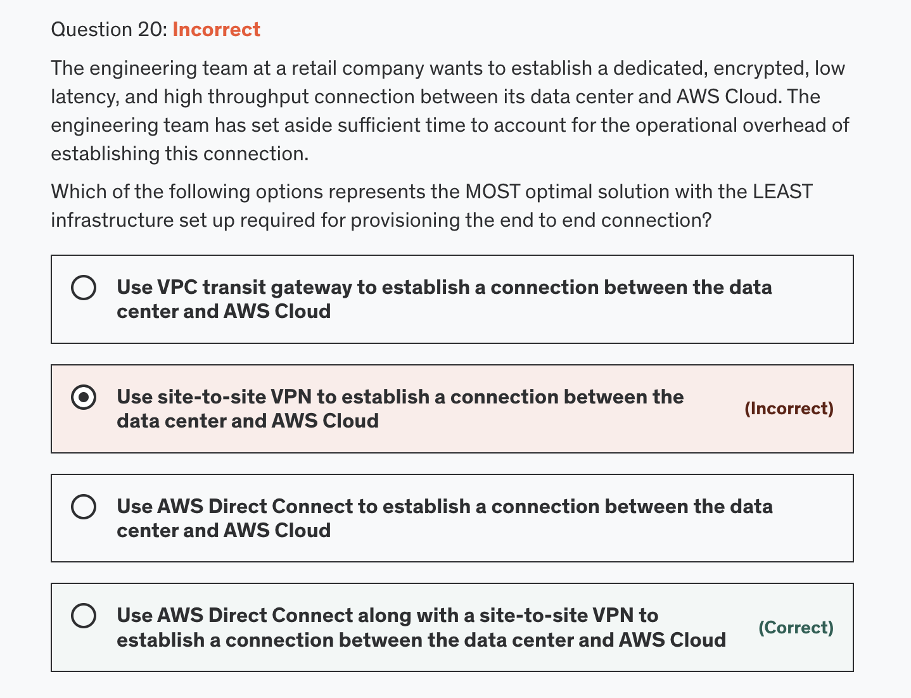

- WS Direct Connect is a cloud service solution that makes it easy to establish a dedicated network connection from your premises to AWS. AWS Direct Connect lets you establish a dedicated network connection between your network and one of the AWS Direct Connect locations.

  With AWS Direct Connect plus VPN, you can combine one or more AWS Direct Connect dedicated network connections with the Amazon VPC VPN. This combination provides an IPsec-encrypted private connection that also reduces network costs, increases bandwidth throughput, and provides a more consistent network experience than internet-based VPN connections. This solution combines the AWS managed benefits of the VPN solution with low latency, increased bandwidth, more consistent benefits of the AWS Direct Connect solution, and an end-to-end, secure IPsec connection. Therefore, AWS Direct Connect plus VPN is the correct solution for this use-case.

# 21번

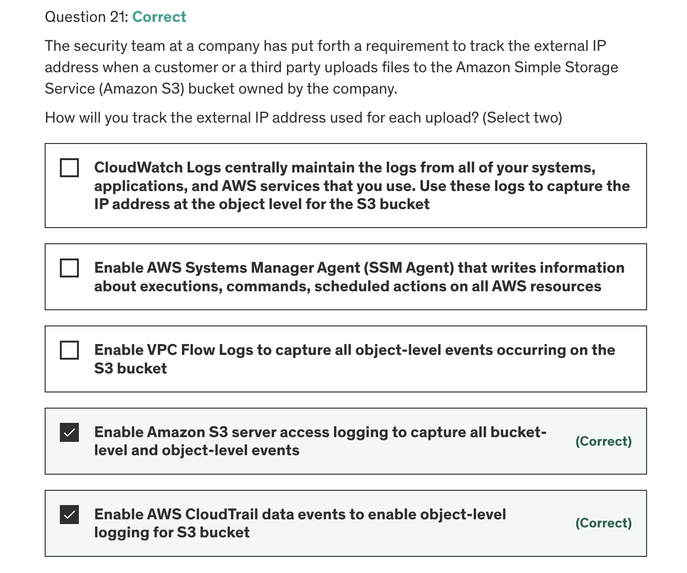

- To find the IP addresses for object-level requests to Amazon S3 (uploads and downloads), you must first enable one of the following logging methods:
  1. Amazon S3 server access logging captures all bucket-level and object-level events. These logs use a format similar to Apache web server logs. After you enable server access logging, review the logs to find the IP addresses used with each upload to your bucket.
  2. AWS CloudTrail data events capture the last 90 days of bucket-level events (for example, PutBucketPolicy and DeleteBucketPolicy), and you can enable object-level logging. These logs use a JSON format. After you enable object-level logging with data events, review the logs to find the IP addresses used with each upload to your bucket. It might take a few hours for AWS CloudTrail to start creating logs.

# 23번

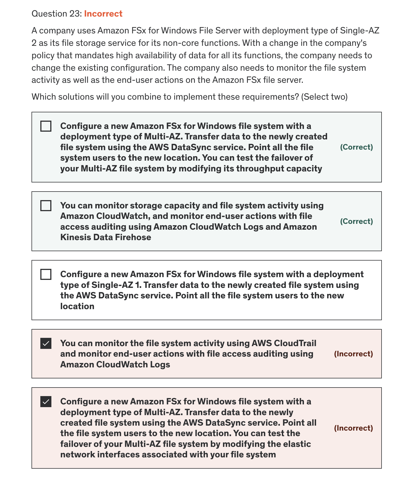

- In a Multi-AZ deployment, Amazon FSx automatically provisions and maintains a standby file server in a different Availability Zone. Any changes written to disk in your file system are synchronously replicated across Availability Zones to the standby. If there is planned file system maintenance or unplanned service disruption, Amazon FSx automatically fails over to the secondary file server, allowing you to continue accessing your data without manual intervention. Multi-AZ file systems are recommended for most production workloads that require high availability of shared Windows file data.

  To migrate your existing files to FSx for Windows File Server file systems, AWS recommends using AWS DataSync, an online data transfer service designed to simplify, automate, and accelerate copying large amounts of data to and from AWS storage services. DataSync copies data over the internet or AWS Direct Connect.

  You can test the failover of your Multi-AZ file system by modifying its throughput capacity. When you modify your file system's throughput capacity, Amazon FSx switches out the file system's file server. Multi-AZ file systems automatically fail over to the secondary server while Amazon FSx replaces the preferred server file server first. Then the file system automatically fails back to the new primary server and Amazon FSx replaces the secondary file server.

- You can monitor storage capacity and file system activity using Amazon CloudWatch. You can monitor end-user actions with file access auditing at any time (during or after the creation of a file system) via the AWS Management Console or the Amazon FSx CLI or API. You can also change the destination for publishing user access events by logging these events to CloudWatch Logs or streaming to Kinesis Data Firehose.

# 24번

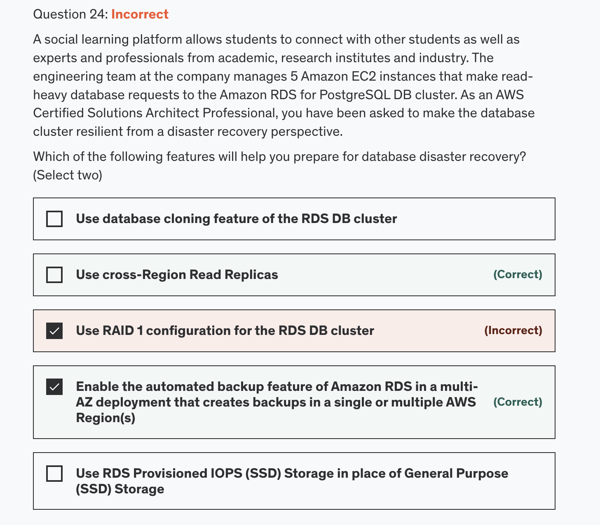

- In addition to using Read Replicas to reduce the load on your source DB instance, you can also use Read Replicas to implement a DR solution for your production DB environment. If the source DB instance fails, you can promote your Read Replica to a standalone source server. Read Replicas can also be created in a different Region than the source database. Using a cross-Region Read Replica can help ensure that you get back up and running if you experience a regional availability issue.

- Amazon RDS provides high availability and failover support for DB instances using Multi-AZ deployments. Amazon RDS uses several different technologies to provide failover support. Multi-AZ deployments for MariaDB, MySQL, Oracle, and PostgreSQL DB instances use Amazon's failover technology.

  The automated backup feature of Amazon RDS enables point-in-time recovery for your database instance. Amazon RDS will backup your database and transaction logs and store both for a user-specified retention period. If it’s a Multi-AZ configuration, backups occur on the standby to reduce I/O impact on the primary. Amazon RDS supports single Region or cross-Region automated backups.

# 26번

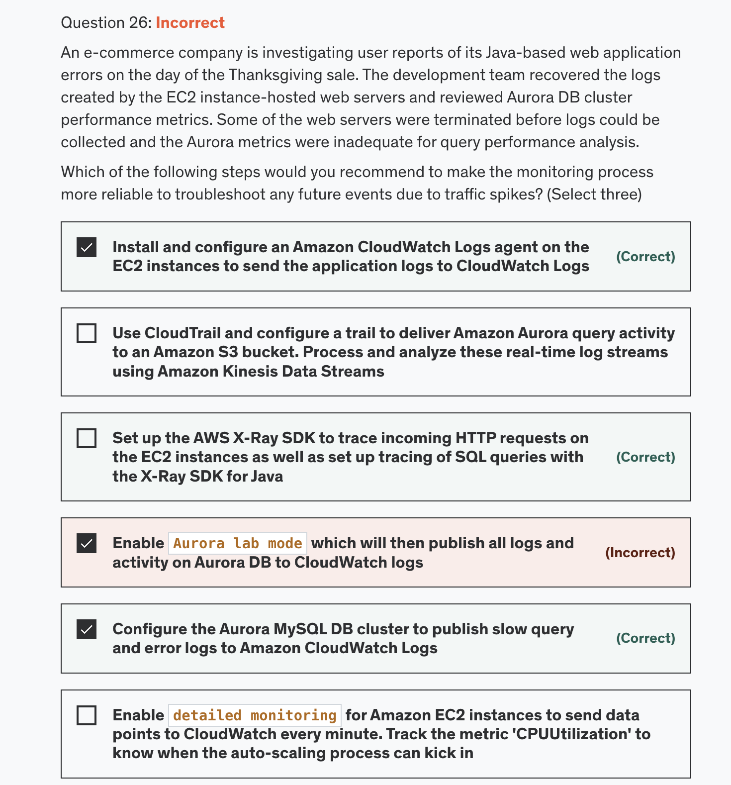

- **Configure the Aurora MySQL DB cluster to publish slow query and error logs to Amazon CloudWatch Logs**

  You can configure your Aurora MySQL DB cluster to publish general, slow, audit, and error log data to a log group in Amazon CloudWatch Logs. With CloudWatch Logs, you can perform real-time analysis of the log data, and use CloudWatch to create alarms and view metrics. You can use CloudWatch Logs to store your log records in highly durable storage.

  To publish logs to CloudWatch Logs, the respective logs must be enabled. Error logs are enabled by default, but you must enable the other types of logs explicitly. The slow query logs and error logs can be used to identify the root cause behind the given issue.

- **Install and configure an Amazon CloudWatch Logs agent on the EC2 instances to send the application logs to CloudWatch Logs**

  You can collect metrics and logs from Amazon EC2 instances and on-premises servers with the CloudWatch agent. The unified CloudWatch agent enables you to collect internal system-level metrics from Amazon EC2 instances across operating systems. The metrics can include in-guest metrics, in addition to the metrics for EC2 instances. You can collect logs from Amazon EC2 instances and on-premises servers, running either Linux or Windows Server. The application logs (via the CloudWatch logs) can be used to identify the root cause behind the given issue.

- **Set up the AWS X-Ray SDK to trace incoming HTTP requests on the EC2 instances as well as set up tracing of SQL queries with the X-Ray SDK for Java**

  You can use the X-Ray SDK to trace incoming HTTP requests that your application serves on an EC2 instance. Use a Filter to instrument incoming HTTP requests. When you add the X-Ray servlet filter to your application, the X-Ray SDK for Java creates a segment for each sampled request. This segment includes timing, method, and disposition of the HTTP request. You can also instrument your SQL database queries by adding the X-Ray SDK for Java JDBC interceptor to your data source configuration. X-Ray tracing for the HTTP requests as well as the SQL queries can help in identifying the root cause behind the given issue.

# 28번

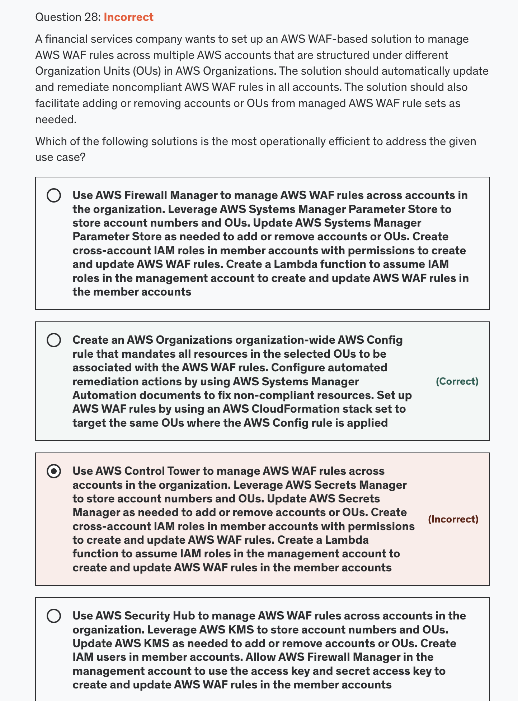

- AWS Config allows you to manage AWS Config rules across all AWS accounts within an organization. You can:

  Centrally create, update, and delete AWS Config rules across all accounts in your organization.

  Deploy a common set of AWS Config rules across all accounts and specify accounts where AWS Config rules should not be created.

  Use the APIs from the management account in AWS Organizations to enforce governance by ensuring that the underlying AWS Config rules are not modifiable by your organization’s member accounts.

  If a new account joins an organization, the rule or conformance pack is deployed to that account. When an account leaves an organization, the rule or conformance pack is removed.

- AWS Config allows you to remediate noncompliant resources that are evaluated by AWS Config Rules. AWS Config applies remediation using AWS Systems Manager Automation documents. These documents define the actions to be performed on noncompliant AWS resources evaluated by AWS Config Rules. You can associate SSM documents by using AWS Management Console or by using APIs. To apply remediation on non-compliant resources, you can either choose the remediation action you want to associate from a prepopulated list or create your own custom remediation actions using SSM documents. AWS Config provides a recommended list of remediation actions in the AWS Management Console.

- AWS CloudFormation StackSets extends the capability of CloudFormation stacks by enabling you to create, update, or delete stacks across multiple accounts and AWS Regions with a single operation. Using an administrator account, you define and manage an AWS CloudFormation template, and use the template as the basis for provisioning stacks into selected target accounts across specified AWS Regions.

- 오답 - C : This option involves significant manual work every time an account is added/removed from the organization. You need to update the items in Secrets Manager and further update the Lambda to assume the role for the new account. Hence this option is incorrect.

# 29번

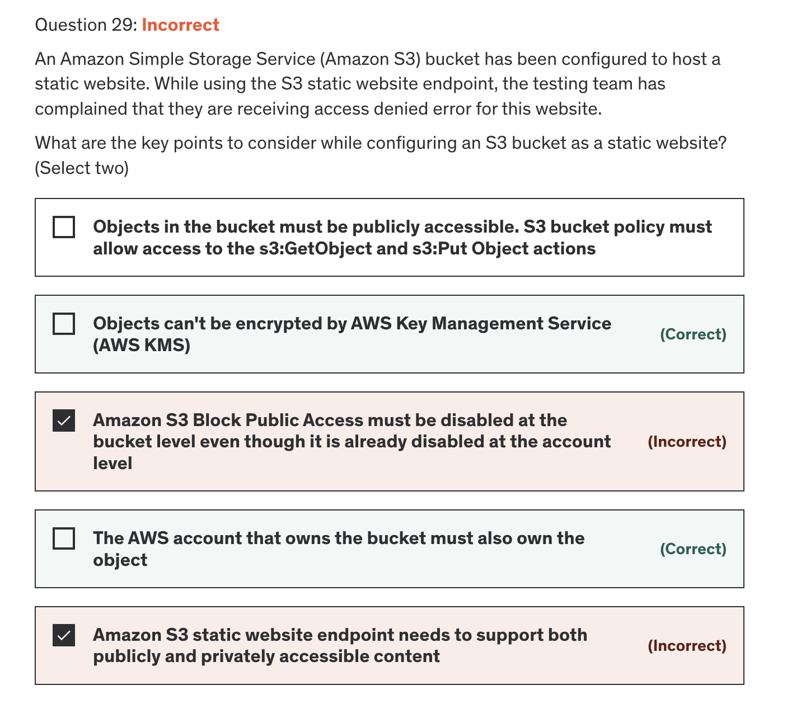

- **Objects can't be encrypted by AWS Key Management Service (AWS KMS)** - AWS KMS doesn't support anonymous requests. As a result, any Amazon S3 bucket that allows anonymous or public access will not apply to objects that are encrypted with AWS KMS. You must remove KMS encryption from the objects that you want to serve using the Amazon S3 static website endpoint. Instead of using AWS KMS encryption, use AES-256 to encrypt your objects.
- **The AWS account that owns the bucket must also own the object** - To allow public read access to objects, the AWS account that owns the bucket must also own the objects. A bucket or object is owned by the account of the AWS Identity and Access Management (IAM) identity that created the bucket or object. The object-ownership requirement applies to public read access granted by a bucket policy. It doesn't apply to public read access granted by the object's access control list (ACL).
- 오답
  - **Amazon S3 Block Public Access must be disabled at the bucket level even though it is already disabled at the account level** - Amazon S3 Block Public Access settings can apply to individual buckets or AWS accounts. Confirm that there aren't any Amazon S3 Block Public Access settings applied to either your S3 bucket or AWS account. These settings can override permissions that allow public read access. There is no need to disable the 'Block Public Access' feature at the bucket level even though it is already disabled at the account level.
  - **Amazon S3 static website endpoint needs to support both publicly and privately accessible content** - This statement is incorrect. Amazon S3 static website endpoint supports only publicly accessible content.