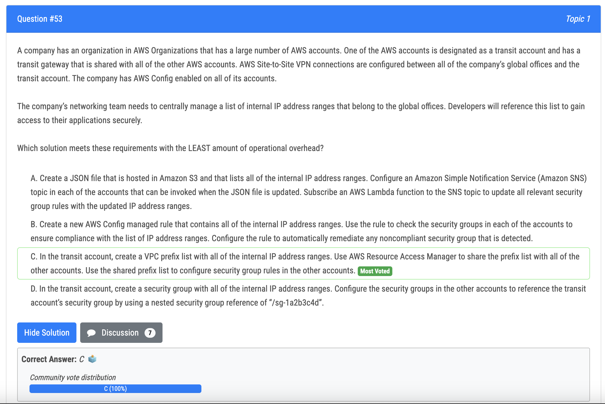

# 51번

- 정답 - B
- 오답 
  - C : 현재 s3 버킷에 있는 object 를 암호화하는 방법이 없음
  - D : security 팀이 어떻게 encyptionn key 를 관리하는지 언급이 없음

# 52번

- 정답 - B
- 오답
  - A : Route 53 의 failover record 는 레이턴시를 증가시키고 client 의 DNS resolution time 을 증가시킴

# 53번

- 정답 - C : a VPC prefix list is created in the transit account with all of the internal IP address ranges, and then shared to all of the other accounts using AWS Resource Access Manager. This allows for central management of the IP address ranges, and eliminates the need for manual updates to security group rules in each account. This solution also allows for compliance checks to be run using AWS Config and for any non-compliant security groups to be automatically remediated.

# 54번

- 정답 - B : The correct answer is B. Opting in to AWS Compute Optimizer and creating a Lambda function that calls the ExportLambdaFunctionRecommendations operation is the least development time solution. This option allows you to use the built-in AWS Compute Optimizer service to extract metrics data and export it as a CSV file, which can then be stored in an S3 bucket.
- 오답
  - Option A is not correct because it requires the development of a Lambda function that extracts metrics data and collates it into tabular format, which adds development time. 
  - Option C is not correct because it requires the setup of enhanced infrastructure metrics, which adds development time. 
  - Option D is not correct because it requires purchasing the AWS Business Support plan and using the Trusted Advisor console, which adds development time.

# 58번 

- 정답 - A 
- 오답 - C : s3 에 있는 스냅샷을 볼 수 없음

# 59번

- 정답
  - Step B is necessary so that the user in the destination account has the necessary permissions to access the source bucket and list its contents, read its objects. 
  - Step D is needed so that the user in the destination account has the necessary permissions to access the destination bucket and list contents, put objects, and set object ACLs 
  - Step F is necessary because the aws s3 sync command needs to be run using the IAM user credentials from the destination account, so that the objects will have the appropriate permissions for the user in the destination account once they are copied.

# 60번

- 정답 - A : Create an alias for every new deployed version of the Lambda function. Use the AWS CLI update-alias command with the routing-config parameter to distribute the load is the correct answer as it meets the requirement of supporting a canary release. 
- 오답 - C : Option C is not correct because while it would allow for a canary release, it would involve creating a version for every new deployed Lambda function, which would be more complex and time-consuming process compared to creating an alias for a new version of the Lambda function.