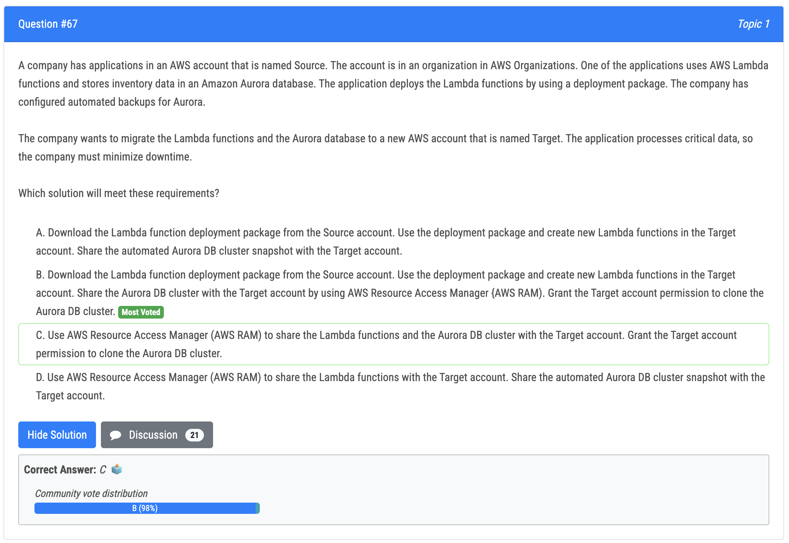

# 61번

- 정답 - B : **AWS Transfer for SFTP is a fully managed SFTP service that enables the company to transfer files directly into and out of Amazon S3 using the SFTP protocol.** By using this service, the company can offload the management of the SFTP server to AWS, which will provide high availability, scalability, and security. The company can then update the DNS record sftp.example.com in Route 53 to point to the server endpoint hostname, which will ensure that the SFTP server is reachable on the DNS.
- 오답
  - A : ALB 는 SFTP 서버를 사용할 수 없음
  - C : Storage Gateway 는 SFTP 서버를 위한 것이 아님
  - D : NLB 도 SFTP 서버를 사용할 수 없음

# 62번

- 정답 - B : Use the VMware vSphere client to export the application as an image in Open Virtualization Format (OVF) format. Create an Amazon S3 bucket to store the image in the destination AWS Region. Create and apply an IAM role for VM Import. Use the AWS CLI to run the EC2 import command. This approach allows the solutions architect to export the application as an image in OVF format, which preserves the software and configuration settings, and then import it into Amazon EC2 using the EC2 import command.
- 오답
  - Option A is incorrect because it uses AWS DataSync and FSx for Windows File Server to replicate the data store, but it doesn't preserve the software and configuration settings of the application. 
  - Option C is incorrect because it uses AWS Storage Gateway to export a CIFS share, but it doesn't preserve the software and configuration settings of the application. 
  - Option D is incorrect because it uses AWS Systems Manager and AWS Backup to create a snapshot of the VM, but it doesn't preserve the software and configuration settings of the application.

# 64번

- 정답 - B : AWS Control Tower provides a set of "strongly recommended guardrails" that can be enabled to implement governance and policy enforcement. One of these guardrails is "Encrypt Amazon RDS instances" which will detect RDS DB instances that are not encrypted at rest. By enabling this guardrail and applying it to the production OU, the company will be able to enforce encryption for RDS instances in the production environment.
- 오답 : C
  - Option A is incorrect because mandatory guardrails are pre-defined by AWS and cannot be customized. 
  - Option C is incorrect because AWS Config does not provide mandatory guardrails for RDS instances. 
  - Option D is incorrect because AWS Control Tower does not provide a feature called custom SCP (Service Control Policy), it uses guardrails instead.

# 65번

- 정답 - D :This strategy uses IAM roles and AWS Systems Manager to provide secure and auditable SSH access to the instances. The IAM role is attached to all the EC2 instances and has the AmazonSSMManagedInstanceCore managed policy attached, which allows the instances to be managed by Systems Manager. The engineers then install the AWS Systems Manager Session Manager plugin for their devices and remotely access the instances by using the start-session API call from Systems Manager. This approach provides secure and auditable access to the instances without the need for IP-based security group rules or additional infrastructure.
- 오답 (결론 : IP-based security group 은 관리하기 힘들고, 감사 기능이 없다.)
  - Option A uses EC2 Instance Connect to provide secure and auditable SSH access to the instances, but it requires additional infrastructure and configuration. 
  - Option B provides auditing of commands run by the engineers, but it relies on IP-based security group rules, which can be difficult to manage and may not be as secure as using IAM roles. 
  - Option C uses AWS Config and Firewall Manager to automatically remediate changes to security group rules, but it still relies on IP-based security group rules and does not provide an auditable method of access to the instances.

# 66번

- 정답
  - B
  - C : D 와 대비해서, SCP 가 organization 을 컨트롤하는데 유용함
  - F : this solution utilizes integrations with AWS Organizations and AWS CloudFormation in order to deploy a budget to every account in a specific organizational unit in your organization. In turn, this budget will send notifications through Amazon Simple Notification Service (SNS) when forecasted thresholds are exceeded. Then, we will utilize these SNS notifications to execute an AWS Lambda function that will shut down every EC2 instance that is not tagged as critical in a single region.

# 67번

- 정답 - B : The correct answer is option B. This solution uses a combination of AWS Resource Access Manager (RAM) and automated backups to migrate the Lambda functions and the Aurora database to the Target account while minimizing downtime. In this solution, the Lambda function deployment package is downloaded from the Source account and used to create new Lambda functions in the Target account. The Aurora DB cluster is shared with the Target account using AWS RAM and the Target account is granted permission to clone the Aurora DB cluster, allowing for a new copy of the Aurora database to be created in the Target account. This approach allows for the data to be migrated to the Target account while minimizing downtime, as the Target account can use the cloned Aurora database while the original Aurora database continues to be used in the Source account.
- 오답
  - Option A is not the best solution because it doesn't share the Aurora DB cluster with the Target account and this would cause data inconsistencies as the Source and Target accounts would not share the same data. 
  - Option C is not the best solution because, it does not specify how the data will be migrated and it would cause downtime as the Source and Target accounts are not sharing the same data. 
  - Option D is not the best solution because it does not specify how the Lambda function will be migrated and it would cause data inconsistencies as the Source and Target accounts are not sharing the same data.

# 69번 

- 정답 - C : The correct answer is C. Choice C meets the requirements for the application to be highly available and to dynamically scale to meet user traffic, as well as implementing a disaster recovery environment in the us-west-1 Region through active-passive failover. In choice C, the company creates a VPC in us-east-1 and a VPC in us-west-1, and sets up an Application Load Balancer (ALB) and Auto Scaling group in both VPCs. The ALB extends across multiple Availability Zones in each VPC, and the Auto Scaling group deploys the EC2 instances across these Availability Zones. The Auto Scaling group is placed behind the ALB, which allows for automatic scaling of the instances to meet user traffic. An Amazon Route 53 hosted zone is also created, with separate records for each ALB. Health checks are enabled for each record, and a failover routing policy is configured. This allows for active-passive failover between the two regions, ensuring high availability for the application.
- 오답 (결론 : 명백한 failover 방법이 없음)
  - Choice A, B, and D do not fully meet the requirements of the disaster recovery environment in the us-west-1 Region and the failover routing policy because they do not include the necessary configurations for active-passive failover.
  - In choice A, the VPCs in us-east-1 and us-west-1 are peered and the Auto Scaling group and Application Load Balancer (ALB) are extended across multiple availability zones in both regions. However, there is no explicit failover routing policy configured, so it is not clear how the application would failover to the us-west-1 region in the event of an outage. 
  - Choice B, the VPCs in us-east-1 and us-west-1 are separate, and the configuration is replicated in both regions but there is no explicit failover routing policy configured, so it is not clear how the application would failover to the us-west-1 region in the event of an outage.

# 70번

- 정답 - D : This option will first enable all features in AWS Organizations, then create and configure an AD Connector to connect to the company's on-premises Active Directory. Then, it will configure IAM Identity Center (AWS SSO) and set the AD Connector as the identity source, allowing the IT support workers to access the console using their existing Active Directory credentials. Finally, it will create permission sets and map them to the existing groups within the company's Active Directory. This solution will also be cost-effective as it does not involve creating a new directory in AWS Directory Service.
  - From aws documentation: 
    - Q: Which AWS accounts can I connect to IAM Identity Center? 
    - You can add any AWS account managed using AWS Organizations to IAM Identity Center. **You need to enable all features in your organizations to manage your accounts single sign-on.**