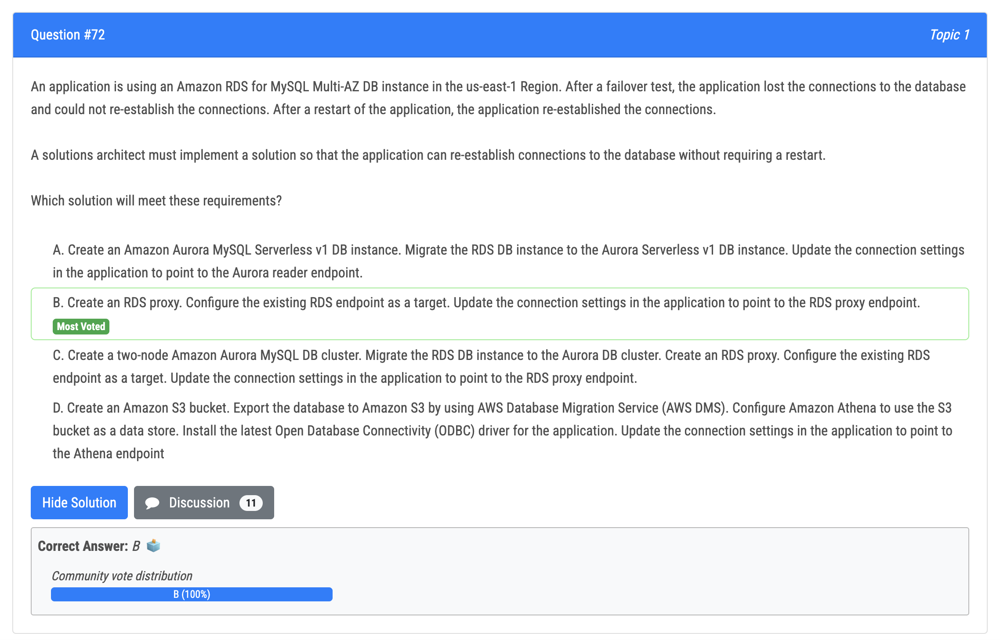
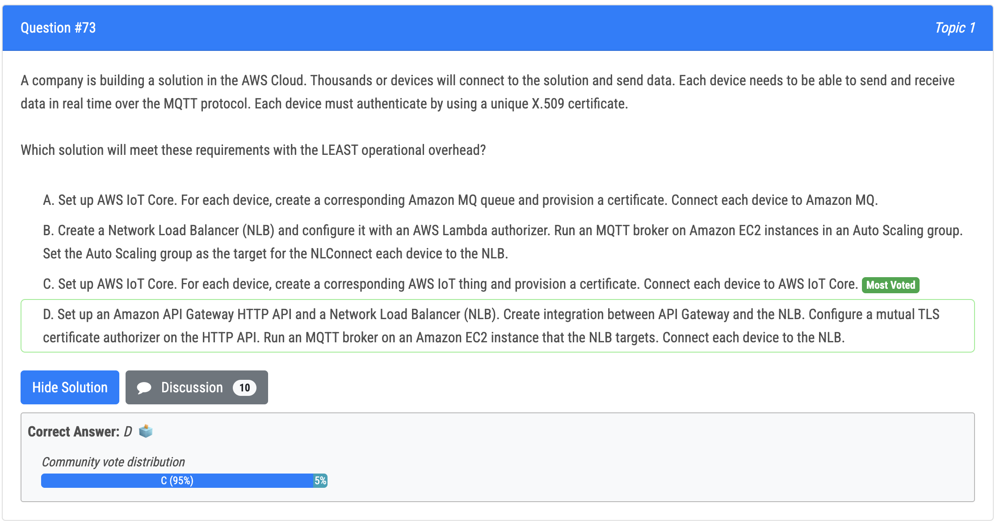
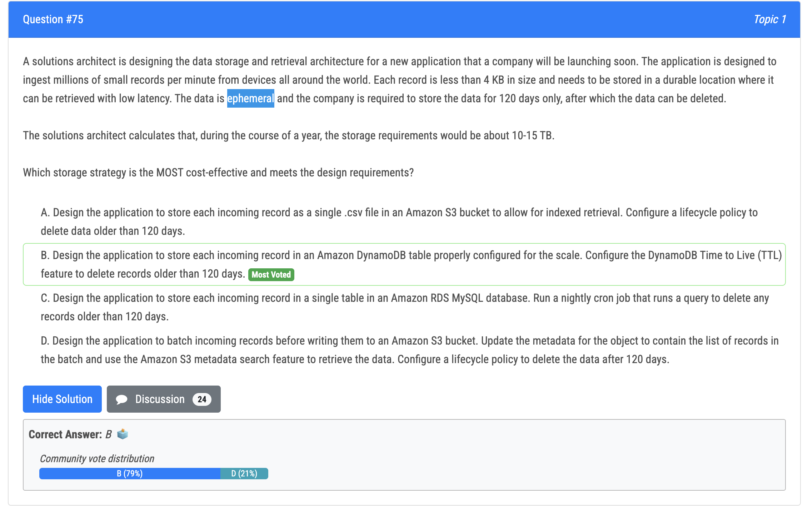
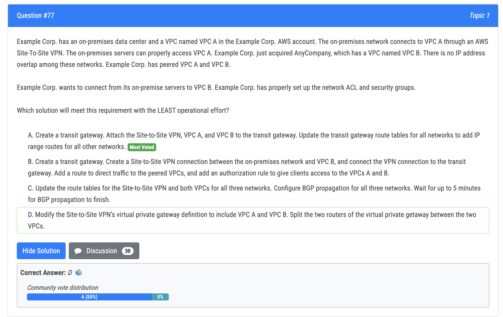
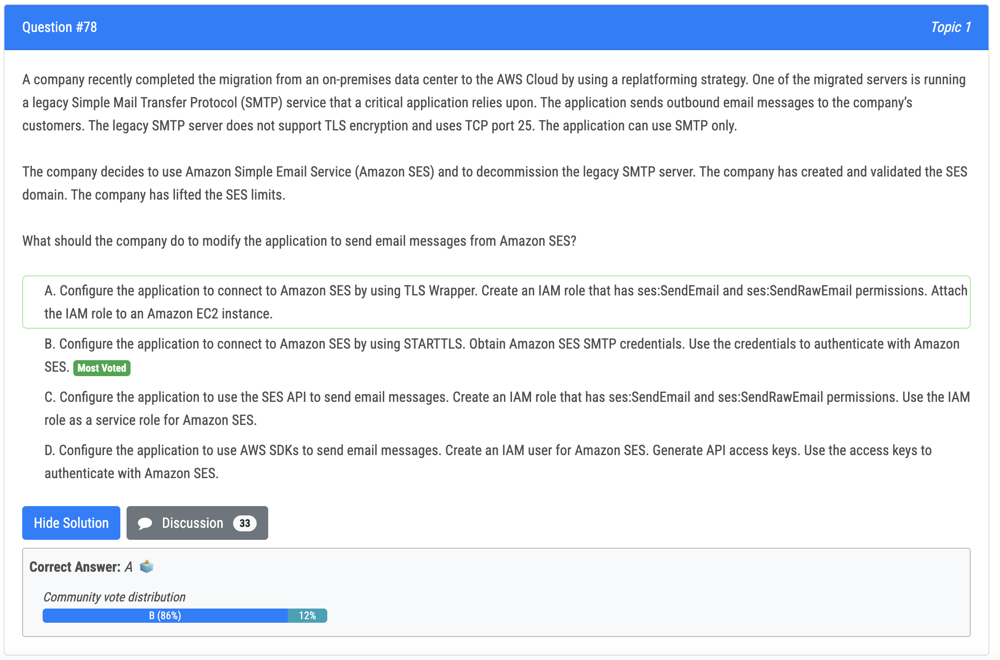
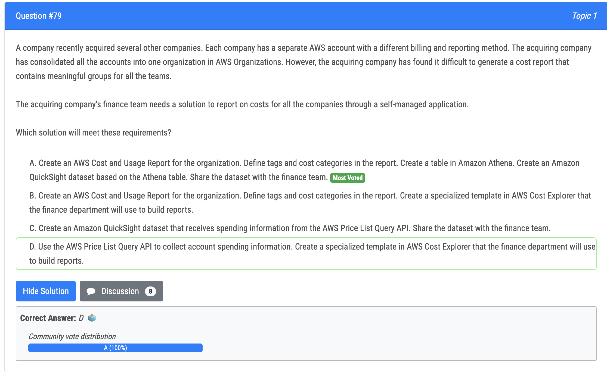

# 72번

- 정답 - B : Amazon RDS Proxy is a fully managed database proxy service for Amazon Relational Database Service (RDS) that makes applications more scalable, resilient, and secure. It allows applications to pool and share connections to an RDS database, which can help reduce database connection overhead, improve scalability, and provide automatic failover and high availability.

# 73번

- 정답 - C : AWS IoT Core is a fully managed service that enables secure, bi-directional communication between internet-connected devices and the AWS Cloud. It supports the MQTT protocol and includes built-in device authentication and access control. By using AWS IoT Core, the company can easily provision and manage the X.509 certificates for each device, and connect the devices to the service with minimal operational overhead.

# 75번

- 정답 - B : The most cost-effective and efficient solution that meets the design requirements would be option B, Design the application to store each incoming record in an Amazon DynamoDB table properly configured for the scale. Configure the DynamoDB Time to Live (TTL) feature to delete records older than 120 days. DynamoDB is a NoSQL key-value store designed for high scale and performance. It is fully managed by AWS and can easily handle millions of small records per minute. Additionally, with the TTL feature, you can set an expiration time for each record, so that the data can be automatically deleted after the specified time period.
- 오답 (S3 에 넣는 것은 파싱해서 가져오기 힘들다.)
  - Option A, storing each incoming record as a single .csv file in an Amazon S3 bucket, would not be a good option because it would be difficult to retrieve individual records from the .csv files, and will likely increase the cost of data retrieval. 
  - Option C, storing each incoming record in a single table in an Amazon RDS MySQL database, would be a more expensive option as RDS is typically more expensive than DynamoDB. Additionally, running a cron job to delete old data could lead to additional operational overhead. 
  - Option D, storing incoming records in batches in an S3 bucket, would be a less efficient option as it would require additional processing and parsing of the data to retrieve individual records.

# 77번

- 정답 - A : Transit gateway is an AWS managed high availability and scalability regional network transit hub used to interconnect VPCs and customer networks. AWS Transit Gateway + VPN, using the Transit Gateway VPN Attachment, provides the option of creating an IPsec VPN connection between your remote network and the Transit Gateway over the internet, as shown in the following picture. https://docs.aws.amazon.com/images/whitepapers/latest/aws-vpc-connectivity-options/images/image4.png Option A is the correct answer since the transit gateway will allow both VPCs to connect to the on premises network. 
- 오답 - B : Option B suggests the same feature but is using the Transit Gateway in a incorrect way. The soul purpose of the gateway is to have point for interconnectivity.

# 78번

- 정답 - B : STARTTLS supports ports 25, 587, and 2587
- 오답
  - A : TLSWRAPPER supports ports 465 and 2465
  - Option C suggests using the SES API, which is a valid approach but requires code modifications to use the SES API instead of SMTP. Since your application can only use SMTP, this option might involve significant code changes. 
  - Option D mentions using AWS SDKs and IAM users, which is more suitable for programmatic access to SES but not for legacy SMTP applications that can only send via SMTP.

# 79번

- 정답 - A : Creating an AWS Cost and Usage Report for the organization and defining tags and cost categories in the report will allow for detailed cost reporting for the different companies that have been consolidated into one organization. By creating a table in Amazon Athena and an Amazon QuickSight dataset based on the Athena table, the finance team will be able to easily query and generate reports on the costs for all the companies. The dataset can then be shared with the finance team for them to use for their reporting needs.
- 오답
  - Option B is not correct because it does not provide a way to query and generate reports on the costs for all the companies. 
  - Option C is not correct because it only provides spending information from the AWS Price List Query API and does not provide detailed cost reporting for the different companies. 
  - Option D is not correct because it only uses the AWS Price List Query API and does not provide a way to query and generate reports on the costs for all the companies.

