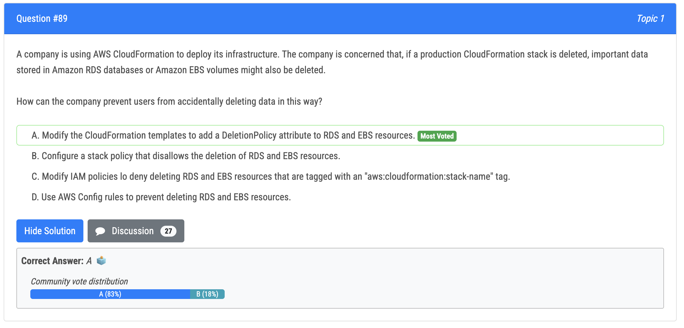

# 81번

- 정답
  - A : Enable S3 Transfer Acceleration on the S3 bucket and ensure that the web application uses the Transfer Acceleration signed URLs will accelerate the uploads of documents to S3 bucket, this will help to reduce the latency for users outside of Europe.
  - C : Change the API Gateway Regional endpoints to edge-optimized endpoints will help the company to improve the latency by caching the responses of the API Gateway closer to the users.
- 오답
  - B. Creating an accelerator in AWS Global Accelerator and attaching it to the CloudFront distribution will not help in this scenario as it only helps to route the traffic to the optimal endpoint based on the location of the user. 
  - D. Provisioning the entire stack in two other locations that are spread across the world and using global databases on the Aurora Serverless cluster will help to reduce the latency but it would be more complex to implement and manage. 
  - E. Adding an Amazon RDS proxy between the Lambda functions and the Aurora Serverless database will not help in this scenario because it is only used to improve connection management and load balancing for Amazon RDS databases, but not for Aurora Serverless databases.

# 83번

- 정답 - C : Storage Lens: All S3 Storage Lens metrics are retained for a period of 15 months. However, metrics are only available for queries for a specific duration, which depends on your metrics selection. This duration can't be modified. Free metrics are available for queries for a 14-day period, and advanced metrics are available for queries for a 15-month period.
- 오답 - B : Storage class: After you configure a filter, you'll start seeing data analysis based on the filter in the Amazon S3 console in 24 to 48 hours. However, storage class analysis observes the access patterns of a filtered data set for 30 days or longer to gather information for analysis before giving a result 

# 85번

- 정답 - C : AWS Organizations allows the management of multiple AWS accounts as a single entity and AWS CloudFormation StackSets allows creating, updating, and deleting stacks across multiple accounts and regions in an organization. This solution allows creating a single CloudFormation template that can be deployed across multiple accounts and regions, and also allows for the management of access and permissions for the different accounts through the use of IAM roles and policies in the management account.
- 오답
  - Option A and D both use AWS CloudFormation, but do not take into account the management of multiple accounts and regions. Option B uses AWS Organizations but doesn't include the use of CloudFormation StackSets, which is necessary for managing deployments across multiple accounts and regions.

# 89번

- 정답 - A : With the DeletionPolicy attribute you can preserve, and in some cases, backup a resource when its stack is deleted. You specify a DeletionPolicy attribute for each resource that you want to control. If a resource has no DeletionPolicy attribute, AWS CloudFormation deletes the resource by default. 
  - Retain - CloudFormation keeps the resource without deleting the resource or its contents when its stack is deleted. You can add this deletion policy to any resource type. When CloudFormation completes the stack deletion, the stack will be in Delete_Complete state; however, resources that are retained continue to exist and continue to incur applicable charges until you delete those resource

# 90번

- 정답 - B