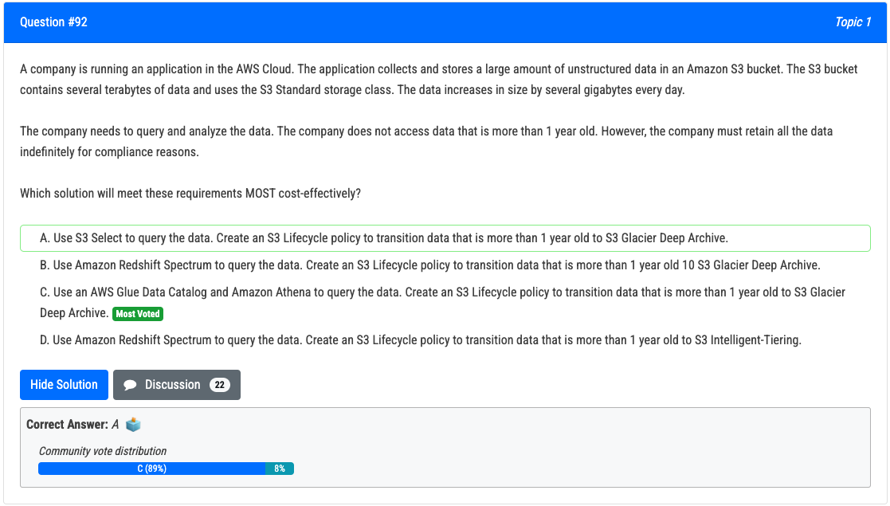
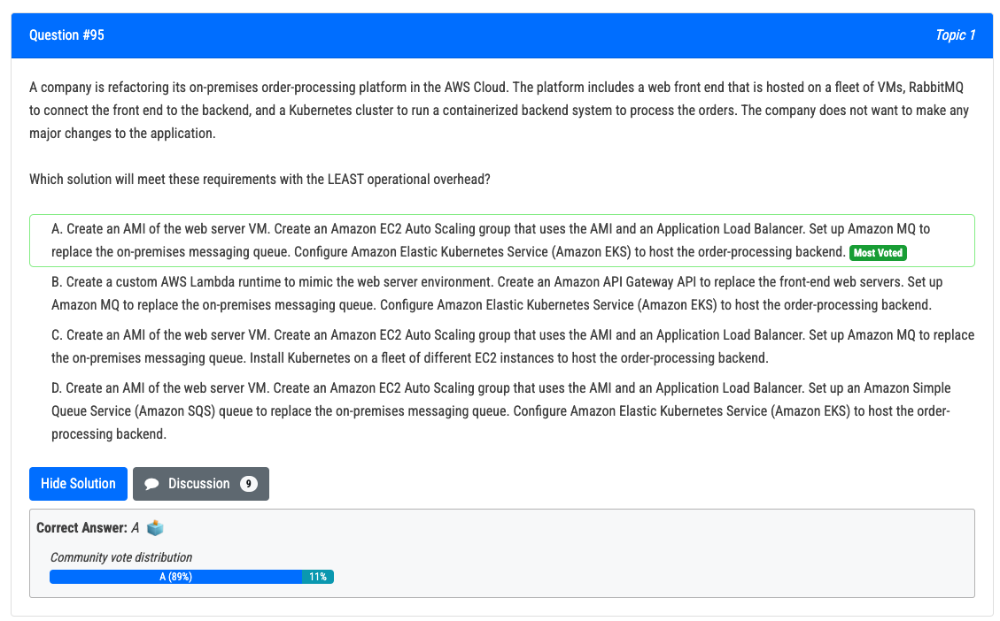
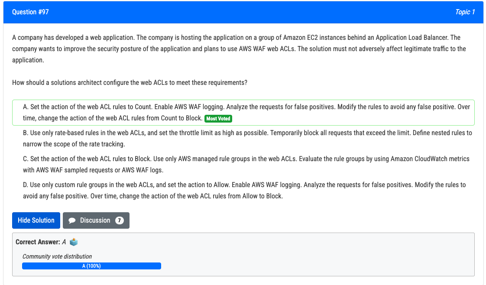
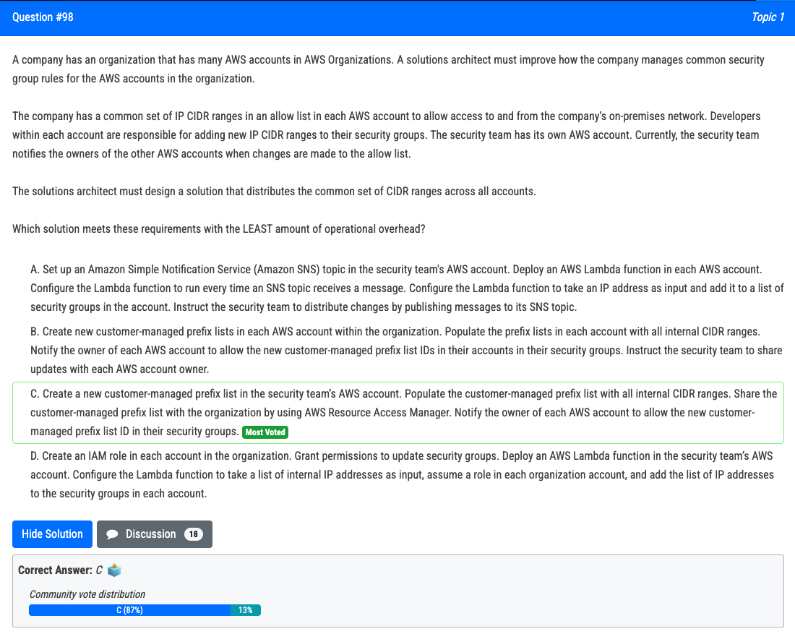
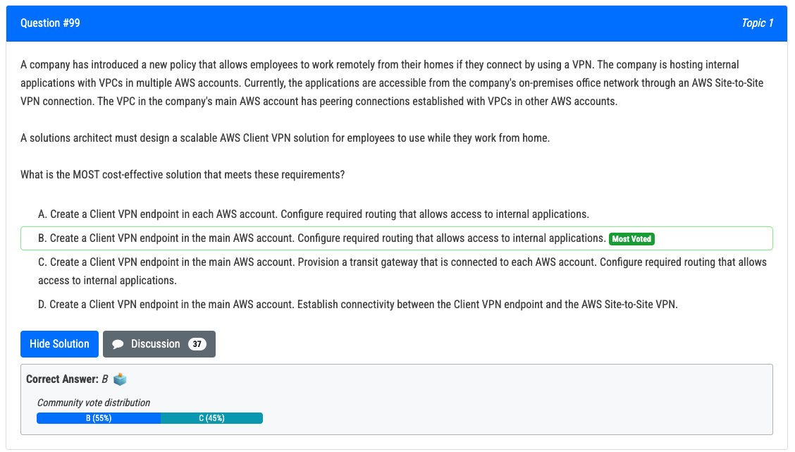

# 92번

- 정답 - C : This solution allows you to use Amazon Athena and the AWS Glue Data Catalog to query and analyze the data in an S3 bucket. Amazon Athena is a serverless, interactive query service that allows you to analyze data in S3 using SQL. The AWS Glue Data Catalog is a managed metadata repository that can be used to store and retrieve table definitions for data stored in S3. Together, these services can provide a cost-effective way to query and analyze large amounts of unstructured data. Additionally, by using an S3 Lifecycle policy to transition data that is more than 1 year old to S3 Glacier Deep Archive, you can retain the data indefinitely for compliance reasons while also reducing storage costs.
- 오답 - B : Amazon Redshift Spectrum can be used to query data stored in S3, but it may not be as cost-effective as using Amazon Athena for querying unstructured data

# 95번 (정답)

 

- 정답 - A : Option A is the correct answer. In this solution, the company creates an Amazon Machine Image (AMI) of the web server VM, which can be used to launch EC2 instances that are identical to the on-premises web servers. The company then creates an EC2 Auto Scaling group that uses the AMI and an Application Load Balancer (ALB) to provide automatic scaling and high availability for the web front end. The company also replaces the on-premises messaging queue (RabbitMQ) with Amazon MQ, which is a managed message broker service that is fully compatible with RabbitMQ. Finally, the company uses Amazon Elastic Kubernetes Service (EKS) to host the order-processing backend, which allows them to run their existing Kubernetes cluster in the AWS cloud without making any major changes to the application. This approach allows the company to lift and shift their existing platform with minimal operational overhead.

# 97번

- 정답은 A입니다. 웹 ACL 규칙의 동작을 Count로 설정합니다. AWS WAF 로깅을 활성화합니다. 가양성에 대한 요청을 분석합니다. 잘못된 긍정을 방지하도록 규칙을 수정합니다. 시간이 지남에 따라 웹 ACL 규칙의 작업을 개수에서 차단으로 변경합니다.

  이 접근 방식을 사용하면 합법적인 트래픽에 영향을 줄 수 있는 조치를 취하기 전에 들어오는 트래픽과 동작을 모니터링할 수 있습니다. 작업을 count로 설정하면 웹 ACL은 규칙의 조건과 일치하는 요청만 기록하지만 차단하지는 않습니다. 이렇게 하면 회사에서

  요청을 분석하고 오탐지를 확인할 수 있습니다. 잘못된 긍정을 식별하고 수정하면 웹 ACL 규칙의 작업을 카운트에서 블록으로 점진적으로 변경할 수 있으므로 합법적인 트래픽에 악영향을 미치지 않으면서 애플리케이션의 보안 태세를 개선할 수 있습니다.

  옵션 B는 속도 기반 규칙만 사용하면 잘못된 긍정이 발생하고 합법적인 트래픽이 차단될 수 있으므로 올바르지 않습니다. 옵션 C는 올바르지 않습니다. AWS 관리형 규칙 그룹만 사용하면 웹 ACL의 유연성과 특이성이 제한될 수 있기 때문입니다. 작업이 허용으로 설정된 사용자 지정 규칙 그룹만 사용하면 보안 취약점이 발생할 수 있으므로 옵션 D는 올바르지 않습니다.

# 98번

- 정답 - C : This solution meets the requirements with the least amount of operational overhead as it requires the security team to create and maintain a single customer-managed prefix list, and share it with the organization using AWS Resource Access Manager. The owners of each AWS account are then responsible for allowing the prefix list in their security groups, **which eliminates the need for the security team to manually notify each account owner when changes are made.** This solution also eliminates the need for a separate AWS Lambda function in each account, reducing the overall complexity of the solution.
- 오답 - B : Option B is not correct because it requires creating new customer-managed prefix lists in each AWS account within the organization, which increases the operational overhead as it requires the security team to create and maintain multiple prefix lists.

# 99번

- 정답 - B : Create a Client VPN endpoint in the main AWS account. Configure required routing that allows access to internal applications is the MOST cost-effective solution that meets these requirements. This solution allows employees to connect to the main AWS account using a Client VPN endpoint, and then use peering connections established with other AWS accounts to access the internal applications. This eliminates the need for additional Client VPN endpoints in each AWS account, reducing costs.
- 오답 - C : Creating a transit gateway, would also add unnecessary costs.

