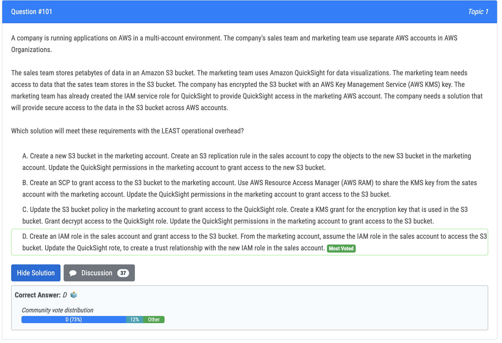
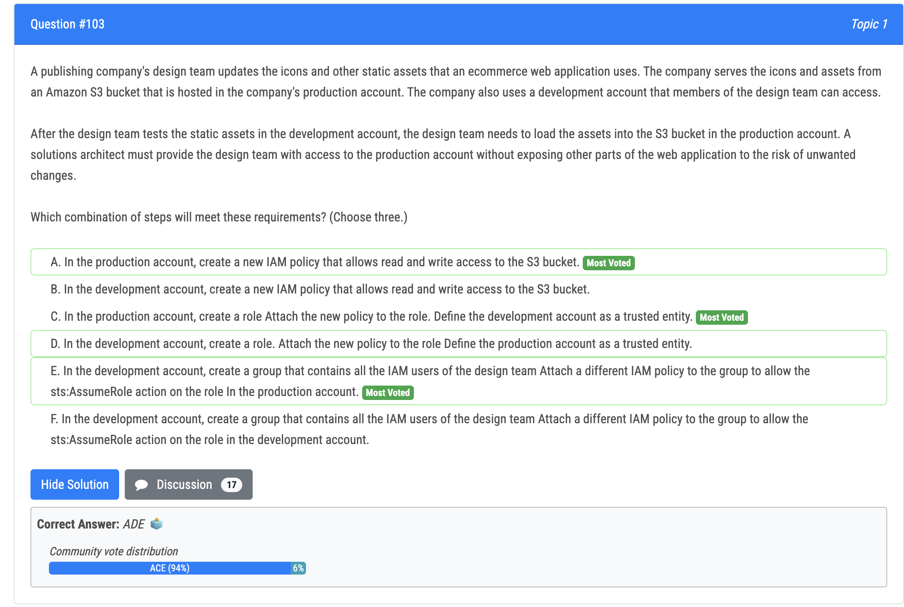
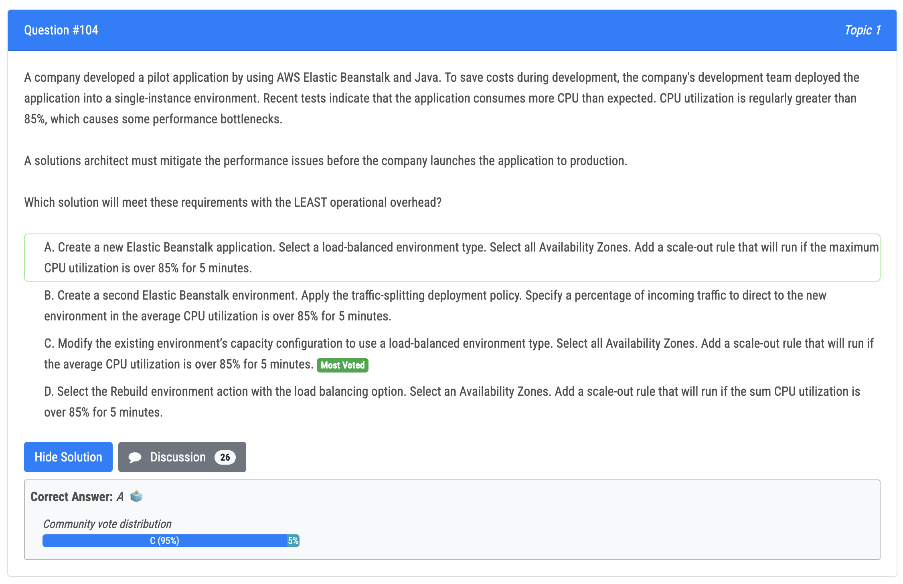
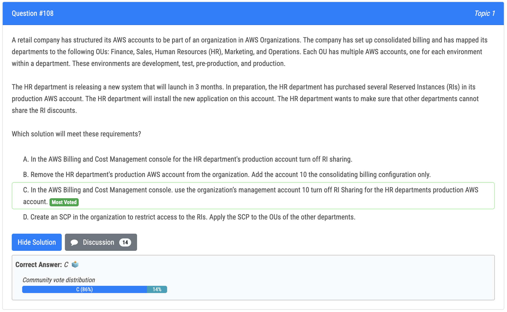
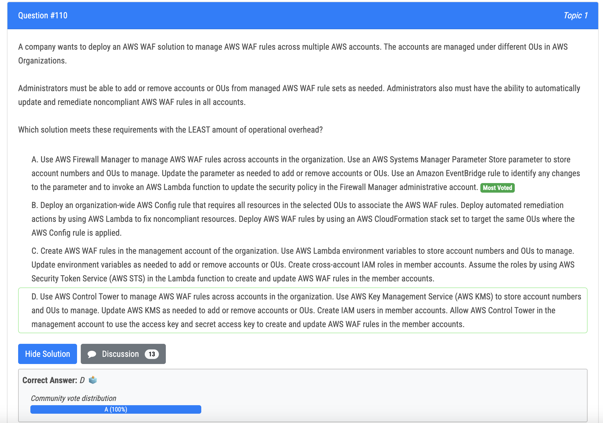

# 101번

- 정답 - D : This solution meets the requirements by allowing the marketing team to access the data in the S3 bucket in the sales account through assuming an IAM role, which eliminates the need to copy the data or share the KMS key, and also eliminates the need to modify the S3 bucket policy or create a KMS grant. This solution allows to use the same access to the bucket without duplicating data and re-encrypting it.
- 오답 - B : Update the QuickSight permissions in the marketing account to grant access to the S3 bucket is not correct because it does not provide a secure way to share the KMS key between accounts and also it would create unnecessary data duplication and increased storage costs.

# 103번

- 정답
  - A: In the production account, creating a new IAM policy that allows read and write access to the S3 bucket is correct because it allows the design team to upload and update the static assets in the S3 bucket in the production account. 
  - C: In the production account, creating a role and attaching the new policy to the role, and defining the development account as a trusted entity is correct because it allows the design team from the development account to assume the role and access the S3 bucket in the production account, while limiting their access to only the specific resources and actions defined in the policy.
  - E: In the development account, creating a group that contains all the IAM users of the design team and attaching a different IAM policy to the group to allow the sts:AssumeRole action on the role in the production account is correct because it allows the users in the group to assume the role created in the production account, which gives them access to the S3 bucket in the production account.

# 104번

- single instance 에서 Load balancer 로 변경 가능

# 108번

- 정답 - C : Management account -->Billing Dashboard --> Billing preferences, this option is there to choose enable/disable RI discounts sharing

# 110번(정답)

- 정답 - A : In this solution, AWS Firewall Manager is used to manage AWS WAF rules across accounts in the organization. An AWS Systems Manager Parameter Store parameter is used to store account numbers and OUs to manage. This parameter can be updated as needed to add or remove accounts or OUs. An Amazon EventBridge rule is used to identify any changes to the parameter and to invoke an AWS Lambda function to update the security policy in the Firewall Manager administrative account. This solution allows for easy management of AWS WAF rules across multiple accounts with minimal operational overhead.
- 오답
  - Option B does not meet the requirement of being able to add or remove accounts or OUs from managed AWS WAF rule sets as needed. 
  - Option C is not the best approach as it requires manual configuration of the cross-account IAM roles and assume-role calls in the Lambda function, increasing the operational overhead. 
  - Option D does not meet the requirement of providing a centralized management console to manage the WAF rules across multiple accounts.

