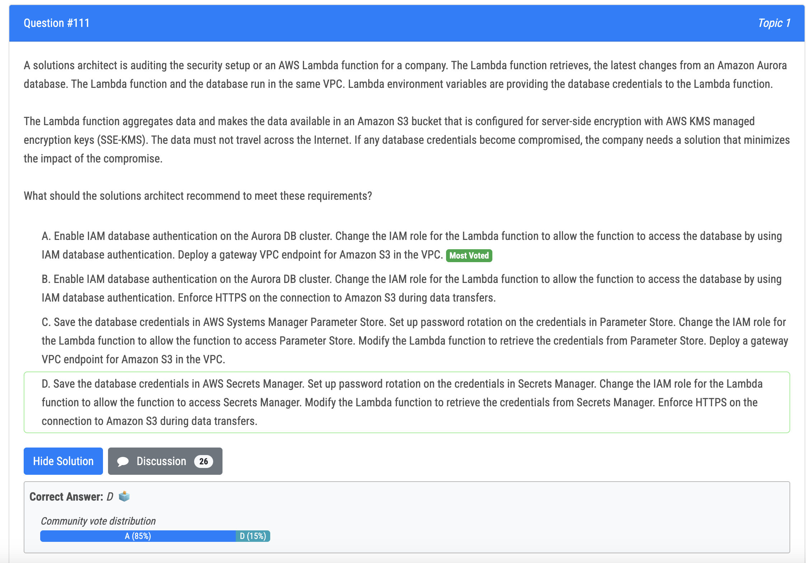
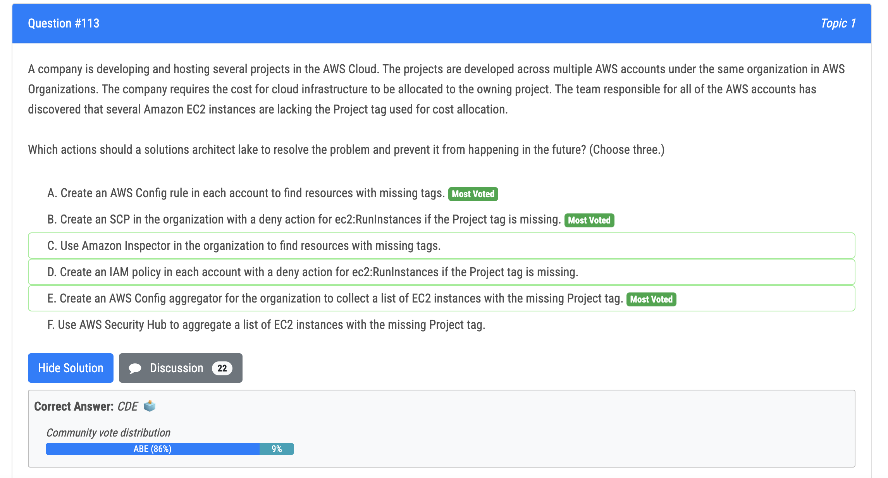
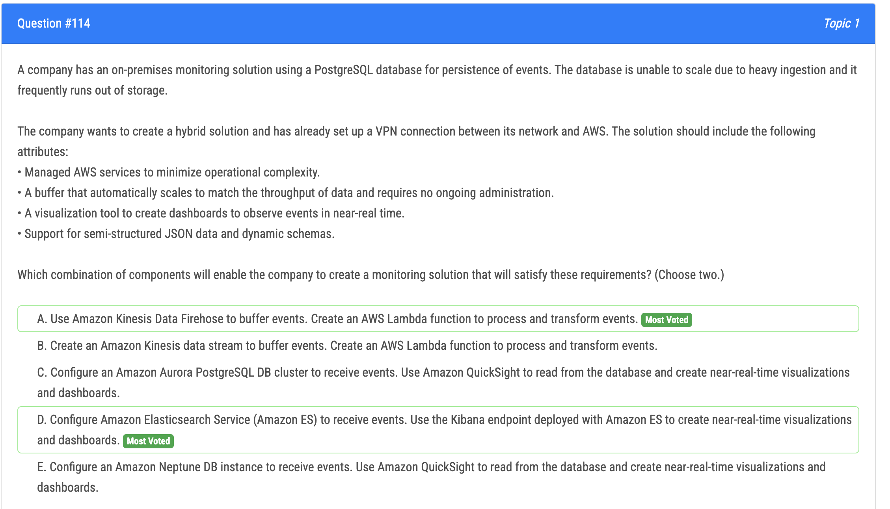
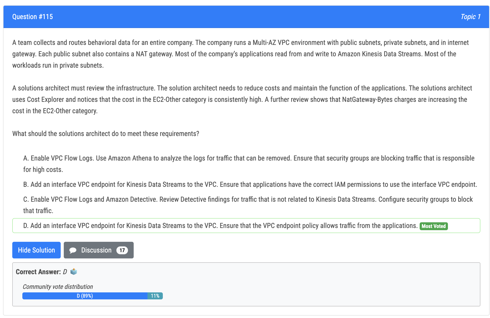
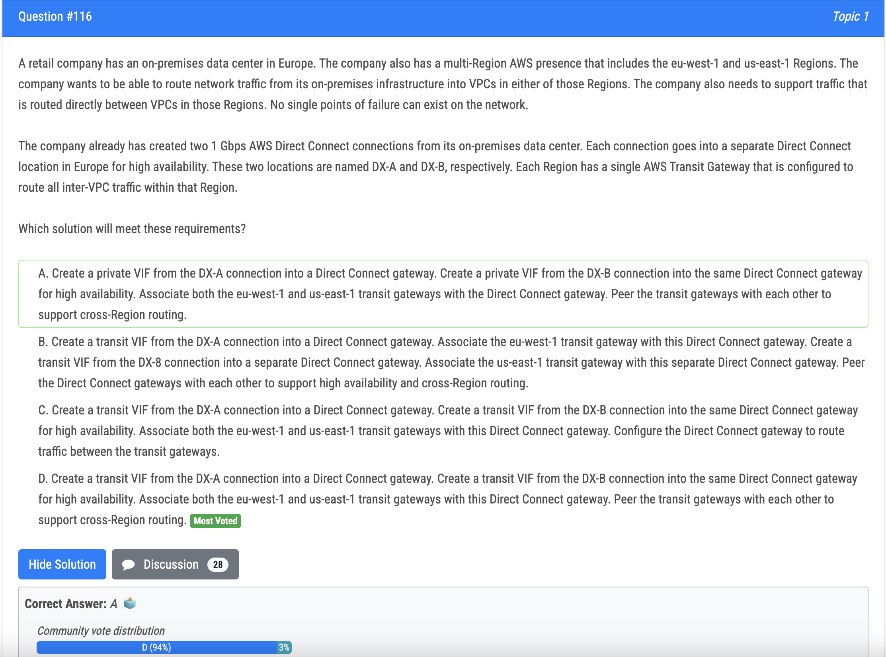
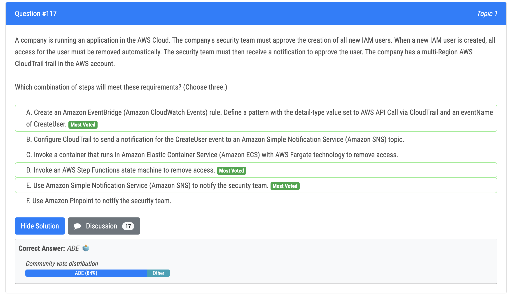
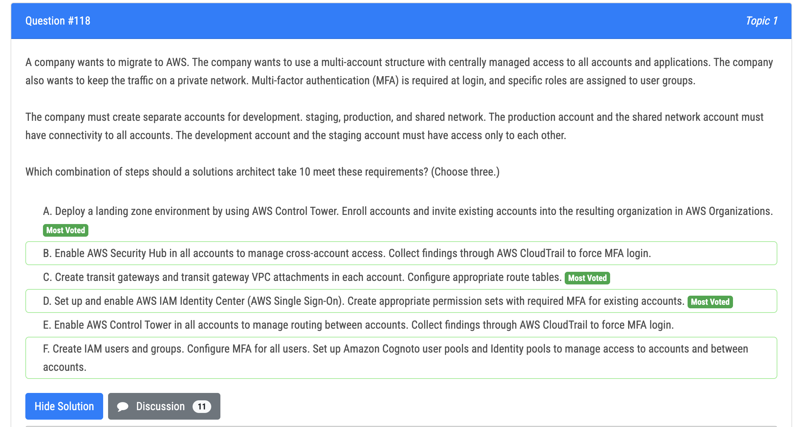

# 111번

- 정답 - A : a little bit confused between A and D but as said by others members D doesn't adress the The question of "data must not travel across the Internet"==> A is the answer
- 오답 - C : C is out because you cannot enable rotation in Parameter Store

# 113번

- A. Create an AWS Config rule in each account to find resources with missing tags. By creating an AWS Config rule in each account, you can check if resources are missing tags or have tags that are not conforming to your organization's standards. You can also use AWS Config to automatically remediate non-compliant resources by applying tags. This can help ensure that resources are properly tagged for cost allocation purposes
- B. Create an SCP in the organization with a deny action for ec2:RunInstances if the Project tag is missing. By creating a Service Control Policy (SCP) in the organization, you can enforce a deny action for EC2 instances that do not have the required Project tag. This can prevent users from launching instances that are not tagged correctly and ensure that new instances are tagged properly for cost allocation.
- E. Create an AWS Config aggregator for the organization to collect a list of EC2 instances with the missing Project tag. By creating an AWS Config aggregator, you can collect a list of EC2 instances across multiple accounts in the organization that are missing the required Project tag. This can help you identify instances that need to be tagged properly for cost allocation. 

# 114번

- 정답
  - Amazon Kinesis Data Firehose (A) allows you to buffer events in two ways: through buffering size or buffering time. With buffering size, you can configure the maximum size of the buffer in MB or the maximum number of records in the buffer. Once the buffer is full, it will automatically deliver the data to the destination 
  - Amazon ES (D) has its ability to receive events from various sources in real-time. Amazon ES can ingest data from a variety of sources, such as Amazon Kinesis Data Firehose, Amazon CloudWatch Logs, and Amazon S3, making it a powerful tool for organizations looking to analyze and visualize real-time streaming data. (Kibana dashboards)

# 115번

- 정답 - D
- 오답 - B : VPC endpoint 에 대한 permission 이 아닌 kinesis 에 대한 permission 이 필요

# 116번

- 정답 - D : 이 솔루션에서는 고가용성을 위해 DX-A 연결과 DX-B 연결의 두 중계 VIF가 동일한 Direct Connect 게이트웨이에 생성됩니다. 그런 다음 eu-west-1 및 us-east-1 전송 게이트웨이가 모두 이 Direct Connect 게이트웨이와 연결됩니다. 그런 다음 전송 게이트웨이가 서로 피어링되어 지역 간 라우팅을 지원합니다. 이 솔루션은 eu-west-1 및 us-east-1 지역의 사내 데이터 센터와 VPC 간에 가용성이 높은 연결을 구축하고 해당 지역의 VPC 간에 직접 트래픽 라우팅을 지원하여 회사의 요구 사항을 충족합니다.

# 117번

- Event Bus (EventBridge) system to receive event notification (Option A). Step function can get triggered with workflow of doing steps like removing access and sending email etc..(Option D, E) 
- EventBridge enables you to create event rules that match events from different sources, such as AWS services, SaaS applications, custom applications, and other AWS accounts. Once an event rule is triggered, EventBridge can route the event to one or more targets, such as AWS Lambda functions, Amazon SNS topics, Amazon SQS queues, or custom HTTP endpoints. 
- AWS Step Functions supports several AWS services, such as AWS Lambda, Amazon Simple Notification Service (SNS), and Amazon Simple Queue Service (SQS). You can use these services to trigger actions and pass data between steps in your state machine. Pinpoint is chat system which question did not ask, F is wrong. Not C as

# 118번

- A. Deploying a landing zone environment using AWS Control Tower and enrolling accounts in an organization in AWS Organizations allows for a centralized management of access to all accounts and applications. 
- C. Creating transit gateways and transit gateway VPC attachments in each account and configuring appropriate route tables allows for private network traffic, and ensures that the production account and shared network account have connectivity to all accounts, while the development and staging accounts have access only to each other. 
- D. Setting up and enabling AWS IAM Identity Center (AWS Single Sign-On) and creating appropriate permission sets with required MFA for existing accounts allows for multi-factor authentication at login and specific roles to be assigned to user groups.