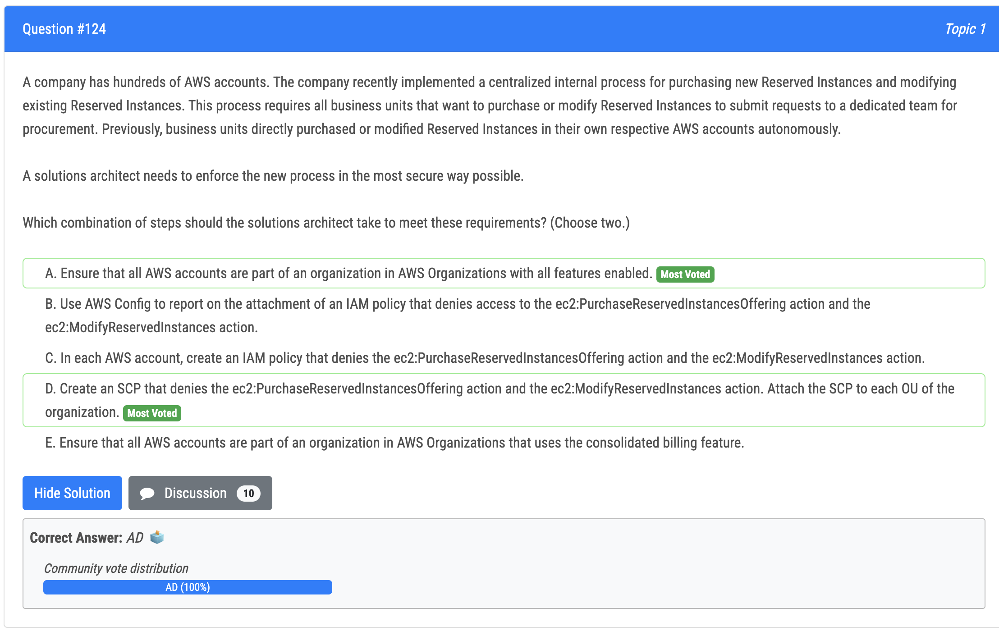
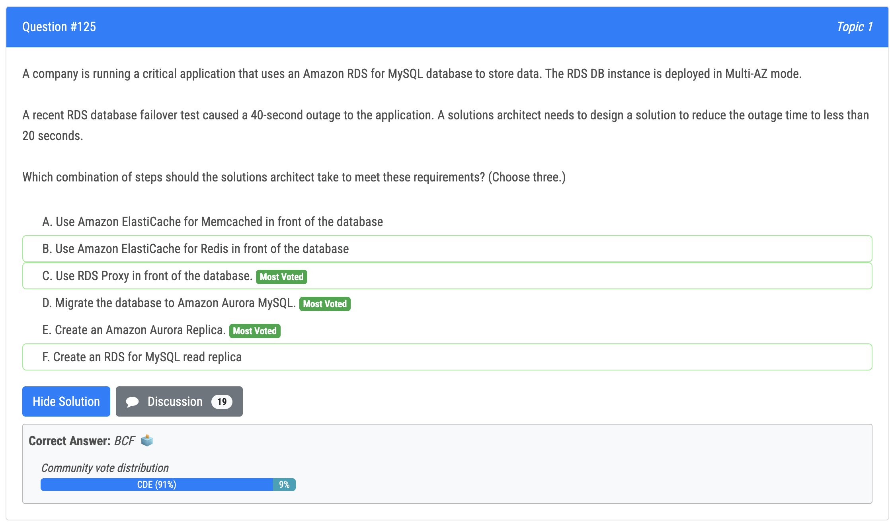
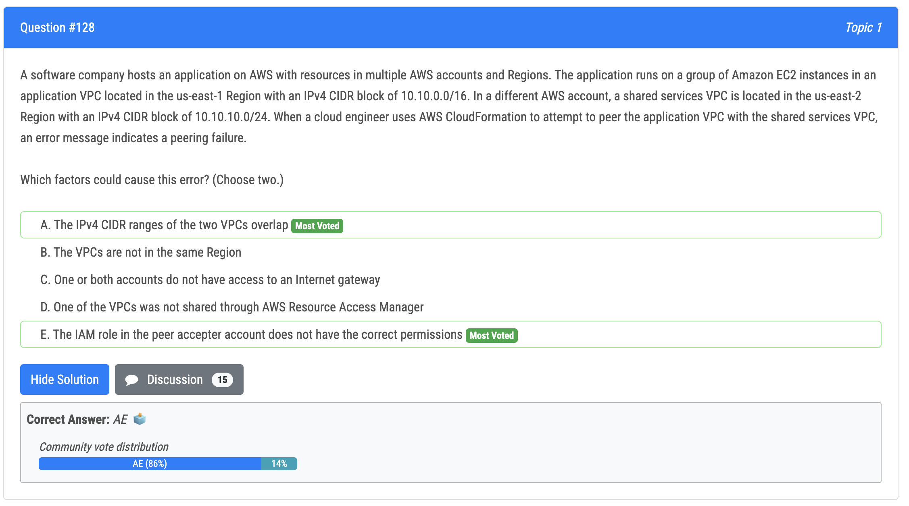
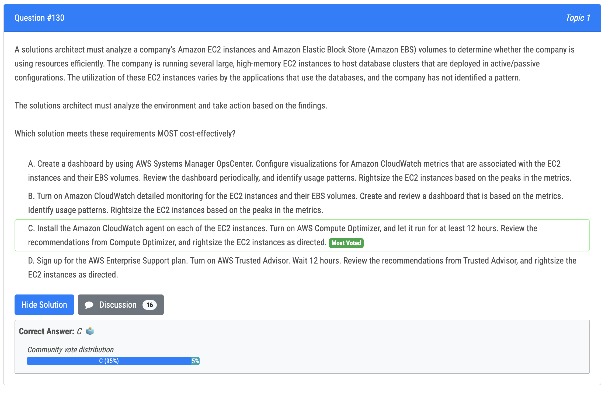

# 124번

- A: By ensuring all AWS accounts are part of an organization in AWS Organizations, it allows for centralized management and control of the accounts. This can help enforce the new purchasing process by giving a dedicated team the ability to manage and enforce policies across all accounts. 
- D: By creating an SCP (Service Control Policy) that denies access to the ec2:PurchaseReservedInstancesOffering and ec2:ModifyReservedInstances actions, it enforces the new centralized purchasing process. Attaching the SCP to each OU (organizational unit) within the organization ensures that all business units are adhering to the new process. 
- B and C are not the correct answer, because AWS Config and IAM policies are used for monitoring and managing access to resources in an account, respectively. They don't enforce the new process for purchasing reserved instances. E is not the correct answer as this is not related to the new process for purchasing reserved instances.

# 125번

- RDS Proxy with Aurora are the best combination for less than "20 sec" failover time... According to this article RDS Proxy can reduce the failover time of Aurora by 79% while it can reduce RDS failover time by only 32%

# 128번(정답)

- A is correct because the IPv4 CIDR ranges of the two VPCs overlap. The two VPCs have an IP range of 10.10.0.0/16 and 10.10.10.0/24, which means that they share the same 10.10.0.0 network. This causes a conflict in routing and will prevent the VPCs from being able to communicate with each other. 
- E is correct because the IAM role in the peer accepter account does not have the correct permissions. The role must have permissions to create, modify, and delete VPC peering connections in order for the peering to be established.

# 130번

- 정답 - C : AWS Compute Optimize helps analyze the usage patterns of AWS resources, such as EC2 instances and Auto Scaling groups, and makes recommendations on how to optimize them for performance and cost using machine learning algorithms.It then generates recommendations that can be used to adjust instance types, purchase options, and other parameters.It provides two types of recommendations: 
  - Recommended instance types - recommends instance types that are more cost-effective and better suited to the workload requirements. 
  - Recommended purchase options - recommends purchasing options, such as Reserved Instances or Savings Plans, that can help customers save money on their compute resources.
- 오답 - B : Option B is expensive - Detailed monitoring scales based on the number of metrics and the number of resources. The company has hundreds of instances so this option could potentially be more expensive than D.