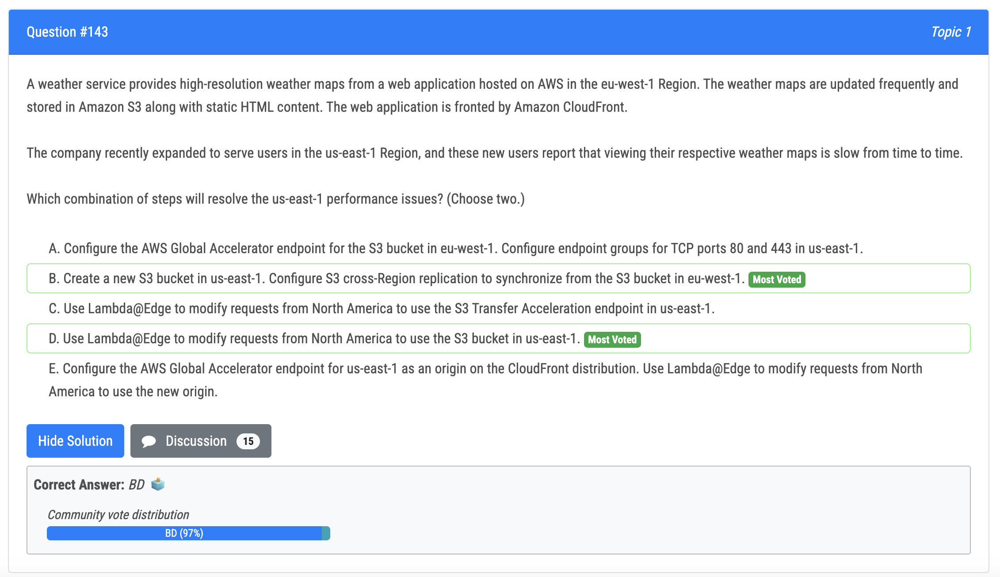

# 131번

- 비밀에 액세스할 수 있는 권한이 있는 애플리케이션 계정에서 IAM 역할을 생성하고 애플리케이션 계정에서 역할을 수임할 권한이 있는 DBA 계정에서 IAM 역할을 생성하면 비밀을 수동으로 공유할 필요가 없기 때문에 옵션 B가 맞습니다. 이 접근 방식은 교차 계정 IAM 역할을 사용하여 애플리케이션 계정의 암호에 대한 액세스 권한을 부여합니다. 데이터베이스 관리자는 DBA 계정의 EC2 인스턴스에서 애플리케이션 계정의 역할을 맡을 수 있으며 암호를 로컬에 저장하거나 수동으로 공유하지 않고도 암호를 검색할 수 있습니다.

# 133번

- SNS 메시지를 다른 리전의 SQS 나 람다로 전송할 수 있음. 따라서 기존의 SNS 로 여러 리전의 SQS 로 보내면 됨

# 134번

- C is correct. only eventbridge can run scheduled task

# 135번

- Regarding DynamoDB Streams - Global tables use DynamoDB Streams to replicate data across different Regions. When you create a replica for a global table, a stream is created by default. Any changes to a replica are replicated to all the other replicas within the same global table within a second using DynamoDB Streams.

# 138번

- Almost voted D because of the Storage Gateway + SAN combination.. but seems like it's not correct since S3 events cannot trigger Batch jobs directly, you need a Lambda function! S3 events can be only Lambda,SNS or SQS..

# 143번

- B is correct because it involves creating a new S3 bucket in the us-east-1 region and configuring cross-Region replication to synchronize from the existing S3 bucket in eu-west-1. This will allow users in us-east-1 to access the weather maps from a closer location, improving performance. 
- D is correct because it involves using Lambda@Edge to modify requests from North America to use the S3 bucket in us-east-1. This will also allow users in us-east-1 to access the weather maps from a closer location, improving performance. 
- A and E are not correct because they do not involve creating a new S3 bucket in us-east-1, which is necessary for improving performance for the users in that region. C is not correct because it involves using the S3 Transfer Acceleration endpoint, which is a different service and not necessary for this scenario.

# 144번

- B is correct. It can prevent the issue from happening again by monitoring the file system with the FreeStorageCapacity metric in Amazon CloudWatch and using Amazon EventBridge to invoke an AWS Lambda function to increase the capacity as required. This ensures that the file system always has enough free space to store user profiles and avoids reaching maximum capacity. 
- A: Removing old user profiles may not be sufficient to create enough space and does not prevent the problem from happening again. 
- C: AWS Step Functions cannot be used to increase capacity, it is a service for creating and running workflows that stitch together multiple AWS services. 
- D: Creating an additional FSx for Windows File Server file system and updating user profile redirection for a portion of the users may not be sufficient to prevent the problem from happening again and does not address the current capacity issue.

# 148번 (정답)

- 정답 - B

# 152번

- Option A, C and D are wrong. They all mention using spot instances and EKS based on EC2. A spot instance is not appropriate for a production server and the company is developing new application designed for AWS Fargate, which means we must plan the future cost improvement including AWS Fargate.

# 153번 (정답)

- Step 1: The solutions architect should upload static informational content to the S3 bucket, this content will be shown to the users when the application is down for maintenance. 
- Step 2: The solutions architect should set the S3 bucket as a second origin in the original CloudFront distribution. To keep the S3 bucket secure, the solutions architect should configure the distribution and the S3 bucket to use an origin access identity (OAI). This will ensure that only CloudFront has access to the S3 bucket.
- Step 3: During the weekly maintenance, the solutions architect should edit the default cache behavior of the CloudFront distribution to use the S3 origin. This will redirect all incoming traffic to the S3 bucket and show the static informational content to the users. Once the maintenance is complete, the solutions architect should revert the change back to the original Elastic Beanstalk origin.
- 오답
  - Option E: During the weekly maintenance, creating a cache behavior for the S3 origin on the new distribution is unnecessary, it is more complex and prone to human error

# 154번

- By using a function alias, the custom application invokes the latest version of the Lambda function without the need to modify the application code every time the company updates the image processing parameters. This reduces the risk of causing interruptions for users.

# 155번

- AWS Global Accelerator는 엔드포인트 및 네트워크 라우팅의 상태를 기반으로 최적의 엔드포인트(이 경우 Application Load Balancer)로 트래픽을 보내는 서비스입니다. 이를 통해 애플리케이션이 배포된 각 리전마다 하나씩 여러 엔드포인트 그룹으로 트래픽을 보내는 액셀러레이터를 생성할 수 있습니다. 액셀러레이터는 AWS 글로벌 네트워크를 사용하여 정상 엔드포인트로의 트래픽 라우팅을 최적화합니다. 회사는 Global Accelerator를 사용하여 apex 도메인에 단일 고정 IP 주소를 사용할 수 있으며 추가 로드 밸런서나 라우팅 정책 없이 사용자 위치에 따라 최적의 엔드포인트로 트래픽이 전달됩니다.

- an apex domain cannot use CNAME records in AWS. This is because of the way DNS resolution works. A CNAME record specifies an alias for a domain name, which points to the canonical name of another domain. However, the DNS standard does not allow CNAME records for apex domains, as they should only have A or AAAA records. 

- When you try to create a CNAME record for an apex domain in AWS Route 53, you will receive an error message indicating that the record set type is not valid for the apex domain. To work around this limitation, you can use an alias record instead.

  

# 156번

- 정답 - D : Don't understand why so many people are choosing B. Read up. A container image cannot be used with Lambda layers. That means A B C are out instantly. Its literally one of the first things they mention about Lamba layers. Answer is D and ABC simply impossible to configure.

# 158번 (정답)

- The AWS Migration Evaluator works by analyzing data about your current on-premises environment, including servers, storage, networking, and applications. It then provides a report that outlines the recommended AWS services and configurations that best match your existing infrastructure and applications. This report includes a detailed cost analysis that estimates the total cost of running your applications in the AWS cloud.

# 161번

- The background is the below. 
  - The company is using ALB features and must keep them. 
  - The new on-premise firewall needs a static IP address of the ALB as the next hop.
  -  However, ALB cannot have a static IP address. 
- So the point is how ALB can have a static IP address endpoint.

# 162번

- AWS managed prefix list is more recommended.

# 164번

- When you use attribute-based instance type selection, you allow AWS to diversify the instances across different instance types within a specified instance family or similar characteristics. This helps in reducing the risk of Spot Instance termination due to capacity issues or price fluctuations.

# 165번 (정답)

- 정답 - B or C ??
- C: Amazon FSx for Lustre is a fully managed service that provides cost-effective, high-performance, scalable storage for compute workloads. Powered by Lustre, the world’s most popular high-performance file system, FSx for Lustre offers shared storage with sub-ms latencies, up to terabytes per second of throughput, and millions of IOPS. FSx for Lustre file systems can also be linked to Amazon Simple Storage Service (S3) buckets, allowing you to access and process data concurrently from both a high-performance file system and from the S3 API.

# 166번

- 정답 - C : C seems to be best and feasible. Rest options are not correct as they are using SQS where messages can be delivered only to one reader while in this scenario there are multiple microservices that needs to read the same message and delete the user information.

# 169번

- 정답 - A : DRS includes EC2 instances as well not just data related as offered by DLM or Backup 
  - Q: What operating systems and applications are supported by AWS DRS? 
  - A: You can use AWS DRS to recover all of your applications and databases that run on supported Windows and Linux operating system versions. This includes critical databases such as Oracle, MySQL, and SQL Server, and enterprise applications such as SAP.
  - AWS Elastic Disaster Recovery (DRS) vs AWS DLM vs AWS Backup 
  - You should use DLM when you want to automate the creation, retention, and deletion of EBS snapshots. You should use AWS Backup to manage and monitor backups across the AWS services you use, including EBS volumes, from a single place.
- 다른 설명 : its understood that others cannot meet the RTO and RPO requirements, because restore from back can take time based on the size of the data

# 170번

- Not B because, Trusted Advisor is available for Enterprise support only which is not cheap and the SA needs to cost optimize here. CPU, memory, and network relate to Compute so D for sure. C will enable to know how much actual memory/CPU is needed for instances and SA can provision based on cw logs