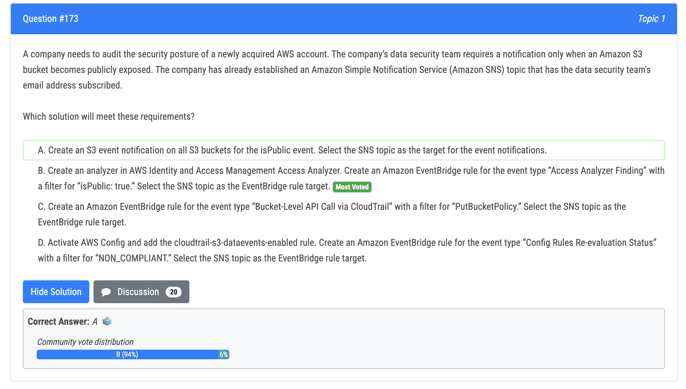

# 171번


- AWS Backup cannot do this for you, so you should use Code Build to clone repo and upload zip to s3

# 173번



- B is the correct solution because it uses AWS Identity and Access Management Access Analyzer to continuously monitor access control configurations and detect whether any S3 buckets have been configured to be publicly accessible. When a publicly accessible bucket is detected, an Amazon EventBridge rule is triggered, and the SNS topic is notified with the finding.

- Click on the "Create rule" button. Enter a name for the rule and a brief description, if desired. Under "Define pattern", select "Event pattern". Select "Custom pattern". In the "Event pattern" field, enter the following code: 

  - ```
    { 
      "source": ["aws.securityhub"], 
      "detail-type": ["Access Analyzer Finding"], 
      "detail": { 
        "findings": [ { "isPublic": [ true ] } ]
        } 
      }
    ```

  - This code will match all Access Analyzer Finding events where the "isPublic" field is set to "true"

# 174번


- ?

# 177번


- Option D provisions a new Amazon Connect instance with all existing users and contact flows in a second Region. It also sets up an Amazon Route 53 health check for the URL of the Amazon Connect instance, an Amazon CloudWatch alarm for failed health checks, and an AWS Lambda function to deploy an AWS CloudFormation template that provisions claimed phone numbers. This option allows for the fastest recovery time because all the necessary components are already provisioned and ready to go in the second Region. In the event of a disaster, the failed health check will trigger the AWS Lambda function to deploy the CloudFormation template to provision the claimed phone numbers, which is the only missing component.
- C or D ? : D seems to fit all requirements, however C & D seem to be very similar. Only difference is whether to upload users or phone numbers through Cloud Formation. It seems users, routing profiles, queues, and flows get created with ReplicateInstance API

# 178번


- The company wants to confirm the identities of the customers before the company shares data. The customers also need access to the most recent data when the company publishes the data. With B, customer can get data from Redshift directly with no time lag and additional operations.

# 186번


- A - Multi Region Access points are like a proxy. It can dynamically request traffic to the nearest S3 bucket (latency based).
- B - Two way replication must be enabled to have data in sync.
- E - Versioning must be enabled for Replication.

# 187번


- 

# 188번


# 189번


- none of the previous responses really make use of Business continuity as indicated in the scenario. my picks are options B and E. The combination of these two options (E and B) provides both security (via AWS WAF) and high availability (via multi-region deployment) for your application. It helps in preventing attacks and ensuring business continuity with minimal service interruptions during ongoing attacks, making it a cost-effective choice.

# 190번


- For people are asking why C is better than A: The approach of A is more suited for scenarios where there is a complete failure of the primary endpoint rather than intermittent errors. The health checks may not register a failure if the 502 errors are sporadic and the system is generally operational, thus the failover might not be triggered. With the approach of C CloudFront will always automatically switch to the secondary origin when the primary origin returns specific HTTP status code failure responses

