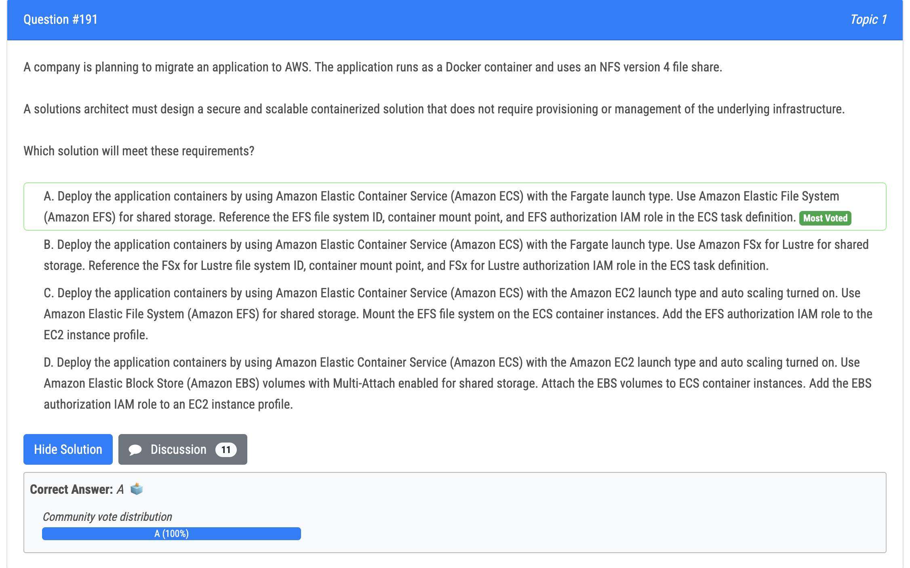
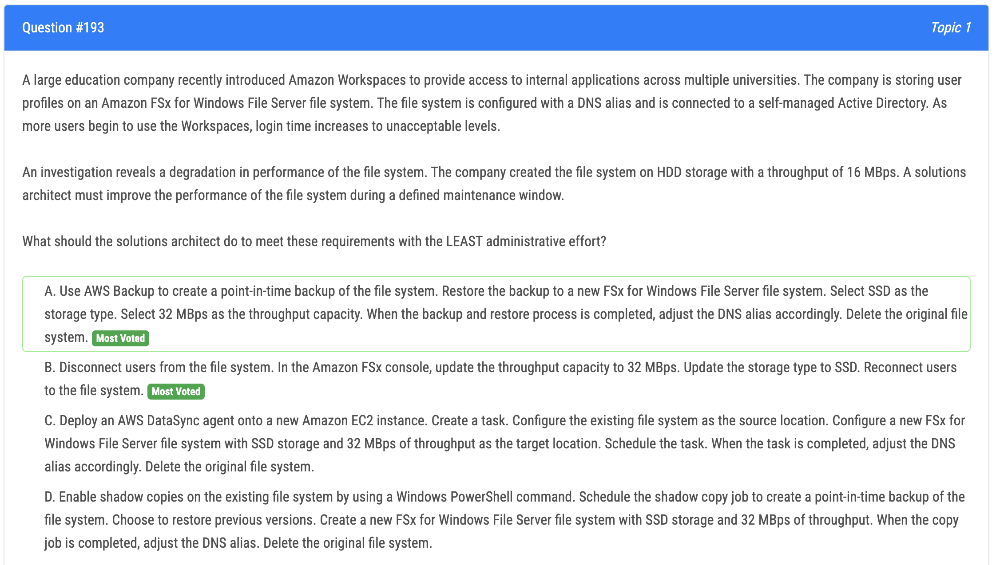
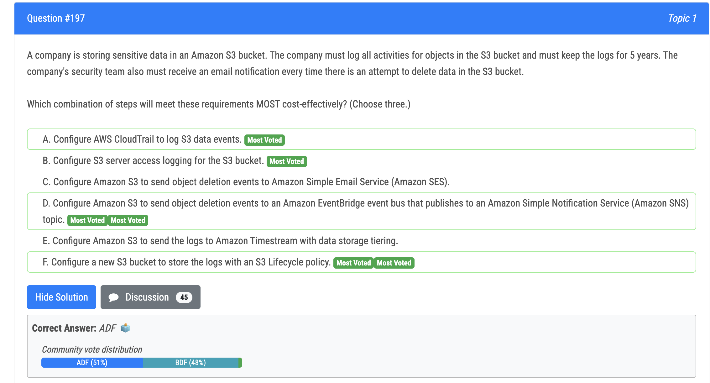
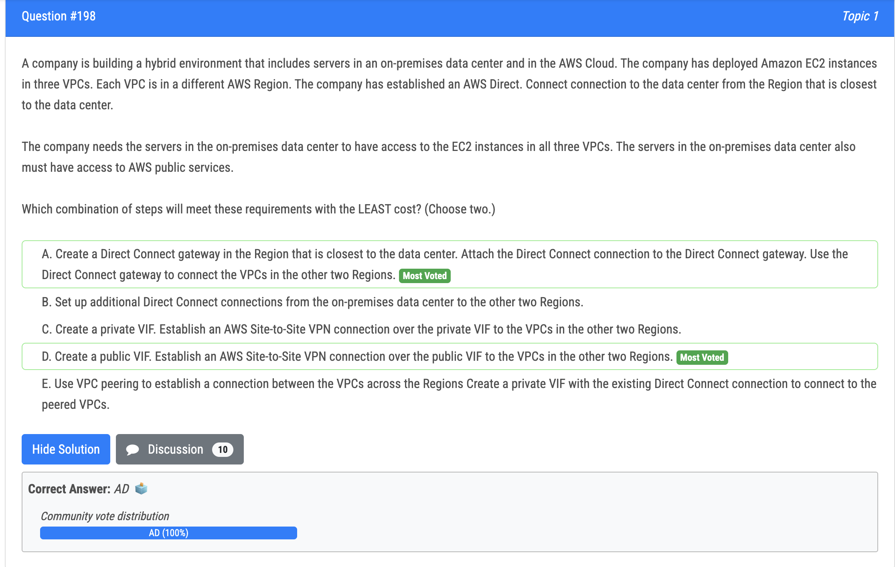
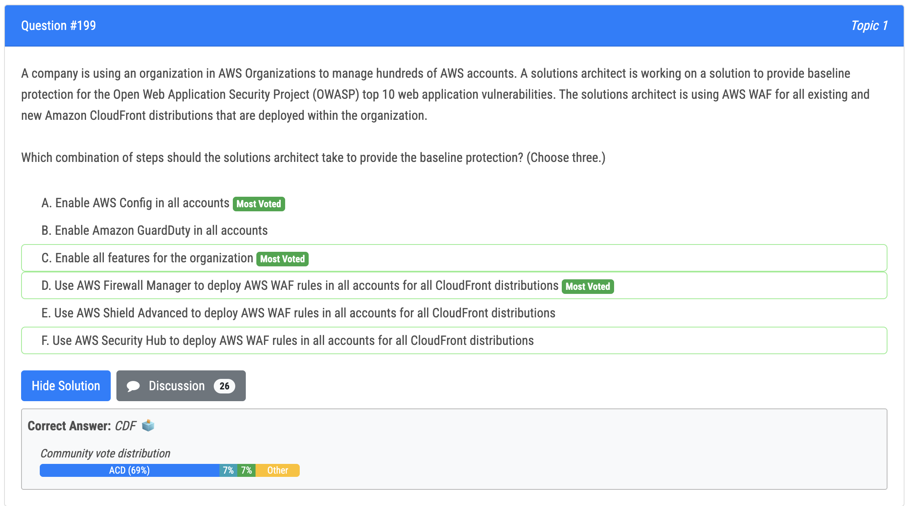
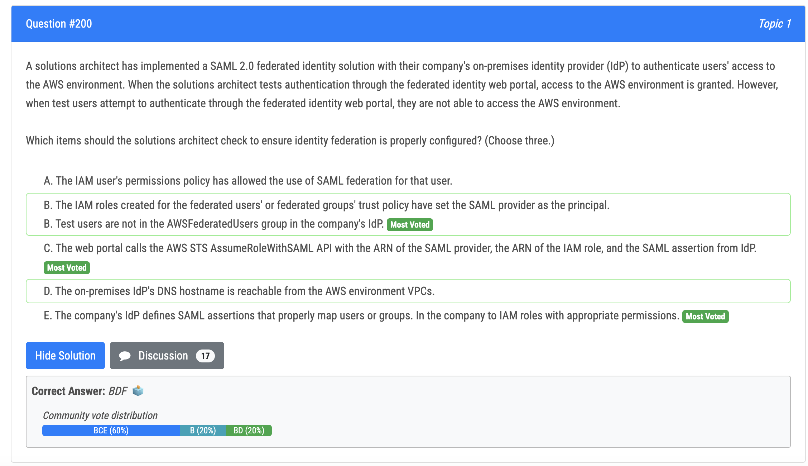

# 191번

- EFS = NFS 4 
- Fargate = No mgmt or provisioning overheads for servers

# 193번

- a, b 둘다 맞는 말..
- Between option A and B, option A would be easier to implement with minimal effort. Option A involves creating a point-in-time backup using AWS Backup and restoring it to a new FSx file system. This is an automated process that restores the backed up data to a new file system. Only adjusting the DNS alias is needed to transition users. Option B requires manually disconnecting users, making configuration changes in the FSx console to update throughput and storage, and then reconnecting users. This is more manual effort compared to the backup and restore process.

# 197번

- c vs d : Amazon SES (Simple Email Service) is more suitable for sending emails and is not designed for handling S3 object deletion events.
- a vs b : Using server access logging provides basic access logs for requests made to the S3 bucket, but it is not as comprehensive for auditing purposes as CloudTrail and can result in a large volume of data, increasing costs.

# 198번

- c vs d : servers in the on-premises data center 가 aws public service 에 엑세스 해야 하기 때문

# 199번

- Prerequisites - AWS Config and All Features should be enabled in the organization.

# 200번

- B) The IAM roles created for the federated users' or federated groups' trust policy have set the SAML provider as the principal.
- D) The web portal calls the AWS STS AssumeRoleWithSAML API with the ARN of the SAML provider, the ARN of the IAM role, and the SAML assertion from IdP. 
- F) The company's IdP defines SAML assertions that properly map users or groups. In the company to IAM roles with appropriate permissions.

