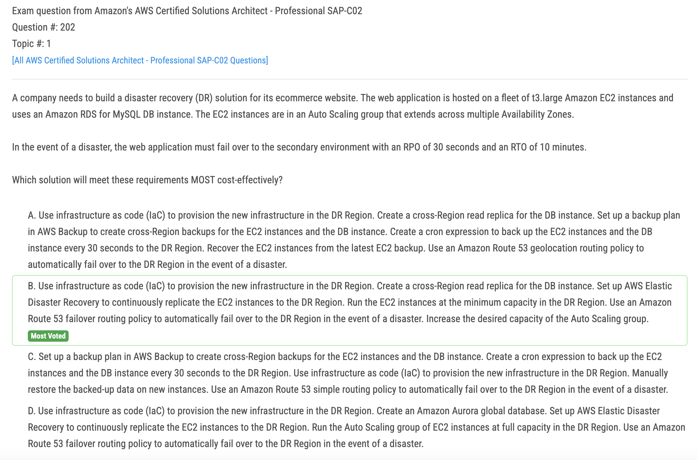
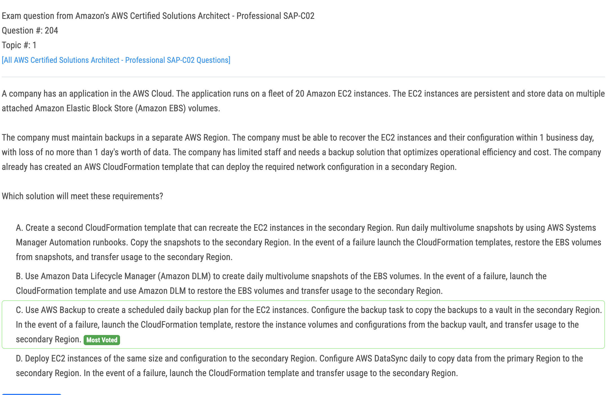
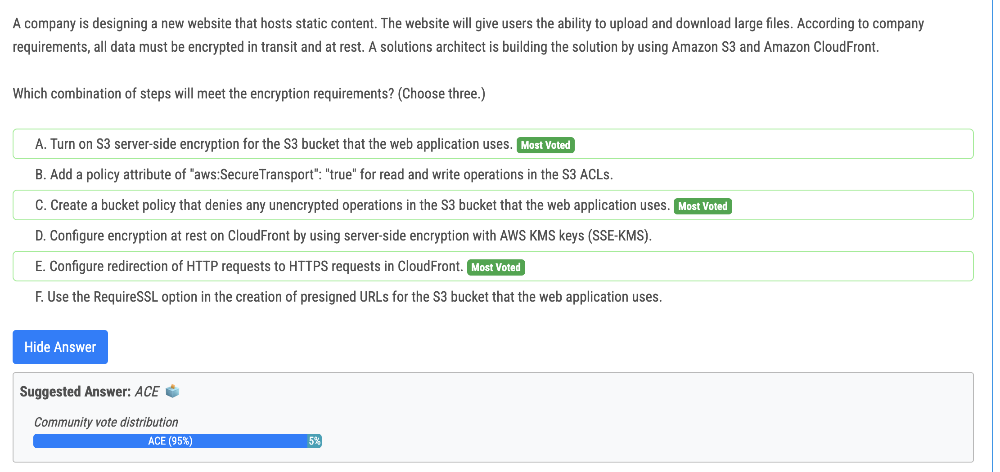
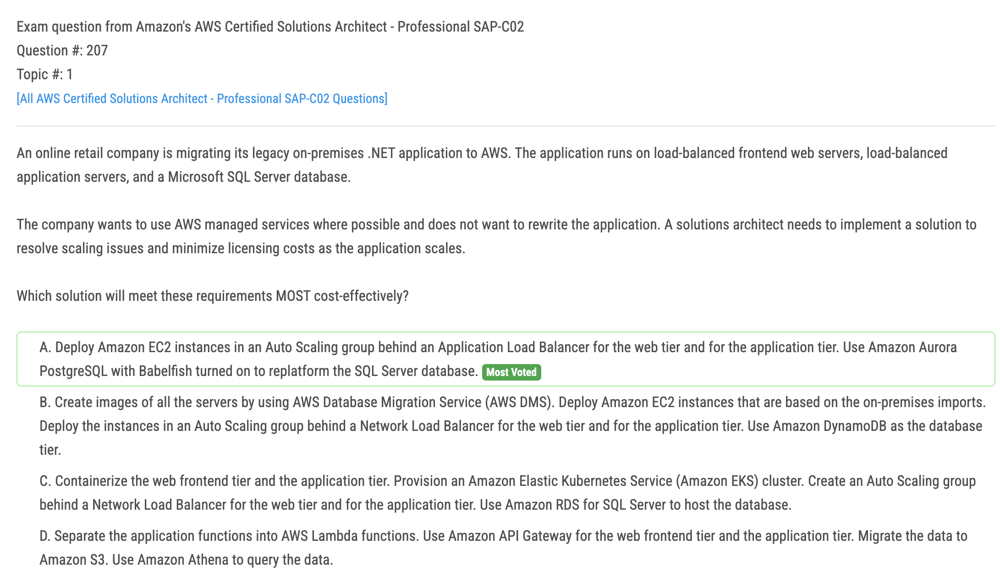
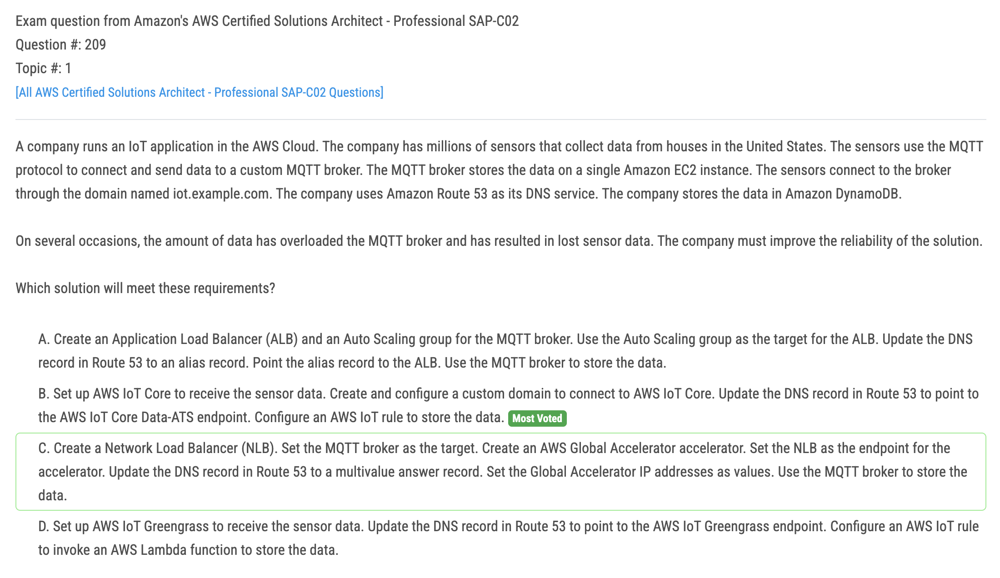
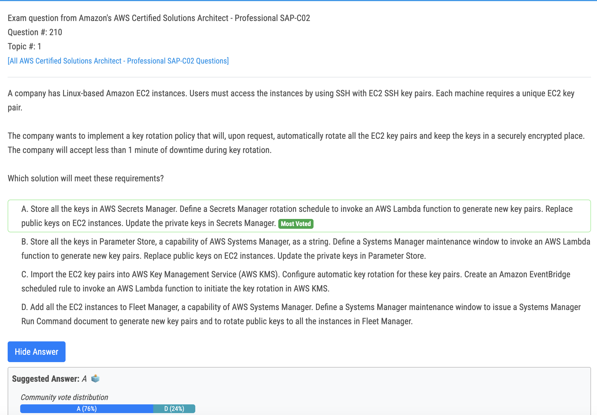

# 202번

- Option B leverages infrastructure as code (IaC) to provision the necessary infrastructure in the DR Region, which allows for automated and repeatable deployments. Creating a cross-Region read replica for the Amazon RDS DB instance ensures that the database is replicated and available in the DR Region. AWS Elastic Disaster Recovery can be used to continuously replicate the EC2 instances from the primary Region to the DR Region, ensuring up-to-date copies of the application. Running the EC2 instances at the minimum capacity in the DR Region helps reduce costs, as resources are only utilized when failover occurs. Using an Amazon Route 53 failover routing policy allows for automatic failover to the DR Region in the event of a disaster, minimizing downtime. Increasing the desired capacity of the Auto Scaling group ensures that sufficient resources are available in the DR Region to handle the workload during failover.

# 204번

# 205번

- A) SSE S3 sounds good encript in rest data 
- B) sounds good until say in ACLs is incorrect 
- C) Bucket Policy avoid upload unencrypted is correct sounds good 
- D) CloudFront with KMS ? why ? not seems 
- E) HTTP redirect to HTTPS sounds good is clasic this case 
- F) why ? not seems in this case

# 207번

- "does not want to rewrite the application. " leaves the possible answer between A and C, cause B and D will force the application team to rewrite the data access part of the application. C is using EKS, which makes AutoScalingGroup is not required. ASG scales instances. ASG doesn't scale PODs in EKS. Babelfish is the key point in this question. "Babelfish for Aurora PostgreSQL is a new capability for Amazon Aurora PostgreSQL-Compatible Edition that enables Aurora to understand commands from applications written for Microsoft SQL Server."

# 209번

- Both C and B should work. I suggest AWS wants us to use as many native services as we can, therefore B should be the preferred answer.
- 오답 - D : Greengrass is typically used for edge computing scenarios and may not be the most suitable solution for addressing MQTT broker reliability and scalability.

# 210번

- A will work, don't overthink, you can request secret rotation in the Secrets manager, and secrets will be stored in a safe place

