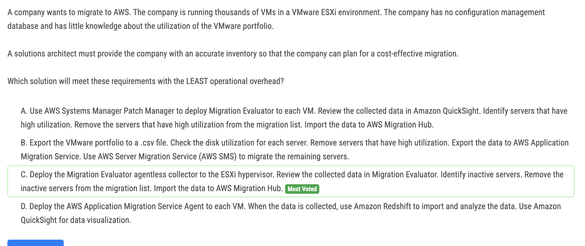
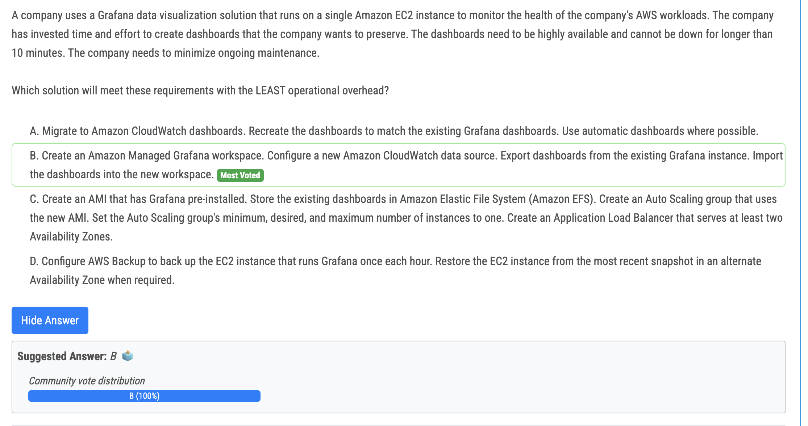
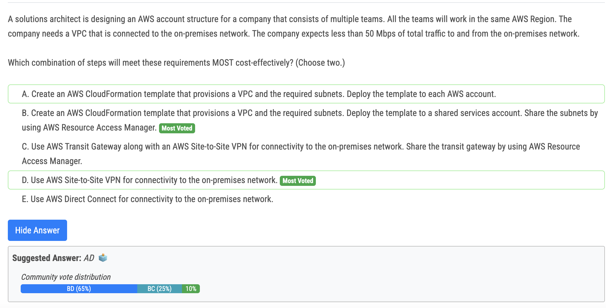
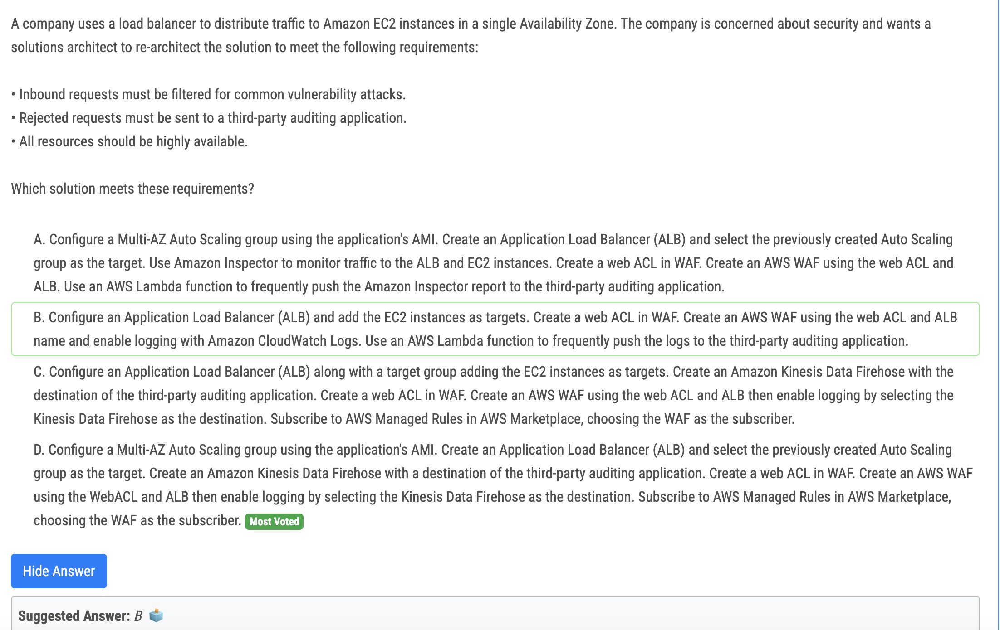
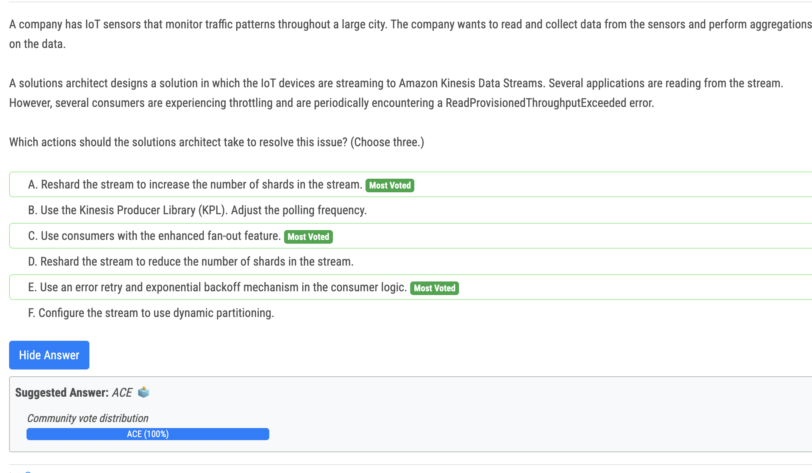

# 211번

- This solution can meet the requirements with the least operational overhead. and also, keyword for planning only

# 213번

- By creating an Amazon Managed Grafana workspace, you can offload the operational overhead of managing and maintaining the Grafana infrastructure. Amazon Managed Grafana is a fully managed service that takes care of the underlying infrastructure, including scalability, availability, and updates.

# 215번

- BD they need a (one) VPC, no need for TGW. Use case for subnet sharing via RAM

# 217번

- 정답 - D : Only A and D cover the requirement for high availability. A uses Inspector, which is a vulnerability scanner and does not monitor traffic. So - even that I don't like the complexity of D - this remains the only option

# 220번

- b vs e : Use the Kinesis Producer Library (KPL) and adjust the polling frequency" may not be directly related to solving the throttling issue. The KPL is primarily used for producing data into the Kinesis stream, not consuming it.

