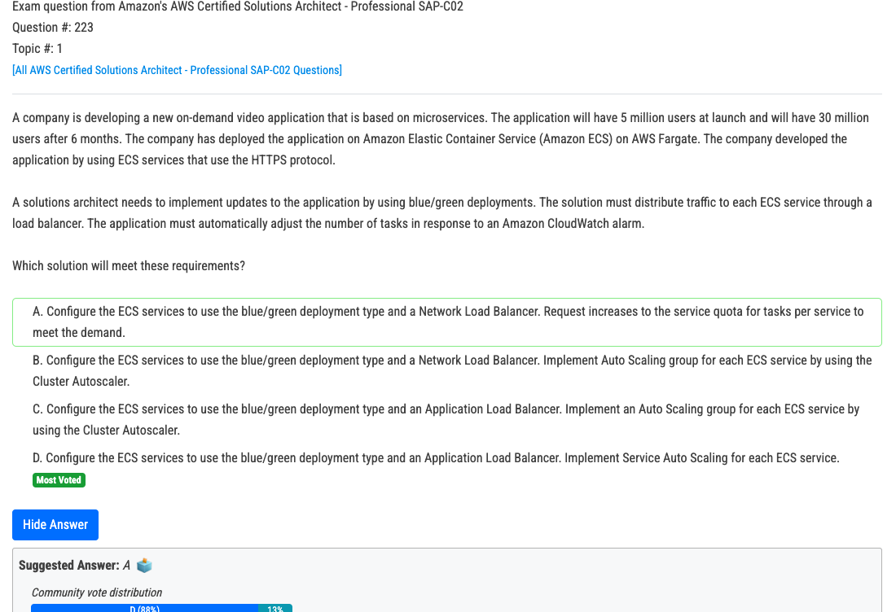
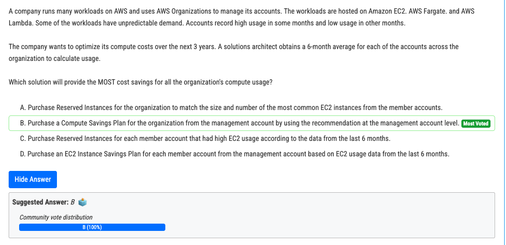
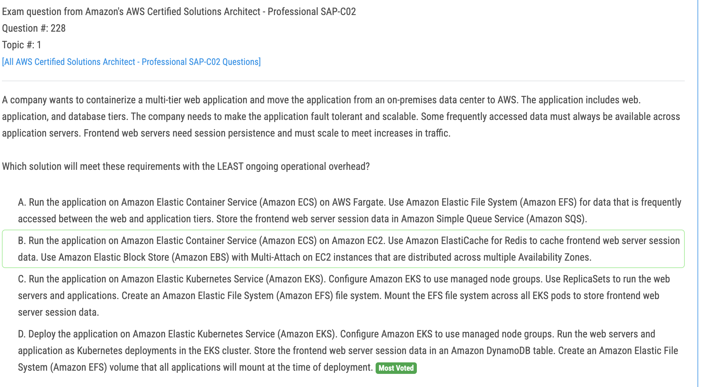
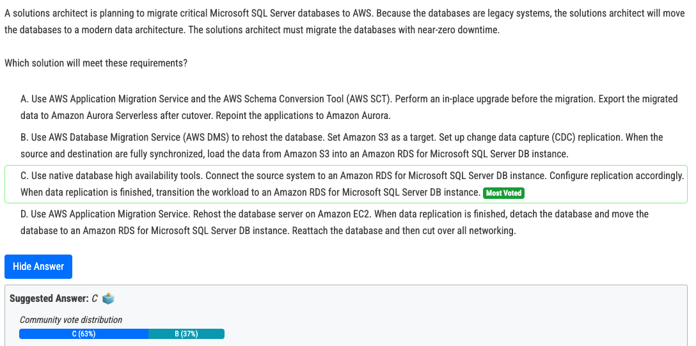

# 223번

- A and B are out, it says the app uses HTTPS. C is out because we have Fargate and there is no Cluster Auto Scaling there. So, it's D because we have Service Auto Scaling.

# 225번

- A. Incorrect: RI's Supports only EC2 instances. 
- B. Correct: Compute savings plan supports EC2, Fargate and Lambda. Applied in Organization's management account. 
- C. Incorrect: RI's Supports only EC2 instances and Changes to be applied at Organizations management account. 
- D. Incorrect: Instance Saving plan supports only EC2.

# 228번

- A - Why do you need SQS to store web sever session data. SQS is for decoupling services 
- B - EBS multi attach is for SAME availibility zone. The ques says multipel availibility zones 
- C - Why do you need EFS to store web sever session data. Its damn expensive 
- **D** - Better answer- But again why need for EKS. If I were to choose one option, its D as its better compared to ABC

# 229번

- C. The proper way is to use AWS DMS, but the answer here uses S3 (???) which will take forever. So the answer is C.