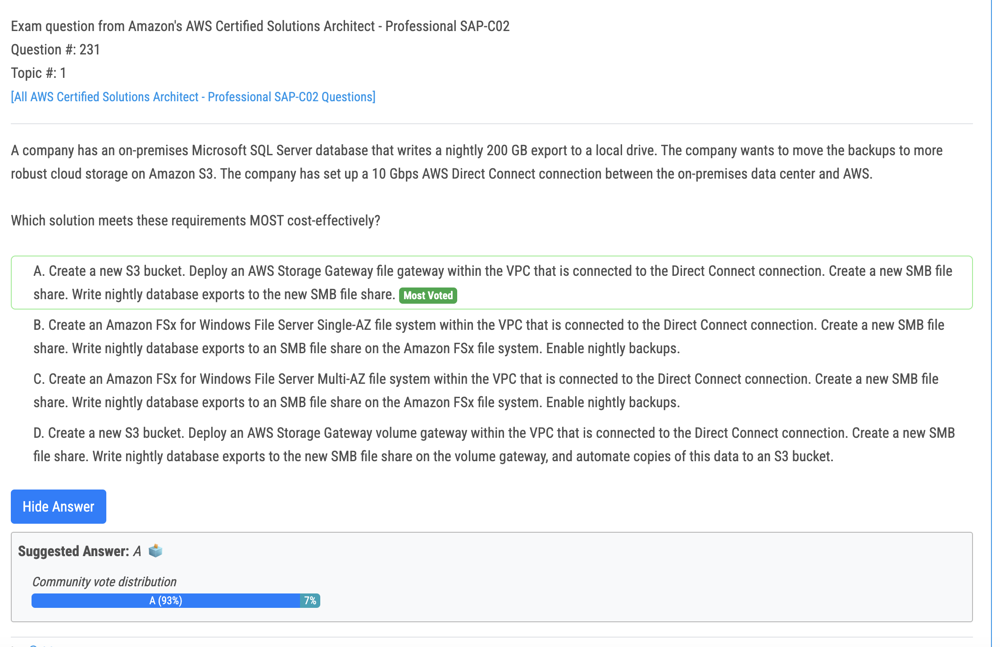
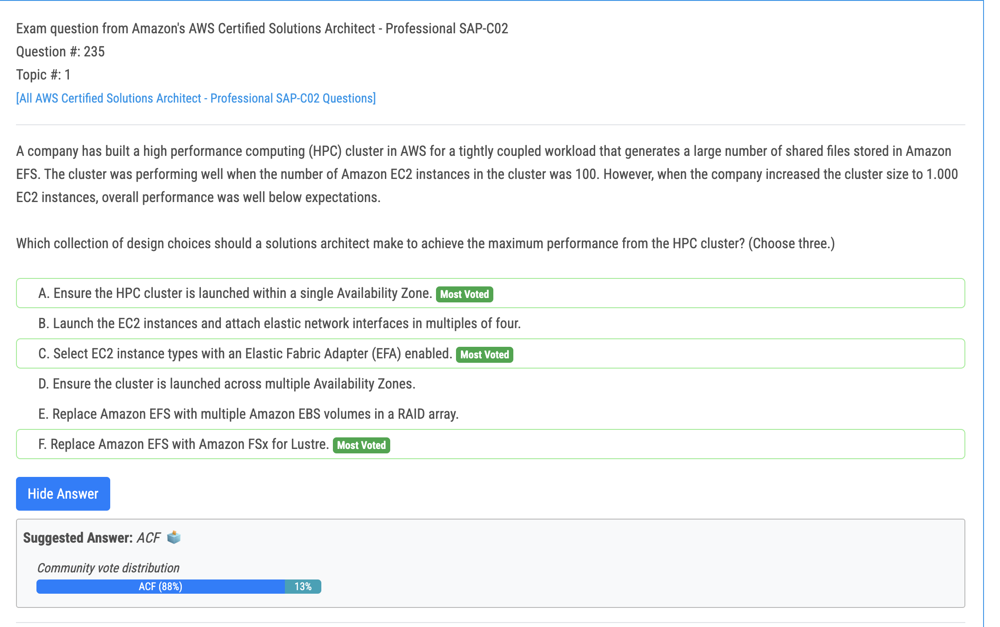
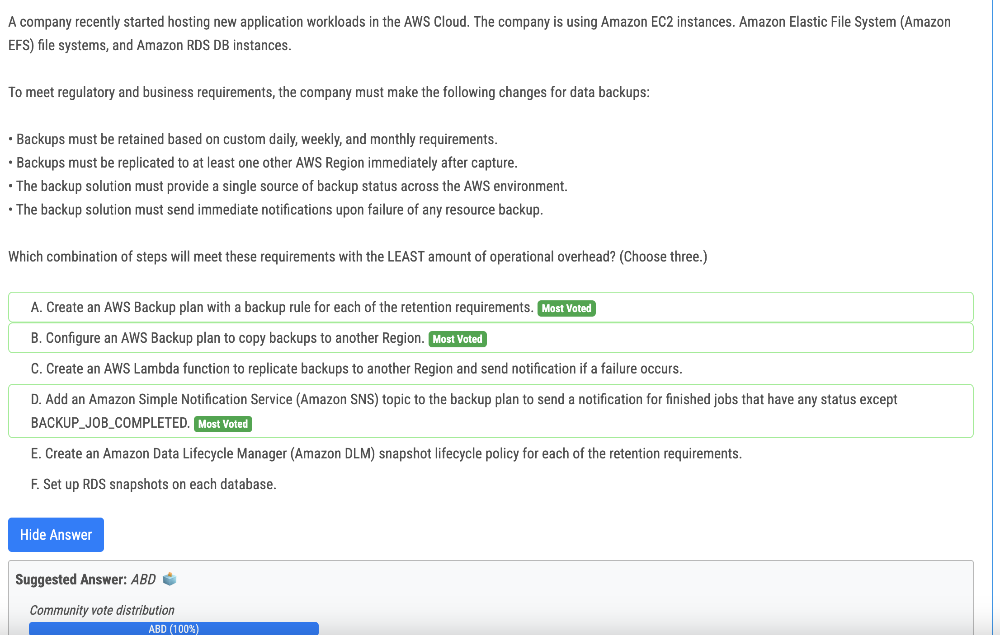

# 231번

- File Gateway == SMB
- NFS Volumes Gateway == iSCSI
- Tape Gateway = VTL

# 235번

- A. Ensure the HPC cluster is launched within a single Availability Zone: This choice ensures that the EC2 instances in the cluster have low network latency and high bandwidth, as they are located within the same data center. 
- C. Select EC2 instance types with an Elastic Fabric Adapter (EFA) enabled: EFA is a network interface that provides low-latency, high-bandwidth communication between EC2 instances. By selecting instance types with EFA enabled, the cluster can benefit from improved inter-instance communication. 
- (틀린거) E vs F. Replace Amazon EFS with Amazon FSx for Lustre: Amazon FSx for Lustre is a high-performance file system optimized for HPC workloads. By using FSx for Lustre instead of Amazon EFS, the cluster can achieve better performance for the large number of shared files generated by the workload.

# 238번

- ABD. 
  - C - You don't need Lambda for cross-region backup.
  - E - E is incorrect because Amazon Data Lifecycle Manager to used to automate the creation, retention, and deletion of EBS snapshots and EBS-backed AMIs. It CANNOT be used for backups for ec2, EFS, RDS 
  - F -  You don't need RDS snaps.