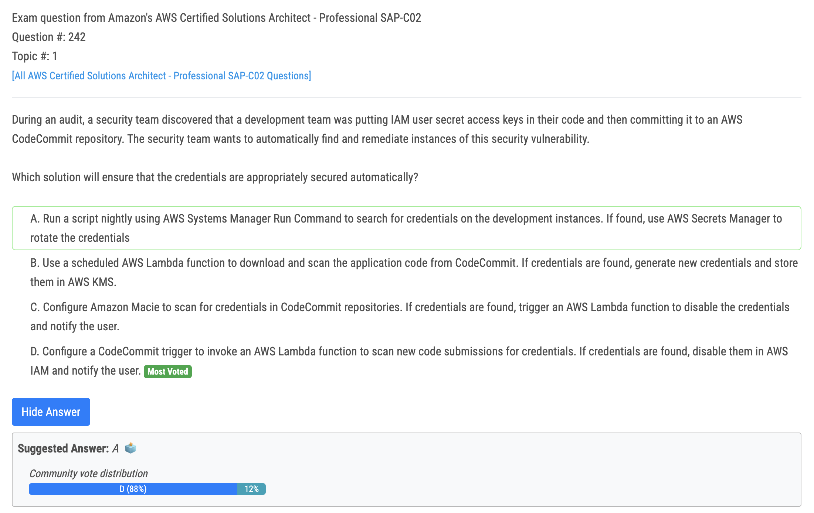
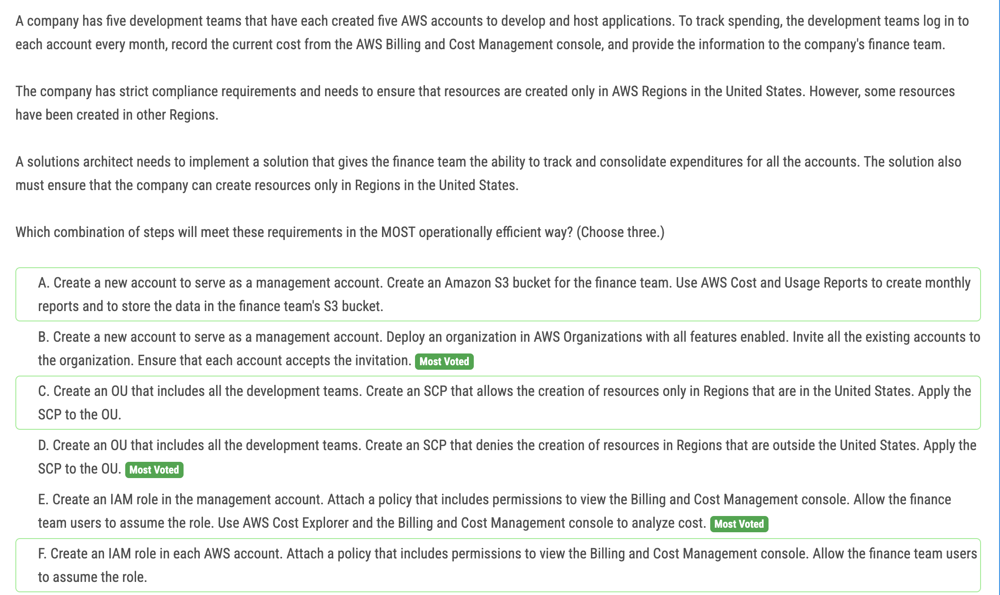
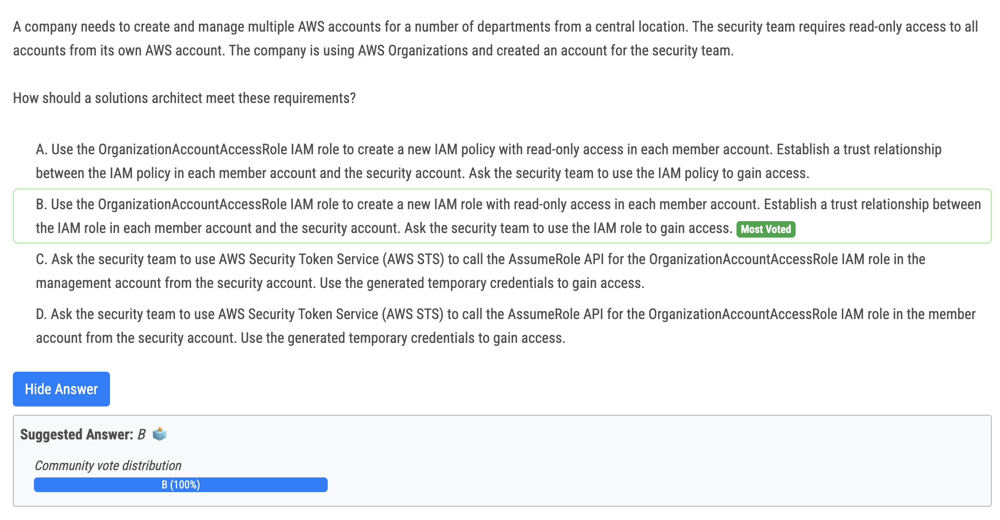
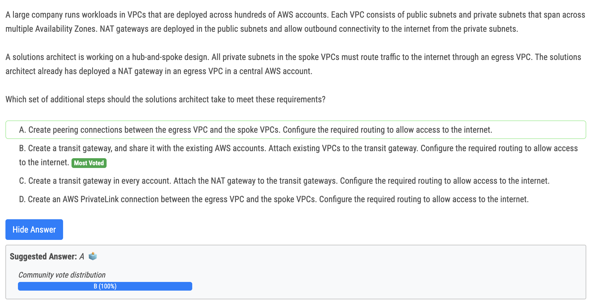
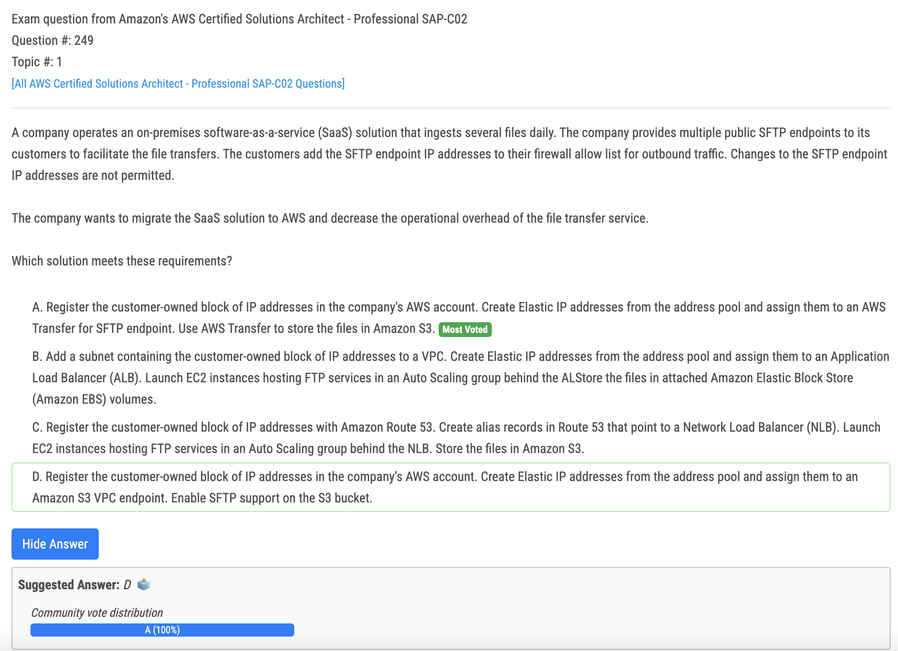

# 242번

- 오답
  - A - AWS Secrets Manager can't rotate the credentials if they are part of the code 
  - B - You don't store creds in KMS, that's the job of Secrets Manager 
  - C - Macie can do S3 only. CodeCommit backend is also S3 but it's transparent for us, so you can't use Macie.

# 245번

- C vs D : If you allow the creation in certain regions in the SCP, all member accounts are allowed to create instances in the region. But each member account can add IAM policies to allow to create them in different regions as well, unless there is an explicit deny. Therefore only D works.

# 246번

- By using the OrganizationAccountAccessRole IAM role, the solutions architect can create a new IAM role with read-only access in each member account. This allows the security team to have read-only access to all accounts from their own AWS account. The trust relationship between the IAM role in each member account and the security account ensures that the security team can assume the IAM role and access the necessary resources.

# 247번

- 정답 - B
  - B vs C : create TGW in each account, wrong

# 249번

- Option A suggests using AWS Transfer for SFTP, which is a fully managed service that enables the transfer of files over the Secure File Transfer Protocol (SFTP) directly into and out of Amazon S3. By registering the customer-owned block of IP addresses in the company's AWS account and creating Elastic IP addresses from that address pool, the company can assign those IP addresses to an AWS Transfer for SFTP endpoint. This allows the customers to continue using their existing firewall allow lists without requiring any changes. The files transferred through the SFTP endpoints are stored directly in Amazon S3, reducing operational overhead
- 오답
  - Option D: S3 doen't have support for SFTP option -> out 
  - B, C: using EC2 to host FTP (not SFTP) while there is a native soltion in option A -> out