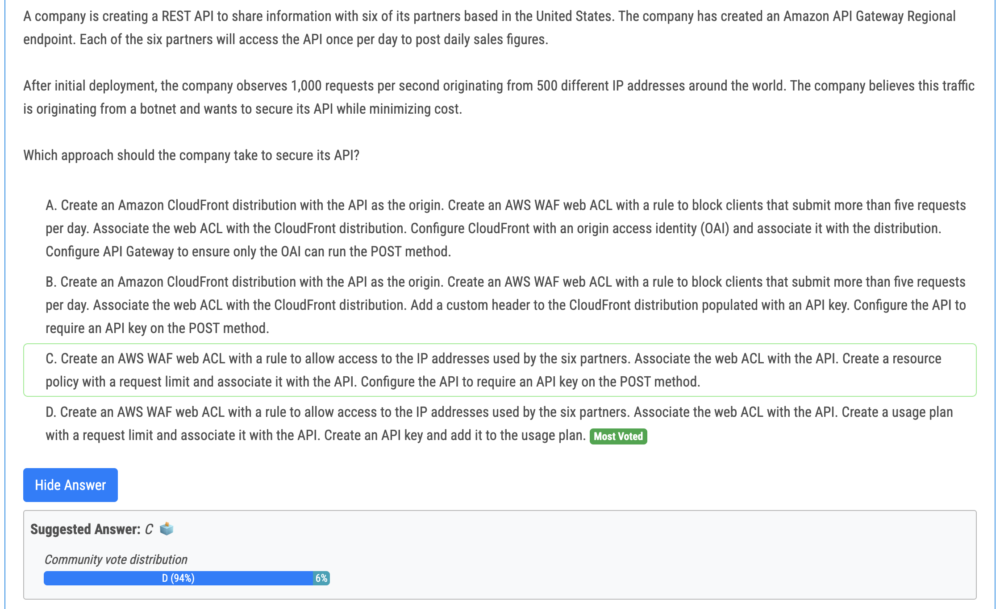
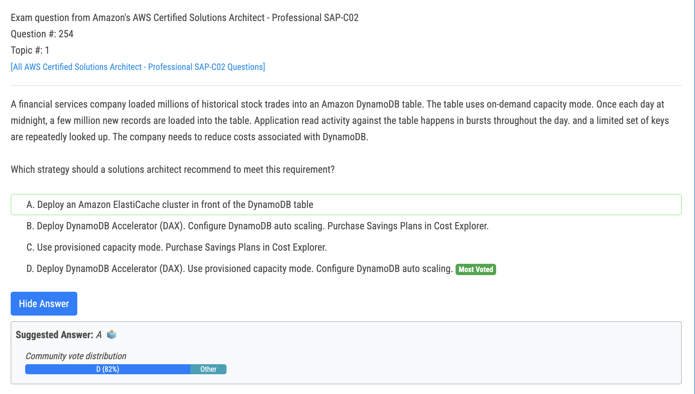
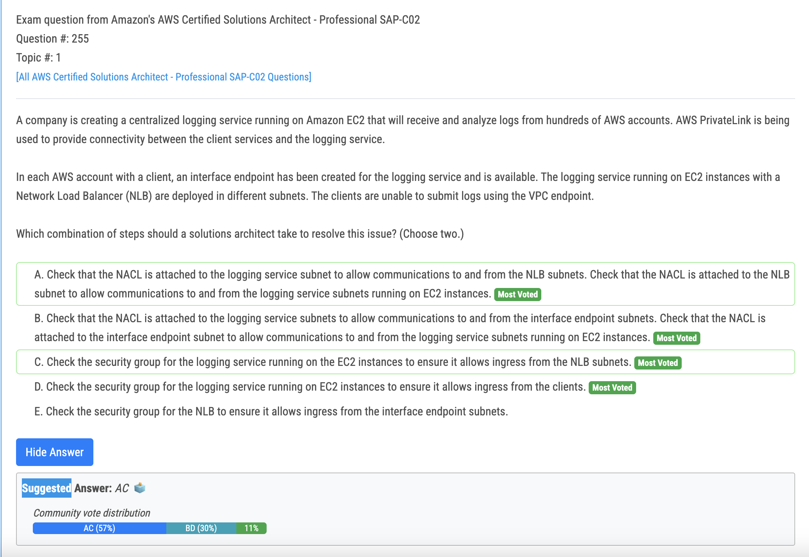
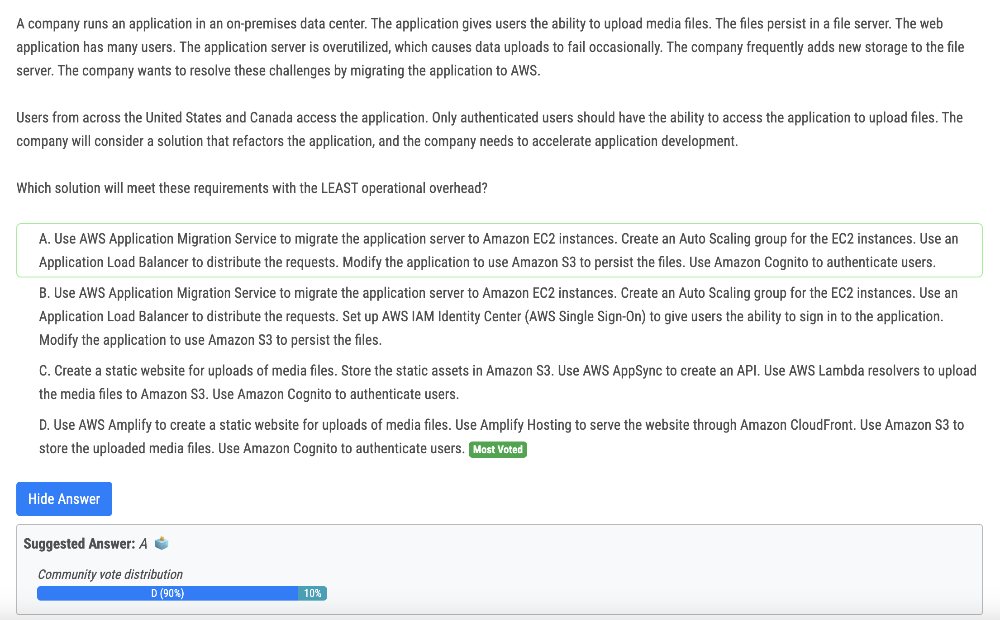

# 251번 (정답)

- Ans is Opt D, A usage plan provides select customers with specific access permissions and request quotas, which helps manage and restrict usage to prevent overuse of resources. API keys are used for tracking and controlling how the API is used. This additional layer of security ensures that only those with the key can access the API. 
- Why not Opt C, Amazon API Gateway doesn't support request limiting through resource policies. You can set permissions on who can access your API using a resource policy, but rate limiting isn't handled by resource policies. API keys alone do not provide throttling or rate limiting. For throttling, you typically would need to use them along with usage plans

# 254번

- DynamoDB Accelerator (DAX): This in-memory cache reduces read latency and improves read throughput for frequently accessed data. Since the application has burst read activity and repeatedly accesses a limited set of keys, DAX can significantly improve performance and reduce costs associated with read throughput on DynamoDB. 
- Provisioned capacity mode: While on-demand capacity mode eliminates the need for upfront planning, it can be costly for applications with predictable workloads. Provisioned capacity allows for better cost optimization and predictability by specifying the minimum and maximum capacity required throughout the day. 
- DynamoDB auto scaling: This feature automatically adjusts provisioned capacity based on actual usage patterns. This ensures that the table has sufficient capacity during peak hours while avoiding wasted resources during off-peak periods, further reducing costs.

# 255번

- When you associate a Network Load Balancer with an endpoint service, the Network Load Balancer forwards requests to the registered target. The requests are forwarded as if the target was registered by IP address. In this case, the source IP addresses are the private IP addresses of the load balancer nodes. If you have access to the Amazon VPC endpoint service, then verify that: 
- The Inbound security group rules of the Network Load Balancer’s targets allow communication from the private IP address of the Network Load Balancer nodes The rules within the network ACL associated with the Network Load Balancer’s targets allow communication from the private IP address of the Network Load Balancer nodes

# 258번 (정답)

- The solution described in Option D leverages AWS Amplify to create a serverless and scalable architecture for media file uploads. Amplify provides an easier development experience and supports integration with Amazon S3 for file storage and Amazon Cognito for user authentication. Hosting the website through Amazon CloudFront ensures low-latency access for users across the United States and Canada. This solution minimizes operational overhead and accelerates application development.