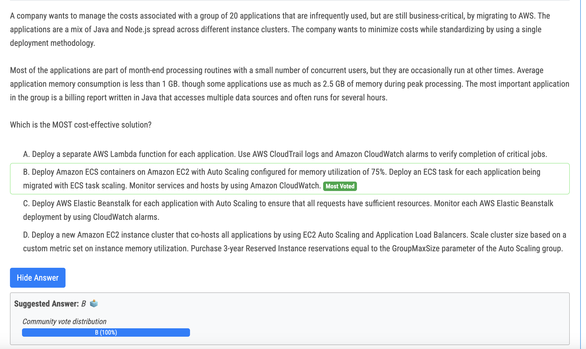
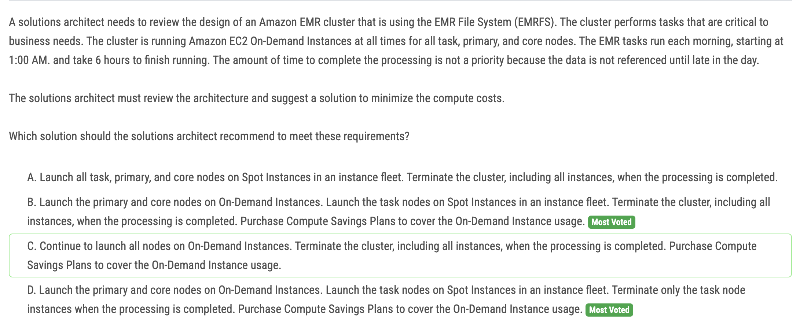
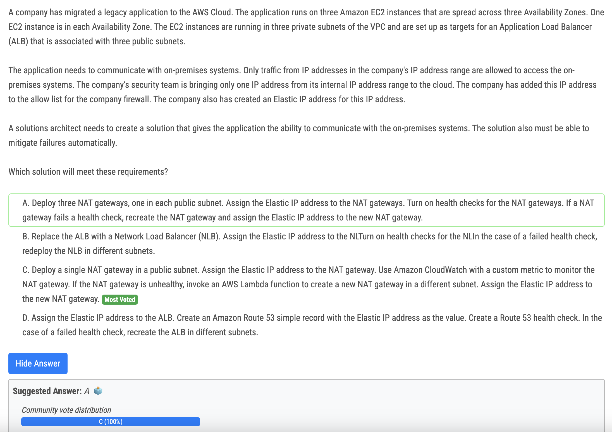
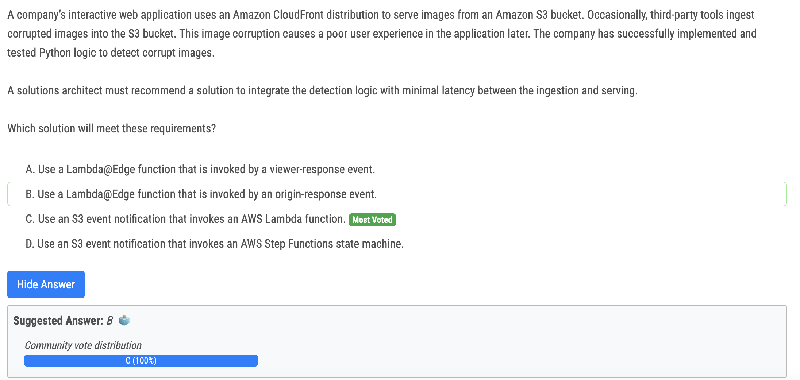
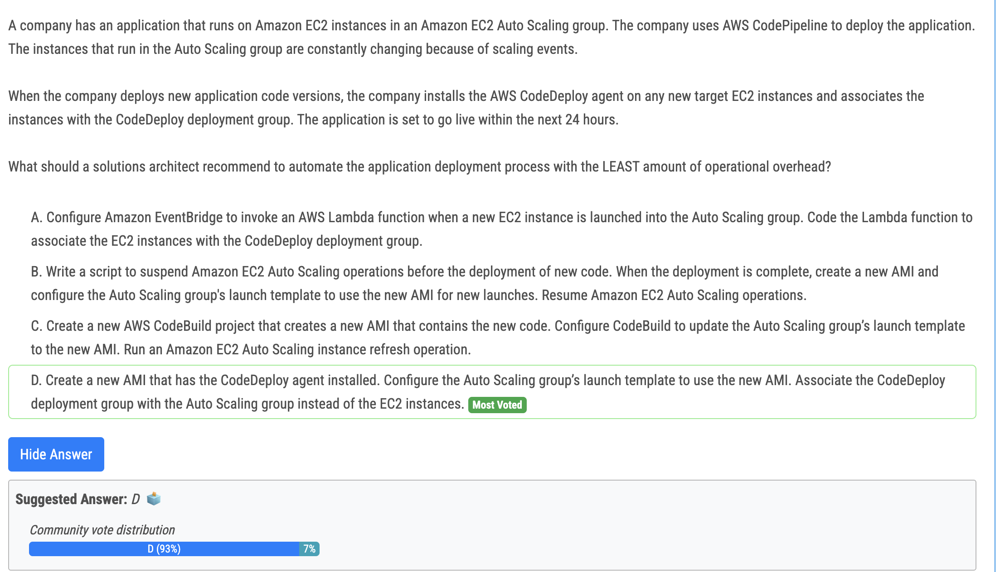
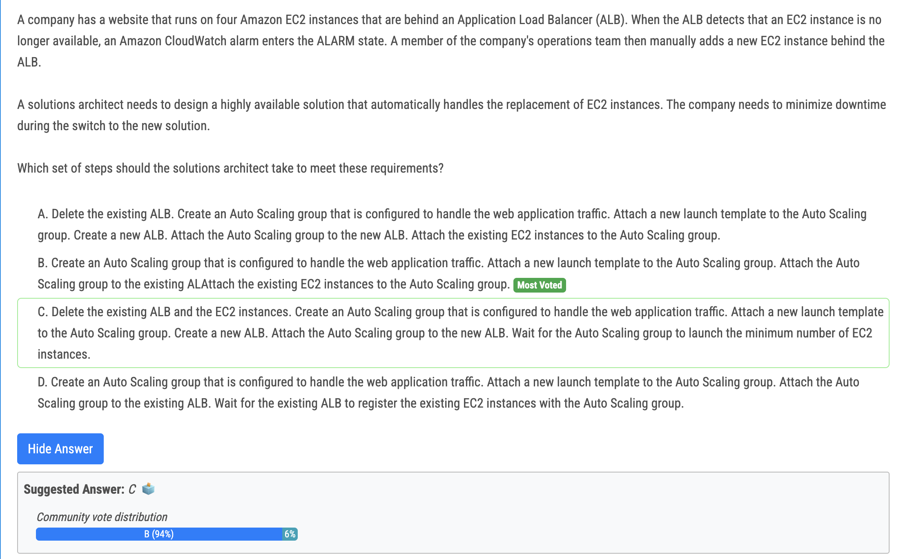
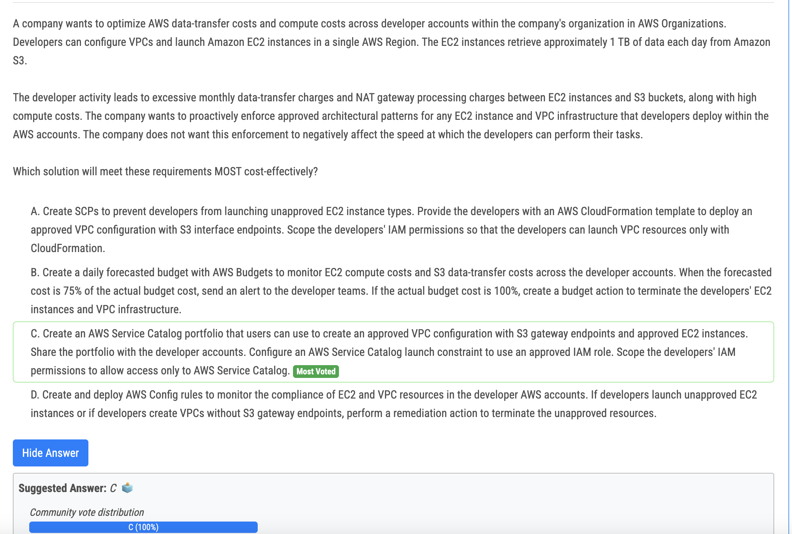
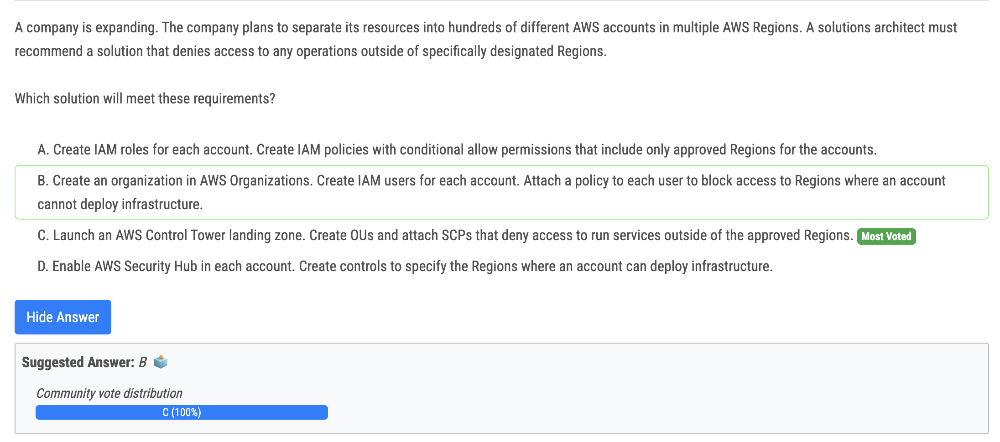

# 262번

- A 가 아닌 이유 : Hours = lambda out

# 263번

- D : The problem statement says: 
  - "The EMR tasks run each morning, starting at 1:00 AM. and take 6 hours to finish running. The amount of time to complete the processing is not a priority because *the data is not referenced until late in the day.*" 
- So later in the day, clients will be using the cluster to read data. Therefore my understanding is that core and primary nodes need to be available, but the task nodes can be terminated once the tasks have finished their daily run.

# 264번

- A is incorrect because you dont need 3 nat gateways 
- B does not make sense to replace ALB 
- D - you cannot assign elastic ip to ALB

# 266번(정답)

- The requirement here is to catch and deal with the corruption at the time of ingestion. Hence, the logical place to put the check would be where the ingestion is actually happening, which is when the image is put into the S3 bucket. Amazon S3 can be configured to send an event notification when a new object is created (i.e., put into the bucket). This event can then trigger a Lambda function that uses the Python logic to check the image for corruption. This way, you are catching and dealing with any issues as soon as the image is ingested.

# 267번

- AWS CodeDeploy is a deployment service that enables developers to automate the deployment of applications to instances and to update the applications as required.

# 268번

- There's no need to delete the existing ALB as suggested in options A and C. The ALB is still functional and will work with the newly created Auto Scaling group. You can directly attach the Auto Scaling group to the existing ALB.

# 269번

- C is correct. Service catalog solves all issues. S3 Gateway endpoint more cost efective with data transfer in VPC on AWS
- AWS Service Catalog를 사용하면 회사에서 IAM 역할을 사용하여 승인된 구성 및 리소스에 대한 액세스를 제어할 수 있는 동시에 개발자가 작업 수행 능력에 부정적인 영향을 주지 않고 리소스를 신속하게 프로비저닝할 수 있습니다.

# 270번

- B is incorrect as it is too difficult to maintain. C is correct answer.