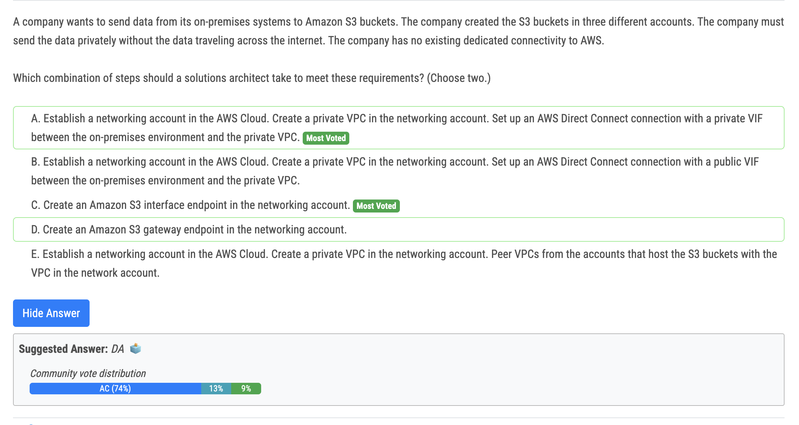
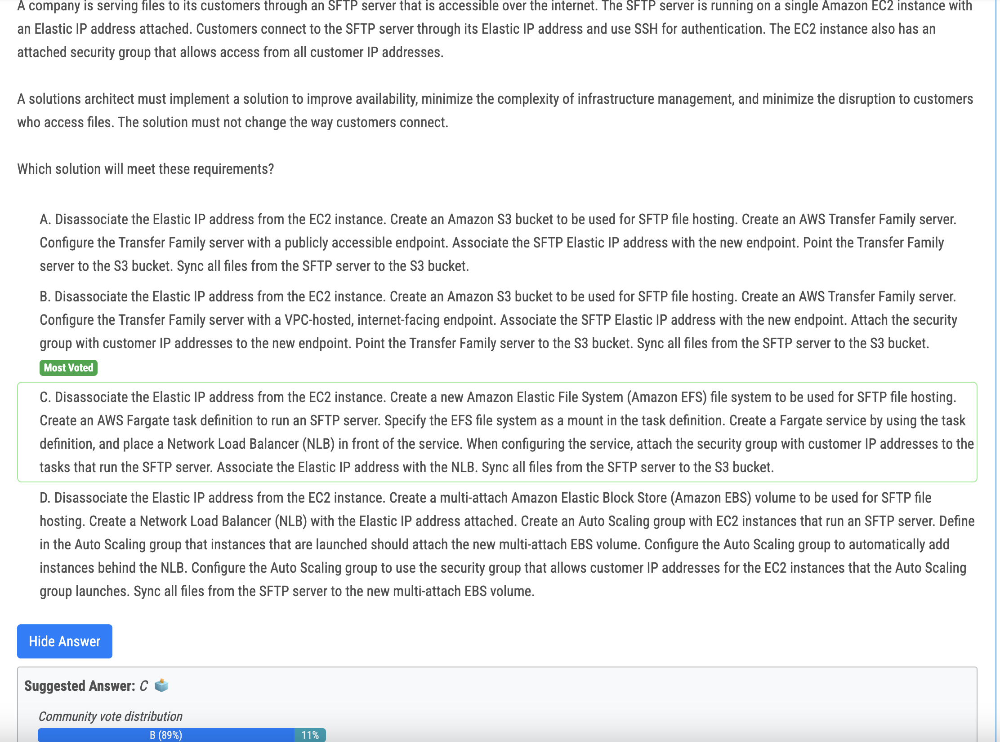

# 282번(정답)

- C - Apply tags and prevent future untagged resources to be created with SCPs.

# 283번(정답)

- C vs D : Both gateway and interface endpoints will use aws backbone, so not internet. However, you cannot access a GW endpoint from onprem. Therefore needs interface (ENIs) endpoints.

# 285번

- Option C (Use AWS AppSync and leverage WebSockets to deliver comments) is the most appropriate solution for real-time comments. AWS AppSync is a fully managed service that simplifies real-time data synchronization and offline capabilities for applications. It supports WebSockets, which enables real-time communication between clients and the server. By leveraging AppSync and WebSockets, the comments can be delivered instantly to users as they are posted, reducing comment latency and improving user engagement.

# 289번(정답)

- A : You cannot natively convert the RDS for MySQL DB instance to an Amazon Aurora MySQL DB cluster. Instead, you can create an Amazon Aurora MySQL replica of the RDS MySQL RDS DB instance

# 290번

- B Question say " The EC2 instance also has an attached security group that allows access from all customer IP addresses." 
  - B say "Attach the security group with customer IP addresses to the new endpoint"
- Option B suggests disassociating the Elastic IP address from the EC2 instance and creating an Amazon S3 bucket for SFTP file hosting. An AWS Transfer Family server is then created and configured with a VPC-hosted, internet-facing endpoint. The SFTP Elastic IP address is associated with the new endpoint, and the security group with customer IP addresses is attached to the endpoint. The Transfer Family server is pointed to the S3 bucket, and all files from the SFTP server are synced to the S3 bucket.