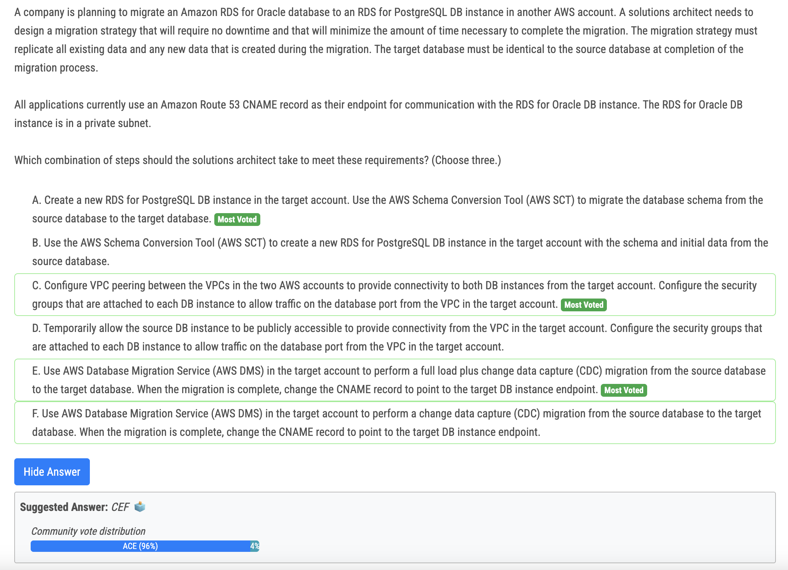
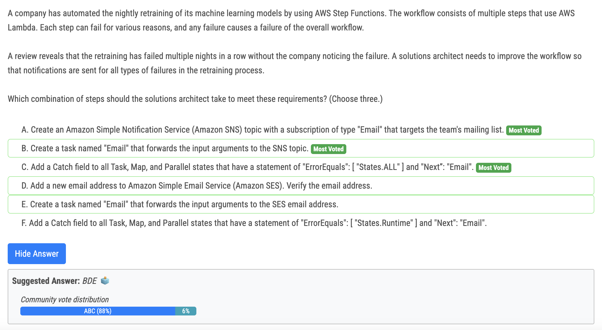
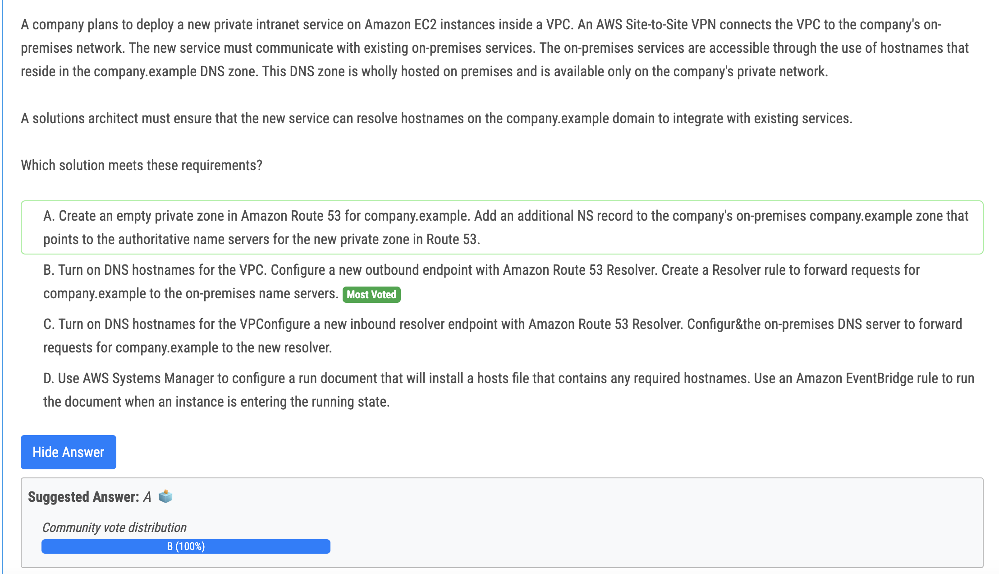
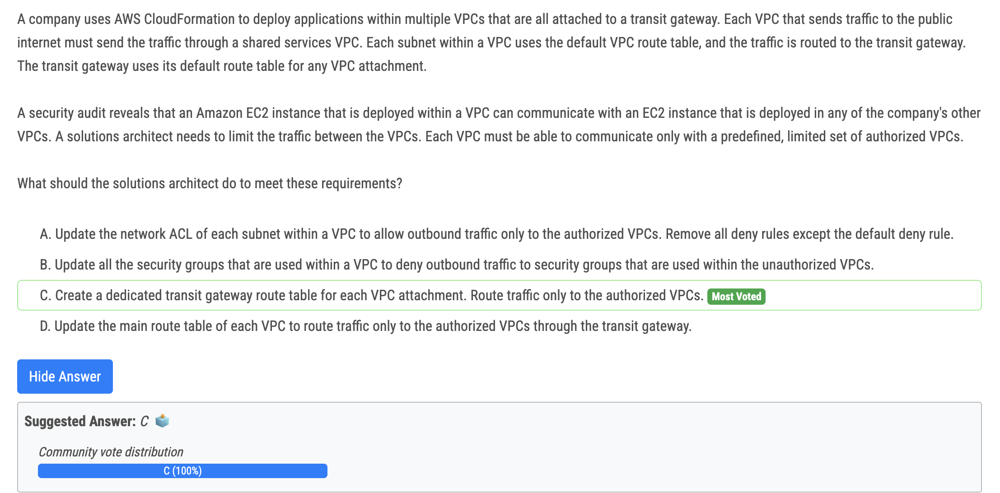
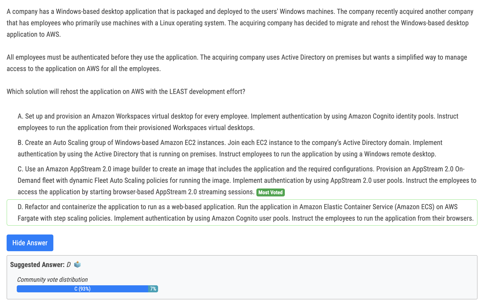

# 275번

- ace - correct 
- b - AWS SCT can't create RDS 
- d - never make anything publicly accessible even if temporary 
- f - you need initial data, not just changes

# 277번

- SNS vs SES : SES is not for notification

- C vs F : "notifications are sent for all types of failures in the retraining process" - that means States.ALL. The rest is common sense. 

  

# 278번(정답)

- Outbound resolver endpoints will let you query your onprem DNS 
- Inbound resolver endpoints will let your onprem DNS server to query the AWS VPC DNS server

# 279번(정답)

- Option C suggests creating a dedicated transit gateway route table for each VPC attachment. This allows fine-grained control over the routing of traffic between VPCs. By creating separate route tables, the architect can specify the allowed routes for each VPC attachment and limit traffic to only the authorized VPCs. This approach ensures that communication between VPCs is restricted and provides a secure and controlled network environment.

# 280번

- Amazon Cognito identity pools does not support AD. however WorkSpace is a right choise forthis use case though.
- Option C leverages Amazon AppStream 2.0, a fully managed application streaming service. With AppStream 2.0, you can create an image that includes the Windows-based desktop application and the required configurations.