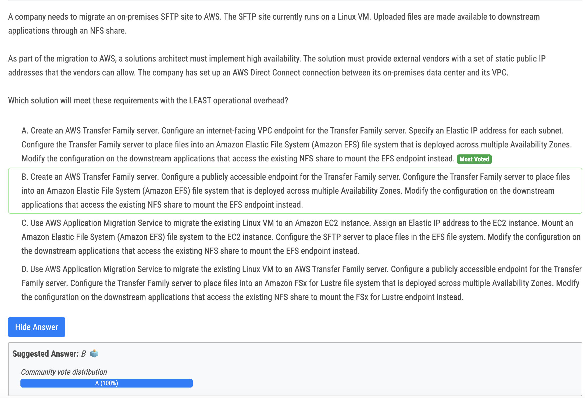
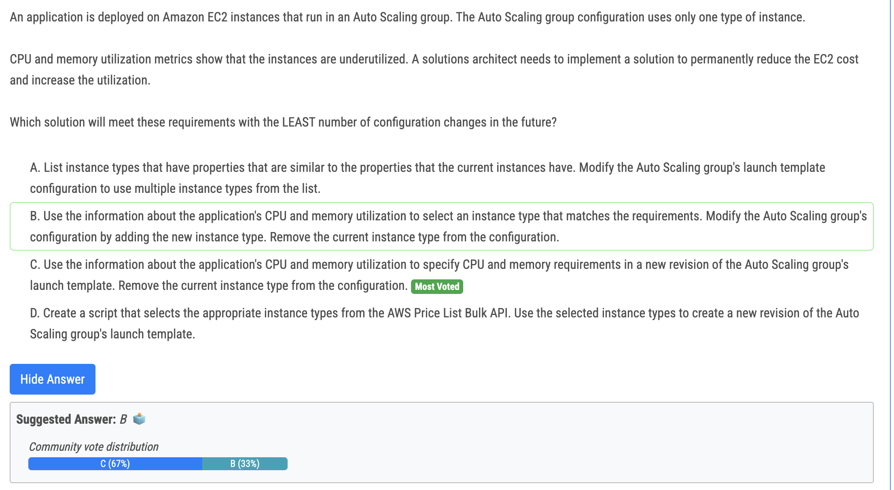
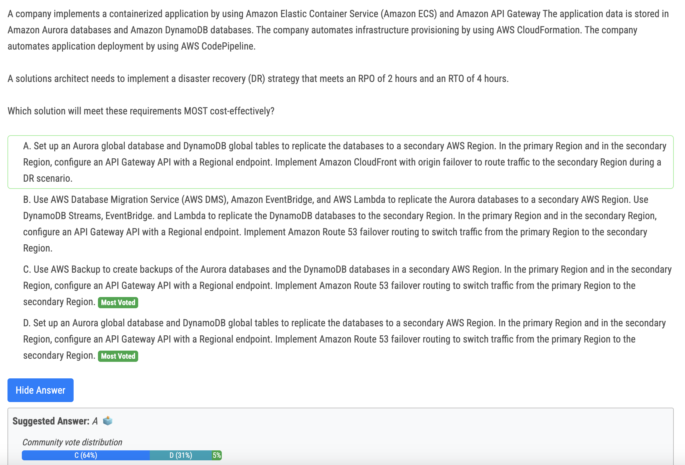
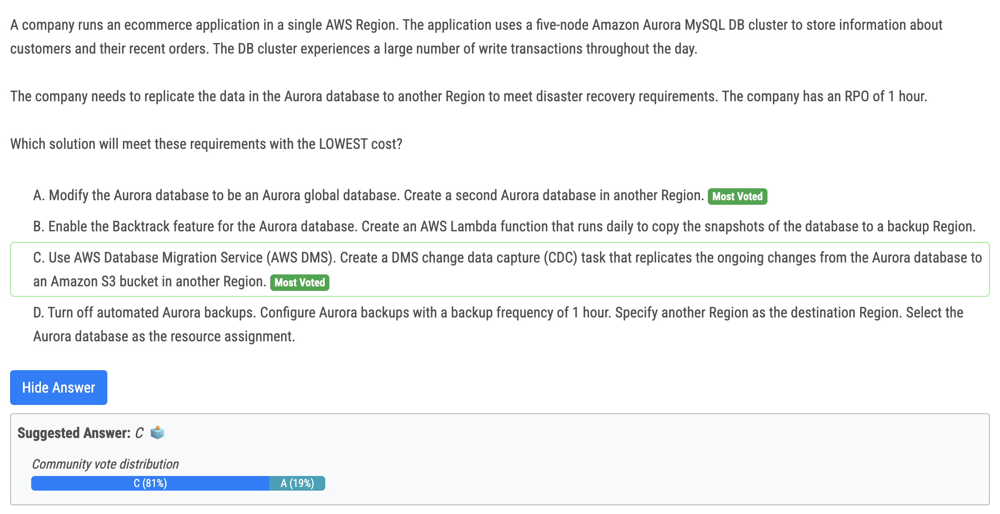
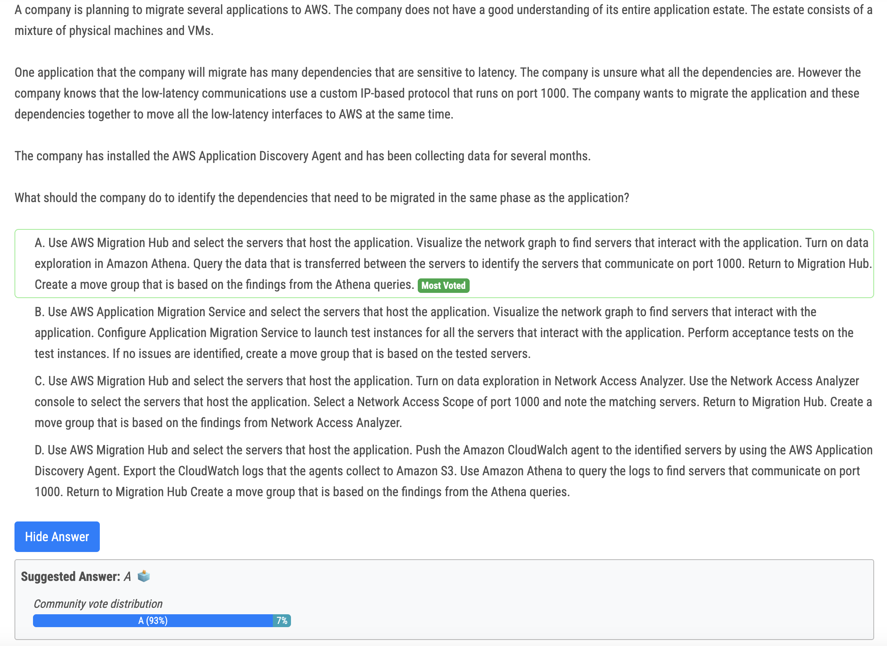

# 292번

- Managed SFTP: AWS Transfer Family eliminates the need to manage and maintain SFTP servers, reducing operational overhead compared to EC2-based solutions. 
- High availability: It provides built-in high availability, ensuring continuous access to SFTP services even in case of component failures.
-  Static IP addresses: The internet-facing VPC endpoint with Elastic IP addresses provides fixed IPs for external vendors, meeting their security requirements. 
- Secure file storage: EFS offers a managed, scalable, and highly available file system, ensuring secure file storage and access for downstream applications. 
- NFS compatibility: EFS integrates seamlessly with NFS, allowing easy migration of downstream applications to the new file system.

# 295번

- Key to the Answer is "Modify". Launch templates are immutable; after you create a launch template, you can't modify it. Instead, you can create a new version of the launch template that includes any changes you require. 

# 296번

- c?? d??

# 298번

- As there is no RTO C is best and most cost-effective.

# 300번

- A: looks fine 
- B: AWS Application Migration Service is for lift and shift, not for dependency mapping 
- C: Network Access Analyzer only for AWS resource, not for on prem 
- D: not the use case of CloudWatch.