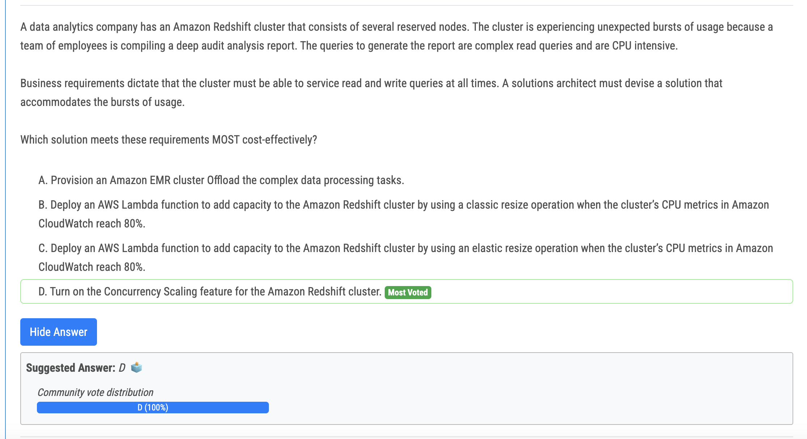

# 304번

- Both settings need to be enabled to allow assigning of public DNS names and use of Amazon DNS
- 오답
  - A is wrong because the question says it use AWS DNS rather than 10.24.34.2 custom DNS server. 
  - C is wrong because same reason with A. 
  - D is wrong because we need to actvate DnsSupport and DnsHostnames.

# 305번

- The most cost-effective solution for addressing bursts of usage and accommodating complex queries in Amazon Redshift is to turn on the Concurrency Scaling feature for the Amazon Redshift cluster.

# 306번

- In Amazon S3, you can identify requests using an AWS CloudTrail event log. AWS CloudTrail is the preferred way of identifying Amazon S3 requests, but if you are using Amazon S3 server access logs, see Using Amazon S3 access logs to identify requests.
- 오답
  - Option C is incorrect because enabling S3 server access logging and delivering the logs to another S3 bucket does not directly address the requirement to report on which scientist accesses which documents. While the logs can be queried, it does not provide a straightforward solution for generating the required reports. 
  - Option D is incorrect because creating an S3 bucket policy that grants read and write access to users in the scientists' IAM user group does not address the compliance officer's concern about scientists being able to access each other's work. It also does not provide a solution for reporting on which scientist accesses which documents.

# 307번(정답)

- Answer A. Use ECR Lifecycle policy. Also using OrgId is more scalable with more accounts will be added than adding accounts individually. Less operational overhead.

# 309번??

- A, C, E
- A - SCP's by default deny so you must have an explicit allow. Often that is done with the FullAwsAccess, but this answer fits most (see reasoning for other answers) 
- B - Resource-based policies are attached to a resources, and not IAM user/group/role so not applicable here 
- C - The IAM user needs the policy to do sts:AssumeRole, so this one is needed
- D - The IAM role in account B only needs permissions to access resources in account B. Also, the answer talks about "user" and there is no user in account B (or at least not in the scope of the question) 
- E - The IAM role in account B needs to trust the action of the user in account A, so this is needed as well. 
- F - GetSessionToken is used to get a session for an IAM user. This users is in account A and we don't need a session in account A, but we need an assumerole to account B. Therefore this is not needed. If the question talks about MFA then this might come into play.