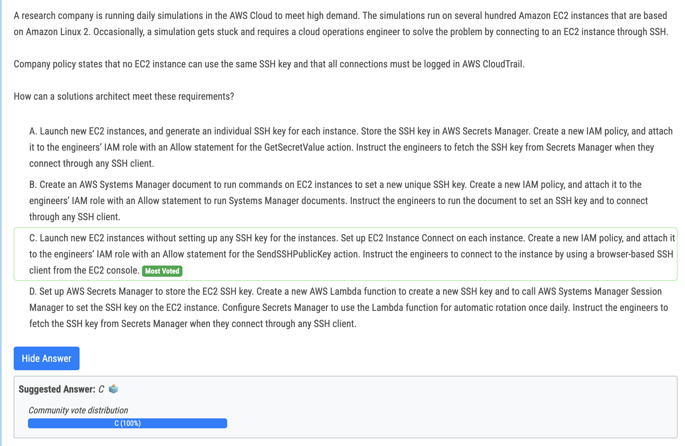
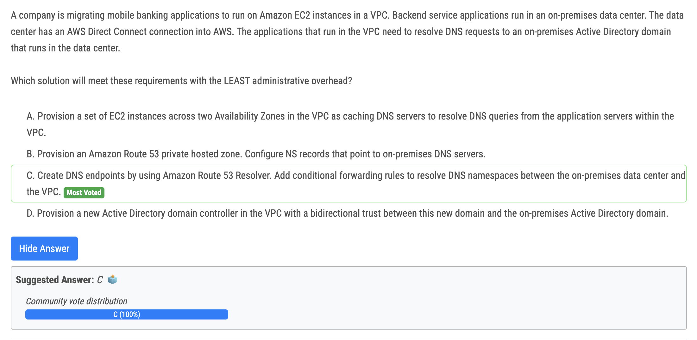
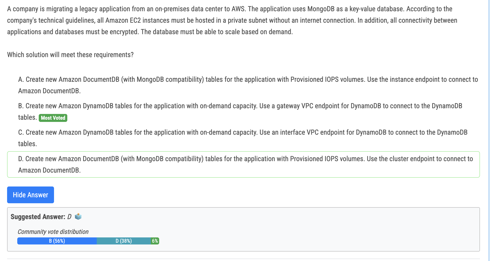
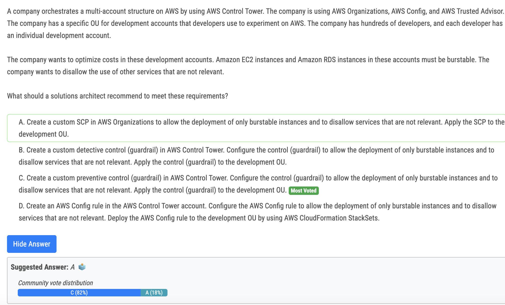

# 321번

- Answer C is correct with the following reasons: 
- The keywords: "no EC2 instance can use the same SSH key" AND " all connections must be logged in AWS CloudTrail." 
  - EC2 Instance connect using temporary ssh key, one-time SSH keys each time the user connects
  - User connections via EC2 Instance Connect are logged to AWS CloudTrail

# 322번

- Option C: Amazon Route 53 Resolver > Conditional Forwarding. Lower Maintenance than Option A which using EC2.

# 324번

- The database must be able to scale based on demand, so Provisioned IOPS volume is out because they will be throttled. A and D are out. EC2 hosted in a private subnet without an internet connection, have to use VPC Endpoint, for DynamoDB, it must be Gateway VPC endpoint. B is the answer.

# 328번(정답)

- C is the best option. A is possible but given that customer is using Control Tower it option A will cause a drift in landing zone.