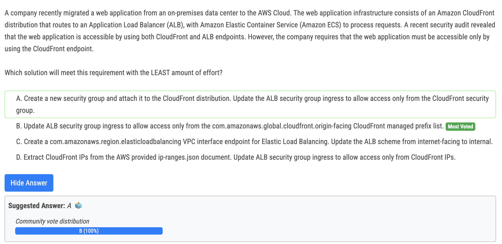
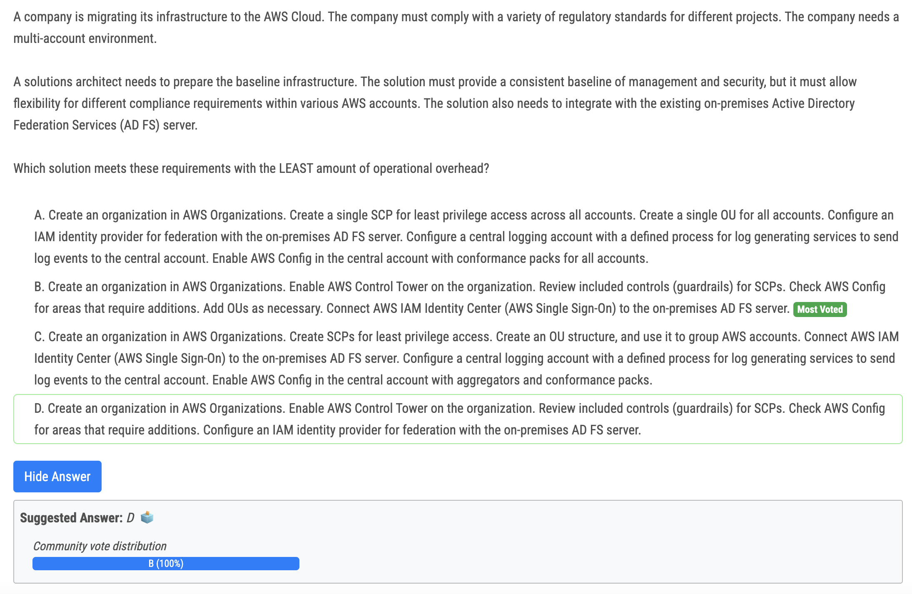
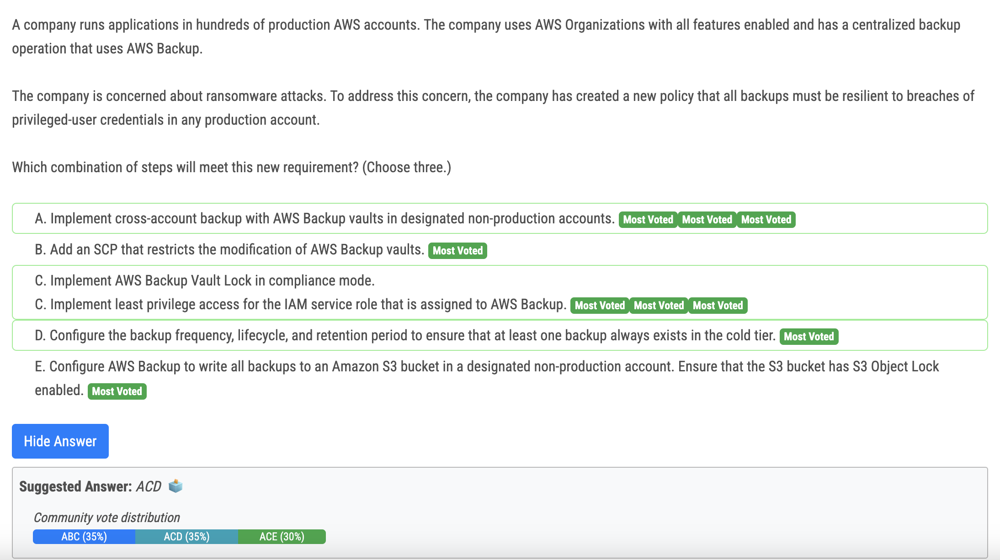
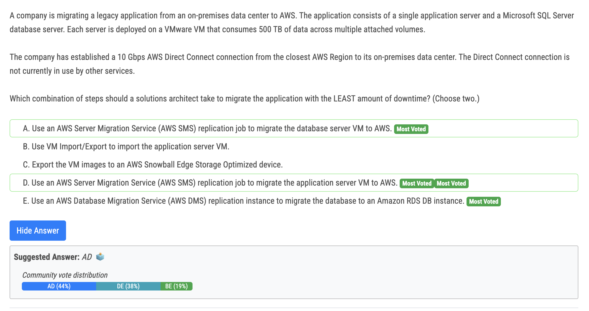
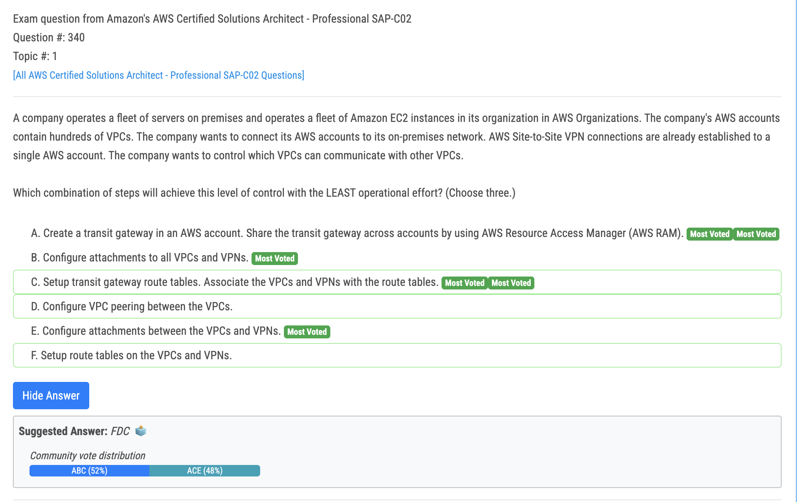

# 332번

- Definitely - B, becase you can't assign securityGroup on Cloudfront. Also, security group can have only 60 rules, so you can't add ALL CloudFront IPs into it, so prefix list

# 324번(정답)

- Answer: B 
- A. Manual setup: Requires more manual configuration and maintenance, increasing operational overhead. 
- C. Central logging and Config setup: While valuable, these components add complexity and management overhead. Control Tower can automate their setup and management. 
- D. IAM identity provider: Doesn't leverage Control Tower's automation and centralized management features, leading to more manual effort.

# 337번

- A. Implement cross-account backup with AWS Backup vaults in designated non-production accounts. This will allow the company to securely copy their backups to other accounts that are part of their organization for operational or security reasons1. 
- C. Implement AWS Backup Vault Lock in compliance mode. This will provide an additional layer of protection and immutability to the backup vaults, preventing any user (including the root user) or AWS from deleting or modifying the backups until the retention period is complete2. 
- E. Configure the backup frequency, lifecycle, and retention period to ensure that at least one backup always exists in the cold tier. This will help the company to avoid accidental or malicious deletion of backups by enforcing a minimum retention period and moving the backups to a lower-cost storage tier2.

# 339번

- 정답 : A, D
  - A : RDS SQL maximum storage is 16TB. So we need to move the VM

# 340번(정답)

- I guess ACE. The company wants to control which VPC will communicate with other VPC, that means that we don't need to setup attachment for all VPCs