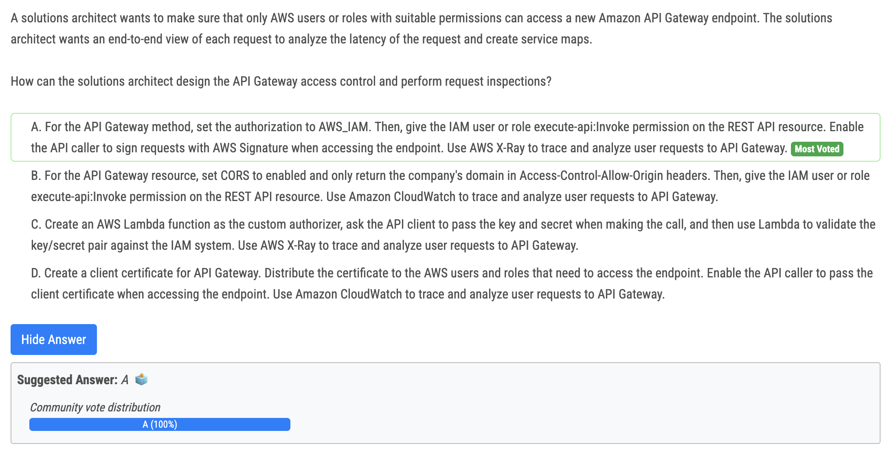
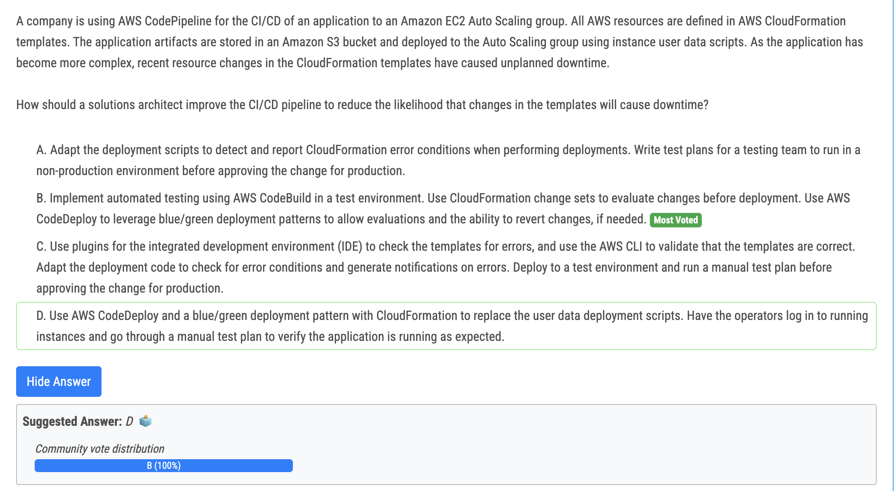
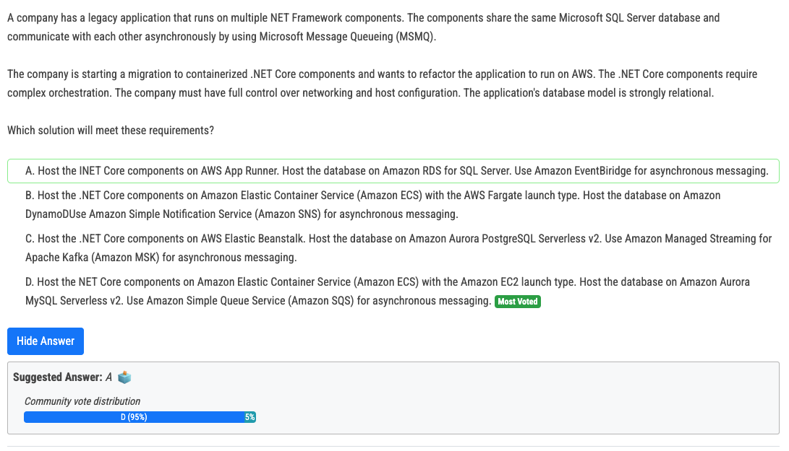
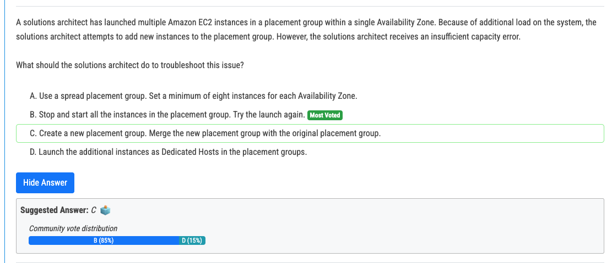
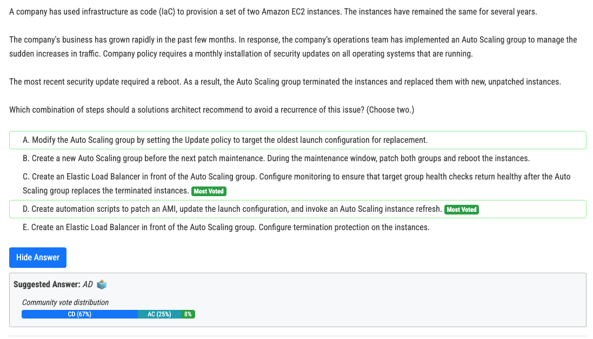
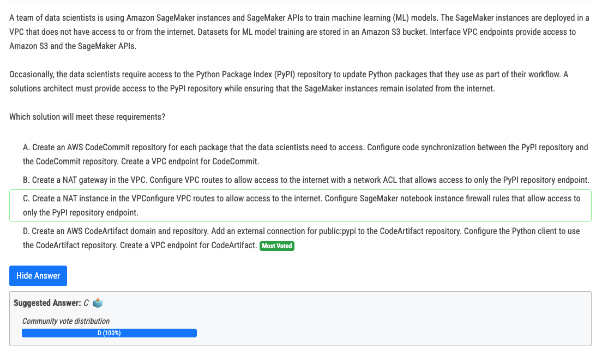

# 343번(정답)

# 344번

- Use Code Build to run unit/automated testing. Code Deploy for blue/green deployments

# 346번

- Amazon ECS with EC2 offers the needed control and orchestration capabilities. Amazon Aurora MySQL Serverless v2 can support the relational database model, though it requires adapting from Microsoft SQL Server to MySQL. Amazon SQS aligns well with the need for asynchronous messaging and can be a suitable replacement for MSMQ.

# 347번

- If you try to add more instances to the placement group later, or if you try to launch more than one instance type in the placement group, you increase your chances of getting an insufficient capacity error. If you stop an instance in a placement group and then start it again, it still runs in the placement group. However, the start fails if there isn't enough capacity for the instance. If you receive a capacity error when launching an instance in a placement group that already has running instances, stop and start all of the instances in the placement group, and try the launch again. Starting the instances may migrate them to hardware that has capacity for all of the requested instances.

# 348번

- A incorrrect: default oldest launchconfiguration will be terminated first
- B. Incorrect: No need to create a new ASG 
- C. Correct: Need a loadbalancer to make sure the request route to the healthy instance. 
- D. Correct: Script to update OS patch, Lambda to update a launch configuration and trigger Autoscaling Instance refresh 
- E. Incorrect: Termination protection is not help.

# 349번(정답)

- 정답 : CodeArtifact allows you to store artifacts using popular package managers and build tools like Maven, Gradle, npm, Yarn, Twine, pip, NuGet, and SwiftPM
- 오답 : It can't be A -- CodeCommit is primarily a source control service and does not directly synchronize with external repositories like PyPI. This option requires significant overhead in maintaining the sync.