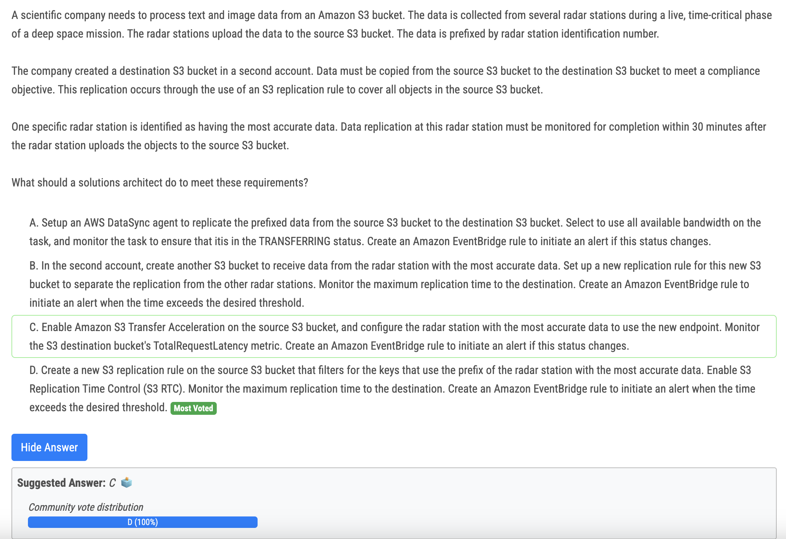

# 351번

- SCP can be applied only to those users and roles which are managed by accounts that are part of any organization 

# 352번

| Feature     | S3 RTC                        | S3 Transfer Acceleration        |
| ----------- | ----------------------------- | ------------------------------- |
| Purpose     | Faster replication            | Faster uploads/downloads        |
| Scope       | Replication across buckets    | Individual file transfers       |
| Performance | SLA for 15-minute replication | Up to 50-500% speed improvement |
| Cost        | Additional charge             | Additional charge               |

# 354번

- A : If your resources span multiple Availability Zones (AZ) , then create one NAT gateway per AZ. This helps to avoid a single point of failure and zone data transfer charges. Data that's transferred between Amazon EC2 and Elastic Network Interfaces in the same AZ is free. However, data that's transferred to and from Amazon EC2 and Elastic Network Interfaces across multiple AZs in the same AWS Region is charged. The charges depend on the data transfer rates for the Region.

# 356번

- Answer B. Application Discovery service agent installed on all servers and VMs to gather information.