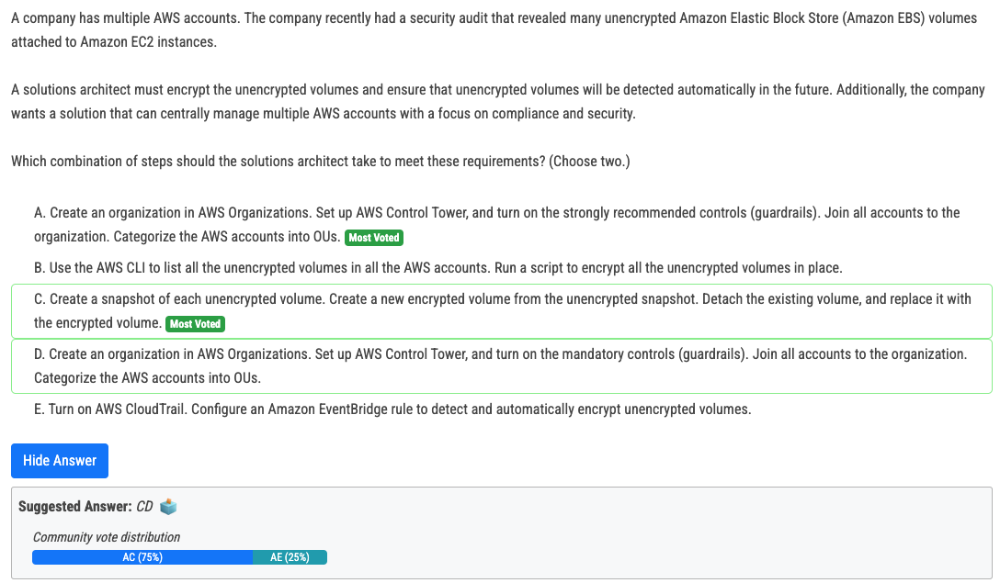

# 365번

- Answer C. No NAT gateway for IPv6 subnets. Only Egress-only Internet gateway to allow only outbound traffic from private subnets.

# 367번

- This setup enables centralized management of member accounts from the management account. Administrators in the management account can assume the OrganizationAccountAccessRole in member accounts to perform necessary actions, aligning with AWS best practices for Organizations. It simplifies the management and auditing of various accounts and ensures a standardized role exists across all accounts for consistent access control.

# 368번

- cloudfront for static content. Then aws kubernetes over kubernetes on ec2.
- Option D with Fargate can potentially provide a more serverless-like experience, emphasizing ease of use and reduced operational responsibilities

# 369번

- AWS Client VPN allows remote users to securely connect to AWS resources, including Amazon FSx for Windows File Server, without the need for a VPN connection to the on-premises data center. Migrating remote users to AWS Client VPN can help reduce bandwidth usage for connections into the on-premises data center, as users will access resources directly from AWS. This approach is more scalable and can be managed with less operational overhead compared to maintaining a VPN infrastructure in the on-premises data center.

# 370번

- A: strongly recommended controls - detects whether the Amazon EBS volumes attached to an Amazon EC2 instance are encrypted 
- C: Best way to encrypt an unencrypted volume