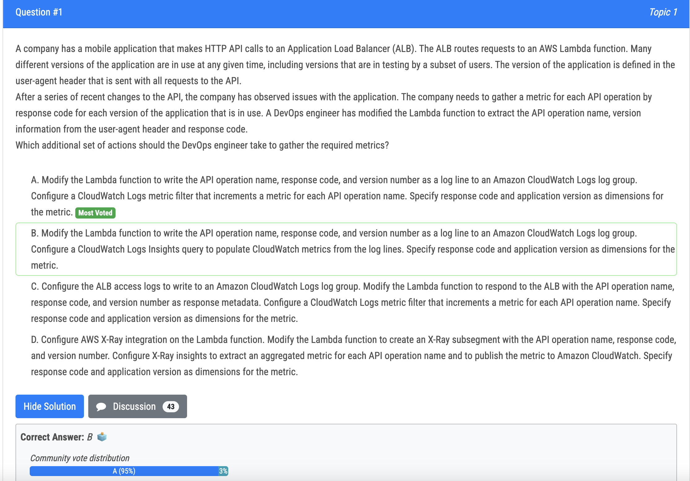
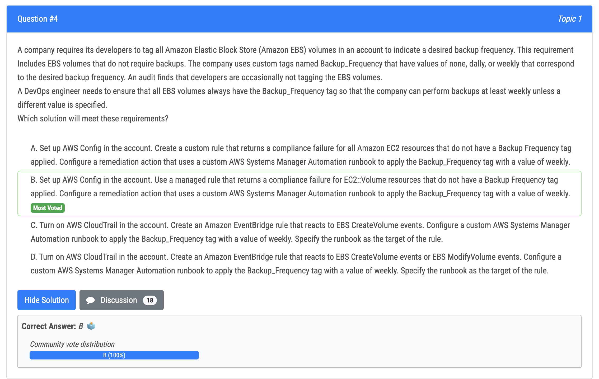
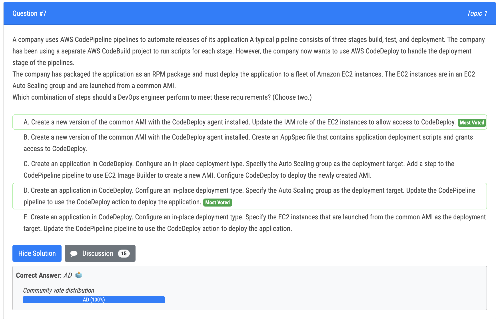
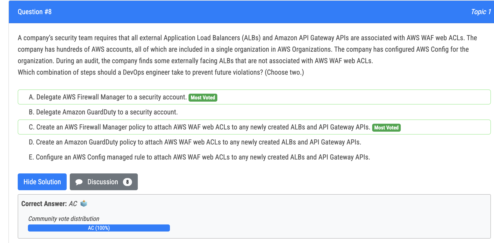
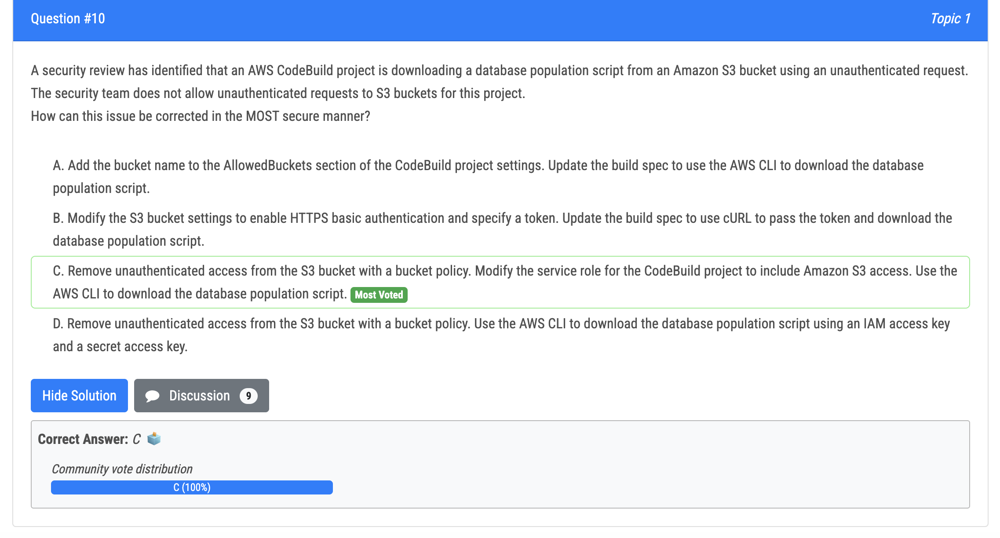

# 1번

- Because only need to gather metric but not parse log or advanced analyzing the log.

# 4번

# 7번

- A - instances need code deploy agent and role 
- D - target as ASG

# 8번

# 10번

- C is the correct answer because it involves removing unauthenticated access from the S3 bucket with a bucket policy, which ensures that only authorized users or services can access the bucket.