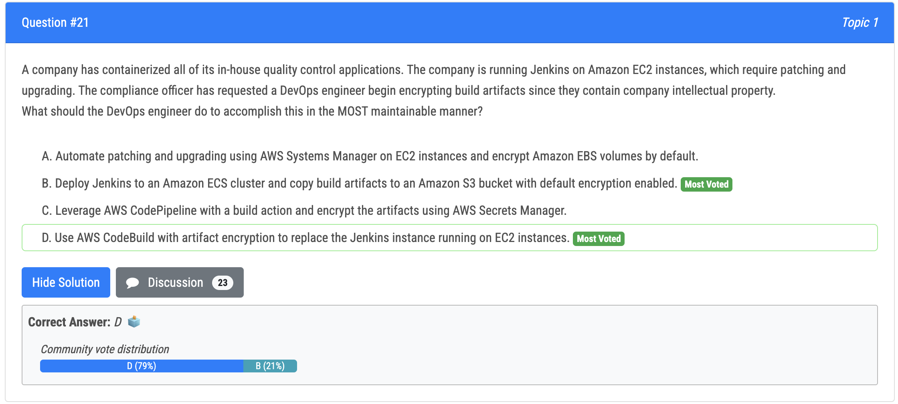
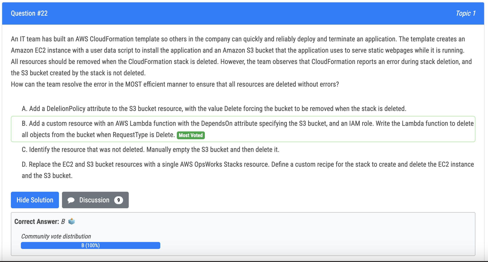
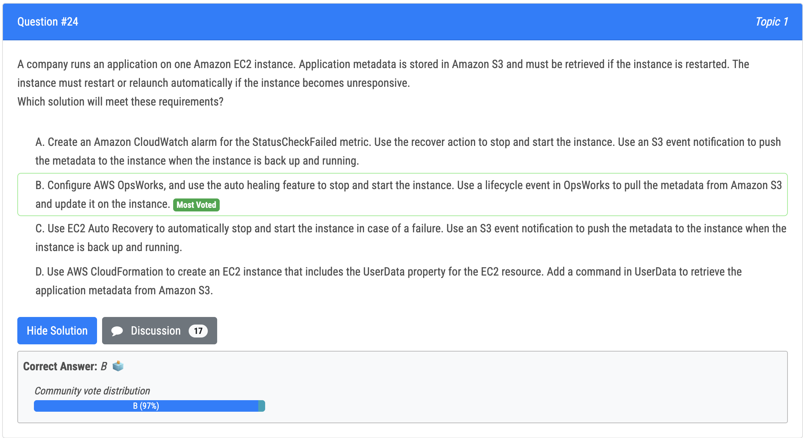

# 21번

- As a managed service, AWS CodeBuild does not require patching and upgrading. AWS CodeBuild, using Amazon S3, provides automatic artifact encryption. So this solution is the easiest to maintain of all the solutions listed.

# 22번

B is correct: - Cant delete S3 so must check S3 - There are several DeletionPolition option in ACF: delete, retain, snapshot. For S3, even if there is delete flag, S3 can only be deleted if all objects are removed

# 24번

B: is correct: AWS opsworks auto healing will monitor the healthiness of EC2. If there is failure, restart EC2 and pull data from S3 to EC2

