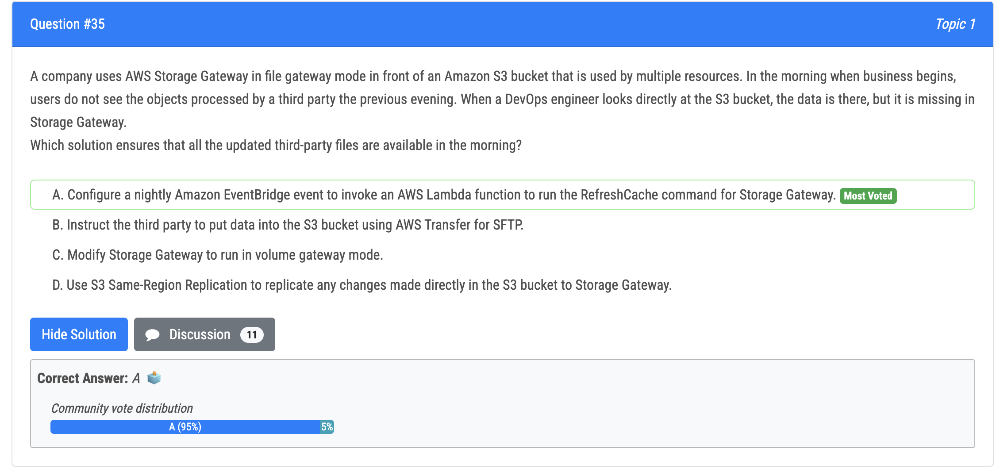
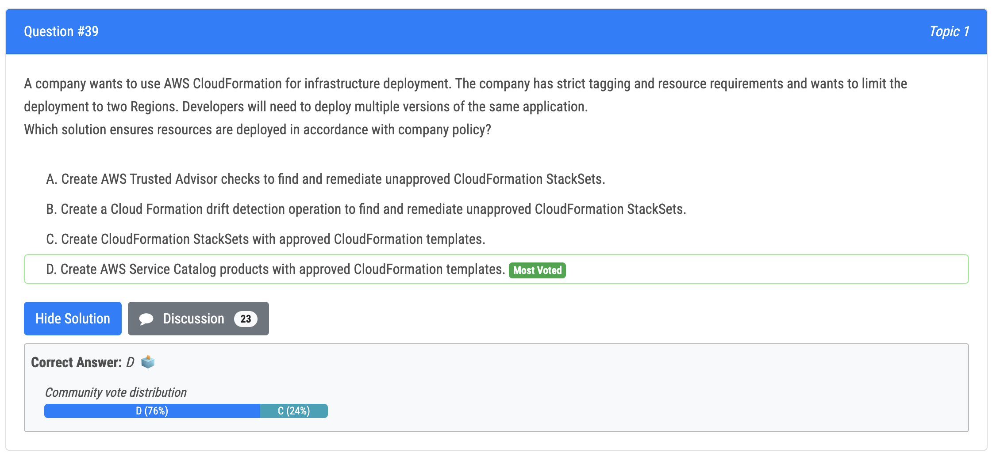
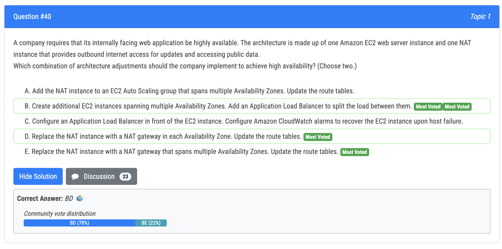

# 35번

- AWS Storage Gateway's file gateway mode provides a bridge between your on-premises servers and Amazon S3. File gateway caches frequently accessed files in your on-premises environment to provide low-latency access. However, if the S3 bucket's data is modified by another service, the cache does not automatically refresh. Thus, to ensure all the updated third-party files are available in the morning, you can use an AWS Lambda function triggered by Amazon EventBridge to run the RefreshCache command for Storage Gateway. This will ensure the cache is updated with the latest changes.

# 39번

- AWS Service Catalog lets you centrally manage your cloud resources to achieve governance at scale of your infrastructure as code (IaC) templates, written in CloudFormation or Terraform configurations. With AWS Service Catalog, you can meet your compliance requirements while making sure your customers can quickly deploy the cloud resources they need.

# 40번

- E 가 오답인 이유 : NAT gateways are regional services and do not span across Availability Zones. So, E is completely wrong.