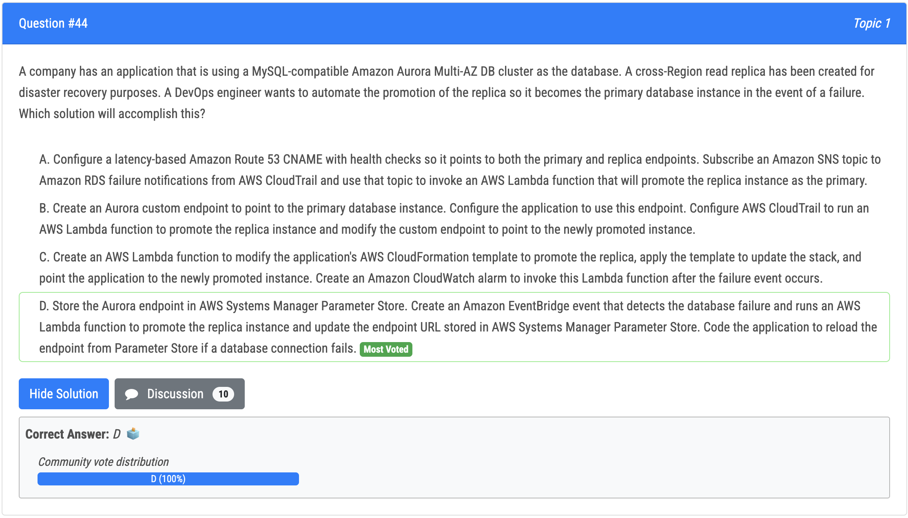
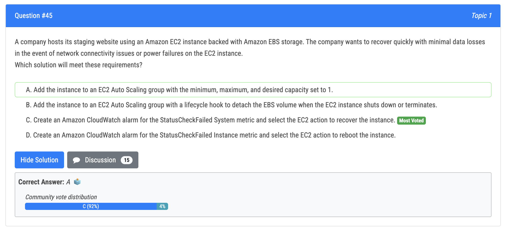
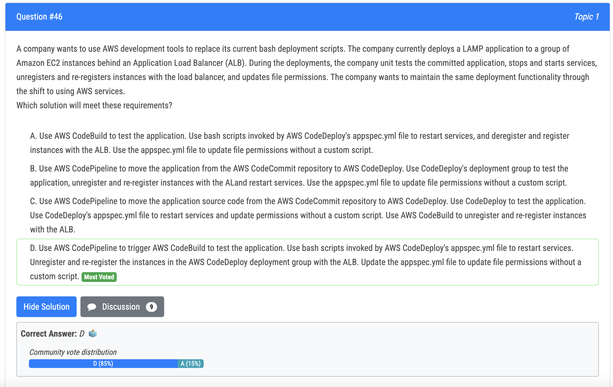
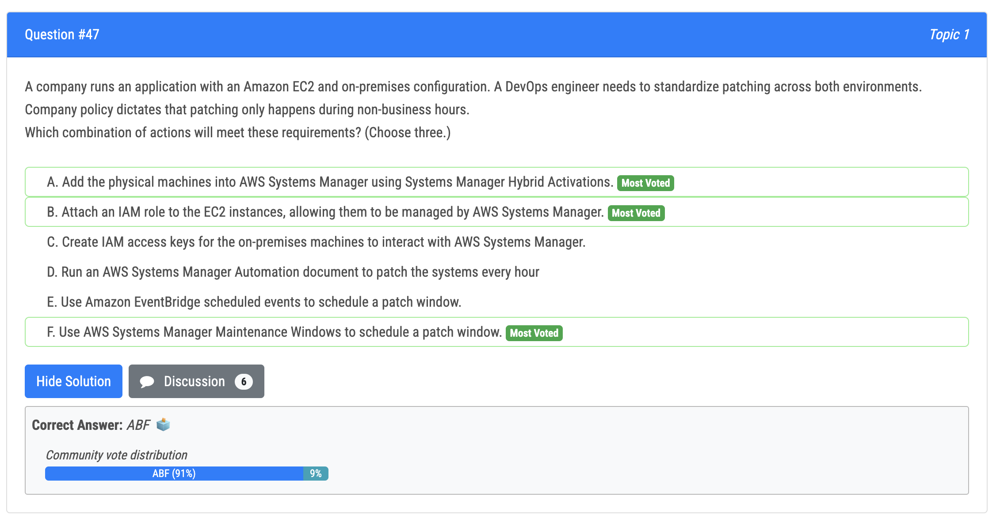
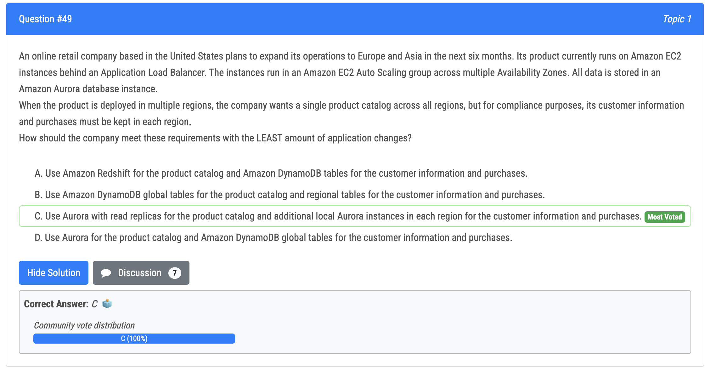

# 44번

- D is the correct answer. 
- Explanation: To automate the promotion of a read replica to the primary instance in the event of a failure, we need to detect the failure and then invoke an AWS Lambda function to promote the replica instance. This can be achieved using Amazon EventBridge. 
- Option A is incorrect because using a CNAME with health checks doesn't provide an automated way to promote the read replica. Additionally, subscribing an Amazon SNS topic to Amazon RDS failure notifications from AWS CloudTrail doesn't help to promote the replica. 
- Option B is incorrect because a custom endpoint is not required to promote the read replica. Additionally, using AWS CloudTrail to run an AWS Lambda function to promote the replica instance doesn't provide an automated way to update the application endpoint to point to the newly promoted instance.

# 45번

- 정답 : C : Amazon CloudWatch provides system-wide visibility into resource utilization, application performance, and operational health. If a system status check fails, this implies there's a problem with the underlying EC2 system that may require AWS involvement to repair. The "Recover this instance" action for the system status check automatically recovers the instance if it becomes impaired due to an underlying issue.

# 46번

- D: is correct: need codepipeline for a seamless deployment. Need codebuild to test and codedeploy to deploy the app on EC2

# 47번

ABF are the right answers: 

- A: enable hybrid on AWS system manager 
- B: create IAM role for System manager to manage EC2 instances 
- F: use maintenance windows to schedule patching on non-business hours 
- C: incorrect because there is no IAM access keys for on-prem 
- D: should not run patching every hour 
- E: should not use Eventbridge because AWS has its own service to schedule patching

# 49번

- C. Using Aurora with read replicas for the product catalog allows for a single product catalog across all regions. Aurora read replicas can be set up in different regions to provide low-latency access to the product catalog from each region. Additionally, by deploying additional local Aurora instances in each region for customer information and purchases, the company can comply with the requirement of keeping customer data and purchases in each region.