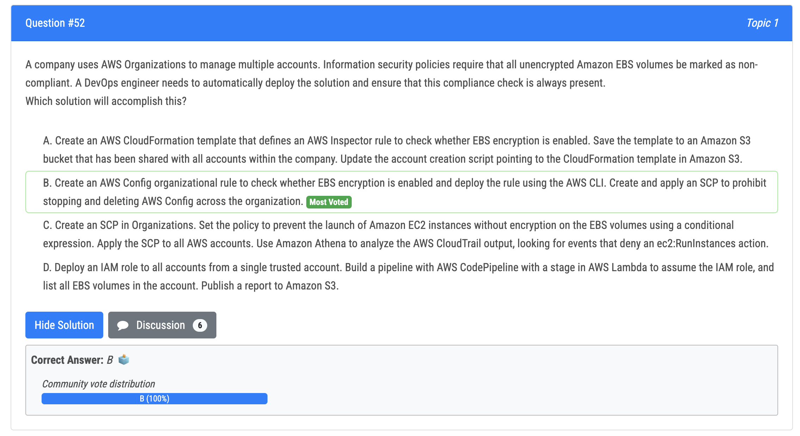
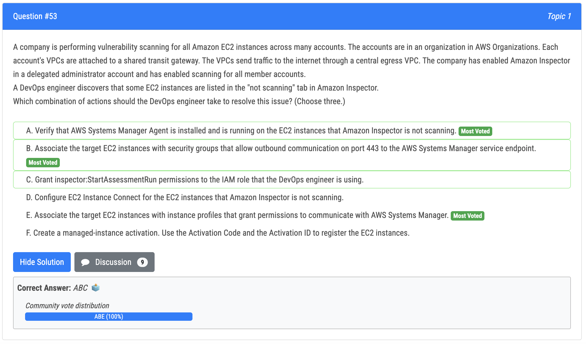
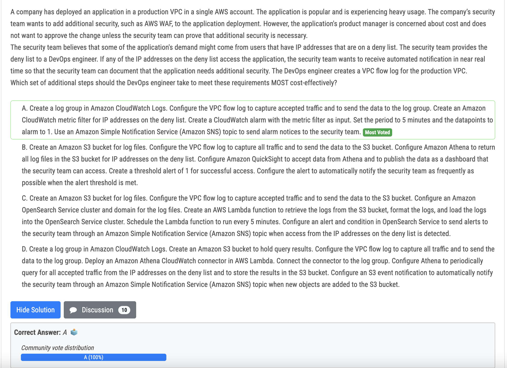
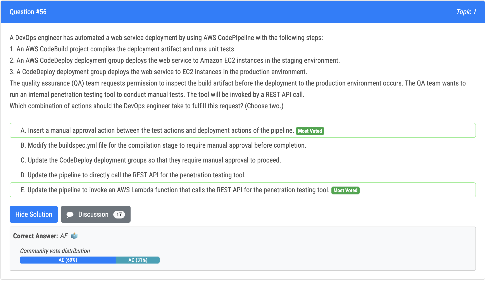
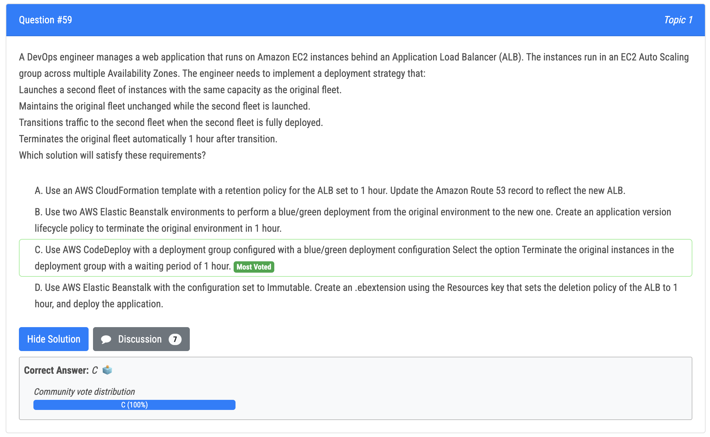
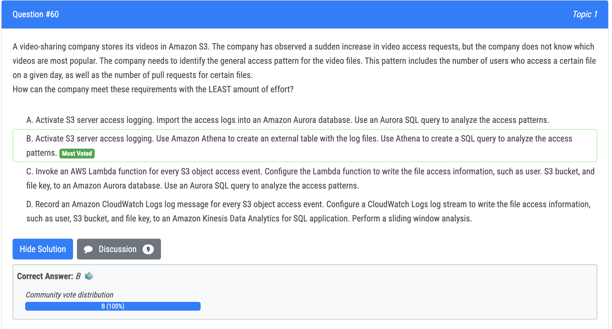

# 52번

- Deploy CloudFormation template with encrypted-volumes in the ConfigRuleName property, AWS Config will automatically scan the environment and check for unencrypted EBS volumes.

# 53번

- ABE are correct: Check if SSM agent is installed, check connection and permission of Ec2 that allows access to SSM
- C: no need to grant inspector:StartAssessmentRun permissions because the dev has already finish the scanning task 
- D: There is not EC2 instance Connect, only need SSM agent 
- F: there is no managed-instance activation

# 55번

- push all VPC flow log to cloudwatch logs. Create metric filter to find denied IP addresses. Create cloudwatch alarm with the metric filter as input. Alarm's action is send noti to Security team via SNS

# 56번

# 59번

- To satisfy the requirements of launching a second fleet of instances with the same capacity as the original fleet, maintaining the original fleet unchanged while the second fleet is launched, transitioning traffic to the second fleet when the second fleet is fully deployed, and terminating the original fleet automatically 1 hour after the transition, the best solution is to use AWS CodeDeploy with a blue/green deployment configuration, and selecting the option to Terminate the original instances in the deployment group with a waiting period of 1 hour.

# 60번

- Use S3 in combination with Athena is the recommended way to analyze data 
- A: setups of Aurora is complex and unnecessary. 
- It also more costly than B C and D are both too complicated.