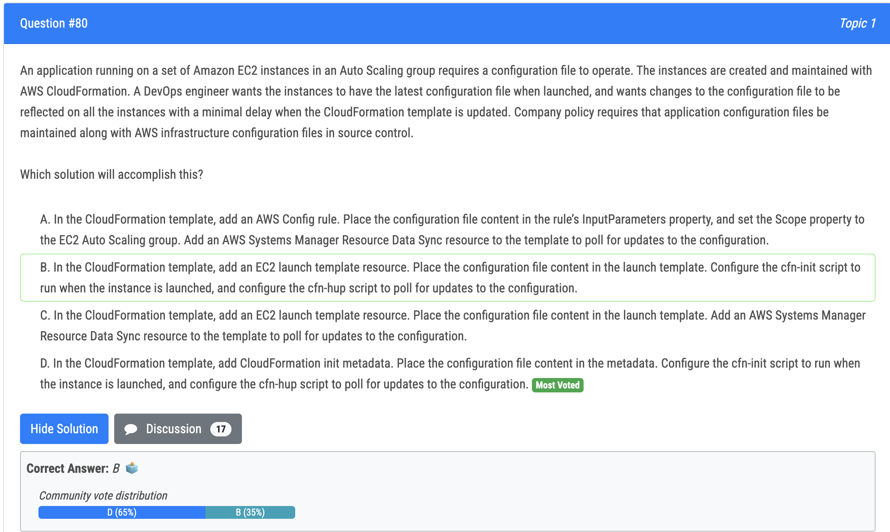
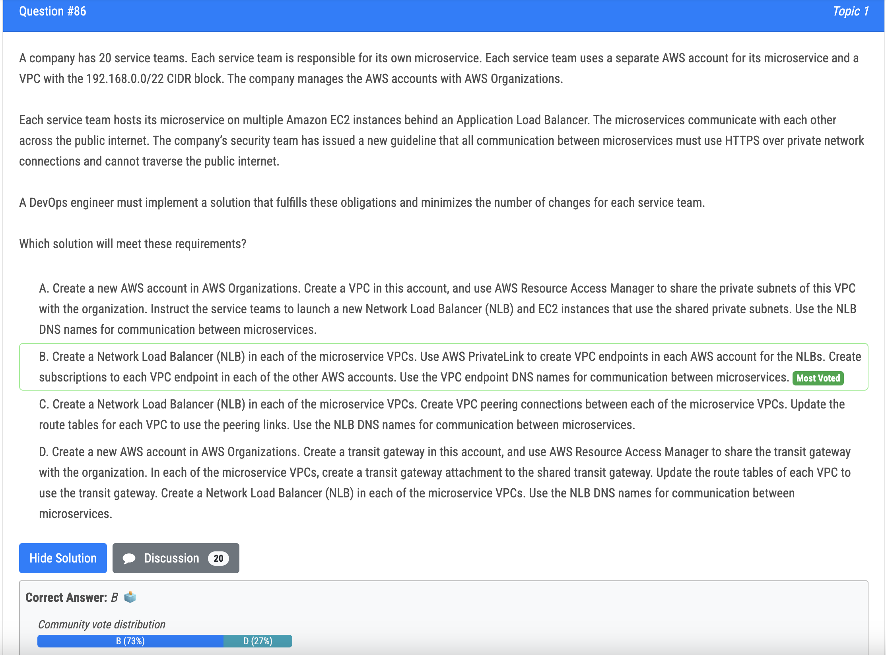

# 62번

- Create a CloudWatch Logs subscription to an AWS Lambda function. Configure the function to add a tag to the EC2 instance that produced the login event and mark the instance to be decommissioned. Create an Amazon EventBridge rule to invoke a daily Lambda function that terminates all instances with this tag.

# 64번

- Option D is the best choice because it allows each application to have its own repository and build process, but uses containerization to create a consistent and automatic delivery pipeline that can be easily deployed to Amazon ECS on infrastructure that AWS Fargate manages. This approach also provides scalability and ease of maintenance.

# 69번

- To run the unit and integration tests on each pull request before it is merged, a solution that listens to pullRequestCreated events and runs a CodeBuild project to execute tests would be the most appropriate option. Option B describes a solution that creates an Amazon EventBridge rule to match pullRequestCreated events from CodeCommit and configures a CodeBuild project to run the unit and integration tests, passing the CodeCommit repository and branch information from the event as a custom payload.

# 70번

- D or C ?

# 73번

- Option A is the most cost-effective solution. By configuring a warm pool of EC2 instances in the Stopped state, the company can reduce the time it takes for new instances to be ready to serve requests. When the Auto Scaling group launches a new instance, it can attach the stopped EC2 instance from the warm pool. The instance can then be started up immediately, rather than having to wait for the data to be downloaded and processed. This reduces the overall startup time for the application. 
- Option C is also a solution that involves a warm pool of EC2 instances, but the instances are in the Running state. This means that they are already running and incurring costs, even though they are not currently serving requests. This is not a cost-effective solution.

# 75번

- Option B is the correct answer. By associating the CodeCommit repository with Amazon CodeGuru Reviewer, the code can be checked for any hardcoded secrets during code reviews. When a hardcoded secret is detected, CodeGuru Reviewer will recommend updating the code to retrieve the secret from a secure storage service like AWS Secrets Manager. The DevOps engineer can choose the option to protect the secret and then update the SAM templates and Python code to retrieve the secret from AWS Secrets Manager instead of hardcoding it in the code

# 78번

- 오답 : B: < domain reset option to propagate changes immediately>: there is no such thing. DNS record will expire after TTL. Cannot force DNS resolvers to query for DNS record before TTL expire

# 80번

- D is correct: <The instances are created and maintained with AWS CloudFormation> means we will only use ACF to satisfy the requirements of this question. <changes to the configuration file to be reflected on all the instances with a minimal delay when the CloudFormation template is updated> means we nead cfn-init, which is a daemon that check for updates and update the changes

# 81번

- You can use a subscription filter with Kinesis Data Streams, Lambda, or Firehose.

# 82번

# 83번

- A. Explanation: For CodeDeploy to work, the EC2 instances need to reach the CodeDeploy endpoint to download the deployment artifacts. If the networking configuration of the EC2 instances does not allow them to access the internet via a NAT gateway or internet gateway, they won't be able to reach the CodeDeploy endpoint, leading to deployment failure. 
- D Explanation: When EC2 instances are part of a CodeDeploy deployment group, they need to have an associated IAM instance profile with the necessary permissions to interact with CodeDeploy and download the deployment artifacts. If the instance profile with proper permissions is not attached to the target EC2 instances, the deployment will fail as the instances won't have the required permissions to complete the deployment process.

# 84번

- C is correct: <automate the process that the security team uses to provide the AMI IDs to the development teams> and <MOST scalable solution> means we need a pipeline (imange builder) to build AMI and to automate sharing

# 85번

- C is correct: <deployment fails during the AllowTraffic lifecycle event> means there are problems with ALB.

# 86번

- B is correct: <all communication between microservices must use HTTPS over private network connections and cannot traverse the public internet> means privatelink

# 89번

