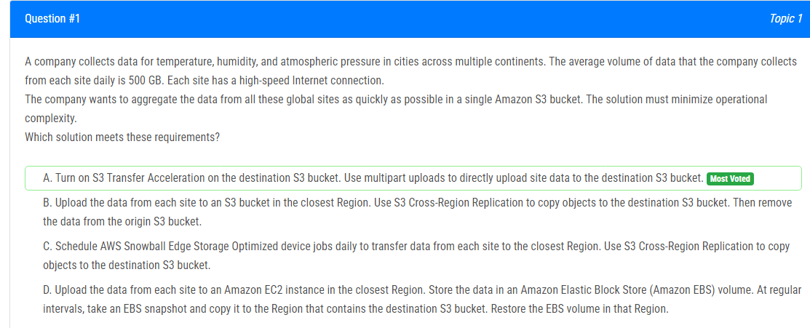
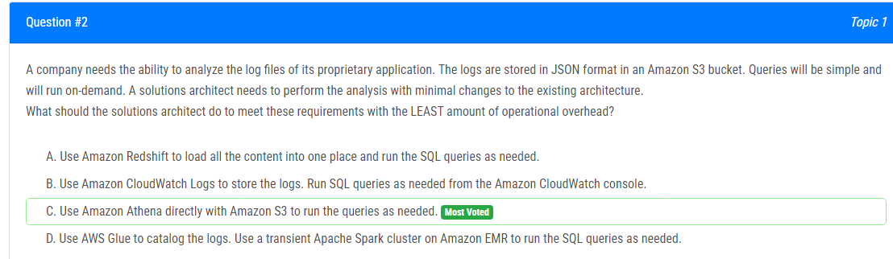
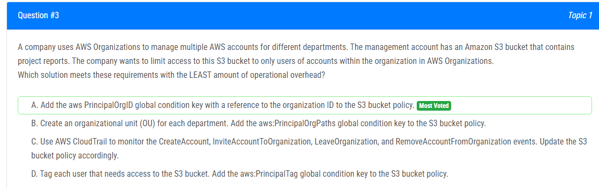
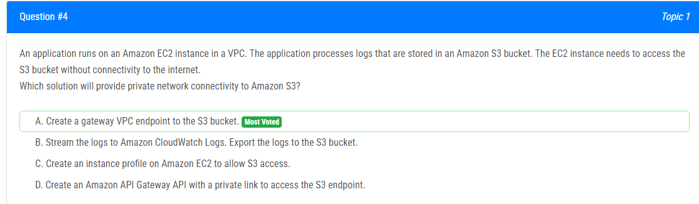
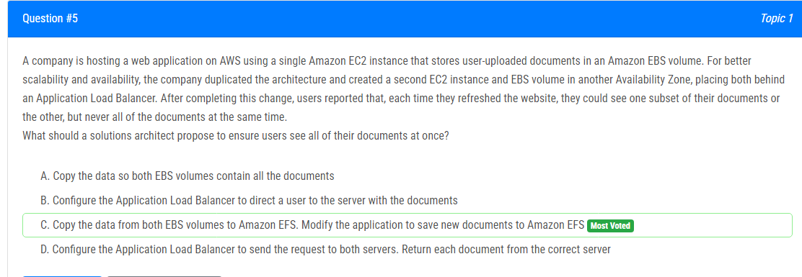
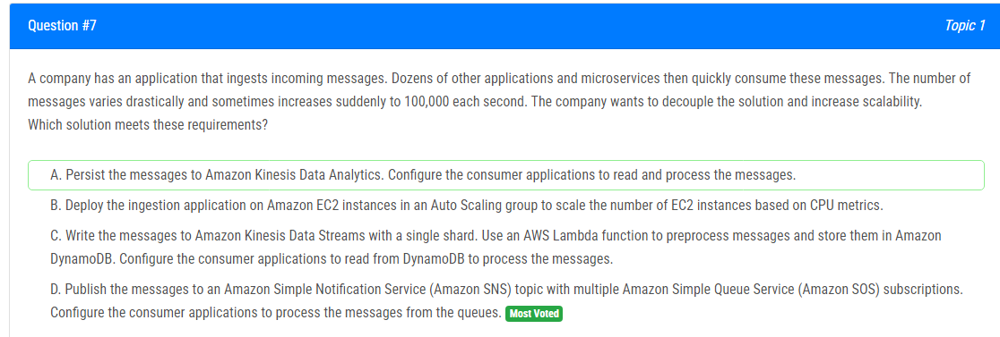
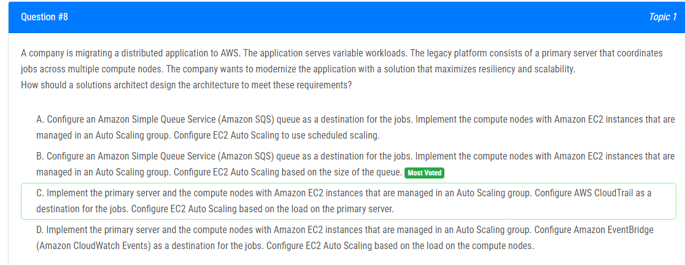
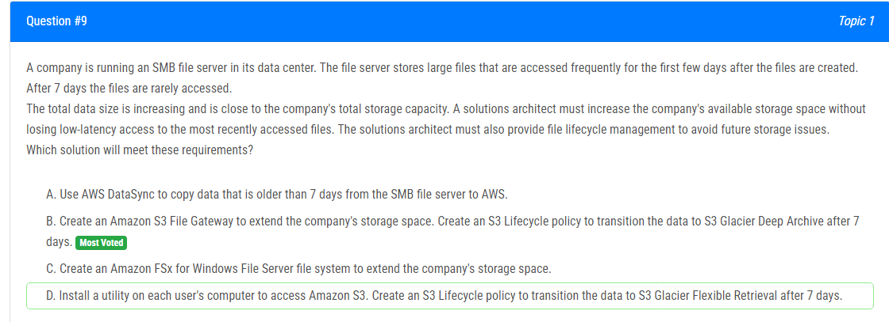
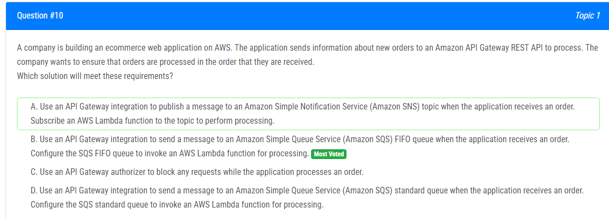

해설:

다수의 대륙에서 거대한 양의 파일을 수집하는 상황에서, 높은 속도의 인터넷 연결이 조건으로 주어졌습니다. 주어진 작업은 이 데이터를 모두 단일 S3 버킷에 집계하는 것이며, 이를 가능한 한 빠르게 수행하면서 운영 복잡성을 최소화해야 합니다.

올바른 답은 A: S3 Transfer Acceleration입니다. 이유는 다음과 같습니다:
- 먼 거리 전송에 이상적으로 작동하며(Edge Locations 사용),
- S3의 콘텐츠 전송을 최대 50-500%까지 가속화할 수 있습니다.
- 사용 사례: 모바일 및 웹 응용 프로그램 업로드 및 다운로드, 분산된 사무실 전송, 신뢰할 수 있는 파트너와의 데이터 교환. 대개 회사 간 큰 데이터 집합을 공유하기 위해 고객은 가속화된 업로드로 S3 버킷에 특별한 액세스를 설정하여 데이터 교환과 혁신 속도를 높일 수 있습니다.

B - 재해 복구에 관한 내용

C - 로컬 환경과 AWS 클라우드 간 데이터 전송에 관한 내용

D - 재해 복구에 관한 내용

해설: 주어진 요구 사항에 따라 최소한의 운영 오버헤드로 로그 파일을 분석하려면 어떻게 해야 할까요?

정답 C. Amazon Athena를 Amazon S3와 직접 사용하여 필요에 따라 쿼리를 실행합니다.

- Amazon Athena는 Amazon S3와 원활하게 통합되며 간단한 SQL 쿼리를 빠르게 실행할 수 있습니다.
- 이미 로그가 JSON 형식으로 Amazon S3 버킷에 저장되어 있으므로 추가적인 데이터 이동이나 변환 없이 Athena를 사용할 수 있습니다.
- 다른 옵션들에 비해 운영 오버헤드가 최소화되며, 필요할 때 쿼리를 실행하는 데 적합합니다.

해설: S3 버킷 정책에 조직 ID에 대한 참조를 사용하여 aws PrincipalOrgID 글로벌 조건 키를 추가합니다

정답 A.

버킷 정책은 S3 및 해당 객체에 액세스할 수 있는 사용자 및 계정을 제어합니다.
PrincipalOrgID는 AWS 조직 ID에 대한 글로벌 조건 키로, 버킷 정책에 이를 추가하여 해당 조직 내의 계정에만 액세스를 제한할 수 있습니다.
다른 옵션들에 비해 운영 오버헤드가 가장 적습니다.

B. 이 옵션은 정확하지만 불필요하게 복잡합니다. 질문에서 제시된 요구 사항에 대해 AWS 조직 사용자를 분리할 필요가 없기 때문에 더 많은 운영 오버헤드만 추가됩니다.

C. CloudTrail을 사용하여 S3 액세스 권한을 제어하는 것은 적절하지 않으며 많은 이벤트를 모니터링해야 합니다. 또한 CloudTrail은 로그만 기록하므로 S3에 액세스하는 계정에 제한을 설정할 수 없습니다.

D. 각 사용자에게 태그를 부여하는 것은 확장 가능하거나 효율적인 해결책이 아닙니다. 인프라 내의 모든 사용자에 태그를 지정해야 하며, 이는 아마도 정적이지 않을 것입니다. 또한, 해당 버킷에 연결된 S3 버킷 정책을 불필요하게 상세하게 만듭니다.

해설: S3 버킷에 대한 게이트웨이 VPC 엔드포인트 생성

정답 A.

VPC 게이트웨이 엔드포인트를 사용하면 Amazon S3 버킷에 대한 프라이빗 네트워크 연결을 손쉽게 설정할 수 있습니다.
이 서비스는 무료이며 S3와 자연스럽게 통합되어 있습니다.
다른 옵션들에 비해 가장 간단한 방법으로 S3에 대한 프라이빗 네트워크 연결을 제공합니다.

B. Amazon CloudWatch Logs는 로그를 수집하고 모니터링하는 용도이지만 네트워크 연결을 설정하는 데는 자체적으로 기능이 없습니다.

C. 인스턴스 프로파일은 EC2 인스턴스에 IAM 역할을 할당하는 데 사용되지만 네트워크 연결과는 관련이 없습니다.

D. API Gateway는 외부에서의 네트워크를 받아서 요청을 AWS Lambda, Amazon EC2, Elastic Load Balancing(예: Application Load Balancer 또는 Classic Load Balancer), Amazon DynamoDB, Amazon Kinesis 또는 기타 공개적으로 사용 가능한 HTTPS 기반 엔드포인트로 전달하는 프록시 역할을 합니다. 그러나 S3에는 적용되지 않습니다.

해설: 
두 번째 EC2 인스턴스 및 EBS 볼륨. 사용자는 문서 중 하나의 하위 집합 또는 다른 하위 집합을 볼 수 있지만 한 번에 모든 문서를 볼 수 없습니다.

EBS: 하나의 인스턴스에 연결(일부 특수 EBS io1, io2는 여러 인스턴스에 연결될 수 있지만 그렇게 많지는 않음)
EFS: 여러 인스턴스에 연결할 수 있음

정답 C.

A: EBS 볼륨은 실행 중인 EBS 볼륨에서 데이터를 다른 실행 중인 EBS 볼륨으로 복사하는 기능이 없습니다.

B: 스티키 세션을 사용하여 동일한 사용자를 동일한 서버로 리디렉션할 수 있지만 사용자가 세션을 잃으면 사용자가 다른 서버로 리디렉션될 수 있습니다.

C: 두 인스턴스가 하나의 EFS 데이터 저장소를 가리키므로 사용자는 두 데이터를 모두 볼 수 있습니다.

D: 트래픽 미러링을 사용하여 요청을 양쪽 서버로 전송할 수 있습니다. 그러나 Application Load Balancer는 서버 간에 워크로드를 분산하기 위해 설계되었으므로 요청을 양쪽 서버로 보낼 수 없습니다. 또한 ALB는 양쪽 서버에서 문서를 결합하고 반환할 수 없습니다.

해설: AWS Snowball Edge 작업 생성. 온프레미스에 Snowball Edge 장치 수령. Snowball Edge 클라이언트를 사용하여 데이터를 장치로 전송. 장치를 반송하여 AWS가 데이터를 Amazon S3로 가져올 수 있도록 합니다.

정답 B.

Snowball Edge 장치에서 파일을 최대 100Gbps로 복사할 수 있습니다. 70TB는 약 5600초가 걸리므로 매우 빠르게 마이그레이션됩니다. 하지만 Snowball Edge 장치를 수령하고 반송하며 AWS에서 데이터를 S3로 가져오는 데에는 4-6일이 소요되므로 총 시간은 6-9일이 됩니다. 대역폭 사용: 0.

A: CLI를 사용하여 로컬에서 모든 파일을 S3 버킷으로 복사합니다. 그러나 이는 네트워크 대역폭을 사용하므로 즉시 마이그레이션하는 데에는 적합하지 않습니다.

C: File Gateway는 인터넷을 통해 연결되므로 최대 속도는 1Gbps로 제한되며 최소 6.5일이 소요됩니다. 또한 70TB의 인터넷 대역폭을 사용합니다.

D: Direct Connect를 사용하면 최대 10Gbps의 속도를 얻을 수 있습니다. 전체 시간은 15.5시간이 소요되며 70TB의 대역폭을 사용합니다. 그러나 질문에서 어떤 유형의 대역폭을 사용할지 구체적으로 명시되어 있지 않습니다. Direct Connect는 인터넷 대역폭을 사용하지 않습니다. 따라서 "퍼블릭" 대역폭이 아닌 온프레미스와 AWS 클라우드 간에 전용 피어 투 피어 연결이 있으므로 엄밀히 말하면 "퍼블릭" 대역폭을 사용하지 않습니다.
결론적으로 B가 가장 적절한 답일 것으로 보이며, D도 가능성이 있습니다. 하지만 대역폭 사용이 엄격히 "퍼블릭" 연결을 의미하지 않는다면 B가 더 적합할 수 있습니다.

해설 : 메시지를 Amazon Simple Notification Service (Amazon SNS) 주제로 발행하고 여러 Amazon Simple Queue Service (Amazon SQS) 구독을 사용합니다. 소비자 응용 프로그램을 대기열에서 메시지를 처리하도록 구성합니다.

정답 D. 

이 질문에서 "해제"란 응용 프로그램을 가능한 한 많이 분리하고자 하는 것입니다. 이를 위한 하나의 패턴은 팬아웃 패턴으로, 많은 SQS 큐를 가진 SNS 주제를 설정하여 메시지를 처리합니다. 따라서 올바른 답은 D입니다.

A. Amazon KDA 사용은 소비자 및 고객 부족으로 인해 적합하지 않습니다. Amazon Kinesis Data Streams을 사용하면 여러 다양한 소스(소비자)에서 실시간 데이터를 처리할 수 있습니다. 또한 지속성은 문장 요구 사항에 부합하지 않습니다.

B. EC2 인스턴스는 예측할 수없는 트래픽 스파이크에 대응하기 위한 높은 워크로드를 지원하는 데 적합하지 않습니다. 또한 트래픽 스파이크를 피하고 해제하기 위한 EC2의 메커니즘이 없으므로 비용이 많이 들고 효율적이지 않습니다.

C. Amazon KDS를 사용하는 것은 괜찮지만 그 수만큼의 샤드로 트래픽 스파이크를 처리할 수 없습니다. 게다가 DynamoDB를 사용하면 병목 현상이 발생할 수 있으므로 운영적으로 복잡합니다.

해설 :  작업의 대상으로 Amazon Simple Queue Service (Amazon SQS) 대기열을 구성하십시오. Amazon EC2 인스턴스를 사용하여 컴퓨트 노드를 구현하고 Auto Scaling 그룹에서 관리합니다. EC2 Auto Scaling을 대기열 크기를 기반으로 구성합니다

정답 B. 

Amazon SQS 대기열을 구성하여 작업을 처리합니다. Amazon EC2 인스턴스를 사용하여 컴퓨트 노드를 구현하고 Auto Scaling 그룹에서 관리합니다.
대기열 크기에 따라 EC2 Auto Scaling을 구성함으로써 워크로드의 크기에 따라 EC2 인스턴스 수를 동적으로 조절할 수 있습니다.
SQS는 높은 워크로드에서도 메시지를 대기열에 유지할 수 있으므로 신속성과 확장 가능성을 극대화할 수 있습니다.

A: 질문에서 높은 워크로드에 대한 일정에 대한 언급이 없습니다. 따라서 이 경우에는 예약된 스케일링을 사용하지 않습니다.

C: AWS CloudTrail은 API 로그로 AWS 사용자 활동의 감사 로그로 사용됩니다.

D: 이벤트 브리지는 이벤트를 필터링하고 이벤트를 트리거하는 데 사용됩니다.

해설 : 회사의 저장 공간을 확장하기 위해 Amazon S3 File Gateway를 생성하십시오. 데이터를 S3 Glacier Deep Archive로 7일 후에 전환하는 S3 Lifecycle 정책을 생성합니다.

정답 B.

S3 File Gateway를 사용하면 파일 시스템/서버와 S3 간에 통신이 가능하며 SMB 프로토콜을 지원합니다.
S3 FGW를 사용하여 파일을 FS에서 S3 버킷으로 이동할 수 있습니다. 그런 다음 문제에서는 7일 이상 된 파일이 거의 액세스되지 않는다고 언급되었으므로 해당 파일을 효율적으로 비용 효율적으로 아카이브하기 위해 S3 Glacier로 전환할 수 있습니다.
이로써 회사의 저장 공간을 확장하고 낮은 지연으로 가장 최근에 액세스된 파일에 접근할 수 있습니다.

A: DataSync는 동기화가 필요한 경우에 데이터를 전송하는 데 중점을 둡니다. 이 경우 데이터를 전송하거나 동기화할 필요가 없으며 저장 공간만 늘리면 됩니다. 따라서이 옵션은 올바르지 않습니다.

C: 파일을 저장할 두 가지 다른 저장소가 있으므로 상호 운용성이 불필요하게 더 복잡해집니다 (또한 옵션 A와 관련하여 지속적인 데이터 동기화가 필요합니다).

D: 이것은 혼란스럽습니다. 이 솔루션은 확장 가능하지 않으며 사용자 수에 따라 달라지며 이는 정적인 숫자가 아닙니다. 또한 Flexible Retrieval은 불필요합니다.

해설 : 애플리케이션이 주문을 수신하면 Amazon SQS FIFO 대기열로 메시지를 보내는 API Gateway 통합을 사용하십시오. SQS FIFO 대기열을 구성하여 처리를 위해 AWS Lambda 함수를 호출하도록 합니다.

정답 B.

메시지를 효과적으로 처리하는 대기열을 사용합니다. 또한 FIFO 대기열이므로 순서를 보존합니다. 메시지 처리에 대한 처리량 제한이 없으므로 이 옵션이 올바릅니다.

A. 이 옵션은 SNS FIFO 옵션을 사용하는 경우에 올바를 수 있지만, 이 경우에 해당하지 않습니다. 또한 이 작업은 구독 서비스보다 큐를 사용하는 것이 효율적입니다. 따라서이 옵션은 올바르지 않습니다.

C. 이 옵션은 아직 처리 중인 모든 메시지를 폐기하므로 좋은 솔루션이 아닙니다.

D. B와 동일한 옵션이지만 정상 큐를 사용하는 경우로, 이는 순서를 보존하지 않습니다. 부적절합니다.

