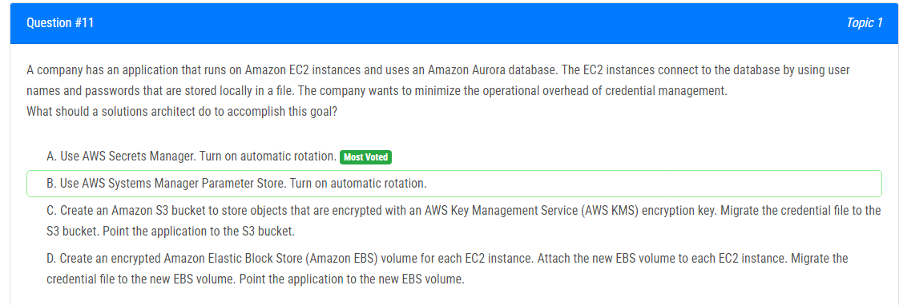
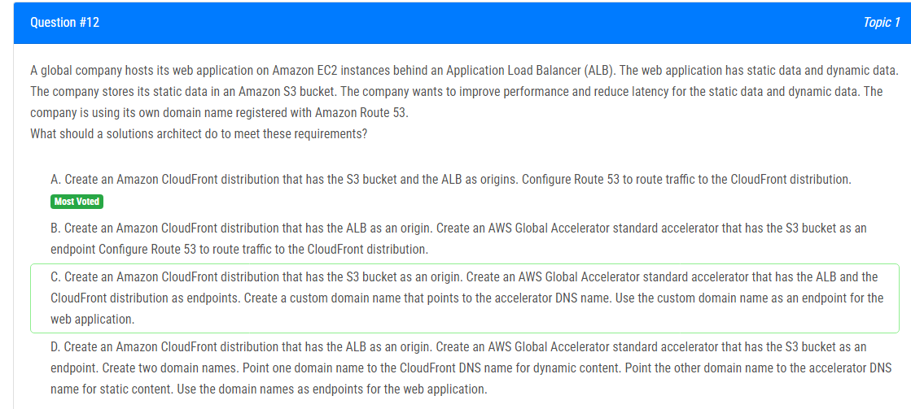
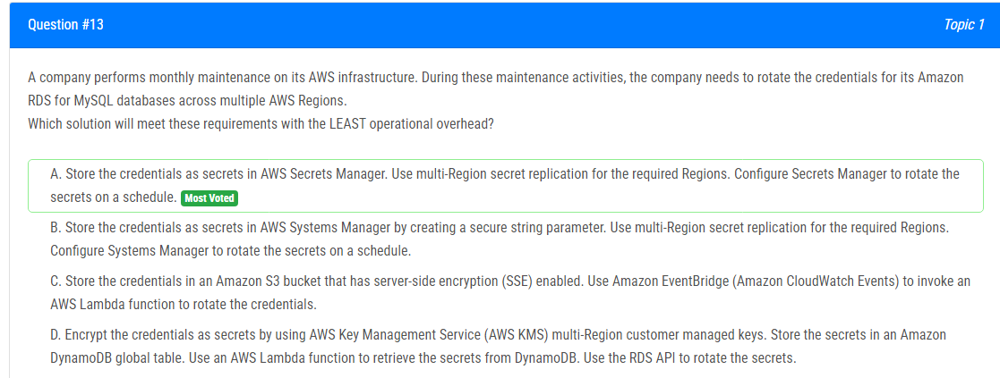
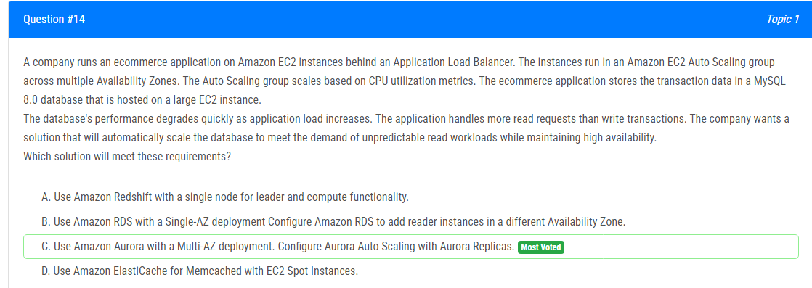
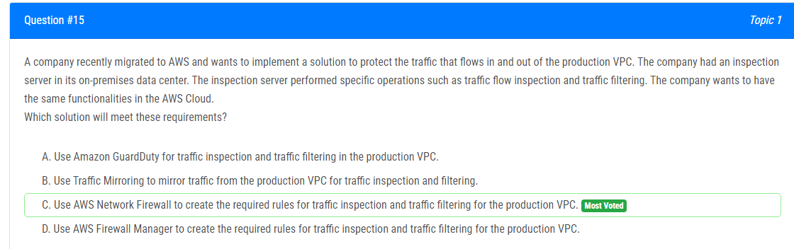
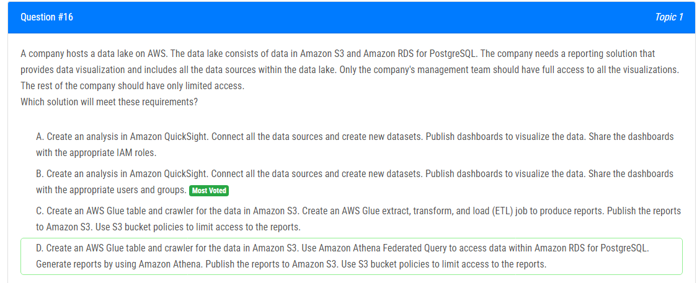
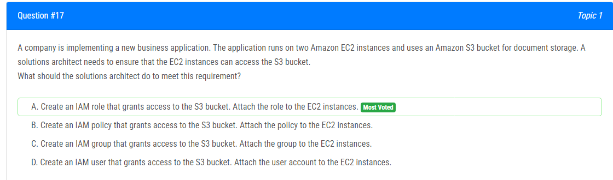
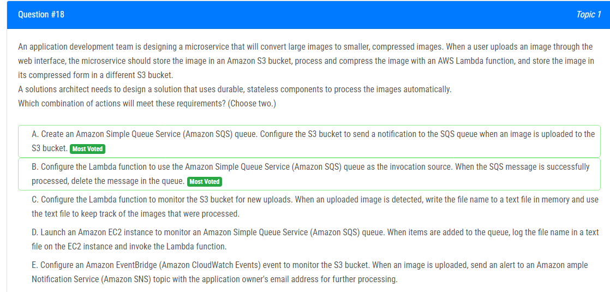
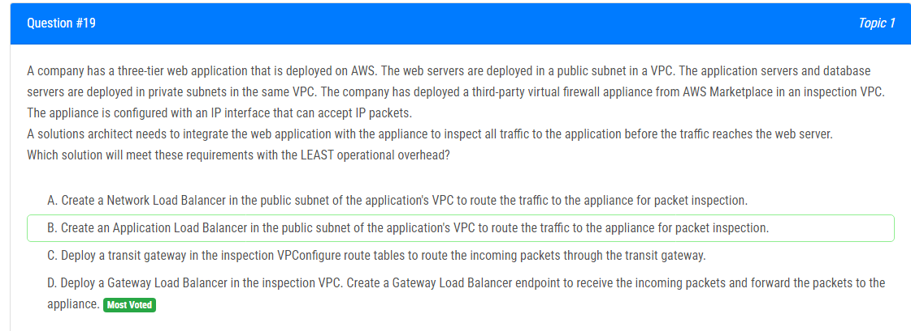
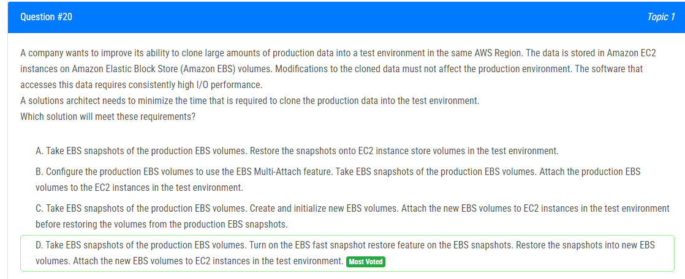

해설: 로컬 파일에 저장된 사용자 이름 및 암호 -> 자격 증명 관리의 운영 부담 최소화 (보안 향상 및 운영 부담 최소화를 위해)

정답 A.

AWS Secrets Manager를 사용하면 사용자 이름과 암호가 KMS로 암호화되며 자동 회전 기능도 제공됩니다.

B: AWS Systems Manager Parameter Store에는 자동 회전 기능이 없습니다.

C: 이 방법은 사용 가능하지만 AWS Secrets Manager보다 더 많은 작업을 수행해야 합니다.

D: 이 방법은 사용 가능하지만 AWS Secrets Manager보다 더 많은 운영 부담이 필요합니다.

해설:

정답 A.

A가 정답입니다. 다른 답안들은 잘못된 오리진 또는 엔드포인트 유형을 가지고 있습니다.

CloudFront는 동일한 분포에서 여러 오리진(예: ALB 및 S3)을 지원합니다.

B 오답 - Global Accelerator Standard accelerator는 s3 엔드포인트를 지원하지 않습니다.

C 오답 - Global Accelerator Standard accelerator는 CloudFront 분포를 엔드포인트로 지원하지 않습니다.

D 오답 - Global Accelerator Standard accelerator는 s3 엔드포인트를 지원하지 않습니다.

해설:

정답 A.

RDS, DocumentDb, Redshift, 기타 DB의 자격 증명을 암호화합니다.
다중 리전 복제를 지원합니다.
일정에 따라 원격 회전을 지원합니다.

B: 안전한 문자열 매개변수는 Parameter Store에만 적용됩니다. AWS Secrets Manager의 경우 모든 데이터가 암호화됩니다.

C: S3의 복제에 대한 언급이 없습니다.

D: 답 A에 비해 단계가 많습니다.

해설:

정답 C. 높은 가용성 및 자동 확장 문제를 해결합니다.

데이터베이스의 성능이 응용 프로그램 부하가 증가함에 따라 빠르게 저하됩니다.
응용 프로그램은 쓰기 트랜잭션보다 더 많은 읽기 요청을 처리합니다.
예측할 수 없는 읽기 워크로드 수요를 충족시키기 위해 데이터베이스를 자동으로 확장
높은 가용성을 유지

A: Amazon Redshift는 데이터 분석 및 웨어하우스에 사용되며, MySQL에서 Redshift로 이동할 때 발생하는 문제 (저장 프로 시저, 트리거 등)가 있습니다. 리더에 대한 단일 노드는 높은 가용성을 유지하지 않습니다.

B: 요구 사항은 "예측할 수 없는 읽기 워크로드 수요를 충족시키기 위해 데이터베이스를 자동으로 확장"이지만 여기에 자동 확장이 누락되어 있습니다.

D: 인스턴스 중지는 높은 가용성을 유지하지 않습니다.

해설:

정답 C.

AWS Network Firewall을 사용하여 프로덕션 VPC에서 트래픽 검사 및 트래픽 필터링에 필요한 규칙을 생성합니다.

AWS Network Firewall은 인바운드 및 아웃바운드 네트워크 트래픽에 대한 필터링을 제공하는 관리형 방화벽 서비스로, 트래픽 검사 및 필터링을 위한 규칙을 생성할 수 있어 프로덕션 VPC를 보호하는 데 도움이 됩니다.

A: Amazon GuardDuty는 위협 감지 서비스로, 트래픽 검사 또는 필터링 서비스가 아닙니다.

B: 트래픽 미러링은 VPC에서 다른 VPC 또는 온프레미스 위치로 네트워크 트래픽의 복사본을 복제하고 전송하는 기능으로, 트래픽 검사 또는 필터링 서비스가 아닙니다.

D: AWS Firewall Manager는 계정 간에 방화벽을 중앙에서 구성하고 관리하는 보안 관리 서비스로, 트래픽 검사 또는 필터링 서비스가 아닙니다.

해설:

정답 B. Amazon QuickSight은 사용자(표준 버전) 및 그룹(엔터프라이즈 버전)만 지원하며 IAM은 지원하지 않습니다. QuickSight는 S3, RDS, Redshift, Aurora, Athena, OpenSearch, Timestream에서 대시 보드를 만드는 데 사용됩니다.

A : Amazon QuickSight는 사용자(표준 버전) 및 그룹(엔터프라이즈 버전)만 지원하며 IAM은 지원하지 않습니다. QuickSight를 사용하여 S3, RDS, Redshift, Aurora, Athena, OpenSearch, Timestream에서 대시 보드를 만듭니다.

C : 이 방법은 시각화를 지원하지 않으며 RDS 데이터를 처리하는 방법을 언급하지 않습니다.

D : 이 방법은 시각화를 지원하지 않으며 RDS 및 S3 데이터를 어떻게 결합할지 언급하지 않습니다.

해설:

정답 A. S3 버킷에 액세스 권한을 부여하는 IAM 역할을 생성하고 해당 역할을 EC2 인스턴스에 부착하십시오.

IAM 역할은 AWS 리소스 및 서비스에 대한 액세스를 위임할 수 있는 AWS 리소스입니다. S3 버킷에 액세스를 부여하는 IAM 역할을 생성한 다음 해당 역할을 EC2 인스턴스에 부착하면 EC2 인스턴스가 S3 버킷 및 해당 내부에 저장된 문서에 액세스할 수 있습니다.

B : IAM 정책은 IAM 사용자 또는 그룹에 대한 권한을 정의하는 데 사용되며 EC2 인스턴스에는 적용되지 않습니다.

C : IAM 그룹은 IAM 사용자 및 정책을 그룹화하는 데 사용되며 리소스에 대한 액세스를 부여하는 데 사용되지 않습니다.

D : IAM 사용자는 AWS 리소스와 상호 작용하는 사람이나 서비스를 나타내는 데 사용되며 리소스에 대한 액세스를 부여하는 데 사용되지 않습니다.

해설:

정답 A, B.

A : 이미지 업로드 프로세스와 이미지 처리 사이에 결합을 제공하므로 올바릅니다. S3를 SQS에 알림을 보내도록 구성함으로써 이미지 업로드 이벤트는 기록되어 마이크로서비스에서 독립적으로 처리될 수 있습니다.

B : Lambda가 SQS의 메시지에 의해 트리거되도록 보장합니다. Lambda는 SQS에서 이미지 정보를 검색하고 이미지를 처리하고 압축하여 압축된 이미지를 다른 S3에 저장할 수 있습니다. 처리가 성공하면 Lambda는 SQS에서 처리된 메시지를 삭제하여 이미지가 처리되었음을 나타냅니다.

C : 이미지 처리된 내용을 추적하기 위해 메모리 내의 텍스트 파일을 사용하여 상태 기반 접근 방식을 도입하므로 권장되지 않습니다.

D : EC2를 도입하여 SQS를 모니터링하고 텍스트 파일을 유지 관리하므로 불필요한 복잡성을 도입합니다.

E : 이미지를 자동으로 처리하는 요구 사항과 직접 관련이 없습니다. EventBridge 및 SNS는 이벤트 알림 및 추가 처리에 유용할 수 있지만 SQS만큼 내구성과 확장성을 제공하지 않습니다.

해설:

정답 D. Gateway Load Balancer (GWLB)는 글로벌 서비스이며 어떤 VPC에서도 배포될 수 있습니다. 이는 GWLB가 애플라이언스에 도달할 수 있다는 것을 의미합니다. 게다가 GWLB는 패킷 검사를 위해 패킷을 애플라이언스로 전달하도록 구성할 수 있습니다.

A : Network Load Balancer (NLB)가 리전 서비스이고 애플라이언스가 검사 VPC에 배포되었기 때문에 NLB가 애플라이언스에 도달할 수 없을 것이기 때문에 올바르지 않습니다.

B : Application Load Balancer (ALB)가 리전 서비스이고 애플라이언스가 검사 VPC에 배포되었기 때문에 ALB가 애플라이언스에 도달할 수 없을 것이기 때문에 올바르지 않습니다.

C : 트랜짓 게이트웨이가 글로벌 서비스이고 애플라이언스가 검사 VPC에 배포되었기 때문에 트랜짓 게이트웨이가 애플라이언스에 도달할 수 없을 것이기 때문에 올바르지 않습니다.

해설:

정답 D.

A: 이것은 가능하지만 요구 사항을 충족하는 데 시간이 오래 걸릴 수 있습니다.

B: 이 접근 방식은 프로덕션 및 테스트에 동일한 EBS 볼륨을 사용합니다. 테스트를 수정하면 프로덕션 환경에 영향을 미칠 수 있습니다.

C: EBS 스냅샷은 새로운 EBS 볼륨을 생성합니다. 기존 볼륨에서 복원할 수 없습니다.

D: EBS 스냅샷에서 빠른 스냅샷 복원 기능을 활성화합니다 -> 처음 사용 시 지연이 없음