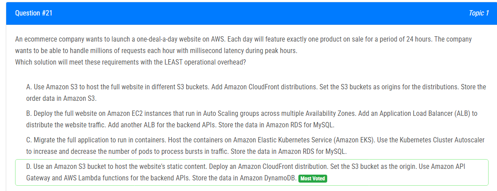
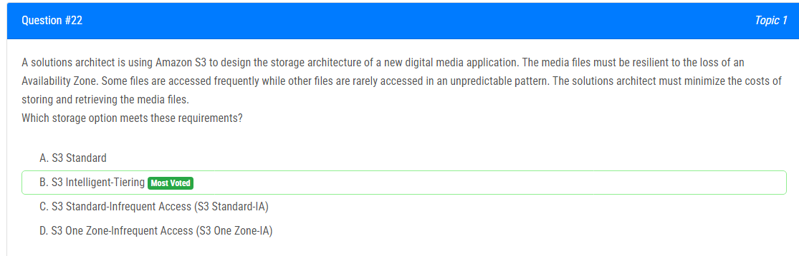
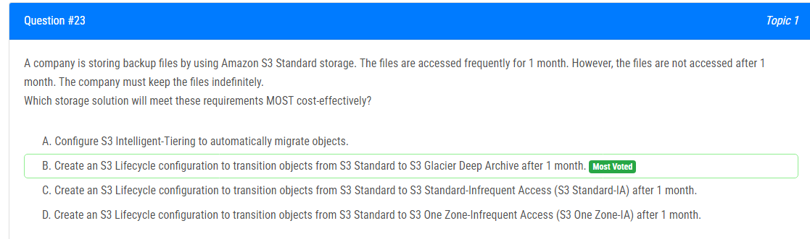
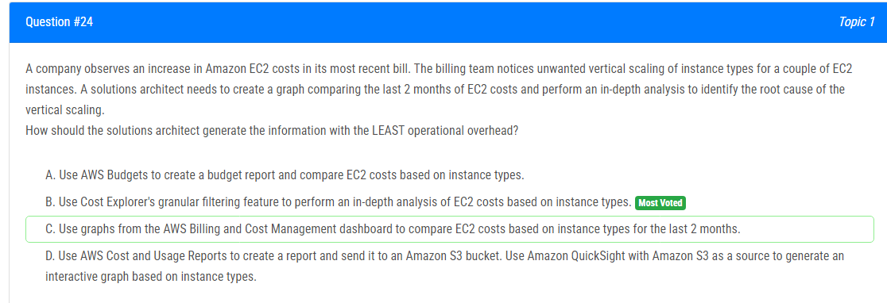
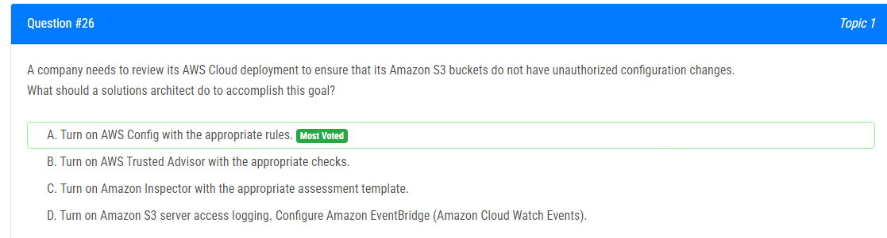
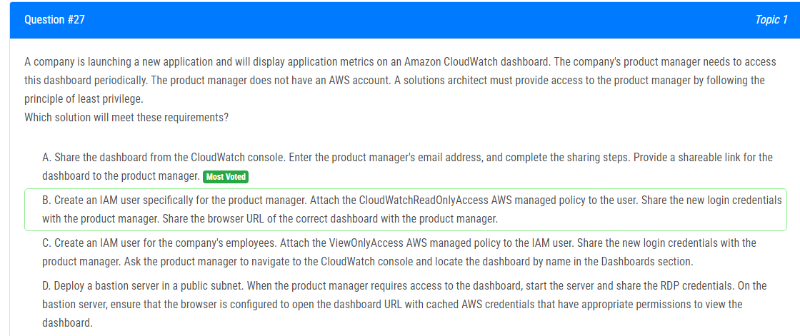
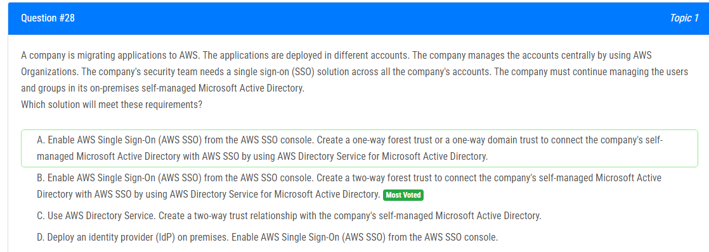
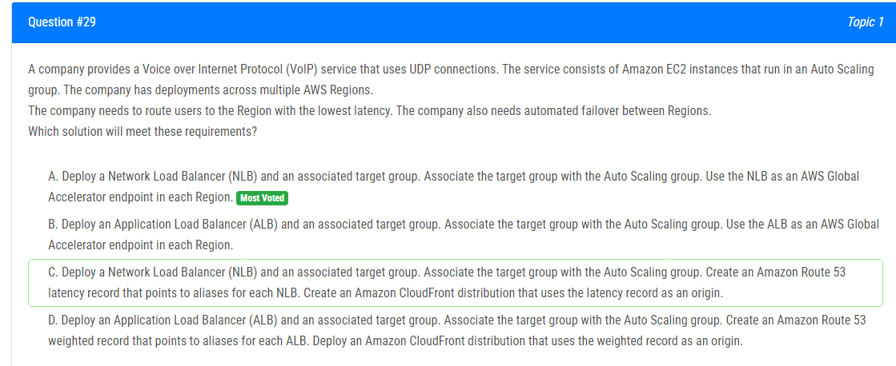
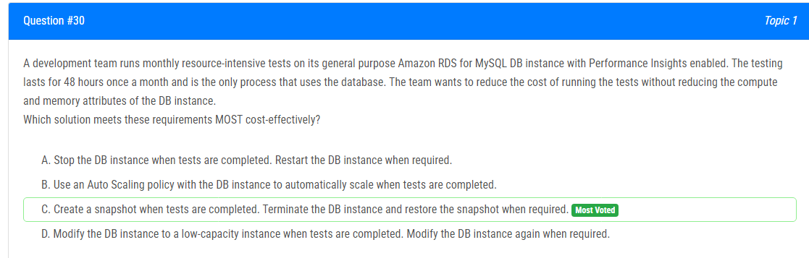

해설:

정답 D.

D를 선택하는 이유는 Amazon S3를 사용하여 정적 콘텐츠를 호스팅하고 Amazon CloudFront를 통해 콘텐츠를 전송함으로써 웹 사이트에 대한 높은 성능과 확장성을 제공할 수 있기 때문입니다. Amazon API Gateway 및 AWS Lambda를 사용하여 확장 가능하고 고가용성의 백엔드 API를 구축할 수 있으며, 데이터는 Amazon DynamoDB에 저장됩니다. 이 솔루션은 요구 사항을 충족하기 위해 자동으로 확장되는 완전히 관리되는 서비스를 활용하므로 운영 오버헤드가 최소화됩니다.

A : 여러 개의 S3 버킷을 사용하여 전체 웹 사이트를 호스팅하는 것이 백만 건의 요청과 밀리초 지연이 필요한 성능과 확장성을 제공하지 않기 때문에 올바르지 않습니다.

B : 전체 웹 사이트를 EC2 인스턴스에 배포하고 Application Load Balancer (ALB) 및 RDS 데이터베이스를 사용하는 것이 인프라를 유지 및 확장하기 위해 더 많은 운영 오버헤드를 필요로 하기 때문에 올바르지 않습니다.

C : 응용 프로그램을 컨테이너에 배포하고 Amazon Elastic Kubernetes Service (EKS)에서 호스팅하는 것이 높은 성능과 확장성을 제공할 수 있지만, 인프라를 유지 및 확장하기 위해 더 많은 운영 오버헤드가 필요하기 때문에 올바르지 않습니다. 완전히 관리되는 서비스인 S3 및 CloudFront와 비교하여.

해설:

정답 B.

이 요구 사항을 충족하는 저장 옵션은 B: S3 Intelligent-Tiering입니다.

Amazon S3 Intelligent-Tiering은 액세스 패턴을 기반으로 자동으로 데이터를 가장 비용 효율적인 저장 계층으로 이동시키는 저장 클래스입니다. 이는 두 가지 액세스 티어에서 객체를 저장할 수 있습니다. 자주 액세스되는 티어와 드물게 액세스되는 티어입니다. 자주 액세스되는 티어는 자주 액세스되는 객체에 최적화되어 있으며 S3 Standard와 동일한 비율로 청구됩니다. 드물게 액세스되는 티어는 자주 액세스되지 않는 객체에 최적화되어 있으며 S3 Standard보다 낮은 비율로 청구됩니다.

S3 Intelligent-Tiering은 자주 및 드물게 예측할 수 없는 패턴으로 액세스되는 미디어 파일을 저장하는 데 좋은 선택입니다. 이는 액세스 패턴을 기반으로 데이터를 가장 비용 효율적인 저장 계층으로 자동으로 이동시킴으로써 저장 및 검색 비용을 최소화합니다. 또한 이는 지역 내의 여러 가용 영역에 객체를 저장하여 가용 영역 손실에 내구성을 가지고 있습니다.

A : S3 Standard,은 S3 Intelligent-Tiering의 비용 최적화를 제공하지 않기 때문에 적합하지 않습니다.

C : S3 Standard-Infrequent Access (S3 Standard-IA),은 드물게 액세스되는 객체에 최적화되어 있어 S3 Intelligent-Tiering의 비용 최적화를 제공하지 않기 때문에 적합하지 않습니다.

D : S3 One Zone-Infrequent Access (S3 One Zone-IA),은 가용 영역의 손실에 내구성을 제공하지 않으며 다른 저장 클래스보다 내구성이 낮기 때문에 적합하지 않습니다.

해설:

정답 B.

이러한 요구 사항을 가장 비용 효과적으로 충족시키는 저장 솔루션은 B: S3 Glacier Deep Archive로 객체를 1개월 후에 이전하는 S3 Lifecycle 구성을 생성하는 것입니다.

Amazon S3 Glacier Deep Archive는 드물게 액세스되는 데이터의 장기 보존을 위한 안전하고 내구성 있는 Amazon S3 저장 클래스로, 여러 시간의 검색 시간이 허용되는 데이터에 대한 것입니다. 이는 Amazon S3의 가장 낮은 비용 저장 옵션으로, 1개월 후에 액세스되지 않는 백업 파일을 저장하기에 비용 효과적인 선택입니다.

S3 Lifecycle 구성을 사용하여 객체를 1개월 후에 S3 Standard에서 S3 Glacier Deep Archive로 자동으로 이전할 수 있습니다. 이를 통해 자주 액세스되지 않는 백업 파일의 저장 비용을 최소화할 수 있습니다.

A : S3 Intelligent-Tiering을 구성하여 객체를 자동으로 마이그레이션하는 것은 장기 저장을 위해 설계되지 않았으며 S3 Glacier Deep Archive의 비용 이점을 제공하지 않기 때문에 적합하지 않습니다.

C : 1개월 후에 S3 Standard에서 S3 Standard-Infrequent Access (S3 Standard-IA)로 객체를 이전하는 것은 가장 낮은 비용 저장 옵션이 아니며 S3 Glacier Deep Archive의 비용 이점을 제공하지 않기 때문에 적합하지 않습니다.

D : 1개월 후에 S3 Standard에서 S3 One Zone-Infrequent Access (S3 One Zone-IA)로 객체를 이전하는 것은 가장 낮은 비용 저장 옵션이 아니며 S3 Glacier Deep Archive의 비용 이점을 제공하지 않기 때문에 적합하지 않습니다.

해설:

정답 B.

A : 보고서가 결과이므로 선택할 수 없습니다.
B : 14일간의 가시성이 제한되어 있고, 그래프는 2개월을 커버해야 하므로 선택할 수 없습니다.
C : 그래프를 제공하고 두 달 동안의 비용을 비교할 수 있는 최상의 옵션으로 보입니다.
D : 그래프를 제공할 수 있지만 운영 오버헤드를 최소화해야 하므로 선택하지 않아야 합니다.

따라서 최소한의 운영 오버헤드로 요청된 결과를 얻기 위해 해결사는 C를 선택해야 합니다. AWS Billing and Cost Management 대시보드에서 인스턴스 유형을 기준으로 두 달 동안의 EC2 비용을 비교할 수 있습니다.

해설:

정답 D.

이러한 요구 사항을 충족하면서 확장성을 향상하고 구성 노력을 최소화하는 해결책은 D입니다. 두 개의 Lambda 함수를 설정하고 한 함수를 정보를 수신하도록 구성하고 다른 함수를 데이터베이스에 정보를로드하도록 구성합니다. 이 두 Lambda 함수를 Amazon Simple Queue Service (Amazon SQS) 대기열을 사용하여 통합합니다.

D 옵션을 선택하는 이유:

- Lambda 함수는 서버리스이며 자동으로 확장되므로 높은 데이터 볼륨을 처리하기에 적합합니다.

- SQS 대기열을 사용하여 데이터를 큐잉함으로써 응용 프로그램을 효과적으로 확장할 수 있습니다. 데이터를 비동기적으로 처리하여 Lambda 함수가 수용할 수 있는 속도로 데이터를로드할 수 있습니다.

- SQS를 사용하면 높은 확장성을 제공하면서도 데이터베이스로의 정보 전송을 안정적으로 처리할 수 있습니다.

- SQS는 구성이 간단하며 Lambda 함수 간의 통합을 단순화합니다.

반면, 다른 옵션들은 더 많은 구성이 필요하거나 기존 아키텍처를 크게 변경해야 하므로 운영 노력이 증가할 수 있습니다.

해설:

정답 A.

이 목표를 달성하는 데 가장 적합한 솔루션은 A입니다: 적절한 규칙으로 AWS Config를 활성화합니다.

AWS Config는 AWS 리소스의 구성을 평가, 감사 및 평가할 수 있는 서비스로, Amazon S3 버킷의 구성 변경 사항을 모니터링하고 기록할 수 있습니다. AWS Config를 활성화하고 적절한 규칙을 사용하여 S3 버킷이 무단으로 구성 변경되지 않도록 할 수 있습니다.

B : AWS Trusted Advisor (AWS 신뢰된 어드바이저)를 사용하는 것은 AWS 리소스에 대한 최상의 사례 권고를 제공하지만, 이는 S3 버킷의 구성 변경을 모니터링하거나 기록하지 않습니다.

C : Amazon Inspector는 응용 프로그램의 보안 및 규정 준수를 평가하는 데 사용되지만, 이는 S3 버킷의 구성 변경을 모니터링하거나 기록하지 않습니다.

D : Amazon S3 서버 액세스 로깅은 S3 버킷에 대한 요청을 기록할 수 있지만, 이는 S3 버킷의 구성 변경을 모니터링하거나 기록하지 않습니다.

이것들은 AWS Config가 리소스 구성 변경을 모니터링하고 평가하는 서비스이지만, 다른 옵션들은 이러한 목적에는 적합하지 않습니다.

해설:

정답 A.

가장 적은 권한의 원칙을 따르면서 이 요구 사항을 충족시키기 위한 해결책은 A입니다. CloudWatch 콘솔에서 대시보드를 공유하고 제품 관리자의 이메일 주소를 입력한 다음 공유 단계를 완료합니다. 그런 다음 대시보드에 대한 공유 가능한 링크를 제품 관리자에게 제공합니다.

A 옵션을 선택하는 이유:
- 제품 관리자가 AWS 계정이 없기 때문에 IAM 사용자를 만들 필요가 없습니다.
- 대시보드를 직접 공유하여 특정 대시보드에만 액세스할 수 있도록 합니다.
- 다른 옵션들은 불필요한 IAM 사용자를 만들거나 불필요한 권한을 제공하는 등 필요하지 않은 복잡성을 도입합니다.

B : IAM 사용자를 만들고 제품 관리자에게 불필요한 권한을 부여하므로 최적의 해결책이 아닙니다.

C : ViewOnlyAccess 관리 정책이 CloudWatch 리소스에 액세스를 제공하지 않기 때문에 적절한 해결책이 아닙니다.

D : 불필요한 오버헤드와 RDP 자격 증명에 대한 액세스를 요구하여 적절한 해결책이 아닙니다.

해설:

정답 B.

AWS 애플리케이션이 온프레미스 도메인에서 객체를 조회해야 하고 제공된 시나리오의 구체적인 내용을 고려하면, 양방향 신뢰가 필요합니다. AWS IAM Identity Center 및 사용자 및 그룹 메타데이터에 의존하는 다른 애플리케이션들은 동기화 및 이 정보에 대한 양방향 액세스를 허용합니다.

이 요구 사항과 시나리오에서 제공된 정보를 고려할 때, 올바른 선택은 다음과 같습니다:

- **옵션 B:** AWS Directory Service for Microsoft Active Directory를 사용하여 회사의 자체 관리형 Microsoft Active Directory와 AWS 관리형 Microsoft AD를 연결하기 위해 양방향 포레스트 신뢰 또는 양방향 도메인 신뢰를 생성합니다.

이 선택은 AWS 애플리케이션의 인증 및 정보 조회를 위해 양방향 신뢰가 필요한 시나리오와 일치합니다.

해설:

정답 A.
 
사용자를 가장 낮은 지연 시간을 갖는 지역으로 라우팅하고 여러 AWS 지역 간에 자동 장애 조치를 제공하기 위한 최적의 해결책은 A입니다.

- **옵션 A:** 각 지역에서 AWS Global Accelerator 엔드포인트로 사용할 수 있는 Network Load Balancer (NLB)를 배포하고 해당 대상 그룹과 Auto Scaling 그룹을 연결합니다. 이를 통해 사용자는 가장 낮은 지연 시간을 갖는 지역으로 라우팅될 수 있습니다. 또한 NLB는 지역 간에 자동으로 장애 조치를 수행하여 서비스의 가용성을 보장합니다.

나머지 옵션들인 B, C, D는 VoIP 서비스에 UDP 연결을 사용하는 회사의 요구 사항에 적합하지 않거나 덜 효과적일 수 있습니다. 이러한 옵션들은 HTTP/HTTPS 트래픽을 위한 Application Load Balancer (ALB)를 사용하거나, 추가적인 설정이 필요한 Amazon Route 53 및 CloudFront를 활용하며, 이는 VoIP 서비스의 특성에 적합하지 않을 수 있습니다.

해설:

정답 C.

가장 비용 효율적으로 요구 사항을 충족하는 해결책은 C입니다: 테스트가 완료된 경우 스냅샷을 생성하고 DB 인스턴스를 종료한 다음 필요할 때 스냅샷을 복원합니다.

A : (중지 및 다시 시작)는 작업의 간단함과 데이터베이스를 빠르게 사용 가능한 상태로 만드는 데 더 적합하며 운영의 간소함이 주요 고려 사항일 때 적합합니다.

C : (스냅샷, 종료 및 복원)은 특히 인스턴스가 크고 실행 비용이 높은 경우에 더 높은 비용 절감을 제공할 수 있습니다. 인스턴스가 중지된 동안에는 인스턴스가 다운되어 있는 시간에 대한 비용이 부과되지 않기 때문입니다. 그러나 더 높은 운영 복잡성과 데이터베이스를 다시 온라인으로 가져 오는 데 더 오랜 시간이 걸립니다.

Amazon RDS에서는 DB 인스턴스가 중지된 경우에도 인스턴스와 관련된 비용이 발생합니다. 이는 Amazon EC2와는 달리 EC2 인스턴스가 중지된 동안에는 인스턴스 시간에 대한 비용이 부과되지 않는 것과 대조적인 중요한 차이점입니다. RDS에서는 인스턴스 자체가 실행되지 않아도 저장소 및 백업과 관련된 비용이 계속 발생합니다.