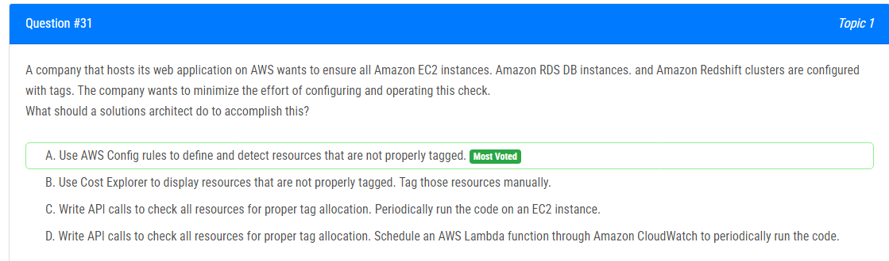
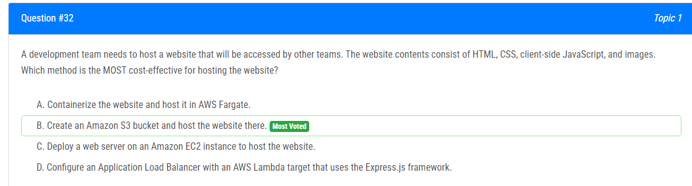
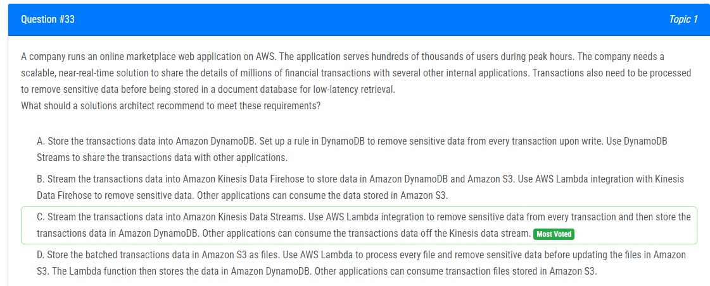
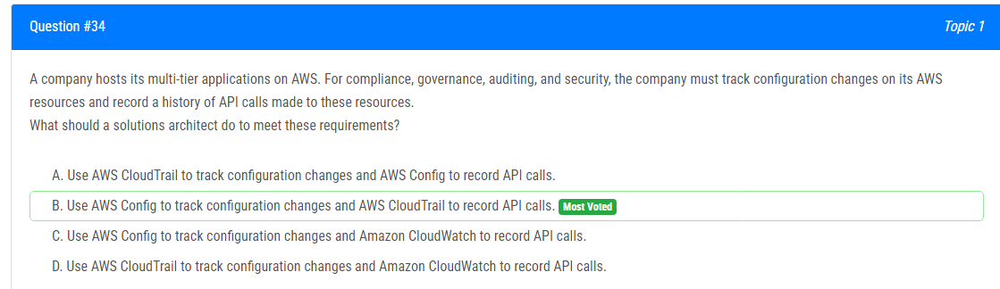
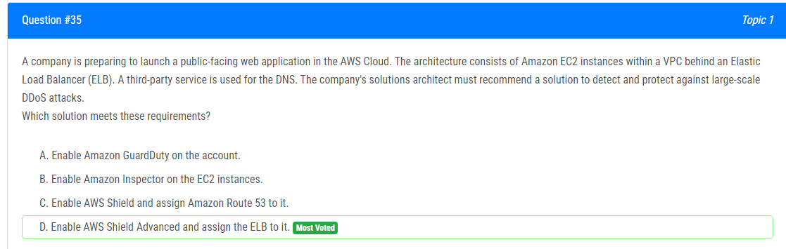
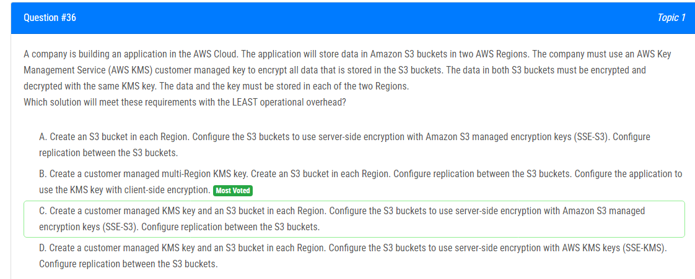
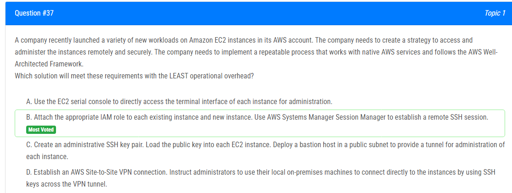
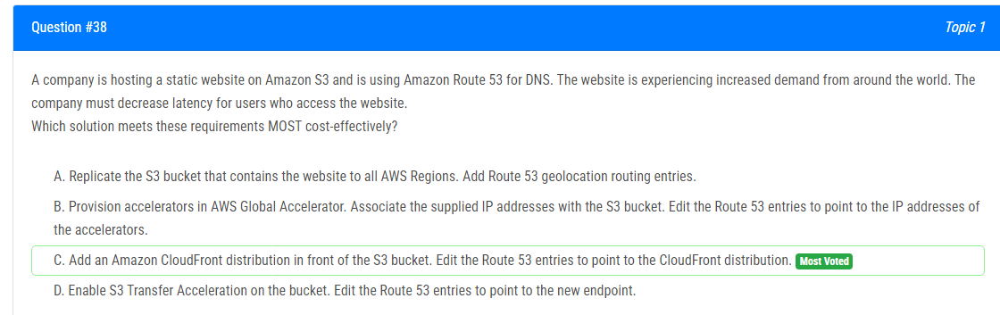
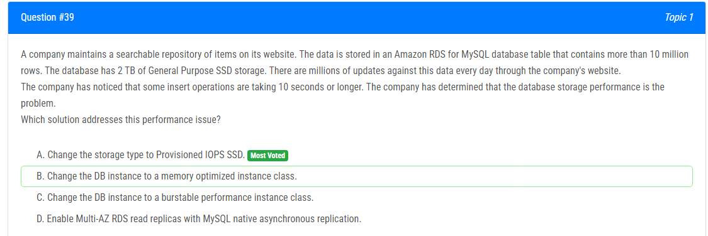
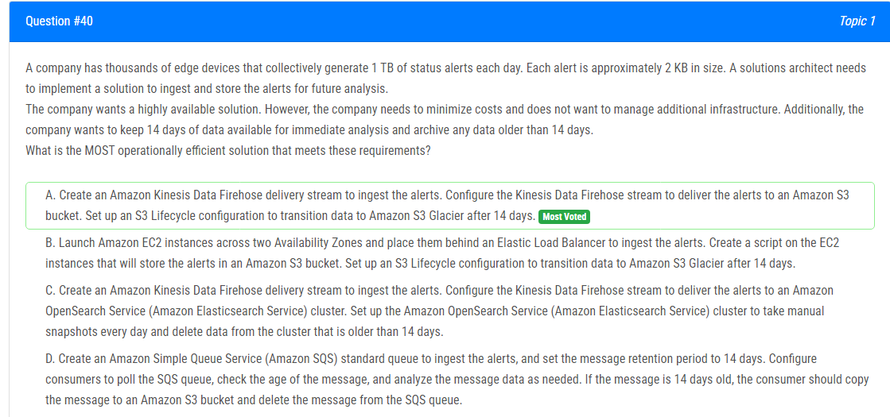

해설 : 

정답 A.

AWS Config 규칙을 사용하여 올바르게 태그가 지정되지 않은 리소스를 정의하고 감지하는 것은 이 체크를 자동화하는 효과적인 방법입니다. 이를 통해 올바르게 태그가 지정되지 않은 리소스를 수동으로 확인하거나 태그를 지정할 필요가 없어집니다.

B : 비용 탐색기를 사용하여 올바르게 태그가 지정되지 않은 리소스를 표시하고 그러한 리소스에 대해 수동으로 태그를 지정하는 것으로, 이는 자동화된 솔루션이 아닙니다.

C : API 호출을 사용하여 모든 리소스의 태그 할당을 확인하고 이 코드를 주기적으로 EC2 인스턴스에서 실행하는 방법으로, 이는 수동으로 코드를 실행하고 올바르게 태그가 지정되지 않은 리소스를 확인하는 데 노력이 필요합니다.

D : API 호출을 사용하여 모든 리소스의 태그 할당을 확인하고 Amazon CloudWatch를 통해 주기적으로 코드를 실행할 AWS Lambda 함수를 예약하는 방법으로, 수동으로 코드를 유지 관리하고 Lambda 함수를 예약하는 작업이 필요합니다. 하지만 AWS Config 규칙을 사용하는 것이 더 효율적이고 효과적인 방법입니다.

해설 :

정답 B.

가장 비용 효율적인 방법은 옵션 B인 "Amazon S3 버킷을 만들고 웹사이트를 거기에 호스팅하는 것"입니다. Amazon S3를 사용하면 웹사이트의 내구성, 확장성, 낮은 비용의 가격 모델을 활용할 수 있습니다. 웹사이트와 관련된 저장소 및 데이터 전송에만 비용이 발생하며 웹 서버나 컨테이너를 관리하고 유지보수할 필요가 없습니다. 이로써 운영 부하와 인프라 비용이 감소합니다.

A : 웹사이트를 컨테이너화하고 AWS Fargate에서 호스팅하는 것은 컨테이너 환경을 관리하고 리소스를 확장하는 데 추가 복잡성과 비용이 발생할 수 있습니다. 

C : Amazon EC2 인스턴스에 웹 서버를 배포하는 것은 EC2 인스턴스를 프로비저닝하고 관리해야 하므로 정적인 웹사이트에 대해서는 비용 효율적이지 않을 수 있습니다. 

D : AWS Lambda를 사용하는 Express.js 프레임워크를 타깃으로 하는 Application Load Balancer를 구성하는 것은 불필요한 복잡성을 추가하고 정적인 웹사이트를 호스팅하기에는 효율적이지 않을 수 있습니다.

해설 :

정답 C.

이 문제에서는 수백만 건의 금융 거래를 여러 내부 애플리케이션과 실시간으로 공유하고, 민감한 데이터를 제거한 후 낮은 대기 시간으로 문서 데이터베이스에 저장해야 합니다.

C. 옵션을 권장하는 이유는 다음과 같습니다.

1. 실시간 데이터 스트림: 수백만 건의 금융 거래를 다른 앱과 공유하기 위해서는 실시간으로 데이터를 수집할 수 있어야 합니다. 이는 Amazon Kinesis Data Streams를 통해 가능합니다.

2. 데이터 변환: Kinesis Data Streams와 함께 AWS Lambda를 사용하여 거래에서 민감한 데이터를 정제하고 제거한 다음, 이를 Amazon DynamoDB에 저장할 수 있습니다. 이는 민감한 데이터를 신경쓰는 요구 사항을 처리합니다.

3. 확장성: DynamoDB 및 Amazon Kinesis는 모두 엄청난 데이터 양을 처리하고 워크로드에 적응할 수 있는 매우 확장 가능한 기술입니다.

4. 낮은 대기 시간 검색: 실시간 데이터를 필요로 하는 애플리케이션은 DynamoDB에 처리된 데이터를 저장함으로써 낮은 대기 시간 검색의 혜택을 누릴 수 있습니다.

A : DynamoDB with Streams에서는 실시간 데이터 스트리밍이 제공되지 않으며, 실시간으로 데이터를 처리하기 위해 추가 구성 요소가 필요합니다.
B : Kinesis Data Firehose은 Kinesis Data Streams의 실시간 처리 기능이 부족하며, 주로 S3와 같은 대상으로 데이터를 분배하는 데 사용됩니다.
D : 옵션(S3를 사용한 배치 처리)은 거래의 수백만 건에 대한 실시간 처리 요구 사항과 양립하지 않는 배치 처리의 대기 시간 및 오버헤드를 추가합니다.

Lambda, DynamoDB 및 Kinesis Data Streams의 장점을 활용하여 C 옵션은 주어진 사용 사례에 대해 확장 가능하고 실시간 및 효과적인 솔루션을 제공합니다.

해설 :

정답 B.

이 회사는 AWS에서 멀티티어 애플리케이션을 호스팅하고 있으며, 규정 준수, 거버넌스, 감사 및 보안을 위해 AWS 리소스의 구성 변경을 추적하고 이러한 리소스에 대한 API 호출의 이력을 기록해야 합니다.

이러한 요구 사항을 충족하기 위해 솔루션 아키텍트는 옵션 B를 권장해야 합니다: AWS Config를 사용하여 구성 변경을 추적하고 AWS CloudTrail을 사용하여 API 호출을 기록합니다.

A : CloudTrail을 사용하여 구성 변경을 추적하고 Config를 사용하여 API 호출을 기록하는 것은 CloudTrail이 API 호출 이력을 캡처하도록 특별히 설계되었는 반면, Config는 구성 변경을 추적하기 위해 설계되었기 때문에 올바르지 않습니다.

C : Config를 사용하여 구성 변경을 추적하고 CloudWatch를 사용하여 API 호출을 기록하는 것은 권장되지 않습니다. CloudWatch는 모니터링 및 로깅에 사용될 수 있지만, API 호출 이력을 기록하기 위해 CloudTrail보다는 세부 수준과 규정 준수 추적이 부족합니다.

D : CloudTrail을 사용하여 구성 변경을 추적하고 CloudWatch를 사용하여 API 호출을 기록하는 것은 CloudTrail이 구성 변경을 추적하는 데 적합한 서비스이므로 최적의 선택이 아닙니다. CloudWatch는 특별히 API 호출 이력을 기록하기 위해 설계되지 않았습니다.

해설 :

정답 D.

A : Amazon GuardDuty가 AWS 계정 내에서 악성 활동 및 무단 행동을 식별하는 위협 감지 서비스로, 다양한 보안 위협을 감지하는 데 사용되지만 특히 대규모 DDoS 공격에 대해 집중적으로 다루지 않습니다.

B : Amazon Inspector는 EC2 내에서 보안 문제 및 취약점을 식별하는 취약점 평가 서비스로, 직접적으로 DDoS 공격에 대한 보호를 제공하지 않습니다.

C : AWS Shield가 Elastic IP 주소, CloudFront 및 Route53 호스팅 영역과 같은 리소스에 대한 기본 DDoS 보호를 제공하지만, 대규모 DDoS 공격에 대한 고급 기능 및 지원을 제공하는 AWS Shield Advanced와 비교하면 최적의 선택이 아닙니다.

그러므로 ELB를 AWS Shield Advanced에 할당하는 옵션 D가 설명된 아키텍처에서 대규모 DDoS 공격을 감지하고 방어하기 위한 권장 솔루션입니다.

해설 :

정답 B.

올바른 답은 B입니다.

고객 관리 다 리전 KMS 키를 만듭니다. 이렇게 하면 여러 리전에서 동일한 키를 사용할 수 있습니다. 그런 다음 각 리전에 S3 버킷을 생성하십시오. S3 버킷 간에 복제를 구성하십시오. 이렇게 하면 데이터가 두 리전에 모두 저장됩니다. 마지막으로 응용 프로그램을 KMS 키와 함께 클라이언트 측 암호화를 사용하도록 구성하십시오. 이렇게 하면 S3 버킷에 저장된 모든 데이터가 동일한 KMS 키를 사용하여 암호화 및 복호화됩니다. 이 솔루션은 모든 요구 사항을 가장 적은 운영 오버헤드로 충족합니다.

다른 옵션들은 모두 모든 요구 사항을 충족시키지 않습니다. A와 C는 두 리전에서 동일한 KMS 키를 사용하지 않습니다. D는 다 리전 KMS 키의 사용을 명시적으로 지정하지 않습니다.

해설 :

정답 B.

A : 시리얼 콘솔은 장치의 주변 장치에 직접 연결하여 부팅 등을 모니터하는 데 사용됩니다.
C : 작업 가능한 솔루션이지만 오버헤드가 많습니다.
D : 모든 사용자에게 너무 많은 오버헤드

B: 이러한 목적으로 관리되는 제품이므로 가장 적은 오버헤드가 있습니다.

따라서 최소한의 운영 오버헤드로 요구 사항을 충족하는 가장 적절한 솔루션은 B입니다.

해설 :

정답 C.

A : 모든 AWS 리전에 S3 버킷 복제는 데이터를 여러 리전에 걸쳐 복제하고 동기화를 관리하는 데 비용과 복잡성이 따를 수 있습니다. CloudFront 솔루션과 비교했을 때 상당한 대기 시간 감소를 제공하지 않을 수 있습니다.

B : AWS Global Accelerator에서 가속기 프로비저닝은 추가적인 인프라(가속기) 계층을 추가하며 IP 주소를 S3 버킷과 연결하는 요구 사항이 있을 수 있어 비용이 더 많이 들 수 있습니다. CloudFront는 이미 전역 엣지 위치를 포함하고 유사한 가속 기능을 제공합니다.

D : S3 Transfer Acceleration 활성화는 S3 버킷으로의 업로드 속도를 향상시킬 수 있지만 웹 사이트 방문자에 대한 대기 시간 감소에는 큰 영향을 미치지 않을 수 있습니다.

따라서 옵션 C가 가장 비용 효율적인 솔루션으로, CloudFront의 캐싱 및 전역 배포 기능을 활용하여 대기 시간을 감소시키고 웹 사이트 성능을 향상시킵니다.

해설 :

정답 A.

B : 메모리 최적화 인스턴스 클래스로 변경은 메모리 용량을 향상시키는 데 중점을 두지만, 저장소 성능 문제를 직접 해결하지 않을 수 있습니다.

C : 버스터블 성능 인스턴스 클래스로 변경은 변동 사용 패턴과 버스터블 성능 요구 사항이 있는 워크로드에 적합하지만, 무거운 쓰기 워크로드에 대한 일관된 및 예측 가능한 성능을 제공하지 않을 수 있습니다.

D : Multi-AZ RDS 읽기 복제본을 활성화하고 MySQL 네이티브 비동기 복제 사용은 고가용성 및 읽기 확장을 위한 솔루션이지만, 저장소 성능 문제를 직접 해결하지 않습니다.

따라서 A는 Amazon RDS for MySQL 데이터베이스에 대한 일관된 및 예측 가능한 I/O 성능을 제공하는 Provisioned IOPS SSD 저장소 유형을 활용하여 성능 문제를 해결하기 위한 가장 적절한 솔루션입니다.

해설 :

정답 A.

B : EC2 인스턴스를 시작하여 경고를 수신 및 저장하도록 제안하며, 이는 추가 인프라 관리 오버헤드를 도입하고 Kinesis Data Firehose 및 S3와 같은 관리형 서비스를 사용하는 것만큼 비용 효율적이고 확장 가능하지 않을 수 있습니다.

C : 경고를 Amazon OpenSearch Service 클러스터로 전달하고 수동으로 스냅샷 및 데이터 삭제를 관리하는 복잡성을 도입합니다. 이는 Kinesis Data Firehose 및 S3를 사용하는 간단한 솔루션보다 복잡하며 수동 오버헤드가 더 많이 발생할 수 있습니다.

D : SQS를 사용하여 경고를 수신하되 데이터를 직접 S3에 저장하는 대신 메시지를 복사하고 분석하는 등의 추가 작업을 수행하게끔 제안합니다. 이는 추가적인 수동 처리를 도입하고 경고 데이터의 지속성 및 내구성이 S3에 직접 저장되는 것만큼 강력하지 않을 수 있습니다.

따라서 A는 Kinesis Data Firehose를 활용하여 경고를 수신하고 S3에 저장하며, S3 수명주기 구성을 사용하여 장기 아카이브를 위해 데이터를 S3 Glacier로 이관하여 추가 인프라 관리 없이 요구 사항을 가장 효율적으로 해결하는 솔루션입니다.