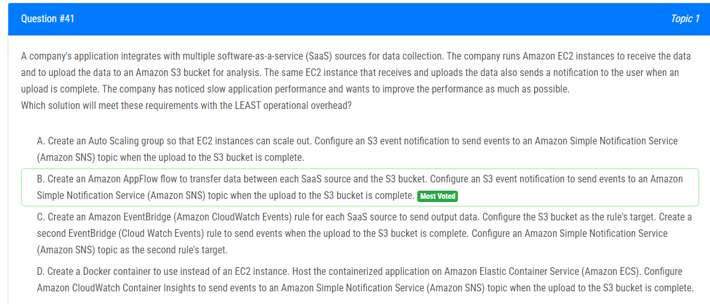
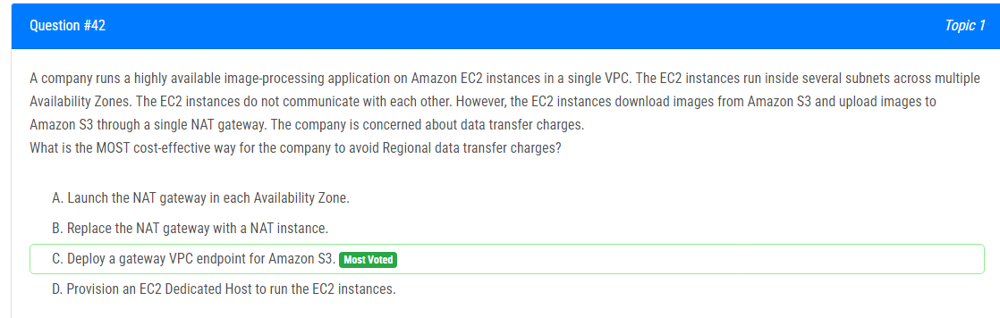
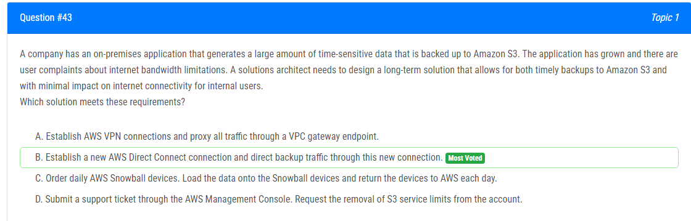
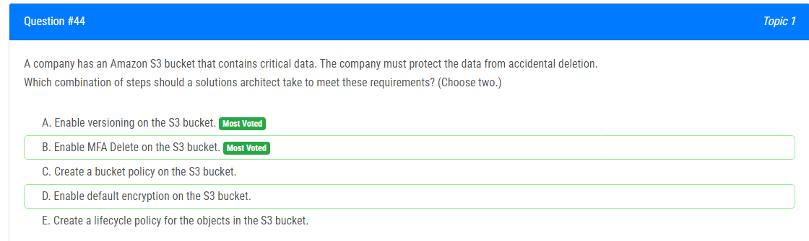
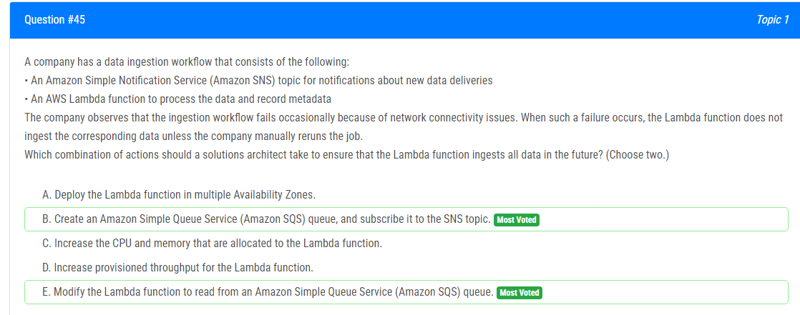
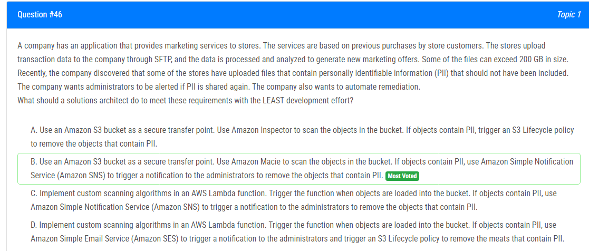
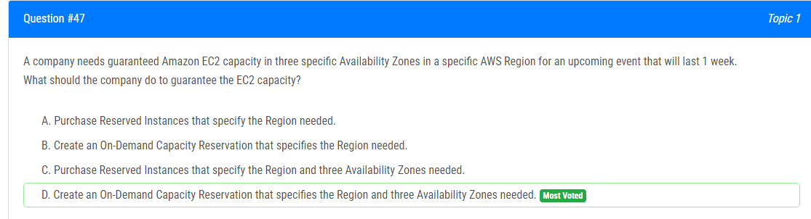
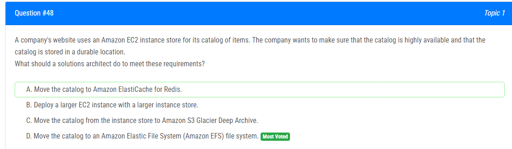
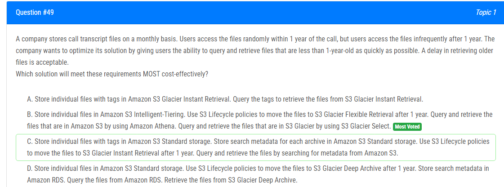
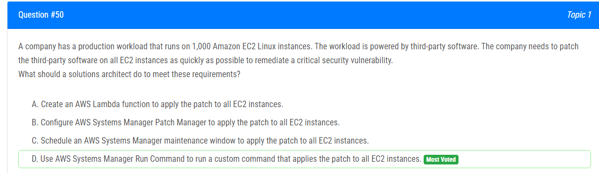

해설:

정답 B.

A : EC2 인스턴스를 스케일 아웃할 수 있는 Auto Scaling 그룹을 생성합니다. S3 버킷으로의 업로드가 완료되면 S3 이벤트 알림을 구성하여 Amazon Simple Notification Service (Amazon SNS) 토픽으로 이벤트를 보냅니다. 이 방법은 EC2 인스턴스를 자동으로 스케일 아웃하여 부하를 분산하고, 업로드 완료 이벤트를 통해 사용자에게 통지할 수 있도록 해줍니다.

B : Amazon AppFlow 플로우를 생성하여 각 SaaS 소스와 S3 버킷 간의 데이터 전송을 구성합니다. S3 이벤트 알림을 설정하여 S3 버킷으로의 업로드가 완료되면 Amazon Simple Notification Service (Amazon SNS) 토픽으로 이벤트를 보냅니다. 이 방법은 운영 오버헤드가 가장 적고, 간단한 솔루션으로 SaaS 소스에서 데이터를 전송하고 통지를 관리할 수 있습니다.

C : 각 SaaS 소스에 대한 Amazon EventBridge (Amazon CloudWatch Events) 규칙을 생성하여 출력 데이터를 전송합니다. S3 버킷을 규칙의 대상으로 구성하고, 업로드가 완료되면 이를 알리기 위한 두 번째 EventBridge (CloudWatch Events) 규칙을 생성합니다. 이 방법은 별도의 규칙을 사용하여 복잡성이 추가되며, 느린 응용 프로그램 성능에 대한 명시적인 처리가 없습니다.

D : EC2 인스턴스 대신 Docker 컨테이너를 생성하고, 이를 Amazon Elastic Container Service (Amazon ECS)에 호스팅합니다. S3 버킷으로의 업로드가 완료되면 Amazon CloudWatch Container Insights를 구성하여 Amazon Simple Notification Service (Amazon SNS) 토픽으로 이벤트를 보냅니다. 이 방법은 운영 오버헤드 및 설정이 Amazon AppFlow보다 많이 필요하며, 더 복잡한 솔루션일 수 있습니다.

따라서, 가장 운영 오버헤드가 적고 간단한 솔루션은 B입니다. Amazon AppFlow를 사용하여 데이터 전송을 관리하고, S3 이벤트 알림 및 Amazon SNS를 통해 업로드 완료를 통지합니다.

해설:

정답 C.

가장 비용 효율적인 방법은 C. Amazon S3에 대한 게이트웨이 VPC 엔드포인트를 배포하는 것입니다.

게이트웨이 VPC 엔드포인트를 사용하면 VPC와 S3 간에 직접 연결을 설정할 수 있으며, 이를 통해 EC2와 S3 간의 트래픽이 인터넷 게이트웨이나 NAT 게이트웨이를 통과하지 않고 Amazon 네트워크 내에서 유지되어 지역 데이터 전송 요금이 발생하지 않습니다.

A : 각 가용 영역에서 NAT 게이트웨이를 시작하는 것을 제안합니다. 이것은 가용성과 내결함성을 향상시킬 수 있지만, 데이터 전송 요금 문제를 해결하지 않습니다. 여전히 NAT 게이트웨이를 통해 데이터 전송이 발생할 것이며, 따라서 요금이 부과됩니다.

B : NAT 게이트웨이를 NAT 인스턴스로 교체하는 것을 제안합니다. 그러나 이 솔루션은 여전히 NAT 인스턴스를 통한 데이터 전송을 포함하고 있으며, 결과적으로 데이터 전송 요금이 발생합니다.

D : EC2 Dedicated Host를 프로비저닝하여 EC2를 실행하도록 제안합니다. 이것은 인스턴스에 대한 전용 하드웨어를 제공할 수 있지만, 데이터 전송 요금 문제를 직접 해결하지 않습니다.

해설:

정답 B.

가장 적절한 해결책은 B. 새로운 AWS Direct Connect 연결을 설정하고 백업 트래픽을 이 새로운 연결을 통해 전송하는 것입니다.

AWS Direct Connect는 온프레미스 데이터 센터에서 AWS로의 전용 네트워크 연결을 설정할 수 있는 서비스입니다. 이 연결은 공용 인터넷을 우회하며 온프레미스 응용 프로그램과 Amazon S3 간에 더 안정적이고 지연 시간이 적은 통신을 제공할 수 있습니다. 백업 트래픽을 AWS Direct Connect 연결을 통해 전송함으로써 인터넷 대역폭에 미치는 영향을 최소화하고 S3로의 적시된 백업을 보장할 수 있습니다.

A : AWS VPN 연결을 설정하고 모든 트래픽을 VPC 게이트웨이 엔드포인트를 통해 프록시하는 것은 인터넷 대역폭에 미치는 영향을 충분히 최소화하지 않을 수 있습니다. 여전히 공용 인터넷을 통해 S3에 액세스해야 합니다.

C : AWS Snowball 디바이스를 사용하는 것은 인터넷 대역폭 제한 문제를 해결하지 않습니다. 데이터는 여전히 Snowball 디바이스로부터 인터넷을 통해 전송되어야 하기 때문입니다.

D : S3 서비스 제한을 제거하는 것은 인터넷 대역폭 제한 문제를 해결하지 않으며, S3로의 적시된 백업을 보장하지 않습니다.

해설:

정답 A, B.

기업이 중요한 데이터를 포함하는 Amazon S3 버킷을 보호해야 할 경우, 해결책 아키텍트는 다음 조합의 단계를 취할 수 있습니다:

A : S3 버킷에 버전 관리를 활성화하십시오. 

B : S3 버킷에 MFA Delete를 활성화하십시오. 

이러한 단계를 통해 데이터의 실수로 인한 삭제를 방지할 수 있습니다.

C : S3 버킷에 버킷 정책을 생성하는 것은 주로 버킷 및 해당 객체에 대한 액세스 제어 및 권한을 정의하는 데 중점을 둡니다. 그러나 이는 실수로 인한 삭제에 직접적으로 대응하지는 않습니다.

D : S3 버킷에 기본 암호화를 활성화하는 것은 새로 업로드되는 객체가 자동으로 암호화되도록 보장합니다. 그러나 이것은 주로 데이터 보안과 관련이 있으며, 실수로 인한 삭제에 직접적으로 대응하지는 않습니다.

E : S3 버킷의 객체에 대한 수명 주기 정책을 생성하는 것은 미리 정의된 규칙에 기반하여 객체를 자동으로 관리하는 데 도움이 될 수 있습니다. 그러나 이는 주로 데이터 보존 및 저장 비용 최적화와 관련이 있으며, 실수로 인한 삭제에 직접적으로 대응하지는 않습니다.

해설:

정답 B, E.

Lambda 함수가 데이터를 처리하지 못하는 경우를 해결하기 위해 해결책 아키텍트가 취해야 할 조치 조합은 다음과 같습니다.

B : Amazon Simple Queue Service (Amazon SQS) 대기열을 생성하고 해당 대기열을 SNS 주제에 구독합니다. (최다 투표)

E : Lambda 함수를 수정하여 Amazon Simple Queue Service (Amazon SQS) 대기열에서 읽도록 변경하십시오. (최다 투표)

이러한 조치를 통해 SQS 큐를 사용하여 메시지를 처리할 수 있습니다. SQS는 메시지를 안전하게 저장하여 처리가 실패하더라도 데이터 손실을 방지합니다. Lambda 함수가 네트워크 연결 문제로 실패하더라도 SQS에 있는 메시지를 나중에 처리할 수 있습니다.

A : Lambda 함수를 여러 가용 영역에 배포하는 것은 가용성과 내결함성을 향상시킬 수 있지만, 이는 네트워크 연결 문제로 인한 Lambda 함수 실패 문제를 직접 해결하지 않습니다.

C : Lambda 함수에 할당된 CPU 및 메모리를 늘리는 것은 문제를 해결하는 데 도움이 되지 않습니다. 이 문제는 주로 네트워크 연결 문제와 관련이 있습니다.

D : Lambda 함수에 대한 프로비저닝 처리량을 늘리는 것은 문제를 해결하는 데 도움이 되지 않습니다. 문제는 Lambda 함수의 실패로 인한 것이기 때문입니다. 높은 프로비저닝 처리량은 실패를 해결하지 않습니다.

해설:

정답 B.

가장 적은 개발 노력으로 요구 사항을 충족시키기 위해 솔루션 아키텍트가 취해야 할 조치는 B입니다.

B : Amazon S3 버킷을 안전한 전송 지점으로 사용합니다. Amazon Macie를 사용하여 버킷의 객체를 스캔합니다. 객체에 개인 식별 정보(PII)가 포함되어 있다면 Amazon Simple Notification Service (Amazon SNS)를 사용하여 관리자에게 PII가 포함된 객체를 제거하도록 알립니다.

이 조치는 Amazon Macie를 활용하여 AWS에서 자동으로 민감한 데이터인 PII를 검색, 분류 및 보호하는 관리형 서비스를 활용합니다. Macie를 S3에서 활성화하면 업로드된 객체를 PII에 대해 스캔할 수 있습니다.

A : Amazon Inspector를 사용하여 S3의 객체를 스캔하는 것은 PII 데이터를 스캔하는 데 최적의 선택이 아닙니다. Amazon Inspector는 콘텐츠 스캔이 아닌 호스트 수준의 취약점 평가를 위해 설계되었습니다.

C : AWS Lambda 함수에 사용자 정의 스캐닝 알고리즘을 구현하는 것은 큰 파일을 처리하기 위한 개발 노력이 상당할 것입니다.

D : SES를 통한 알림 및 S3 Lifecycle 정책을 트리거하는 것은 솔루션에 불필요한 복잡성을 추가할 수 있습니다.

따라서 최소한의 개발 노력으로 요구 사항을 충족시키는 최상의 옵션은 S3를 안전한 전송 지점으로 사용하고 PII 스캐닝에 Amazon Macie를 활용하며, 관리자에게 SNS 알림을 트리거하는 것입니다.

해설:

정답 D.

회사가 특정 AWS 지역의 세 가지 특정 가용 영역에서 보장된 Amazon EC2 용량이 필요한 경우 해야 할 조치는 D입니다.

D : 필요한 지역 및 세 가지 가용 영역을 지정하는 On-Demand Capacity Reservation을 생성하십시오.

On-Demand Capacity Reservation은 Amazon EC2에서 예약된 용량을 만들고 관리할 수 있는 유형의 예약입니다. On-Demand Capacity Reservation을 사용하면 특정 지역 및 가용 영역, 예약할 EC2 인스턴스 수를 지정할 수 있습니다. 이를 통해 특정 지역의 특정 가용 영역에서 용량을 보장할 수 있습니다.

A : 필요한 지역을 지정하는 예약 인스턴스를 구매하는 것은 특정 가용 영역에서의 용량을 보장하지 않습니다.
B : 필요한 지역을 지정하는 On-Demand Capacity Reservation을 생성하는 것은 특정 가용 영역에서의 용량을 보장하지 않습니다.
C : 필요한 지역 및 세 가지 가용 영역을 지정하는 예약 인스턴스를 구매하는 것은 특정 가용 영역에서의 용량을 보장하지 않습니다.

해설:

정답 D.

회사의 웹 사이트가 항목 카탈로그를 위해 Amazon EC2 인스턴스 스토어를 사용하고 있습니다. 회사는 카탈로그가 고가용성이 보장되고 카탈로그가 내구성 있는 위치에 저장되도록 하고자 합니다.

이 요구 사항을 충족하기 위해 솔루션 아키텍트가 해야 할 조치는 D입니다.

D : 카탈로그를 Amazon Elastic File System (Amazon EFS) 파일 시스템으로 이동하십시오.

A : 카탈로그를 보관하는 데 내구성이 부족하므로 적합하지 않습니다. ElastiCache는 주로 캐싱을 위해 사용되는 메모리 내 데이터 저장소이며 카탈로그에 내구성 있는 저장소를 제공할 수 없습니다.

B : 고가용성이나 내구성을 보장하지 않습니다. 인스턴스 스토어는 EC2 인스턴스에 연결된 순간적인 저장소로 내구성이나 복제가 되지 않습니다.

C : 내구성은 제공할 수 있지만 고가용성을 제공하지 않습니다. S3 Glacier Deep Archive는 장기 보관용 스토리지로, Glacier에서 데이터에 액세스하는 데 상당한 검색 시간과 비용이 발생할 수 있습니다.

따라서 D 옵션이 회사의 카탈로그에 대한 고가용성과 내구성을 보장하는 가장 적합한 선택입니다.

해설:

정답 B.

B는 가장 비용 효율적인 옵션입니다. Intelligent-Tiering은 초기 1년 동안의 무작위 액세스 패턴을 고려하여 가장 저렴한 방식으로 파일을 관리합니다. 1년이 지나면 S3 Glacier Flexible Retrieval로 이동하여 더 낮은 비용으로 파일을 관리할 수 있습니다. Amazon Athena는 파일이 어디에 있는지에 상관없이 작동하며 쿼리를 수행할 수 있습니다.

A : 첫 해의 무작위 패턴을 고려하지 않습니다.
C : "각 보관소에 대한 검색 메타데이터를 Amazon S3 Standard 저장소에 저장" 부분이 잘못되었습니다. 메타데이터를 영구적으로 S3에 저장하여 쿼리할 수 있도록 하는 것은 효율적이지 않습니다.
D : RDS는 저장 및 쿼리에 대한 비용이 비싸며 S3 객체의 위치를 알기 위해 이를 사용하는 것이 불필요합니다.

따라서 B가 비용 효율적으로 요구 사항을 충족시키는 최적의 선택지입니다.

해설:

정답 D.

이 요구 사항을 충족하기 위한 가장 적절한 솔루션은 D 옵션입니다. AWS Systems Manager Run Command는 Amazon EC2 인스턴스, 온프레미스 서버 및 가상 머신(VM)의 구성을 원격 및 안전하게 관리할 수 있도록 하는 기능입니다. Run Command를 사용하여 여러 인스턴스에 대해 스크립트 또는 기타 공통 시스템 관리 작업을 실행할 수 있습니다.

모든 EC2 인스턴스에 타사 소프트웨어를 패치하려면 Run Command를 사용하여 모든 인스턴스에 패치를 적용하는 사용자 지정 명령을 실행할 수 있습니다. 이를 통해 수동으로 각 인스턴스에 로그인하여 패치를 수동으로 적용할 필요 없이 소프트웨어를 신속하고 효율적으로 패치할 수 있습니다.

A : 패치를 적용하기 위해 AWS Lambda 함수를 만드는 것은 적절한 솔루션이 아닙니다. Lambda 함수는 EC2 인스턴스에 직접 액세스할 수 없습니다.

B : AWS Systems Manager Patch Manager를 구성하여 패치를 적용하는 것은 적절한 솔루션이 될 수 있지만 긴급 패치가 아닌 지속적인 패치 관리를 위해 설계되어 있을 수 있습니다.

C : 패치를 적용하기 위해 유지 보수 창을 예약하는 것은 적절한 솔루션이 될 수 있지만 Run Command 사용보다 스케줄링이 필요하며 Run Command 사용보다 더 오랜 시간이 걸릴 수 있습니다.