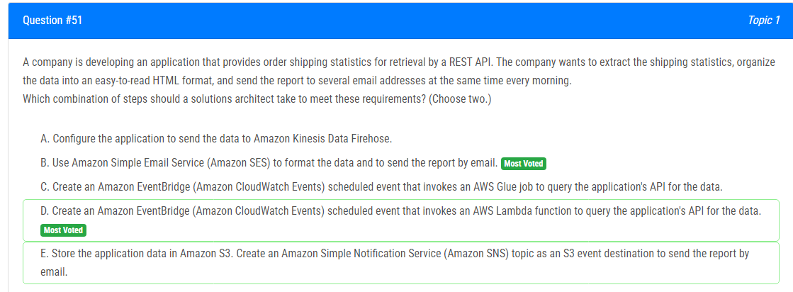
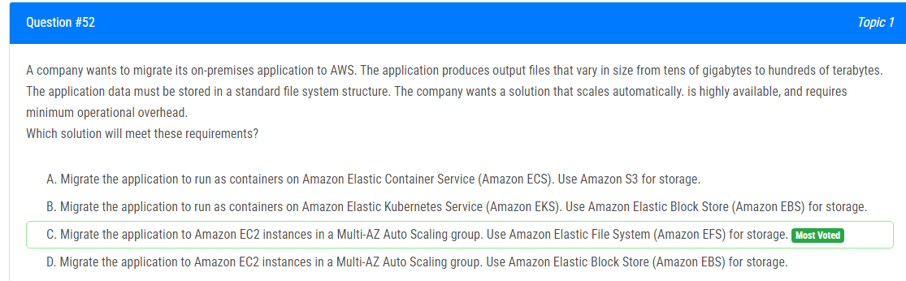
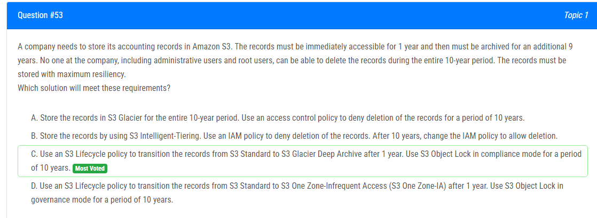
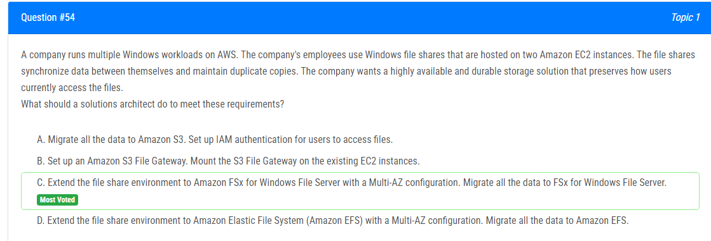
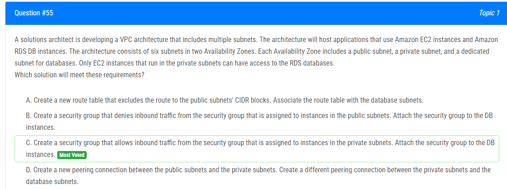
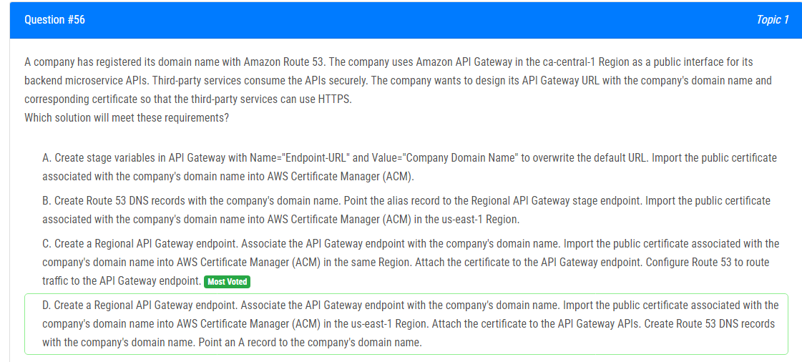
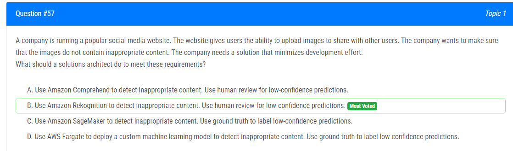
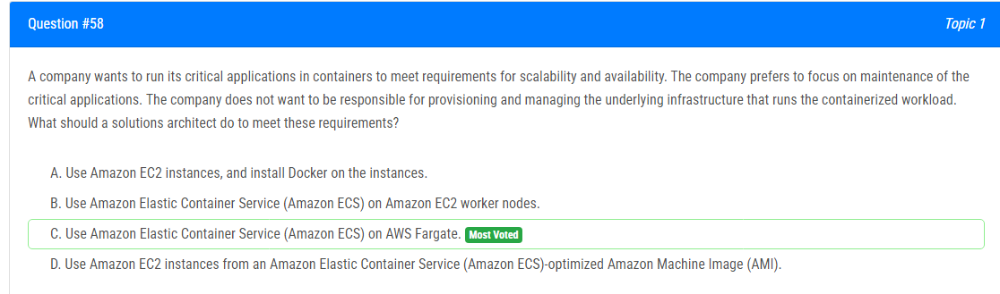
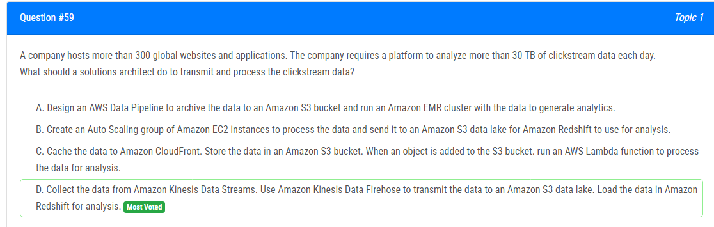
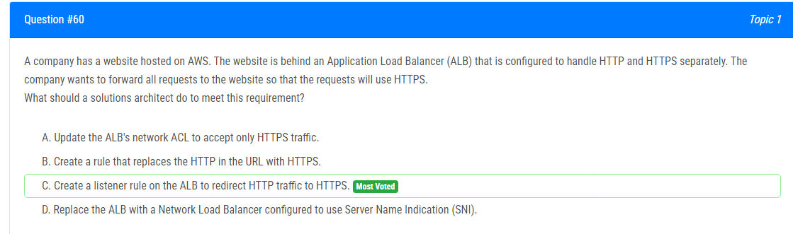

해설:

정답 B, D.

B : Amazon Simple Email Service (Amazon SES)를 사용하여 데이터를 형식화하고 이메일로 보고서를 전송합니다. 
D : Amazon EventBridge (Amazon CloudWatch Events) 예약된 이벤트를 만들어 애플리케이션의 API에서 데이터를 검색하기 위해 AWS Lambda 함수를 호출합니다. 

A, C 및 E 옵션은 원하는 결과를 얻기 위해 필요하지 않습니다. 옵션 A는 주로 실시간 스트리밍 데이터 수집 및 데이터 레이크 또는 분석 서비스로 전송에 사용됩니다. Glue (C)는 완전히 관리되는 추출, 변환 및 로드 (ETL) 서비스로 이 시나리오에 지나친 복잡성을 추가할 수 있습니다. S3에 애플리케이션 데이터를 저장하고 SNS (E)을 사용하는 것은 대안일 수 있지만 불필요한 복잡성을 추가합니다.

따라서 B와 D 옵션을 선택하여 Amazon SES를 사용하여 데이터를 형식화하고 이메일로 보고서를 전송하며, Amazon EventBridge 예약된 이벤트를 사용하여 Lambda 함수를 호출하여 API에서 데이터를 검색합니다.

해설:

정답 C.

EFS는 쉽게 여러 EC2에 마운트할 수 있는 확장 가능하고 완전히 관리되는 파일 시스템을 제공합니다. 데이터 크기에 따라 자동으로 확장되므로 표준 파일 시스템이 필요한 회사의 요구 사항과 일치합니다.

A : 컨테이너 오케스트레이션을 위해 ECS를 사용하고 저장에는 S3를 사용하는 것을 제안합니다. ECS는 기본 파일 시스템 저장 솔루션을 제공하지 않습니다. S3는 객체 저장 서비스이며 표준 파일 시스템 구조에 가장 적합한 옵션이 아닐 수 있습니다.

B : 컨테이너 오케스트레이션을 위해 EKS를 사용하고 저장에는 EBS를 사용하는 것을 제안합니다. A와 유사하게 EBS는 블록 저장소이며 파일 시스템 액세스에 최적화되어 있지 않습니다. EKS는 컨테이너를 관리할 수 있지만 특별히 파일 저장소 요구를 해결하지는 않습니다.

D : 저장에 EBS를 사용하여 EC2를 사용하는 것을 제안합니다. EBS는 EC2를 위한 블록 저장소를 제공할 수 있지만 EFS와 같이 확장 가능한 파일 시스템 솔루션을 본질적으로 제공하지 않습니다. EBS 볼륨을 수동으로 관리하고 프로비저닝해야 할 수 있으며 이는 운영 오버헤드를 도입할 수 있습니다.

해설: 

정답 C.

10년 동안 레코드를 삭제하지 못하게 하려면 S3 Object Lock 기능을 활용할 수 있습니다. 이를 compliance 모드로 설정하여 객체에 보존 기간을 설정하면 관리 사용자 및 루트 사용자를 포함한 모든 사용자가 레코드를 삭제할 수 없습니다.

A: S3 Glacier는 장기 보관에 적합하지만 1년 동안 즉시 액세스를 제공하지 않을 수 있습니다.

B: Intelligent-Tiering은 오랜 기간에 걸친 가장 비용 효과적인 아카이빙 저장 옵션을 제공하지 않을 수 있습니다. 10년 후 IAM 정책을 변경하여 삭제를 허용하면 수동 단계와 잠재적인 인간 오류가 발생할 수 있습니다.

D: S3 One Zone-IA는 비용 절감을 제공할 수 있지만 장기 보존에 대한 S3 Glacier Deep Archive와 동일한 수준의 강건성을 제공하지 않습니다.

해설: 

정답 C.

FSx for Windows는 Windows용으로 완전히 관리되는 SMB 파일 공유를 제공하며 Windows 클라이언트에서 액세스할 수 있습니다.
기존 Windows 파일 공유를 사용자에게 영향을주지 않고 FSx 공유로 원활하게 마이그레이션할 수 있습니다.
Multi-AZ 구성은 파일 저장을 위한 고가용성 및 내구성을 제공합니다.
사용자는 SMB를 통해 동일한 방식으로 파일에 계속 액세스할 수 있습니다.
Windows 워크로드에 최적화되어 있으며 사용자 할당량, ACL, AD 통합과 같은 기능을 제공합니다.
데이터는 SSD에 저장되며 내구성을 위한 자동 백업이 제공됩니다.

해설:

정답 C.

프라이빗 서브넷에 할당된 보안 그룹에서 수신 트래픽을 허용하면 RDS 데이터베이스에 액세스 할 수 있는 것은 해당 보안 그룹에 할당된 EC2 인스턴스뿐입니다. 보안 그룹을 DB에 연결하여 특정 보안 그룹에 속한 인스턴스만이 액세스할 수 있도록 제한합니다.

A: 이 접근 방식은 VPC 내에서 라우팅을 제어하는 데 도움이 될 수 있지만 EC2 인스턴스와 RDS 데이터베이스 간의 특정 액세스 요구 사항을 해결하지 않습니다.

B: 보안 그룹에서 들어오는 트래픽을 거부하는 규칙을 사용하면 복잡성과 잠재적인 잘못된 구성으로 이어질 수 있습니다. 일반적으로 액세스 권한을 명시적으로 정의하기 위해 허용 규칙을 사용하는 것이 권장됩니다.

D: 피어링 연결은 다른 VPC 또는 다른 지역의 VPC 간의 통신을 가능하게 하며 동일한 VPC 내의 서브넷 간의 액세스를 제한하는 데 필요하지 않습니다.

해설:

정답 C.
C가 맞는 해결책입니다.

API Gateway에서 HTTPS를 사용하여 사용자 정의 도메인 이름을 사용하려면 다음 단계를 따라야 합니다.

API Gateway 엔드포인트: Regional이어야 합니다. Regional 엔드포인트는 특정 AWS 리전과 연결되어 있으며, ACM(인증서 관리자) 인증서가 동일한 리전에서 요청되어야 하는 요구 사항과 일치합니다.

ACM 인증서: HTTPS에 사용되는 ACM 인증서는 API Gateway 엔드포인트가 있는 동일한 AWS 리전에서 요청되어야 합니다. 이는 올바른 연결과 기능을 위한 중요한 요소입니다.

사용자 정의 도메인 매핑: ACM 인증서를 획득한 후 사용자 정의 도메인 이름을 API Gateway 도메인 이름 하위에서 Regional API 엔드포인트에 매핑합니다. 이렇게 하면 API가 사용자 정의 도메인을 통해 액세스할 수 있게 됩니다.

Route 53 구성: Route 53을 구성하여 트래픽을 API Gateway 리전 도메인으로 라우팅합니다. Route 53을 사용하면 사용자 정의 도메인을 API Gateway 엔드포인트에 매핑할 수 있습니다.

인증서 첨부: ACM 인증서를 API Gateway 도메인 이름에 첨부합니다. 이 단계는 HTTPS를 활성화하여 클라이언트와 API Gateway 간의 통신을 안전하게 보호하는 데 필수적입니다.

A: 스테이지 변수를 사용하고 ACM에 인증서를 가져오는 것만으로는 API Gateway 엔드포인트에 사용자 지정 도메인 및 인증서를 연결하는 요구 사항을 충족시키기에는 충분하지 않습니다.

B: ACM에 인증서를 가져오긴 하지만 리전별 API Gateway나 해당 리전에 대한 언급이 없어요.

D: 리전별 API Gateway에 대한 인증서를 us-east-1 리전에서 가져오는 것은 문제를 일으킬 수 있습니다. 또한 API Gateway 엔드포인트에 도메인 이름과 인증서를 어떻게 연결하는지에 대한 명확한 세부 정보가 제공되지 않습니다.

해설:

정답 B.

이러한 요구 사항을 충족하기 위한 최적의 솔루션은 옵션 B입니다. Amazon Rekognition을 사용하여 부적절한 콘텐츠를 감지하고, 낮은 확신의 예측에 대해서는 인간 검토를 사용합니다.

Amazon Rekognition은 사전 훈련된 라벨 감지 모델을 사용하여 이미지에서 부적절한 콘텐츠를 감지할 수 있는 클라우드 기반 이미지 및 비디오 분석 서비스입니다. 명시적 또는 암시적인 성인 콘텐츠, 폭력적인 콘텐츠, 모욕적인 언어 등 다양한 부적절한 콘텐츠를 식별할 수 있습니다. 서비스는 높은 정확도와 낮은 지연 시간을 제공하여 이러한 사용 사례에 적합합니다.

다른 옵션들에 대한 간략한 설명:

A: Amazon Comprehend는 텍스트를 분석하는 서비스로 이미지에 부적절한 콘텐츠를 감지하는 데는 적합하지 않습니다.

C: Amazon SageMaker를 사용하여 부적절한 콘텐츠를 감지하려면 맞춤형 머신 러닝 모델을 구축하고 교육해야 하므로 상당한 개발 노력이 필요합니다.

D: AWS Fargate를 사용하여 맞춤형 머신 러닝 모델을 배포하는 것은 큰 개발 노력과 레이블이 지정된 대규모 이미지 데이터셋이 필요할 수 있습니다.

요약하면 이미지에서 부적절한 콘텐츠를 감지하기 위해 Amazon Rekognition을 사용하고, 낮은 확신의 예측에 대해서는 인간 검토를 통해 모든 부적절한 콘텐츠를 식별할 수 있도록 하는 것이 가장 효과적인 솔루션입니다.

해설:

정답 C.

이러한 요구 사항을 충족하기 위한 최적의 솔루션은 옵션 C입니다. Amazon Elastic Container Service (Amazon ECS)를 AWS Fargate에서 사용하는 것입니다.

AWS Fargate는 서버 관리 없이 애플리케이션을 구축할 수 있도록 하는 서버리스 및 비용 청구형 컴퓨트 엔진입니다. AWS Fargate는 Amazon Elastic Container Service (ECS) 및 Amazon Elastic Kubernetes Service (EKS)와 호환됩니다.

A: 이 옵션은 EC2 인스턴스를 수동으로 프로비저닝 및 관리해야 하며, 해당 인스턴스에 Docker를 설치 및 구성해야 합니다. 이는 기본 인프라 관리 및 유지 관리에 대한 추가적인 부담과 책임을 초래합니다.

B: 이 옵션은 ECS를 사용하여 컨테이너를 관리하지만, 여전히 워커 노드로 사용될 EC2를 프로비저닝하고 관리해야 합니다. Fargate의 서버리스 특성에 비해 복잡성과 유지 관리 부담이 더 많이 발생합니다.

D: 이 옵션은 여전히 EC2를 관리하며, ECS에서 실행할 EC2를 설정하는 과정을 간소화하는 ECS 최적화된 AMI를 사용하지만, Fargate에서 제공하는 서버리스 추상화 및 관리 용이성 수준을 제공하지 않습니다.

요약하면 AWS Fargate에서 Amazon Elastic Container Service (Amazon ECS)를 사용하는 것이 서버리스 추상화와 인프라 관리의 용이성을 제공하는 가장 효과적인 솔루션입니다.

해설:

정답 D.

이러한 시나리오에서 클릭스트림 데이터를 전송하고 처리하기 위한 가장 적절한 솔루션은 옵션 D입니다.

Amazon Kinesis Data Streams은 고도로 확장 가능하고 내구성 있는 서비스로, 고용량 및 고속의 스트리밍 데이터를 실시간으로 처리할 수 있게 해줍니다. Kinesis Data Streams를 사용하여 클릭스트림 데이터를 실시간으로 수집 및 처리할 수 있습니다.

Amazon Kinesis Data Firehose는 데이터를 데이터 저장소 및 분석 도구로 로드하는 완전히 관리되는 서비스입니다. Kinesis Data Firehose를 사용하여 Kinesis Data Streams에서 데이터를 Amazon S3 데이터 레이크로 전송할 수 있습니다.

데이터가 데이터 레이크에 있으면 Amazon Redshift를 사용하여 데이터를 로드하고 분석을 수행할 수 있습니다. Amazon Redshift는 SQL 및 기존 비즈니스 인텔리전스 도구를 사용하여 데이터를 신속하게 효율적으로 분석할 수 있는 완전히 관리되는 페타바이트 규모의 데이터 웨어하우스 서비스입니다.

A: AWS Data Pipeline을 사용하여 데이터를 Amazon S3 버킷에 아카이빙하고 Amazon EMR 클러스터에서 데이터를 실행하여 분석을 생성하는 것은 데이터의 실시간 처리를 포함하지 않기 때문에 가장 적절한 솔루션이 아닙니다.

B: 데이터를 처리하기 위해 Amazon EC2 인스턴스의 Auto Scaling 그룹을 만들고 데이터를 처리한 후 Amazon S3 데이터 레이크로 전송하는 것은 전송 레이어에서 데이터 레이크로 데이터를 완전히 관리되는 서비스를 사용하지 않기 때문에 가장 적절한 솔루션이 아닙니다.

C: 데이터를 Amazon CloudFront에 캐시하고 데이터를 Amazon S3 버킷에 저장하며 S3 버킷에 개체가 추가될 때 AWS Lambda 함수를 실행하여 데이터를 처리하는 것은 실시간으로 데이터를 수집하고 처리하는 확장 가능하고 내구성 있는 서비스를 포함하지 않기 때문에 가장 적절한 솔루션이 아닙니다.

해설:

정답 C.

모든 요청을 웹사이트로 전달하여 요청이 HTTPS를 사용하도록 하는 요구 사항을 충족시키기 위해 솔루션 아키텍트는 ALB에 HTTP 트래픽을 HTTPS로 리디렉션하는 리스너 규칙을 생성할 수 있습니다. 이는 모든 HTTP 트래픽을 일치시키는 조건과 해당 트래픽을 HTTPS 리스너로 리디렉션하는 규칙 액션을 가진 규칙을 생성함으로써 수행할 수 있습니다. HTTPS 리스너는 이미 HTTPS 트래픽을 수락하고 대상 그룹으로 전달하도록 구성되어 있어야 합니다.

A : ALB의 네트워크 ACL을 업데이트하여 HTTPS 트래픽만 수락하도록 하는 것은 유효한 솔루션이 아닙니다. 네트워크 ACL은 서브넷 레벨에서 들어오는 및 나가는 트래픽을 제어하는 데 사용되며 리스너 레벨에서는 사용되지 않습니다.

B : URL에서 HTTP를 HTTPS로 대체하는 규칙을 생성하는 것은 유효한 솔루션이 아닙니다. 이것은 트래픽을 HTTPS 리스너로 리디렉션하지 않을 것입니다.

D : Server Name Indication (SNI)을 사용하도록 구성된 Network Load Balancer로 ALB를 교체하는 것은 유효한 솔루션이 아닙니다. 이것은 HTTP 트래픽을 HTTPS로 리디렉션하는 요구 사항을 해결하지 않을 것입니다.