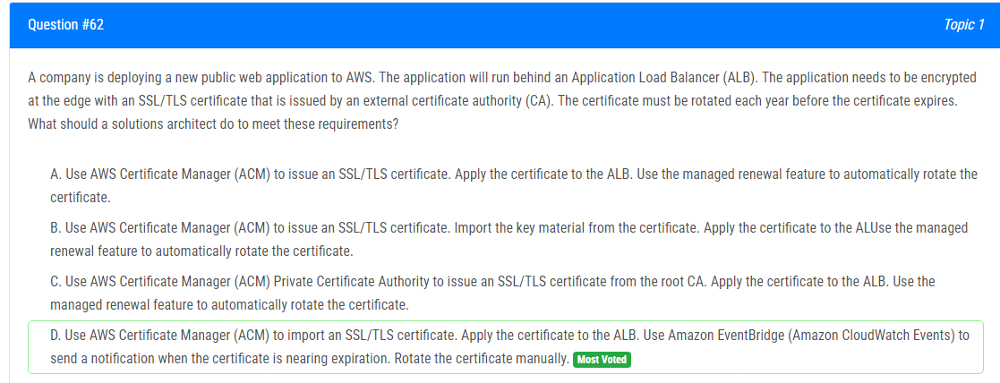
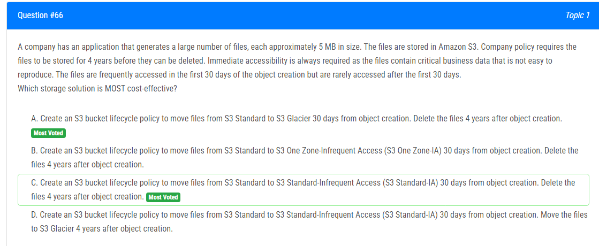
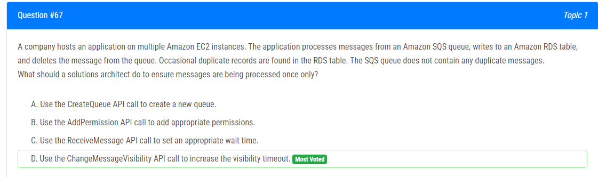
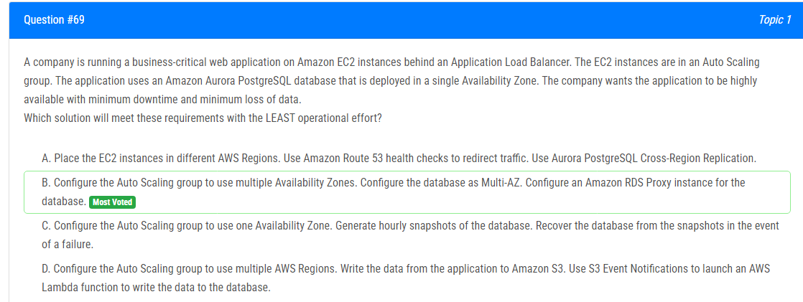
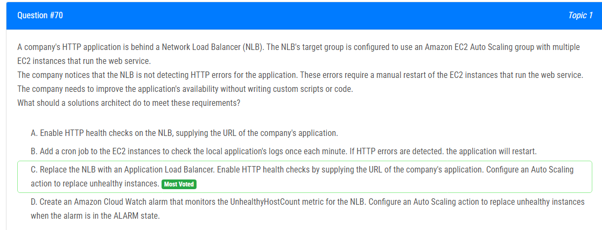
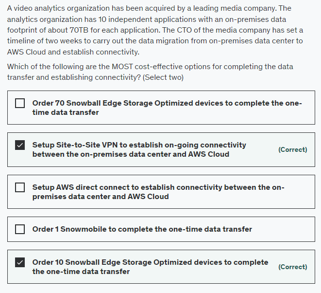
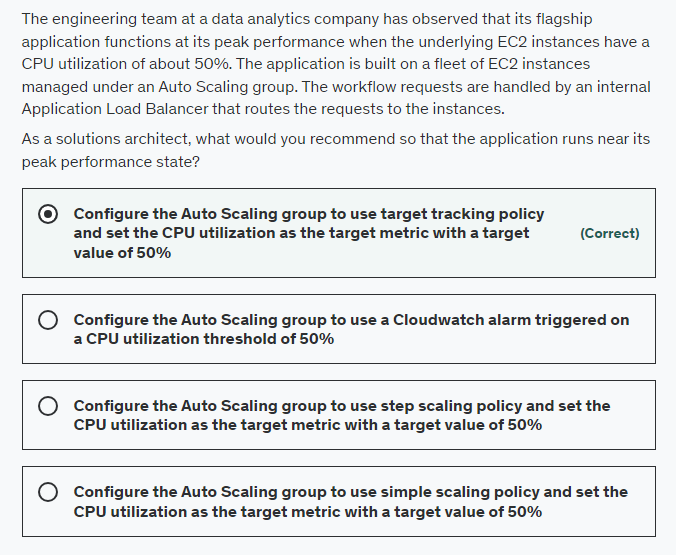

해설:

정답 C.

Amazon S3 Transfer Acceleration을 사용하여 S3 전송 가속을 통해 파일을 업로드하려면 다음과 같은 단계를 따를 수 있습니다.

1. 필요한 라이브러리 또는 SDK 설치:
   AWS SDK나 클라이언트 라이브러리를 사용하여 S3 전송 가속을 활성화한 환경에서 업로드를 수행합니다.

2. AWS 계정 및 자격 증명 구성:
   AWS 계정 및 자격 증명을 구성하여 업로드 권한을 얻습니다.

3. 파일 분할 및 전송 가속 활성화:
   파일을 여러 부분으로 나누어 multipart 업로드를 수행하고, 이때 전송 가속을 활성화하여 최적의 네트워크 경로를 활용합니다.

4. 업로드 수행:

```python
import boto3
from botocore.exceptions import NoCredentialsError

# AWS 자격 증명 및 S3 클라이언트 생성
s3 = boto3.client('s3', region_name='your-region', aws_access_key_id='your-access-key-id',
                  aws_secret_access_key='your-secret-access-key', use_accelerate_endpoint=True)

# 업로드할 파일 설정
file_path = 'path/to/your/file.zip'
bucket_name = 'your-s3-bucket'

# 업로드 수행
try:
    # Multipart 업로드 시작
    response = s3.create_multipart_upload(Bucket=bucket_name, Key='your-object-key')

    # 파일을 여러 부분으로 나누기
    part_info = s3.upload_file(file_path, bucket_name, 'your-object-key',
                                ExtraArgs={'StorageClass': 'STANDARD_IA'},
                                Callback=lambda x: print(f"Uploading: {x}"))

    # 각 부분 별 업로드 수행
    parts = []
    for i in range(1, part_info['parts'] + 1):
        parts.append({'PartNumber': i, 'ETag': 'your-etag'})

    # Multipart 업로드 완료
    s3.complete_multipart_upload(Bucket=bucket_name, Key='your-object-key',
                                 UploadId=response['UploadId'], MultipartUpload={'Parts': parts})
    print("Upload successful")

except FileNotFoundError:
    print("The file was not found")
except NoCredentialsError:
    print("Credentials not available")
except Exception as e:
    print(f"Error: {e}")
```

위의 코드에서 'your-region', 'your-access-key-id', 'your-secret-access-key', 'your-s3-bucket', 'your-object-key' 등은 실제 AWS 계정 및 S3 환경에 맞게 수정해야 합니다. 또한, 필요에 따라 StorageClass 및 기타 설정을 조정할 수 있습니다.



해설:

정답 C, E.

올바른 옵션:

E : 특권 있는 사용자에 대한 MFA 활성화 - AWS의 최상의 관행에 따라 특권 있는 사용자들에 대해 MFA(Multi Factor Authentication)를 활성화하는 것이 좋습니다. MFA는 MFA 활성화된 모바일 장치나 하드웨어 MFA 토큰을 통해 이루어집니다.

C : 모든 계정 활동을 기록하기 위해 AWS CloudTrail 구성 - AWS는 모든 IAM 작업을 모니터링하고 감사 목적으로 CloudTrail을 켜는 것을 권장합니다.

부적절한 옵션:

D : 최소한의 계정 생성 후 해당 계정 자격 증명을 직원들 간에 공유 - AWS는 사용자 계정 자격 증명을 공유하지 말아야 하며, 따라서 이 옵션은 올바르지 않습니다.

B : 권한을 다시 할당하지 않기 위해 최대한의 권한 부여 - AWS는 특정 작업을 완료하는 데 필요한 최소한의 권한을 부여하고 과도한 권한을 부여하지 말라고 권장하므로, 이 옵션은 올바르지 않습니다.

A : Amazon EC2 인스턴스에 대한 특정 권한을 부여하기 위해 사용자 자격 증명 사용 - 서로 다른 AWS 서비스에서 작동하는 EC2 인스턴스에 대한 액세스 권한을 부여하기 위해 역할을 사용하는 것이 권장되므로, 이 옵션은 올바르지 않습니다.


해설:

올바른 옵션:

```json
{
    "Action": [
        "s3:DeleteObject"
    ],
    "Resource": [
        "arn:aws:s3:::example-bucket/*"
    ],
    "Effect": "Allow"
}
```

정책문의 주요 구성 요소는 다음과 같습니다:

1. **Effect (효과):** 정책문이 수행될 때 동작을 Allow(허용) 또는 Deny(거부) 중 하나로 지정합니다. 여기에서는 Allow가 정의되어 있습니다.

2. **Action (동작):** 입력된 Effect에 따라 실행이 허용되거나 거부될 특정 동작 또는 동작들을 설명합니다. API 동작은 각 서비스에 고유합니다. 여기에서는 DeleteObject가 정의되어 있습니다.

3. **Resource (리소스):** 정책이 적용되는 자원을 Amazon Resource Name (ARN) 형식으로 지정합니다. 여기에서는 S3 버킷이나 객체와 같은 리소스를 나타내기 위해 "arn:aws:s3:::example-bucket/*"가 정의되어 있습니다.

이 정책은 해당 그룹에 대한 S3 버킷 자원의 삭제 권한을 제공합니다.


해설:

정답 C.

Amazon Kinesis Data Firehose는 스트리밍 데이터를 데이터 저장소 및 분석 도구로로드하는 가장 간편한 방법입니다. 이는 스트리밍 데이터를 Amazon S3, Amazon Redshift, Amazon Elasticsearch Service 및 Splunk으로 캡처, 변환 및로드할 수 있으며, 기존의 비즈니스 인텔리전스 도구 및 대시 보드를 사용하여 거의 실시간 분석을 지원합니다. 이는 데이터의 처리량에 자동으로 맞추어 확장되는 완전히 관리되는 서비스로서 지속적인 관리가 필요하지 않습니다. 이는 데이터를로드하기 전에 데이터를 일괄로 처리하고 압축하며 암호화할 수도 있어 목적지에서 사용되는 저장소 양을 최소화하고 보안을 높일 수 있습니다.

올바른 옵션은 Kinesis Data Firehose에 데이터를 적재하고 Lambda 함수를 사용하여 입력 데이터를 필터링 및 변환한 다음 결과를 S3에 저장하는 것입니다. 이렇게하면 모델에 필요한 관련 데이터 속성 만 포함 된 데이터의 슬라이스 버전을 저장해야합니다. 또한이 솔루션은 완전한 서버리스이며 인프라 유지 관리가 필요하지 않습니다.





해설:

정답 B, D.

인스턴스를 Standby 상태로 전환한 후 유지 보수 패치를 적용하여 인스턴스를 업데이트할 수 있습니다. 인스턴스가 준비되면 Standby 상태를 종료하고 인스턴스를 서비스로 다시 반환할 수 있습니다. Standby 상태로 전환된 인스턴스는 여전히 Auto Scaling 그룹의 일부이지만 애플리케이션 트래픽을 활성적으로 처리하지 않습니다.

또 다른 옵션으로는 Auto Scaling 그룹에 대해 ReplaceUnhealthy 프로세스 유형을 일시 중지하고 유지 보수 패치를 인스턴스에 적용할 수 있습니다. 인스턴스가 준비되면 인스턴스의 건강 상태를 수동으로 다시 건강하게 설정하고 다시 ReplaceUnhealthy 프로세스 유형을 활성화할 수 있습니다. ReplaceUnhealthy 프로세스는 건강하지 않은 것으로 표시된 인스턴스를 종료하고 그들을 대체하기 위해 새로운 인스턴스를 생성합니다. EC2 Auto Scaling은 건강하지 않은 것으로 표시된 인스턴스를 대체 중지합니다. EC2 또는 Elastic Load Balancing 건강 점검에서 실패한 인스턴스는 여전히 건강하지 않은 것으로 표시됩니다. ReplaceUnhealthly 프로세스를 다시 시작하면 이 프로세스가 일시 중지된 동안 건강하지 않은 것으로 표시된 인스턴스를 대체합니다.


해설:

정답 C.

올바른 옵션:

**Path-based Routing (경로 기반 라우팅)**

Elastic Load Balancing은 자동으로 여러 대상(Amazon EC2 인스턴스, 컨테이너, IP 주소 및 Lambda 함수 등)에 들어오는 응용 프로그램 트래픽을 분산합니다.

만약 여러 개별 서비스로 구성된 애플리케이션을 보유하고 있다면, Application Load Balancer는 요청의 내용을 기반으로 서비스로 요청을 라우팅할 수 있습니다. 다양한 유형은 다음과 같습니다.

- **Host-based Routing (호스트 기반 라우팅):** HTTP 헤더의 Host 필드를 기반으로 클라이언트 요청을 라우팅하여 동일한 로드 밸런서에서 여러 도메인으로 라우팅할 수 있습니다.

- **Path-based Routing (경로 기반 라우팅):** HTTP 헤더의 URL 경로를 기반으로 클라이언트 요청을 라우팅할 수 있습니다.

- **HTTP header-based Routing (HTTP 헤더 기반 라우팅):** 표준 또는 사용자 지정 HTTP 헤더의 값을 기반으로 클라이언트 요청을 라우팅할 수 있습니다.

- **HTTP method-based Routing (HTTP 메서드 기반 라우팅):** 표준 또는 사용자 지정 HTTP 메서드를 기반으로 클라이언트 요청을 라우팅할 수 있습니다.

- **Query string parameter-based Routing (쿼리 문자열 매개변수 기반 라우팅):** 쿼리 문자열이나 쿼리 매개변수를 기반으로 클라이언트 요청을 라우팅할 수 있습니다.

- **Source IP address CIDR-based Routing (소스 IP 주소 CIDR 기반 라우팅):** 요청이 발생한 소스 IP 주소의 CIDR을 기반으로 클라이언트 요청을 라우팅할 수 있습니다.

경로 기반 라우팅 개요:

경로 패턴을 사용하여 요청을 경로 기반 라우팅으로 라우팅하는 규칙을 정의할 수 있습니다. 경로 패턴은 URL의 경로에만 적용되며 쿼리 매개변수에는 적용되지 않습니다.



해설:

정답 D, E.

Amazon CloudFront은 안전하게 데이터, 비디오, 응용 프로그램 및 API를 전 세계 고객에게 저지연 시간, 높은 전송 속도로 개발자 친화적인 환경에서 안전하게 제공하는 빠른 콘텐츠 전송 네트워크(CDN) 서비스입니다.

CloudFront의 포인트 오브 프레선스 (POP) 또는 엣지 위치는 인기 있는 콘텐츠를 빠르게 뷰어에게 제공할 수 있도록 보장합니다. CloudFront에는 리전 엣지 캐시도 있어서 콘텐츠가 POP에 머무르기에는 인기가 충분하지 않더라도 콘텐츠를 뷰어에게 더 가깝게 가져올 수 있어 성능을 향상시킬 수 있습니다.

동적 콘텐츠(요청 시간에 결정되는 캐시 동작이 모든 헤더를 전달하도록 구성됨)은 리전 엣지 캐시를 통과하지 않고 직접 오리진으로 이동합니다. 따라서 이 옵션은 올바릅니다.

프록시 메서드 PUT/POST/PATCH/OPTIONS/DELETE는 POP에서 오리진으로 직접 이동하며 리전 엣지 캐시를 통과하지 않습니다. 따라서 이 옵션도 올바릅니다.



해설:

정답 A.

Consolidated billing(통합 빌링)이 활성화되지 않았습니다. 모든 AWS 계정은 월별 요금이 한 번만 청구되도록 하나의 통합 빌링에 속해야 합니다. - 여러 AWS 계정이 있는 경우 AWS Shield Advanced를 사용하려면 각 계정에서 AWS Management Console 또는 API를 사용하여 개별적으로 활성화해야 합니다. AWS 계정이 모두 하나의 통합 빌링에 속하고 해당 계정과 리소스를 모두 소유하는 한 월별 요금을 한 번만 지불하게 됩니다.

잘못된 옵션들:

1. AWS Shield Advanced가 AWS 클라우드의 일부가 아닌 사용자 정의 서버에 사용되어 비용이 증가함 - AWS Shield Advanced는 AWS 외부의 리소스에도 보호를 제공합니다. 이로 인해 예상치 못한 청구 비용 증가가 발생하지 않아야 합니다.

2. AWS Shield Advanced가 AWS Shield Standard 플랜을 커버하고 비용이 증가함 - AWS Shield Standard는 모든 AWS 고객에게 추가 비용 없이 자동으로 활성화됩니다. AWS Shield Advanced는 선택 사항으로 추가 비용이 발생합니다.

3. 모든 AWS 계정에 대해 AWS Shield Advanced 서비스에 대한 Savings Plans가 활성화되지 않았음 - 이 옵션은 주의를 돌리기 위해 추가되었습니다. Savings Plans는 EC2, Lambda 및 Fargate 사용에 대한 저렴한 가격을 제공하며 1 또는 3년 동안 일관된 사용량(시간당 $ 기준)에 대한 약속과 교환으로 제공됩니다. Savings Plans는 AWS Shield Advanced 서비스에 적용되지 않습니다.


해설:

정답 D, E.

객체 버전에 보존 기간을 명시적으로 적용하면 해당 객체 버전에 대해 Retain Until Date(보존 기간 만료일)를 지정합니다. 객체 버전에 보존 기간을 명시적으로 적용하면 해당 객체 버전의 메타데이터에 Retain Until Date 설정을 저장하고, 보존 기간이 만료될 때까지 해당 객체 버전을 보호합니다.

객체에 대한 보존 기간은 명시적으로 설정하거나 버킷 기본 설정을 통해 적용할 수 있습니다. 객체 버전에 보존 기간을 명시적으로 적용할 때는 해당 객체 버전에 대해 Retain Until Date를 지정합니다. Amazon S3는 Retain Until Date 설정을 객체 버전의 메타데이터에 저장하고 보존 기간이 만료될 때까지 해당 객체 버전을 보호합니다.

단일 객체의 다른 버전은 서로 다른 보존 모드 및 기간을 가질 수 있습니다. 보존 기간은 다른 객체 버전에도 적용되며 각 객체 버전에 대해 별도로 설정됩니다.

예를 들어, 30일의 보존 기간 중인 객체 버전이 있고, 동일한 이름의 객체를 60일의 보존 기간으로 Amazon S3에 PUT한다고 가정해 봅시다. 이 경우 PUT은 성공하고 Amazon S3는 60일의 보존 기간을 가진 객체의 새 버전을 생성합니다. 이전 버전은 원래의 보존 기간을 유지하며 15일 후에 삭제 가능 상태가 됩니다.


해설:

정답 D, E.

DynamoDB Accelerator (DAX) - Amazon DynamoDB Accelerator (DAX)는 DynamoDB의 완전 관리형이고 고가용성을 갖춘 인메모리 캐시로, 초당 수백만 건의 요청에서도 밀리초에서 마이크로초까지 최대 10배의 성능 향상을 제공합니다. DAX는 DynamoDB 테이블에 인메모리 가속을 추가하기 위해 필요한 모든 작업을 처리하며, 개발자가 캐시 무효화, 데이터 채우기 또는 클러스터 관리를 관리하지 않아도 됩니다. 따라서 이는 올바른 옵션입니다.

ElastiCache - Amazon ElastiCache for Memcached는 Amazon RDS나 Amazon DynamoDB와 같은 데이터 스토어의 이상적인 프론트엔드로, 극도로 높은 요청률이나 낮은 지연 요구 사항을 가진 응용 프로그램에 대한 고성능 미들 티어를 제공합니다. 따라서 이 또한 올바른 옵션입니다.


해설:

정답 D.

Instance Store를 기반으로 하는 EC2 인스턴스 사용

인스턴스 스토어는 인스턴스에 대한 임시 블록 레벨 스토리지를 제공합니다. 이 스토리지는 호스트 인스턴스에 물리적으로 연결된 디스크에 위치해 있습니다. 인스턴스 스토어는 버퍼, 캐시, 스크래치 데이터 및 기타 임시 콘텐츠와 같이 자주 변경되는 정보를 일시적으로 저장하거나 웹 서버의 로드 밸런스 풀과 같이 여러 인스턴스로 복제되는 데이터와 같은 경우에 이상적입니다. 인스턴스 스토어 볼륨은 인스턴스 사용 비용의 일부로 제공됩니다.

인스턴스 스토어 기반의 볼륨은 낮은 비용으로 높은 랜덤 I/O 성능을 제공하며 (저장소는 인스턴스 사용 비용의 일부로 제공되므로), 견고한 아키텍처가 모든 인스턴스의 손실에 대한 조정을 수행할 수 있기 때문에 이러한 사용 사례에 대해 인스턴스 스토어 기반의 EC2 인스턴스를 사용해야 합니다.


해설:

정답 A.

API Gateway는 상태를 저장하지 않는 클라이언트-서버 통신을 가능하게 하는 RESTful API를 생성하며 또한 WebSocket 프로토콜을 준수하는 WebSocket API를 생성하여 클라이언트와 서버 간의 상태 유지 및 양방향 통신을 지원합니다.

Amazon API Gateway는 개발자가 어떠한 규모에서든 API를 쉽게 생성, 게시, 유지 관리, 모니터링 및 보안 설정할 수 있게 해주는 완전 관리형 서비스입니다. API는 애플리케이션이 백엔드 서비스의 데이터, 비즈니스 로직 또는 기능에 액세스할 수 있는 출입구 역할을 합니다. API Gateway를 사용하면 RESTful API 및 WebSocket API를 생성하여 실시간 양방향 통신 애플리케이션을 구현할 수 있습니다.

API Gateway는 다음과 같은 RESTful API를 생성합니다:

- HTTP 기반.
- 상태를 저장하지 않는 클라이언트-서버 통신을 가능하게 함.
- GET, POST, PUT, PATCH, DELETE와 같은 표준 HTTP 메서드를 구현함.

또한 API Gateway는 다음과 같은 WebSocket API를 생성합니다:

- WebSocket 프로토콜을 준수하며 클라이언트와 서버 간의 상태 유지 및 양방향 통신을 가능하게 함. 메시지 내용을 기반으로 들어오는 메시지를 라우팅함.

따라서 API Gateway는 상태를 저장하지 않는 RESTful API뿐만 아니라 상태를 유지하는 WebSocket API도 지원합니다. 따라서 이 옵션은 올바릅니다.


해설:

정답 D.

Amazon GuardDuty를 사용하여 Amazon S3에 저장된 데이터의 악성 활동을 지속적으로 모니터링하십시오. Amazon Inspector에서 제공하는 보안 평가를 사용하여 Amazon EC2 인스턴스의 취약점을 확인하십시오.

Amazon GuardDuty는 AWS 계정, 워크로드 및 Amazon S3에 저장된 데이터를 지속적으로 모니터링하고 보호할 수 있도록 하는 위협 탐지 서비스를 제공합니다. GuardDuty는 AWS CloudTrail 이벤트, Amazon VPC Flow Logs 및 DNS Logs에서 생성된 계정 및 네트워크 활동의 연속적인 스트림을 분석합니다. 또한 알려진 악성 IP 주소, 이상 감지 및 머신 러닝과 같은 통합된 위협 지능을 사용하여 보다 정확하게 위협을 식별합니다.

Amazon Inspector 보안 평가를 사용하면 Amazon EC2 인스턴스의 의도하지 않은 네트워크 접근성 및 해당 인스턴스의 취약점을 확인할 수 있습니다. Amazon Inspector 평가는 일반적인 보안 모범 사례 및 취약점 정의에 매핑된 미리 정의된 규칙 패키지로 제공됩니다.

따라서 Amazon GuardDuty를 사용하여 Amazon S3에 저장된 데이터의 악성 활동을 모니터링하고 Amazon Inspector를 사용하여 EC2 인스턴스의 취약점을 확인하는 것은 AWS 환경의 보안 포지션을 강화하는 권장 방법입니다.


해설:

정답 D, E.

Route 53 기반 지리 위치 라우팅 정책을 사용하여 콘텐츠 배포를 소유 권한이 있는 위치로 제한하세요.

지리 위치 라우팅을 사용하면 사용자의 지리적 위치, 즉 DNS 쿼리가 발생한 위치를 기반으로 트래픽을 처리하는 리소스를 선택할 수 있습니다. 예를 들어, 모든 유럽에서의 쿼리를 Frankfurt 지역의 ELB 로드 밸런서로 라우팅하려고 할 수 있습니다. 또한 지리 위치 라우팅을 사용하여 소유 권한이 있는 위치로만 콘텐츠를 배포하도록 제한할 수 있습니다.

지역 제한을 사용하여 CloudFront 웹 배포를 통해 배포되는 콘텐츠에 대한 특정 지리적 위치의 사용자가 액세스하는 것을 방지할 수 있습니다.

지역 제한 또는 지오 블로킹으로 알려진 기능을 사용하여 CloudFront 웹 배포를 통해 배포되는 콘텐츠에 대한 특정 지리적 위치의 사용자가 액세스하는 것을 방지할 수 있습니다. 사용자가 콘텐츠를 요청하면 CloudFront는 일반적으로 사용자의 위치에 관계없이 요청된 콘텐츠를 제공합니다. 특정 국가의 사용자가 콘텐츠 액세스를 방지해야 하는 경우 CloudFront 지오 제한 기능을 사용하여 다음 중 하나를 수행할 수 있습니다: 허용 목록에 승인된 국가 중 하나에 위치한 경우에만 사용자가 콘텐츠에 액세스하도록 허용합니다. 금지 목록에 있는 국가 중 하나에 위치한 경우 사용자가 콘텐츠에 액세스하지 못하도록 방지합니다. 따라서 이 옵션 또한 올바릅니다.


해설:

정답 B.

Amazon Kinesis Data Streams - Amazon Kinesis Data Streams는 스트리밍 비대면 데이터를 실시간으로 처리할 수 있게 해줍니다. 레코드의 순서 지정과 동시에 여러 Amazon Kinesis 애플리케이션에서 동일한 순서로 레코드를 읽거나 다시 재생할 수 있는 기능을 제공합니다. Amazon Kinesis Client Library (KCL)은 동일한 파티션 키에 대한 모든 레코드를 동일한 레코드 프로세서에 제공하여 동일한 Amazon Kinesis 데이터 스트림에서 읽는 여러 애플리케이션을 구축하기를 쉽게 만듭니다(예: 카운팅, 집계 및 필터링 수행).

AWS는 다음과 유사한 요구 사항을 가진 사용 사례에 대해 Amazon Kinesis Data Streams를 권장합니다.

1. 관련된 레코드를 동일한 레코드 프로세서로 라우팅하는 경우(스트리밍 MapReduce와 같음). 예를 들어 동일한 키에 대한 모든 레코드가 동일한 레코드 프로세서로 라우팅되면 카운팅 및 집계가 간단해집니다.
2. 레코드의 순서가 필요한 경우. 예를 들어 응용 프로그램 호스트에서 처리/보관 호스트로 로그 데이터를 전송하면서 로그 문에서 순서를 유지하려는 경우.
3. 여러 애플리케이션이 동시에 동일한 스트림을 소비할 수 있는 경우. 예를 들어 실시간 대시 보드를 업데이트하는 응용 프로그램과 데이터를 Amazon Redshift에 아카이브하는 다른 응용 프로그램이 있습니다. 두 애플리케이션이 동일한 스트림에서 데이터를 동시에 독립적으로 소비할 수 있기를 원합니다.
4. 나중에 동일한 순서로 레코드를 소비할 수 있는 경우. 예를 들어 청구 응용 프로그램과 청구 응용 프로그램보다 몇 시간 뒤에 실행되는 감사 응용 프로그램이 있는 경우. Amazon Kinesis Data Streams는 데이터를 최대 365일까지 저장하므로 감사 응용 프로그램을 최대 365일 동안 청구 응용 프로그램보다 뒤로 실행할 수 있습니다.


해설:

정답 A, E.

ElastiCache Redis를 사용하여 온디맨드 라이브 리더보드를 구동하는 것이 올바른 옵션입니다. ElastiCache for Redis는 초미세초 레이턴시를 제공하여 인터넷 규모의 실시간 애플리케이션을 지원하는 빠른 인메모리 데이터 저장소입니다. Redis는 캐싱, 채팅/메시징, 게임 리더보드, 지리 공간, 머신 러닝, 미디어 스트리밍, 큐, 실시간 분석, 세션 저장소 등과 같은 실시간 트랜잭션 및 분석 처리에 이상적입니다. ElastiCache for Redis는 라이브 리더보드를 구동하는 데 사용될 수 있으므로 이 옵션이 올바릅니다.

반면에 DynamoDB와 DynamoDB Accelerator (DAX)를 사용하여 라이브 리더보드를 구동할 수도 있지만, 이는 주로 키-값 및 문서 데이터베이스로서의 성격을 가지고 있으며 초단위의 레이턴시를 제공합니다. DynamoDB 및 DAX는 일부 특정한 사용 사례에서 강력한 조합일 수 있지만, 라이브 리더보드와 같은 실시간 업데이트 및 낮은 레이턴시 요구 사항이 중점인 시나리오에 대해선 ElastiCache Redis가 더 적합합니다.


해설:

정답 D, E.

Amazon S3 Transfer Acceleration을 사용하여 대상 S3 버킷으로의 빠른 파일 업로드를 활성화하세요. Amazon S3 Transfer Acceleration은 클라이언트와 S3 버킷 간의 장거리 파일 전송을 빠르고 쉽고 안전하게 가능하게 합니다. Transfer Acceleration은 Amazon CloudFront의 전 세계적으로 분산된 엣지 위치를 활용합니다. 데이터가 엣지 위치에 도착하면 최적화된 네트워크 경로를 통해 데이터가 Amazon S3로 라우팅됩니다.

대상 S3 버킷으로의 더 빠른 파일 업로드를 위해 멀티파트 업로드를 사용하세요. 멀티파트 업로드를 사용하면 단일 객체를 여러 부분으로 업로드할 수 있습니다. 각 부분은 객체 데이터의 연속적인 부분입니다. 이러한 객체 부분을 독립적으로 어떤 순서로든 업로드할 수 있습니다. 부분 중 하나의 전송이 실패하면 다른 부분에 영향을 주지 않고 해당 부분을 다시 전송할 수 있습니다. 객체의 모든 부분이 업로드되면 Amazon S3는 이러한 부분을 조립하고 객체를 생성합니다. 일반적으로 객체 크기가 100MB에 도달하면 단일 작업으로 객체를 업로드하는 대신 멀티파트 업로드를 사용하는 것이 좋습니다. 멀티파트 업로드는 향상된 처리량을 제공하여 더 빠른 파일 업로드를 가능하게 합니다.


해설:

정답 C.

Amazon S3 버킷에 버전 관리를 활성화한 후에는 해당 버킷을 다시 비버전 상태로 되돌릴 수 없습니다. 버전 관리는 한 번 활성화되면 해당 버킷에 대해 지속적으로 적용되는 기능입니다.

만약 버전 관리를 일시적으로 "중단"하려면 버전 관리를 활성화한 다음 중단할 수 있습니다. 그러나 이렇게 하더라도 버킷은 여전히 버전 관리된 상태로 유지됩니다. 만약 버전 관리를 완전히 비활성화하고 모든 버전을 제거하려면 버킷을 삭제하고 버전 관리를 사용하지 않도록 설정한 후 다시 생성해야 합니다.


해설:

정답 C.

EC2 인스턴스는 클러스터 배치 그룹에 배치되어야 하며, 이를 통해 기본 워크로드가 낮은 네트워크 지연 시간과 높은 네트워크 처리량을 얻을 수 있습니다.

이 질문에서 이해해야 할 주요 사항은 HPC(고성능 컴퓨팅) 워크로드가 HPC 애플리케이션의 특성인 노드 간 긴밀한 통신에 필요한 낮은 지연 네트워크 성능을 달성해야 한다는 것입니다. 클러스터 배치 그룹은 동일한 가용 영역 내에서 인스턴스를 서로 가까이에 묶어둡니다. 이것은 낮은 네트워크 지연 시간, 높은 네트워크 처리량 또는 둘 다에 이점을 얻는 응용 프로그램에 권장됩니다. 따라서 이 옵션이 올바른 답입니다.


해설:

정답 A.

Amazon FSx for Lustre는 세계에서 가장 인기 있는 고성능 파일 시스템을 쉽고 비용 효율적으로 시작하고 실행할 수 있게 해줍니다. 이는 기계 학습, 고성능 컴퓨팅(HPC), 비디오 처리, 금융 모델링과 같은 워크로드에 사용됩니다. 오픈 소스 Lustre 파일 시스템은 빠른 스토리지가 필요한 애플리케이션을 위해 설계되었습니다. 여기서 스토리지가 계산과 함께 유지되어야 하는 경우에 사용됩니다. FSx for Lustre는 Amazon S3와 통합되어 Lustre 파일 시스템으로 데이터 세트를 처리하기 쉽게 만듭니다. S3 버킷에 연결된 경우 FSx for Lustre 파일 시스템은 S3 객체를 파일로 투명하게 제공하며 변경된 데이터를 S3로 다시 쓸 수 있습니다.

FSx for Lustre는 '핫 데이터'를 병렬 및 분산 방식으로 처리하고 '콜드 데이터'를 Amazon S3에 쉽게 저장할 수 있는 기능을 제공합니다. 따라서 이 옵션이 주어진 문제 설명에 가장 적합합니다.


해설:

정답 D.

Amazon API Gateway를 사용하여 Kinesis Data Analytics와 통합

Kinesis Data Analytics를 사용하여 Apache Flink로 실시간 스트리밍 데이터를 변환하고 분석할 수 있습니다. Kinesis Data Analytics를 사용하면 로그 분석, 클릭스트림 분석, 사물 인터넷(IoT), 광고 기술, 게임 등을 위한 엔드 투 엔드 스트림 처리 애플리케이션을 신속하게 구축할 수 있습니다. 가장 일반적인 네 가지 사용 사례는 스트리밍 추출 변환로드(ETL), 지속적인 메트릭 생성, 반응형 실시간 분석, 데이터 스트림의 대화형 쿼리입니다. Apache Flink 애플리케이션의 Kinesis Data Analytics는 Kinesis Processing Unit (KPU) 당 50 GB의 실행 애플리케이션 저장소를 제공합니다.

Amazon API Gateway는 API를 발행, 유지 관리, 모니터링 및 보안할 수 있는 완전히 관리되는 서비스입니다. Amazon API Gateway는 HTTP API 및 REST API를 생성하는 두 가지 옵션과 WebSocket API를 생성하는 옵션을 제공합니다.

해당 사용 사례에서 Amazon API Gateway를 사용하여 트럭에서 수신한 위치 데이터가 있는 요청을 처리하고 이를 백엔드의 Kinesis Data Analytics 애플리케이션으로 전송하는 REST API를 생성할 수 있습니다.


해설:

정답 A.

AWS WAF는 웹 응용 프로그램 방화벽 서비스로 웹 요청을 모니터하고 악성 요청으로부터 웹 응용 프로그램을 보호할 수 있게 해줍니다. AWS WAF를 사용하여 IP 주소와 같은 지정한 조건에 따라 요청을 차단하거나 허용할 수 있습니다. 또한 SQL 인젝션이나 크로스 사이트 스크립팅과 같은 일반적인 공격을 차단하는 데 사용할 수 있는 AWS WAF 사전 구성 보호도 사용할 수 있습니다.

VPC의 Application Load Balancer에 AWS WAF 구성

AWS WAF를 Application Load Balancer와 함께 사용하여 웹 액세스 제어 목록(web ACL)의 규칙을 기반으로 요청을 허용하거나 차단할 수 있습니다. AWS WAF의 지리(Geo) 매치 조건을 사용하면 AWS WAF를 사용하여 뷰어의 지리적 위치에 따라 응용 프로그램 액세스를 제한할 수 있습니다. 지오 매치 조건을 사용하면 특정 국가에서만 AWS WAF가 액세스를 허용하도록 허용할 수 있습니다.

지오 매치 조건은 많은 고객에게 중요합니다. 예를 들어 법적 및 라이선스 요구 사항으로 인해 일부 고객은 특정 국가 외부에 응용 프로그램을 전달할 수 없습니다. 이러한 고객은 해당 국가의 뷰어만 허용하는 화이트리스트를 구성할 수 있습니다. 다른 고객은 암호화된 소프트웨어를 특정 국가의 사용자가 다운로드하는 것을 방지해야 합니다. 이러한 고객은 블랙리스트를 구성하여 해당 국가의 엔드 유저가 소프트웨어를 다운로드하는 것을 차단할 수 있습니다.


해설:

정답 B.

Amazon S3 Standard-Infrequent Access (S3 Standard-IA)

데이터가 재무 연도에 두 번만 액세스되지만 필요할 때 신속한 액세스가 필요한 경우, 이러한 유형의 사용 사례에 가장 비용 효율적인 스토리지 클래스는 S3 Standard-IA입니다. S3 Standard-IA 스토리지 클래스는 덜 자주 액세스되지만 필요할 때 신속한 액세스가 필요한 데이터에 사용됩니다. S3 Standard-IA는 S3 Standard의 고내구성, 고처리량 및 낮은 지연 시간과 일치하면서도 낮은 GB당 저장 비용 및 GB당 검색 수수료를 제공합니다. Standard-IA는 S3 Standard의 99.99% 가용성에 비해 99.9% 가용성을 제공하도록 설계되었습니다. 그러나 보고서 생성 프로세스에는 99.9% 가용성으로 인한 데이터 부재로 인한 장애 조치 및 재시도 시나리오가 내장되어 있으므로 S3 Standard-IA의 99.9% 가용성 때문에 데이터를 사용할 수 없는 경우 작업이 데이터가 성공적으로 검색 될 때까지 자동으로 다시 시작됩니다. 따라서 이것이 올바른 옵션입니다.


해설:

정답 B.

Kinesis Data Streams을 사용하여 스코어 업데이트를 수신하고, 이러한 업데이트를 처리하기 위해 람다 함수를 사용하고, 그런 다음 처리된 업데이트를 DynamoDB에 저장하는 것이 좋습니다.

대규모로 실시간 데이터 또는 스트리밍 데이터를 입력하기 위해 Amazon Kinesis Data Streams (KDS)를 사용할 수 있습니다. KDS는 수십만 개의 소스에서 초당 기가바이트 단위의 데이터를 지속적으로 캡처할 수 있습니다. 수집된 데이터는 밀리초 단위로 사용 가능하여 실시간 분석이 가능합니다. KDS는 레코드의 순서 지정과 여러 Amazon Kinesis 애플리케이션에 동일한 순서로 레코드를 읽거나 다시 재생할 수 있는 기능을 제공합니다.

람다는 Kinesis Data Streams과 네이티브로 통합되어 있습니다. 이 네이티브 통합을 사용하면 폴링, 체크포인트 및 오류 처리와 같은 복잡성이 추상화됩니다. 처리된 데이터는 그런 다음 DynamoDB에 저장되도록 구성할 수 있습니다.


해설:

정답 A.

SSE-KMS를 사용하여 S3에서 사용자 데이터를 암호화하십시오.

AWS Key Management Service (AWS KMS)는 안전하고 고가용성 하드웨어 및 소프트웨어를 결합하여 클라우드에 최적화된 키 관리 시스템을 제공하는 서비스입니다. AWS KMS와 함께 서버 측 암호화(SSE-KMS)를 사용하면 이미 만든 고객 관리 CMK를 지정할 수 있습니다. SSE-KMS는 CMK가 언제 사용되었는지와 누에게서 사용되었는지를 보여주는 감사 추적을 제공합니다. 따라서 SSE-KMS가 이러한 사용 사례에 적합한 올바른 솔루션입니다.


해설:

정답 A.

AWS Storage Gateway - File Gateway

AWS Storage Gateway는 하이브리드 클라우드 스토리지 서비스로 거의 무제한의 클라우드 스토리지에 온프레미스에서 액세스할 수 있는 기능을 제공합니다. 이 서비스는 Tape Gateway, File Gateway, 및 Volume Gateway라는 세 가지 다른 유형의 게이트웨이를 제공하여 온프레미스 애플리케이션을 클라우드 스토리지에 신속한 액세스를 위해 로컬로 데이터를 캐싱합니다.

AWS Storage Gateway의 파일 인터페이스 또는 파일 게이트웨이는 애플리케이션 데이터 파일 및 백업 이미지를 Amazon S3 클라우드 스토리지의 내구성 있는 객체로 저장하기 위해 클라우드에 연결하는 원활한 방법을 제공합니다. 파일 게이트웨이는 Amazon S3의 데이터에 대한 SMB 또는 NFS 기반 액세스를 로컬 캐싱과 함께 제공합니다. 회사가 분석 장비에서 생성된 데이터 파일을 NFS 인터페이스를 통해 AWS에 통합하려고 할 때, AWS Storage Gateway - File Gateway가 올바른 답변입니다.


해설:

정답 A.

Network Load Balancer (NLB)를 Application Load Balancer (ALB)로 교체하고 ALB에서 애플리케이션의 URL을 가리키도록 HTTP health checks를 구성하세요. Auto Scaling 그룹을 활용하여 건강하지 않은 인스턴스를 교체하세요.

Network Load Balancer (NLB)는 Open Systems Interconnection (OSI) 모델의 네 번째 계층에서 작동합니다. NLB는 초당 수백만 건의 요청을 처리할 수 있습니다. 로드 밸런서가 연결 요청을 받은 후, 기본 규칙에 따라 대상 그룹에서 대상을 선택합니다. 선택한 대상에 대한 지정된 포트에서 TCP 연결을 시도합니다.

로드 밸런서는 클라이언트에 대한 단일 접촉 지점으로 작동합니다. 로드 밸런서는 여러 대상, 예를 들어 Amazon EC2 인스턴스,에 들어오는 트래픽을 분산시킵니다. 이는 애플리케이션의 가용성을 향상시킵니다. 로드 밸런서에 하나 이상의 리스너를 추가합니다.

리스너는 구성한 프로토콜 및 포트를 사용하여 클라이언트에서 연결 요청을 확인하고 요청을 대상 그룹으로 전달합니다. 각 대상 그룹은 지정한 TCP 프로토콜과 포트 번호를 사용하여 하나 이상의 등록된 대상, 예를 들어 EC2 인스턴스,로 요청을 라우팅합니다.

주어진 사용 사례에서는 NLB를 ALB로 교체해야 합니다. 이렇게 하면 웹 애플리케이션이 오류를 감지할 수 있는 HTTP 기반 health check를 사용할 수 있습니다. 그런 다음 Auto Scaling 그룹을 활용하여 ALB의 health check를 사용하여 건강하지 않은 인스턴스를 식별하고 교체할 수 있습니다.


해설:

정답 B, C.

해당 질문에서는 올바르지 않은 라이프사이클 전이에 대해 알아보고 있습니다. 다음은 올바른 답변인 옵션들입니다.

S3 Intelligent-Tiering => S3 Standard

S3 One Zone-IA => S3 Standard-IA

다음은 S3 스토리지 클래스에 대한 지원되지 않는 라이프사이클 전이입니다.

- 모든 스토리지 클래스에서 S3 Standard 스토리지 클래스로의 전이
- 모든 스토리지 클래스에서 Reduced Redundancy 스토리지 클래스로의 전이
- S3 Intelligent-Tiering 스토리지 클래스에서 S3 Standard-IA 스토리지 클래스로의 전이
- S3 One Zone-IA 스토리지 클래스에서 S3 Standard-IA 또는 S3 Intelligent-Tiering 스토리지 클래스로의 전이

이러한 전이는 S3 스토리지 클래스 간에 지원되지 않습니다.


해설:

정답 A.

Amazon FSx for Windows File Server는 산업 표준 Service Message Block (SMB) 프로토콜을 통해 접근 가능한 완전히 관리되는 안정적인 파일 저장 공간을 제공합니다. Windows Server 기반으로 구축되어 사용자 할당량, 최종 사용자 파일 복원 및 Microsoft Active Directory (AD) 통합과 같은 다양한 관리 기능을 제공합니다. Amazon FSx는 Microsoft의 분산 파일 시스템 (DFS)을 지원하여 여러 PB까지의 크기로 공유를 단일 폴더 구조로 구성할 수 있습니다. 따라서 이 옵션은 맞습니다.


해설:

정답 A.

Amazon RDS Multi-AZ 배포는 RDS 데이터베이스 (DB) 인스턴스에 대한 향상된 가용성과 내구성을 제공하여 제품용 데이터베이스 워크로드에 적합합니다. Multi-AZ DB 인스턴스를 프로비저닝하면 Amazon RDS가 자동으로 기본 DB 인스턴스를 만들고 데이터를 다른 가용 영역(AZ)에 있는 대기 중인 인스턴스로 동기적으로 복제합니다. Multi-AZ는 단일 지역 내에서 적어도 두 개의 가용 영역을 포함합니다.

Amazon RDS Read Replica는 RDS 데이터베이스 (DB) 인스턴스에 대한 향상된 성능과 내구성을 제공합니다. 읽기 중심의 데이터베이스 워크로드에 대한 단일 DB 인스턴스의 용량 제한을 넘어서 탄력적으로 확장하기 쉽게 만듭니다. MySQL, MariaDB, PostgreSQL, Oracle 및 SQL Server 데이터베이스 엔진의 경우 Amazon RDS는 원본 DB 인스턴스의 스냅샷을 사용하여 두 번째 DB 인스턴스를 만듭니다. 그런 다음 엔진의 기본 비동기 복제를 사용하여 소스 DB 인스턴스에 변경이 있는 경우 읽기 복제본을 업데이트합니다.

Amazon RDS는 원본 DB 인스턴스의 모든 데이터베이스를 복제합니다. 읽기 복제본은 가용 영역 내, Cross-AZ 또는 Cross-Region에 위치할 수 있습니다.


해설:

정답 B.

Application Load Balancer (ALB)는 HTTP 및 HTTPS 트래픽을 로드 밸런싱하는 데 가장 적합하며 마이크로서비스 및 컨테이너를 포함한 현대적인 애플리케이션 아키텍처 전달을 위한 고급 요청 라우팅을 제공합니다. 개별 요청 수준(Layer 7)에서 작동하는 Application Load Balancer는 요청 내용을 기반으로 Amazon Virtual Private Cloud (Amazon VPC) 내의 대상으로 트래픽을 라우팅합니다.

이는 특정한 내용 기반 라우팅 요구 사항이 있으며 이를 Application Load Balancer를 통해 구성할 수 있는 경우입니다. 다양한 가용 영역은 전체 아키텍처에 고가용성을 제공하며 Auto Scaling 그룹은 모든 인스턴스 실패를 가려주는 데 도움이 될 것입니다.


해설:

정답 B.

권한 경계(permissions boundary)는 사용자 및 역할과 같은 IAM 주체가 부여할 수 있는 최대 권한을 제어하는 데 사용될 수 있습니다. IAM 관리자로서 여러 권한 경계를 관리 정책을 사용하여 정의하고 직원에게 이 경계를 사용하여 주체를 생성하도록 허용할 수 있습니다. 그러면 직원은 이 주체에 권한 정책을 첨부할 수 있습니다. 그러나 주체의 유효 권한은 권한 경계와 권한 정책의 교차 부분입니다. 결과적으로 새 주체는 정의한 권한 경계를 초과할 수 없습니다. 따라서 권한 경계를 사용하는 것이 이러한 사용 사례에 적합한 솔루션입니다.


해설:

정답 C, D.

Aurora 레플리카 및 CloudFront 배포를 사용하여 응용 프로그램이 요청률 증가에 대해 더 견고해지도록 할 수 있습니다.

**Aurora 레플리카 사용**

Aurora 레플리카에는 두 가지 주요 목적이 있습니다. 응용 프로그램의 읽기 작업을 확장하기 위해 읽기 전용 연결에 대한 쿼리를 발행할 수 있습니다. 일반적으로 클러스터의 리더 엔드포인트에 연결하여 수 있는 만큼 많은 Aurora 레플리카에게 읽기 전용 연결의 부하를 분산시킬 수 있습니다. Aurora 레플리카는 가용성을 높이는 데도 도움이 됩니다. 클러스터의 작성자 인스턴스가 사용 불가능해지면 Aurora는 자동으로 리더 인스턴스 중 하나를 새 작성자로 대체합니다. AWS 리전 내에서 DB 클러스터가 확장하는 가용 영역을 기준으로 최대 15개의 Aurora 레플리카를 분산할 수 있습니다.

**Application Load Balancer 앞에 CloudFront 배포 사용**

Amazon CloudFront는 데이터, 비디오, 응용 프로그램 및 API를 글로벌 고객에게 낮은 지연 시간, 높은 전송 속도로 안전하게 제공하는 빠른 콘텐츠 전송 네트워크 (CDN) 서비스입니다. CloudFront의 포인트 오브 프레센스(POP) 또는 엣지 위치는 인기 있는 콘텐츠가 뷰어에게 신속하게 제공될 수 있도록합니다. CloudFront에는 콘텐츠가 POP에 유지되기에는 충분히 인기가 없을 때도 뷰어에게 더 많은 콘텐츠를 가까이 가져 오도록 하는 지역 엣지 캐시가 있습니다.

CloudFront는 데이터 내구성 요구 사항을 지원하기 위한 원본 장애 조치 기능을 제공합니다. CloudFront는 전 세계의 데이터 센터 네트워크인 엣지 위치 또는 프레젠스 오브 포인트(POP)라고 하는 데이터 센터의 전 세계 네트워크를 통해 콘텐츠를 전달하는 글로벌 서비스입니다. 콘텐츠가 이미 엣지 위치에 캐시되어 있지 않은 경우 CloudFront는 콘텐츠의 궁극적인 버전의 원본에서 가져옵니다.


해설:

정답 B.

Amazon Aurora는 분산, 내고장성 및 자체 치유식 저장 시스템을 특징으로 하며 128TB까지 자동으로 스케일링되는 데이터베이스 인스턴스를 제공합니다. 이는 최대 15개의 저지연 읽기 레플리카, 시점 복구, Amazon S3로의 지속적인 백업 및 3개의 가용 영역(AZ) 간 복제와 함께 고성능 및 가용성을 제공합니다.

Amazon Aurora에서 각 읽기 레플리카는 우선 순위 티어(0-15)에 연결됩니다. 장애 조치가 발생하면 Amazon Aurora는 가장 높은 우선 순위(가장 낮은 번호의 티어)를 갖는 읽기 레플리카를 프로모션합니다. 두 개 이상의 Aurora 레플리카가 동일한 우선 순위를 공유하는 경우 Amazon RDS는 크기가 가장 큰 레플리카를 프로모션합니다. 두 개 이상의 Aurora 레플리카가 동일한 우선 순위 및 크기를 공유하는 경우 Amazon Aurora는 동일한 프로모션 티어의 임의의 레플리카를 프로모션합니다.

따라서 이 문제에서는 Tier-1 (32TB) 레플리카가 프로모션될 것입니다.


해설:

정답 C.

쓰로틀링은 허가된 프로그램이 주어진 시간 동안 주어진 작업에 제출할 수 있는 요청 수를 제한하는 프로세스입니다.

Amazon API Gateway, Amazon SQS 및 Amazon Kinesis - API Gateway는 토큰 버킷 알고리즘을 사용하여 API에 대한 요청을 제한하여 API가 너무 많은 요청으로 과도하게 사용되지 않도록 합니다. 여기서 토큰은 요청에 대한 카운트 역할을 합니다. 구체적으로 API Gateway는 모든 계정의 모든 API에 대한 요청 제출에 대한 steady-state rate 및 버스트에 대한 제한을 설정합니다. 토큰 버킷 알고리즘에서 버스트는 최대 버킷 크기입니다.

Amazon SQS - Amazon Simple Queue Service (SQS)는 마이크로서비스, 분산 시스템 및 서버리스 애플리케이션을 확장하고 결합할 수 있는 완전히 관리되는 메시지 대기 서비스입니다. Amazon SQS는 메시지를 잃지 않고 지연을 증가시키지 않고 일시적인 볼륨 스파이크를 완화하기 위한 버퍼 기능을 제공합니다.

Amazon Kinesis - Amazon Kinesis는 실시간으로 스트리밍 데이터를 흡수, 버퍼링 및 처리할 수 있는 완전히 관리되는 확장 가능한 서비스입니다.


해설:

정답 A.

Amazon EFS 파일 시스템의 스프레드시트는 다른 AWS 지역의 EC2 인스턴스에서도 상호-지역 VPC 피어링 연결을 사용하여 액세스할 수 있습니다. Amazon EFS는 AWS 클라우드 서비스 및 온프레미스 리소스와 함께 사용할 수 있는 간단하고 확장 가능하며 완전히 관리되는 탄력적인 NFS 파일 시스템을 제공합니다.

Amazon EFS는 지역 서비스로, 여러 가용 영역(Availability Zones, AZs) 내 및 여러 AZs 간에 데이터를 저장하여 고가용성 및 내구성을 제공합니다. Amazon EC2 인스턴스는 AZs, 지역 및 VPC를 통해 파일 시스템에 액세스할 수 있으며, 온프레미스 서버는 AWS Direct Connect 또는 AWS VPN을 사용하여 액세스할 수 있습니다.

상호-지역 VPC 피어링 연결을 사용하여 다른 AWS 지역의 EC2 인스턴스에서 Amazon EFS 파일 시스템에 연결하고, AWS VPN 연결을 사용하여 온프레미스 서버에서도 액세스할 수 있습니다. 따라서 이것은 올바른 옵션입니다.


해설:

정답 C, E.

해당 버킷에서 버전 관리를 활성화하는 것은 올바른 결정입니다. 버전 관리는 동일한 버킷에 객체의 여러 변형을 유지하는 방법입니다. 버전 관리를 사용하면 Amazon S3 버킷에 저장된 각 객체의 모든 버전을 보존, 검색 및 복원할 수 있습니다. 버전 관리가 활성화된 버킷을 사용하면 실수로 삭제되거나 덮어쓰기된 객체를 복구할 수 있습니다.

예를 들어:

- 객체를 덮어쓰면 버킷에 새 객체 버전이 생성되며 이전 버전을 언제든지 복원할 수 있습니다.
- 객체를 삭제하면 영구적으로 제거되는 대신 Amazon S3가 삭제 표시자(delete marker)를 삽입하며 이것이 현재 객체 버전이 됩니다. 이전 버전을 언제든지 복원할 수 있습니다.

따라서 이는 올바른 옵션입니다.

MFA(Multi-Factor Authentication) 삭제를 활성화하는 것도 추가적인 보호를 제공하는 올바른 선택입니다. MFA 삭제를 활성화하면 Amazon S3 버킷에서 객체를 영구적으로 삭제하기 전에 보조 인증이 필요합니다.


해설:

정답 D.

Amazon SQS FIFO(First-In-First-Out) 큐는 메시지를 전송 및 수신한 순서를 엄격히 유지합니다. 배치 모드에서는 큐의 처리량 용량에 따라 초당 전송, 수신 또는 삭제할 수 있는 메시지의 최대 수가 제한됩니다.

기본적으로 FIFO 큐는 초당 300개의 메시지를 지원합니다. 메시지를 배치하는 경우에는 단일 작업에 포함할 수 있는 메시지의 최대 수가 10개입니다. 따라서 4개의 메시지를 한 번에 배치하면 최대 배치 제한을 활용하게 되며, 처리량 용량은 사실상 초당 300개의 메시지를 4로 나눈 것이 됩니다(한 번의 작업당 메시지 수). 이는 초당 75개의 작업까지 지원됩니다.

따라서 SQS FIFO 큐에서 4개의 메시지를 한 번에 배치하는 경우, 큐의 지원되는 처리량 내에서 메시지를 처리할 수 있는 초당 작업 수는 75개이며, 이는 큐의 지원되는 처리량을 벗어나지 않는 적절한 방법입니다. 이 접근 방식은 피크 비율에서 메시지를 처리하는 데 적합합니다.


해설:

정답 B.

Amazon CloudFront를 사용하여 사용자가 웹 사이트를 사용하는 동안 아시아 지역의 사용자가 미국에 있는 온프레미스 서버에 대한 낮은 대기 시간 경험을 누릴 수 있습니다. Amazon CloudFront는 낮은 대기 시간 및 높은 데이터 전송 속도로 콘텐츠를 배포하기 위한 비용 효율적인 방법을 제공하는 웹 서비스입니다.

Amazon CloudFront는 원하는 원본을 사용할 수 있도록 허용하며, 여기에는 Amazon S3 버킷, Amazon EC2 인스턴스 또는 사용자가 관리하는 HTTP 서버 (사용자 지정 원본 또는 사용자 지정 오리진)가 포함됩니다.

CloudFront는 전 세계의 엣지 위치 및 지역 엣지 캐시를 사용하여 콘텐츠의 사본을 캐시합니다. 사용자의 요청은 가장 가까운 엣지 위치에서 제공되므로 뷰어의 대기 시간이 단축되어 뷰어의 성능이 향상됩니다.

따라서 온프레미스 서버가 여전히 미국에 있는 동안에도 CloudFront를 사용하여 사용자에게 낮은 대기 시간 경험을 제공할 수 있습니다.


해설:

정답 B.

Amazon SNS를 사용하여 AWS Lambda로의 메시지 전달이 Lambda의 계정 동시성 할당량을 초과했기 때문에 팀은 AWS 지원팀에 연락하여 계정 제한을 높여야 합니다.

Amazon Simple Notification Service (SNS)는 고가용성, 내구성, 보안, 완전 관리형의 게시/구독 메시징 서비스로, 마이크로서비스, 분산 시스템, 서버리스 애플리케이션을 디커플링할 수 있게 해줍니다.

AWS Lambda를 사용하면 서버를 프로비저닝하거나 관리하지 않고도 코드를 실행할 수 있습니다. 소비한 컴퓨팅 시간만 지불하므로 코드가 실행되지 않는 동안에는 비용이 발생하지 않습니다.

AWS Lambda는 현재 AWS 계정당 지역당 1000개의 동시 실행을 지원합니다. Amazon SNS 메시지 전달이 이러한 동시성 할당량을 초과하면 Amazon SNS 메시지 전달이 제한됩니다. 따라서 계정 제한을 높이려면 AWS 지원팀에 연락해야 합니다. 이것이 올바른 옵션입니다.


해설:

정답 D, E.

Throughput Optimized HDD (st1) 및 Cold HDD (sc1)은 부팅 볼륨으로 사용할 수 없는 Amazon EBS(Elastic Block Store) 볼륨 유형입니다. 이 두 옵션이 정확합니다.

Amazon EBS는 SSD(적절한 성능을 내기 위한 소형 I/O 크기의 빈번한 읽기/쓰기 작업을 포함하는 트랜잭션 워크로드에 최적화된) 및 HDD(처리량이 IOPS보다 더 중요한 대규모 스트리밍 워크로드에 최적화된)와 같은 다양한 볼륨 유형을 제공합니다. Throughput Optimized HDD (st1) 및 Cold HDD (sc1)은 대규모 스트리밍 워크로드에 최적화된 HDD 유형에 속합니다.

이러한 HDD 유형의 특징 중 하나는 부팅 볼륨으로 사용할 수 없다는 것입니다. 따라서 Throughput Optimized HDD (st1) 및 Cold HDD (sc1)은 부팅 디바이스로 사용할 수 없습니다.


해설:

정답 D.

1개의 EC2 인스턴스, 1개의 AMI(Amazon Machine Image) 및 1개의 스냅샷이 리전 B에 존재합니다.

Amazon Machine Image (AMI)는 인스턴스를 시작하는 데 필요한 정보를 제공합니다. 인스턴스를 시작할 때는 반드시 AMI를 지정해야 합니다. 새로운 AMI가 리전 A에서 리전 B로 복사될 때 해당 AMI는 기본 스냅샷을 기반으로 하기 때문에 리전 B에 자동으로 스냅샷을 생성합니다. 또한 리전 B에서 이 AMI에서 인스턴스가 생성됩니다. 따라서 우리는 리전 B에 1개의 EC2 인스턴스, 1개의 AMI 및 1개의 스냅샷이 있다고 할 수 있습니다.


해설:

정답 B.

중간 쿼리 결과를 S3 Standard 저장 클래스에 저장하십시오.

S3 Standard는 빈번하게 액세스되는 데이터에 대한 높은 내구성, 가용성 및 성능 객체 저장을 제공합니다. 낮은 대기 시간과 높은 처리량을 제공하기 때문에 S3 Standard는 클라우드 애플리케이션, 동적 웹 사이트, 콘텐츠 배포, 모바일 및 게임 애플리케이션, 그리고 빅 데이터 분석을 포함한 다양한 유형의 사용 사례에 적합합니다. 최소 저장 기간 요금이나 검색 수수료가 없습니다 (중간 쿼리 결과는 분석 파이프라인의 다른 부분에서 많이 참조되기 때문에). 따라서 이는 주어진 옵션 중에서 가장 비용 효율적인 저장 클래스입니다.



해설:

정답 B, E.

1회성 데이터 전송을 완료하려면 10개의 Snowball Edge Storage Optimized 장치를 주문하십시오.

Snowball Edge Storage Optimized는 안전하게 빠르게 수십 테라바이트에서 페타바이트까지의 데이터를 AWS로 전송해야 하는 경우 최적의 선택입니다. 최대 80TB의 사용 가능한 HDD 저장 공간, 40개의 vCPU, 1TB의 SATA SSD 저장 공간 및 최대 40Gb의 네트워크 연결성을 제공하여 대규모 데이터 전송 및 사전 처리 사례를 해결합니다.

각 Snowball Edge Storage Optimized 장치가 80TB의 데이터를 처리할 수 있으므로 이러한 장치를 10개 주문하여 모든 응용 프로그램의 데이터 전송을 처리할 수 있습니다.

시험 주의:

원래의 Snowball 장치는 서비스에서 제외되었으며 Snowball Edge Storage Optimized가 데이터 전송에 사용되는 주요 장치로 대체되었습니다. 시험에서 Snowball 장치를 볼 수 있지만 원래의 Snowball 장치는 80TB의 저장 공간이 있었다는 사실을 기억하십시오.

온프레미스 데이터 센터와 AWS 클라우드 간에 지속적인 연결성을 확립하려면 Site-to-Site VPN을 설정하십시오.

AWS Site-to-Site VPN을 사용하면 온프레미스 네트워크 또는 지점 오피스 사이트를 Amazon Virtual Private Cloud (Amazon VPC)에 안전하게 연결할 수 있습니다. AWS Site-to-Site VPN 연결을 사용하여 데이터 센터 또는 지점 오피스 네트워크를 안전하게 클라우드로 확장할 수 있습니다. VPC VPN 연결은 IPSec을 사용하여 Intranet과 Amazon VPC 간에 암호화된 네트워크 연결성을 설정합니다. VPN 연결은 몇 분 안에 구성할 수 있으며 즉시 필요하거나 대역폭 요구 사항이 낮거나 적고 인터넷 기반 연결성의 내재적인 가변성을 허용할 수 있는 경우 좋은 솔루션입니다.

따라서 이 옵션은 주어진 시간 프레임 내에 연결성을 쉽게 확립할 수 있기 때문에 주어진 사용 사례에 적합합니다.


해설: 

정답 A.

데이터 센터와 AWS 클라우드 간의 연결을 설정하려면 AWS Direct Connect와 VPN을 사용하십시오.

AWS Direct Connect는 귀사의 기지지에서 AWS로의 전용 네트워크 연결을 쉽게 설정할 수 있게 해주는 클라우드 서비스 솔루션입니다. AWS Direct Connect를 사용하면 귀사의 네트워크와 AWS Direct Connect 위치 중 하나 간에 전용 네트워크 연결을 설정할 수 있습니다.

AWS Direct Connect 플러스 VPN을 사용하면 하나 이상의 AWS Direct Connect 전용 네트워크 연결을 Amazon VPC VPN과 결합할 수 있습니다. 이러한 결합은 IPsec로 암호화된 프라이빗 연결을 제공하며 네트워크 비용을 감소시키고 대역폭 처리량을 증가시키며 인터넷 기반 VPN 연결보다 더 일관된 네트워크 경험을 제공합니다.

이 솔루션은 VPN 솔루션의 AWS 관리 혜택과 AWS Direct Connect 솔루션의 낮은 지연, 증가된 대역폭, 더 일관된 혜택을 결합하고 최종적으로 안전한 IPsec 연결을 제공합니다. 따라서 AWS Direct Connect 플러스 VPN이 이러한 사용 사례에 대한 올바른 솔루션입니다.


해설:

정답 D.

CMK가 하루 전에 삭제되었으므로 'pending deletion' 상태에 있을 것이며, 따라서 CMK 삭제를 취소하고 키를 복구할 수 있습니다.

AWS Key Management Service (KMS)를 사용하면 암호 키를 쉽게 생성하고 관리하며 다양한 AWS 서비스 및 응용 프로그램에서 키 사용을 제어할 수 있습니다. AWS KMS는 FIPS 140-2에서 검증된 하드웨어 보안 모듈을 사용하는 안전하고 견고한 서비스입니다.

AWS Key Management Service (AWS KMS)에서 고객 마스터 키 (CMK)를 삭제하는 것은 파괴적이고 잠재적으로 위험할 수 있습니다. 따라서 AWS KMS는 대기 기간을 강제합니다. AWS KMS에서 CMK를 삭제하려면 키 삭제를 예약합니다. 대기 기간은 최소 7일에서 최대 30일까지 설정할 수 있습니다. 기본 대기 기간은 30일입니다. 대기 기간 동안 CMK 상태 및 키 상태는 'Pending deletion'입니다. CMK를 복구하려면 대기 기간이 끝나기 전에 키 삭제를 취소할 수 있습니다. 대기 기간이 끝나면 키 삭제를 취소할 수 없으며 AWS KMS가 CMK를 삭제합니다.


해설:

정답 B.

Auto Scaling 그룹을 구성하기 위해 마지막 날에 지정된 시간에 시작되는 예약된 작업을 만듭니다. 인스턴스의 원하는 용량을 10으로 설정하십시오. 이렇게하면 지정된 시간에 최대 트래픽이 시작되기 전에 스케일 아웃이 발생합니다.

예약된 스케일링을 사용하면 고유한 스케일링 일정을 설정할 수 있습니다. 예를 들어 매주 웹 응용 프로그램의 트래픽이 수요일에 증가하고 목요일에 높아지며 금요일에 감소하기 시작한다고 가정해 보겠습니다. 웹 응용 프로그램의 예측 가능한 트래픽 패턴을 기반으로 스케일링 작업을 계획할 수 있습니다. 스케일링 작업은 시간 및 날짜의 함수로 자동으로 수행됩니다.

예약된 작업은 예약된 작업에서 지정한 시간에 최소, 최대 및 원하는 크기를 설정합니다. 주어진 사용 사례의 경우 올바른 솔루션은 원하는 용량을 10으로 설정하는 것입니다. 인스턴스의 범위를 지정하려면 최소 및 최대 값을 사용해야 합니다.


해설:

정답 B.

Amazon EC2 Spot 인스턴스를 사용하면 Amazon EC2 컴퓨팅 용량을 최대 90% 할인된 온디맨드 가격으로 요청할 수 있습니다.

Spot 인스턴스는 다음과 같은 경우에 권장됩니다.

- 유연한 시작 및 종료 시간을 갖는 애플리케이션
- 매우 낮은 컴퓨트 가격에서만 실현 가능한 애플리케이션
- 대규모의 추가적인 용량이 급하게 필요한 사용자

주어진 사용 사례에서 워크플로우가 중단될 수 있고 여러 번 시작하고 중지될 수 있는 경우 Spot 인스턴스가 가장 비용 효율적인 솔루션을 제공합니다.

예를 들어, 1시간 동안 실행되고 약 1024 MB의 메모리가 필요한 프로세스를 고려해 보면, t2.micro 인스턴스에 대한 Spot 인스턴스 가격은 1시간당 $0.0035입니다.


해설 :

정답 D.

센서 데이터를 Amazon SQS 표준 큐에 적재하고, 이 큐는 일괄적으로 폴링되어 Lambda 함수에 의해 읽히고 데이터는 자동으로 확장되는 DynamoDB 테이블에 기록됩니다.

AWS Lambda를 사용하면 서버를 프로비저닝하거나 관리하지 않고 코드를 실행할 수 있습니다. 소비한 컴퓨팅 시간에 대해서만 비용을 지불하게 됩니다. Amazon Simple Queue Service (SQS)는 마이크로서비스, 분산 시스템 및 서버리스 애플리케이션을 확장하고 분리할 수 있도록 하는 완전 관리형 메시징 큐 서비스입니다. SQS는 두 가지 유형의 메시지 큐를 제공합니다. 표준 큐는 최대 처리량, 최선의 노력을 다한 순서 지정 및 적어도 한 번의 전달을 제공합니다. SQS FIFO 큐는 메시지가 정확히 한 번만 처리되고 전송된 순서대로 처리되도록 보장하도록 설계되었습니다.

AWS는 높은 가용성과 확장 가능한 메시지 큐 서비스를 제공하기 위해 필요한 모든 지속적인 운영 및 기반이 되는 인프라를 관리합니다. SQS를 사용하면 초기 비용이 들지 않으며 메시징 소프트웨어를 입수하고 설치하고 구성할 필요가 없으며 지원 인프라를 번거롭게 구축하고 유지 관리할 필요가 없습니다. SQS 큐는 동적으로 생성되며 자동으로 확장되므로 신속하고 효율적으로 응용 프로그램을 구축하고 확장할 수 있습니다. 수동으로 처리 능력을 프로비저닝할 필요가 없기 때문에 이것이 올바른 옵션입니다.


해설 :

정답 C.

Amazon EFS의 경우 사용한 리소스에 대해서만 비용을 지불합니다. EFS 표준 스토리지의 가격은 1GB당 월별 $0.30입니다. 따라서 이 테스트 파일을 EFS에 저장하는 데 드는 비용은 월별 $0.30입니다.

EBS General Purpose SSD(gp2) 볼륨의 경우 공급된 스토리지의 월별 비용은 1GB당 $0.10입니다. 따라서 이 사용 사례에서 100GB의 공급 스토리지에 대한 월간 EBS 비용은 $0.10 * 100 = $10입니다. 이 비용은 테스트 파일이 실제로 얼마나 많은 스토리지를 사용하든 상관없이 발생합니다.

S3 Standard 스토리지의 경우 가격은 1GB당 월별 $0.023입니다. 따라서 테스트 파일을 S3에 저장하는 월간 스토리지 비용은 $0.023입니다.

따라서 이것이 올바른 옵션입니다.


해설 :

정답 A.

DynamoDB Accelerator (DAX)는 Amazon DynamoDB의 완전 관리형, 고가용성, 메모리 캐시로, 밀리초에서 마이크로초로 최대 10배의 성능 향상을 제공합니다. 심지어 초당 수백만 건의 요청에서도 성능이 유지됩니다.

DAX는 DynamoDB와 밀접하게 통합되어 있습니다. DAX 클러스터를 프로비저닝하고, DAX 클러스터를 가리키도록 기존 DynamoDB API 호출을 DAX 클러스터에 연결하는 DAX 클라이언트 SDK를 사용하면 나머지는 DAX가 처리합니다. DAX는 DynamoDB 읽기를 네이티브로 캐시하는 데 사용됩니다.

CloudFront는 전 세계에서 정적 및 동적 웹 콘텐츠, 비디오 스트림 및 API를 안전하게 및 대규모로 전달하는 콘텐츠 전송 네트워크 (CDN) 서비스입니다. CloudFront를 사용하여 데이터를 사용자에게 직접 S3에서 전달하는 것보다 더 비용 효율적으로 전달할 수 있습니다.

사용자가 CloudFront로 제공하는 콘텐츠를 요청하면 해당 요청이 가까운 엣지 위치로 라우팅됩니다. CloudFront에 요청된 파일의 캐시 복사본이 있는 경우 CloudFront는 사용자에게 제공하여 빠른(낮은 대기 시간) 응답을 제공합니다. 요청한 파일이 아직 캐시되지 않은 경우 CloudFront는 예를 들어 콘텐츠를 저장한 S3 버킷에서 그 파일을 검색합니다.

따라서 CloudFront를 사용하여 S3에서 정적 콘텐츠를 제공하여 응용 프로그램 성능을 향상시킬 수 있습니다.


해설:

정답 B.

AWS Global Accelerator는 Amazon 글로벌 네트워크를 활용하여 응용 프로그램의 성능을 향상시킵니다. 이를 통해 첫 번째 바이트 지연(클라이언트에서 엔드포인트로 패킷이 이동하고 다시 돌아오는 라운드 트립 시간) 및 지터(지연의 변동)를 낮추고, 처리량(데이터 전송에 걸리는 시간)을 증가시킬 수 있습니다. 이는 공용 인터넷과 비교했을 때의 효과입니다.

Global Accelerator는 TCP 또는 UDP를 통해 여러 AWS 리전에서 실행 중인 응용 프로그램으로 패킷을 프록시하여 다양한 응용 프로그램에 대한 성능을 향상시킵니다. Global Accelerator는 static IP 주소 또는 결정론적이고 빠른 지역 장애 조치가 필요한 HTTP를 포함한 다양한 응용 프로그램에 적합합니다. 이는 HTTP가 아닌 사용 사례에도 적합하며, 예를 들어 게임 (UDP), IoT (MQTT), 또는 음성 통화 (Voice over IP)와 같은 경우에 특히 유용합니다.


해설:

정답 D.

이 연구원은 이미지 업로드에 대해 어떠한 데이터 전송 비용도 지불할 필요가 없습니다. 데이터가 인터넷에서 전송될 때는 S3 데이터 전송 비용이 발생하지 않습니다. 또한 S3 Transfer Acceleration (S3TA)을 사용할 때는 가속 전송에 대해서만 비용을 지불합니다. 따라서 이 경우 S3TA로 인해 가속 전송이 발생하지 않았기 때문에 어떠한 추가 비용도 발생하지 않습니다.


해설:

정답 D.

Amazon Aurora Global Database를 사용하여 games 테이블을 처리하고, users 및 games_played 테이블에 대해서는 Amazon Aurora를 사용하면 됩니다.

Amazon Aurora는 클라우드에 최적화된 MySQL 및 PostgreSQL 호환 관계형 데이터베이스로, 기업용 전통적인 데이터베이스의 성능과 가용성을 오픈 소스 데이터베이스의 간단함과 비용 효율성과 결합합니다. Amazon Aurora는 최대 128TB의 데이터베이스 인스턴스로 자동으로 스케일링되는 분산형이며 내결함성 및 자가 치유 기능을 갖춘 저장 시스템을 특징으로 합니다. Aurora는 인메모리 데이터베이스가 아닙니다.

Amazon Aurora Global Database는 전 세계에 분산된 응용 프로그램을 위해 설계되어 하나의 Amazon Aurora 데이터베이스가 여러 AWS 리전에 걸쳐 확장되도록 허용합니다. 이는 데이터베이스 성능에 영향을 미치지 않고 데이터를 복제하며 각 리전에서 낮은 지연시간과 함께 빠른 지역 독립적인 읽기를 지원하며 리전 전체의 장애로부터의 재해 복구를 제공합니다. Amazon Aurora Global Database가 주어진 사용 사례에 대한 올바른 선택입니다.

따라서 주어진 사용 사례에 대해 두 개의 Aurora 클러스터가 필요합니다. 하나는 글로벌 테이블 (games 테이블)을 위한 것이고, 다른 하나는 로컬 테이블 (users 및 games_played 테이블)을 위한 것입니다.


해설:

정답 A.

Amazon GuardDuty는 악성 활동 및 무단 행위를 지속적으로 모니터링하여 AWS 계정, 워크로드 및 Amazon S3에 저장된 데이터를 보호하는 위협 감지 서비스입니다. 클라우드에서는 계정 및 네트워크 활동의 수집 및 집계가 간소화되지만 보안 팀이 잠재적인 위협을 지속적으로 분석하는 것은 시간이 걸릴 수 있습니다. GuardDuty를 사용하면 AWS에서 지속적인 위협 감지에 대한 지능적이고 비용 효율적인 옵션이 제공됩니다. 이 서비스는 머신 러닝, 이상 탐지 및 통합된 위협 인텔리전스를 사용하여 잠재적인 위협을 식별하고 우선순위를 매기는 데 사용됩니다.

GuardDuty는 AWS CloudTrail 이벤트, Amazon VPC Flow Logs 및 DNS 로그와 같은 여러 AWS 데이터 소스를 통해 수십억 건의 이벤트를 분석합니다.

AWS 관리 콘솔에서 몇 번의 클릭으로 GuardDuty를 활성화할 수 있으며 배포하거나 유지 관리할 소프트웨어나 하드웨어가 필요하지 않습니다. Amazon EventBridge Events와 통합되어 GuardDuty 경보는 실행 가능하며 여러 계정에 걸쳐 집계하고 기존 이벤트 관리 및 워크플로 시스템에 쉽게 푸시할 수 있습니다.


해설:

정답 B.

정확한 옵션:

Amazon GuardDuty는 AWS 계정, 워크로드 및 Amazon S3에 저장된 데이터를 지속적으로 모니터링하고 보호하는 위협 감지 서비스를 제공합니다. GuardDuty는 AWS CloudTrail 이벤트, Amazon VPC 플로우 로그 및 DNS 로그에서 생성된 계정 및 네트워크 활동의 지속적인 메타데이터 스트림을 분석합니다. 또한 알려진 악성 IP 주소, 이상 감지 및 머신 러닝과 같은 통합된 위협 인텔리전스를 사용하여 보다 정확하게 위협을 식별합니다.

**일반 설정에서 서비스 비활성화** - 서비스를 비활성화하면 서비스 권한을 반납하고 서비스를 재설정하기 전에 결과 및 구성을 포함한 모든 남은 데이터가 삭제됩니다. 따라서 이것이 우리 use case에 대한 올바른 옵션입니다.


해설:

정답 A, C.

AWS 계정 루트 사용자에 대한 강력한 암호를 만드는 것은 중요한 보안 관행 중 하나입니다. AWS Management Console에 대한 계정 수준의 액세스를 보호하기 위해 안전한 암호를 사용하십시오. 암호를 안전하게 관리하고 보호하는 것은 계정의 보안을 강화하는 데 도움이 됩니다.

또한, AWS 계정 루트 사용자 계정에 **다중 인자 인증 (MFA)을 활성화**하는 것이 좋습니다. MFA는 추가적인 계정 보안 레이어를 제공하여 악의적인 액세스로부터 계정을 보호합니다. MFA를 사용하면 액세스 키와 함께 추가적인 인증이 필요하므로 계정의 안전성이 향상됩니다.

이외에도 AWS 계정 루트 사용자의 액세스 키를 안전하게 관리하고 공유하지 않으며, 액세스 키를 가진다면 정기적으로 로테이션하고 필요 없는 경우에는 삭제하는 것이 좋습니다. 이러한 조치들은 계정 보안을 강화하고 불필요한 보안 리스크를 최소화하는 데 도움이 됩니다.



해설:

정답 A.

Auto Scaling 그룹을 구성하여 대상 추적 정책을 사용하고 대상 지표로 CPU 사용률을 설정하고 대상 값으로 50%를 설정합니다.

대상 추적 스케일링 정책을 사용하면 스케일링 메트릭을 선택하고 대상 값을 설정할 수 있습니다. Amazon EC2 Auto Scaling은 스케일링 정책을 트리거하는 CloudWatch 알람을 생성 및 관리하며 메트릭 및 대상 값에 기반하여 스케일링 조정을 계산합니다. 스케일링 정책은 메트릭을 지정된 대상 값에 근접하게 유지하도록 필요에 따라 용량을 추가하거나 제거합니다.

예를 들어, Auto Scaling 그룹의 평균 집계 CPU 사용률을 50%로 유지하도록 대상 추적 스케일링 정책을 구성할 수 있습니다. 이는 주어진 사용 사례의 요구 사항을 충족시키므로 올바른 옵션입니다.

