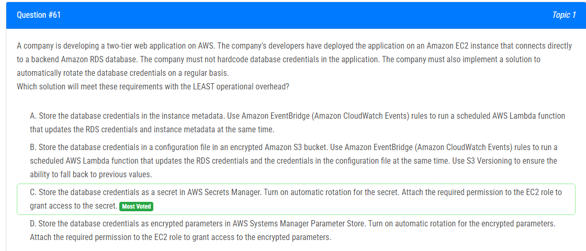
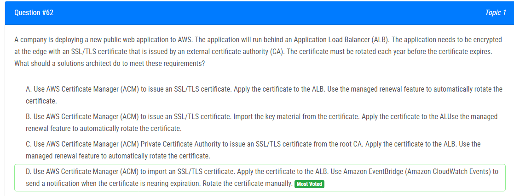
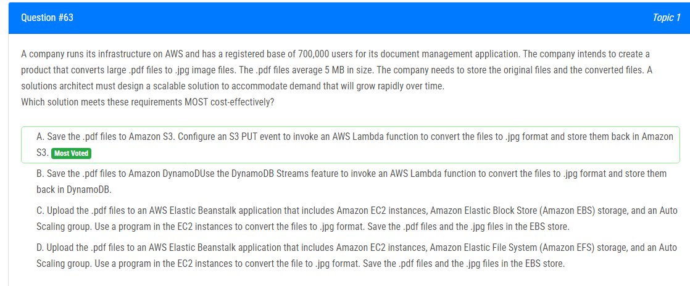
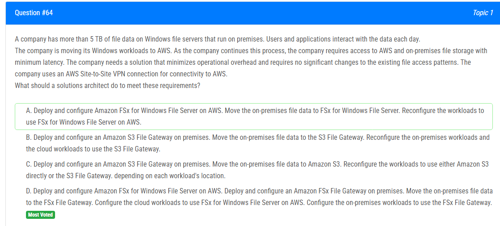
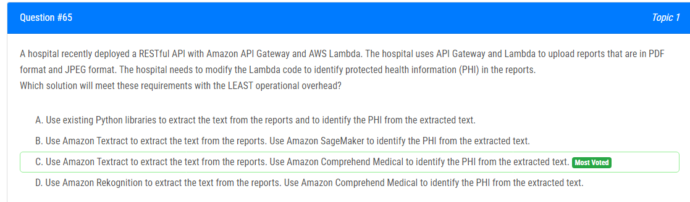
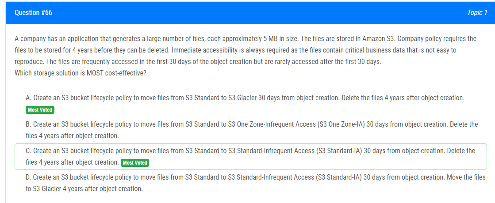
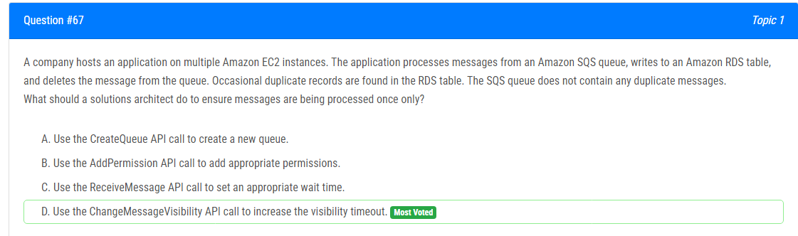
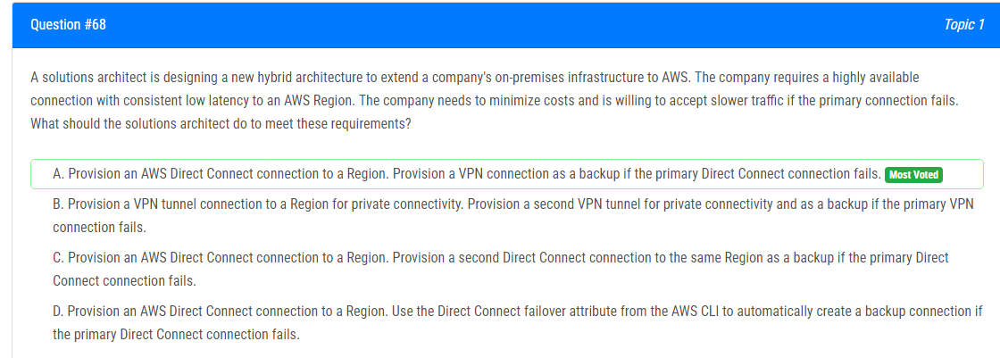
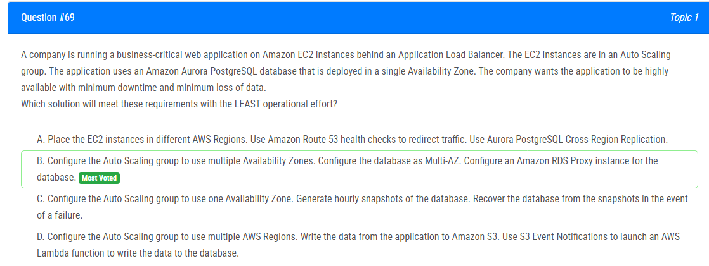
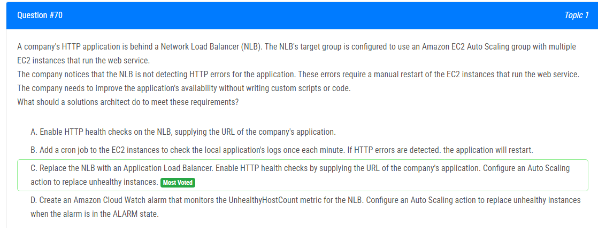

해설:

정답 C.

해당 문제의 올바른 해결책은 C입니다. 데이터베이스 자격 증명을 AWS Secrets Manager의 시크릿으로 저장하고 해당 시크릿에 대한 자동 회전을 활성화합니다. 그런 다음 EC2 역할에 필요한 권한을 부여하여 시크릿에 액세스할 수 있도록 합니다.

AWS Secrets Manager는 데이터베이스 자격 증명, API 키 및 기타 시크릿을 수명 주기 동안 쉽게 회전, 관리 및 검색할 수 있게 해주는 서비스입니다. 데이터베이스 자격 증명을 Secrets Manager의 시크릿으로 저장함으로써 이를 응용 프로그램에 하드코딩하지 않고 규칙적으로 자동으로 회전되도록 할 수 있습니다. EC2 인스턴스에 시크릿 액세스 권한을 부여하려면 필요한 권한을 EC2 역할에 부여하면 됩니다. 이를 통해 응용 프로그램은 필요할 때 Secrets Manager에서 시크릿을 검색할 수 있게 됩니다.

A : 데이터베이스 자격 증명을 인스턴스 메타데이터에 저장하고 Lambda 함수를 사용하여 업데이트하는 것으로, 응용 프로그램에서 자격 증명을 하드코딩하지 않는 요구 사항을 충족하지 못합니다.

B : 데이터베이스 자격 증명을 암호화된 S3 버킷에 저장하고 Lambda 함수를 사용하여 업데이트하는 것으로, 여전히 응용 프로그램에서 구성 파일에서 자격 증명에 액세스해야 하므로 해당 요구 사항을 충족하지 못합니다.

D : 데이터베이스 자격 증명을 AWS Systems Manager Parameter Store의 암호화된 매개 변수로 저장하는 것으로, 여전히 응용 프로그램에서 암호화된 매개 변수에 액세스해야 하므로 해당 요구 사항을 충족하지 못합니다.

해설:

정답 D.

해당 문제에서의 정확한 해결책은 D입니다. 이 접근 방식에서는 외부 인증 기관(CA)에서 발급한 써드파티 인증서를 ACM(AWS Certificate Manager)에 가져와 ALB(Application Load Balancer)에 중앙에서 관리하고 적용할 수 있습니다. CloudWatch Events를 구성하여 인증서가 만료될 때 알림을 수신하고 수동으로 회전 프로세스를 시작할 수 있습니다.

A 및 B : 이러한 옵션들은 SSL/TLS 인증서가 ACM에서 직접 발급될 수 있다고 가정합니다. 그러나 요구 사항에서는 인증서가 외부 인증 기관(CA)에서 발급되어야 한다고 명시되어 있으므로 이 옵션은 적절하지 않습니다.

C : ACM Private Certificate Authority는 자체 개인 CA를 생성하고 해당 CA에서 인증서를 발급할 때 사용됩니다. 이는 외부 CA에서 발급된 인증서를 지원하지 않습니다. 따라서 주어진 요구 사항에는 적절하지 않습니다.

해설:

정답 A.

해당 설명을 해석하면 다음과 같습니다:

B. DynamoDB를 사용하여 대량의 .pdf 파일을 저장하고 처리하는 것은 저장 및 처리량 비용이 DynamoDB와 관련이 있어 비효율적일 것입니다.

C. Elastic Beanstalk을 EC2와 EBS 스토리지와 함께 사용하는 것은 작동할 수 있지만 가장 비용 효율적인 솔루션이 아닐 수 있습니다. 이는 기본 인프라를 수동으로 관리하고 스케일링해야 하는 작업을 포함합니다.

D. C와 유사하게 Elastic Beanstalk을 EC2와 EFS 스토리지와 함께 사용하는 것은 작동할 수 있지만 가장 비용 효율적인 솔루션이 아닐 수 있습니다. EFS는 공유 파일 스토리지 서비스이며 수요 및 파일 크기가 증가함에 따라 변환 프로세스에 최적의 성능을 제공하지 않을 수 있습니다.

A. Lambda 및 S3의 확장 가능하고 비용 효율적인 저장소를 활용한 것이 가장 비용 효율적인 솔루션입니다. Lambda를 사용하면 파일 변환 중에 실제로 사용한 컴퓨팅 시간만 지불하며 S3는 .pdf 및 .jpg 파일 모두에 대해 내구성 있고 확장 가능한 저장소를 제공합니다. S3 PUT 이벤트가 Lambda를 트리거하여 변환을 수행하므로 인프라와 스케일링을 관리할 필요가 없어 이 시나리오에 가장 비용 효율적인 솔루션입니다.

해설:

정답 A.

옵션 A: AWS에서 Amazon FSx for Windows File Server를 배포하고 구성합니다. 이 옵션은 AWS에서 FSx for Windows File Server를 배포하여 온프레미스 파일 데이터를 FSx로 이전할 수 있게 합니다.

워크로드를 AWS에서 FSx for Windows File Server를 사용하도록 재구성함으로써 회사는 파일 데이터에 대한 원활한 액세스를 보장하면서 AWS 인프라의 이점을 활용할 수 있습니다.

이 해결책은 회사가 Windows 워크로드를 AWS로 이동하는 목표와 일치하며 기존의 AWS Site-to-Site VPN 연결을 사용하여 연결성을 활용합니다.

해설:

정답 C.

해당 문제에서 올바른 해결책은 C입니다. Amazon Textract를 사용하여 리포트에서 텍스트를 추출하고, Amazon Comprehend Medical를 사용하여 추출된 텍스트에서 PHI(개인 건강 정보)를 식별하는 것이 가장 효율적인 솔루션일 것입니다. 이는 운영 오버헤드가 가장 적게 발생할 것입니다. Textract는 문서에서 텍스트를 추출하기 위해 특별히 설계되었으며, Comprehend Medical는 의료 텍스트에서 정확하게 PHI를 식별할 수 있는 완전히 관리되는 서비스입니다. 이 솔루션은 최소한의 유지 관리가 필요하며 Textract 및 Comprehend Medical의 사용료 이외에 추가 비용이 발생하지 않을 것입니다.

A : 기존의 Python 라이브러리를 사용하여 텍스트를 추출하고 해당 텍스트에서 PHI를 식별하는 것은 병원이 라이브러리를 유지 관리하고 필요에 따라 업데이트해야 한다는 운영 오버헤드를 유발할 것입니다. 라이브러리를 최신으로 유지하고 발생할 수 있는 문제를 디버깅하는 데 관련된 운영 오버헤드가 있을 것입니다.

B : Amazon SageMaker를 사용하여 추출된 텍스트에서 PHI를 식별하는 것은 SageMaker 모델을 설정 및 유지 관리하는 데 추가적인 운영 오버헤드를 유발할 것이며, SageMaker 사용에 대한 추가 비용이 발생할 수 있습니다.

D : Amazon Rekognition을 사용하여 리포트에서 텍스트를 추출하는 것은 효과적인 해결책이 아닐 것입니다. Rekognition은 주로 이미지 인식을 위해 설계되었으며 PDF 또는 JPEG 파일에서 텍스트를 정확하게 추출할 수 없을 것입니다.

해설:

정답 C.

해당 문제에서의 올바른 해결책은 C입니다. C 옵션에서는 S3 버킷 수명주기 정책을 만들어서 객체 생성 후 30일이 지나면 S3 Standard에서 S3 Standard-Infrequent Access (S3 Standard-IA)로 파일을 이동하고, 객체 생성 후 4년이 지난 후에 파일을 삭제합니다.

A, B, D 옵션은 각각의 단점이 있습니다:

A : S3 Glacier로 전환하면 검색 시간과 비용이 발생할 수 있으며, 즉각적인 액세스가 필요한 파일에는 적합하지 않을 수 있습니다. 4년 후에 직접 삭제하는 것이 더 간단한 접근 방법일 수 있습니다.

B : S3 One Zone-Infrequent Access (S3 One Zone-IA)는 Standard 또는 Standard-Infrequent Access보다 내구성이 떨어지며 데이터를 단일 가용 영역에 저장합니다. 이는 중요한 비즈니스 데이터에 적합하지 않을 수 있습니다.

D : 4년 후에 S3 Glacier로 전환하면 검색 시간과 비용이 발생할 수 있으며, 즉각적인 액세스 요구 사항과 일치하지 않을 수 있습니다. 이는 이 시나리오에서 명확한 이점 없이 복잡성을 추가하는 것일 수 있습니다.

해설:

정답 D.

해당 문제에서 메시지가 한 번만 처리되도록 보장하기 위해 솔루션 아키텍트는 가시성 타임아웃을 증가시키기 위해 ChangeMessageVisibility API 호출을 사용해야 합니다. 이는 D 옵션입니다.

가시성 타임아웃은 SQS 큐에서 수신한 메시지가 처리되는 동안 다른 소비자에게 숨겨진 시간을 결정합니다. 메시지 처리가 가시성 타임아웃보다 길 경우, 메시지는 다른 소비자에게 표시되어 다시 처리될 수 있습니다. 가시성 타임아웃을 증가시킴으로써 솔루션 아키텍트는 메시지가 처리가 완료되고 메시지를 안전하게 큐에서 삭제할 수 있을 때까지 메시지가 다른 소비자에게 표시되지 않도록 할 수 있습니다.

A : CreateQueue API 호출을 사용하여 새 큐를 만듦은 중복 메시지 처리 문제를 해결하지 않을 것입니다.

B : AddPermission API 호출을 사용하여 적절한 권한 추가은 이 문제와 관련이 없습니다.

C : ReceiveMessage API 호출을 사용하여 적절한 대기 시간 설정 역시 이 문제와 관련이 없습니다.

해설:

정답 A.

B와 C : 개인 연결성 및 백업으로 여러 VPN 연결을 사용하는 것을 제안합니다. VPN은 백업으로 사용될 수 있지만, 직접 연결 연결만큼 일관된 낮은 지연 및 높은 가용성을 제공하지 않을 수 있습니다. 게다가 여러 VPN 터널을 프로비저닝하는 것은 운영 복잡성과 비용을 증가시킬 수 있습니다.

D : AWS CLI에서 Direct Connect 장애 조치 속성을 사용하여 기본 Direct Connect 연결이 실패하면 자동으로 백업 연결을 생성하는 것을 제안합니다. 이 접근 방식은 자동화될 수 있지만, 별도의 백업 연결이 있는 것과 같은 즉각적인 장애 조치 능력을 제공하지는 않습니다.

따라서 옵션 A, 지역에 AWS Direct Connect 연결을 프로비저닝하고 백업으로 VPN 연결을 프로비저닝하는 것이 연결성, 비용 효율성 및 고가용성에 대한 회사의 요구 사항을 가장 잘 충족하는 적절한 솔루션입니다.

해설:

정답 B.

A : 이 접근 방식은 지리적인 격리를 제공하지만, 복제 관리, 지연 처리, 그리고 잠재적으로 높은 데이터 전송 비용을 포함하여 추가 복잡성과 운영 노력을 도입합니다.

C : 스냅샷은 데이터 백업 및 복구에 사용될 수 있지만, 실시간 장애 조치 기능을 제공하지 않으며, 스냅샷 간에 장애가 발생하면 중요한 데이터 손실이 발생할 수 있습니다.

D : 이 접근 방식은 일부 격리 및 확장성 이점을 제공하지만, 데이터 흐름에 복잡성을 추가하고 데이터 처리에 대한 추가 오버헤드를 도입합니다.

비교적, 옵션 B는 여러 가용 영역, 데이터베이스를 위한 Multi-AZ 구성 및 개선된 연결 관리를 위한 RDS Proxy를 활용하여 더 간단하고 효율적인 솔루션을 제공합니다. 이는 높은 가용성, 최소한의 다운 타임 및 최소한의 데이터 손실을 보장하며 운영 노력이 가장 적게 듭니다.

해설:

정답 C.

A : NLB를 사용하는 것은 NLB의 헬스 체크가 TCP/UDP 프로토콜에 대한 것으로 설계되어 있으며 ALB에서 제공하는 HTTP 애플리케이션에 특화된 고급 기능이 부족합니다.

B : 이 접근 방식은 사용자 정의 스크립팅과 수동 개입을 필요로 하며, 사용자 정의 스크립트나 코드를 작성하지 말아야 한다는 요구 사항과 충돌합니다.

D : NLB는 HTTP 오류를 감지하지 않기 때문에 UnhealthyHostCount 메트릭에만 의존하는 것은 응용 프로그램 인스턴스의 상태를 정확하게 포착하지 못할 수 있습니다.

따라서 C가 사용자 정의 스크립팅이나 코드 없이 응용 프로그램의 가용성을 향상시키는 권장 사항입니다. NLB를 ALB로 교체하고 HTTP 헬스 체크를 활성화하며 Auto Scaling을 구성하여 비정상적인 인스턴스를 대체함으로써 회사는 오직 건강한 인스턴스만이 트래픽을 처리하도록 보장하며 응용 프로그램의 가용성을 자동으로 향상시킬 수 있습니다.