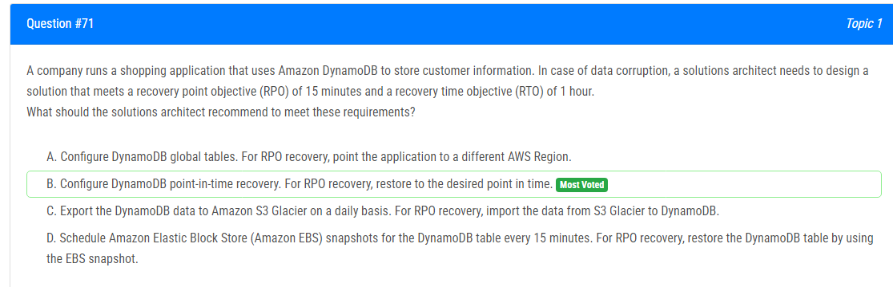
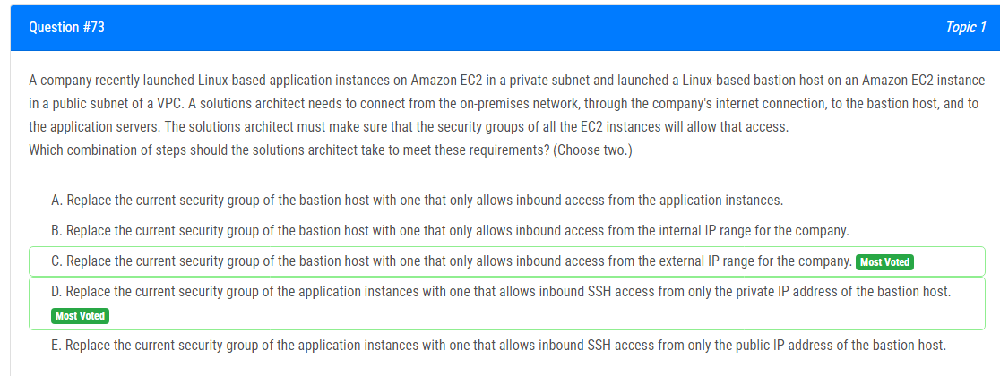
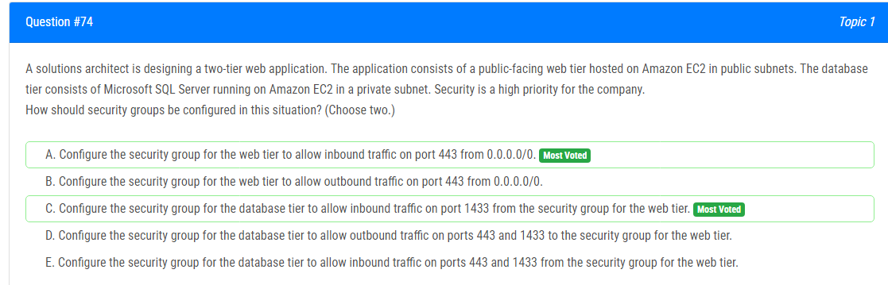
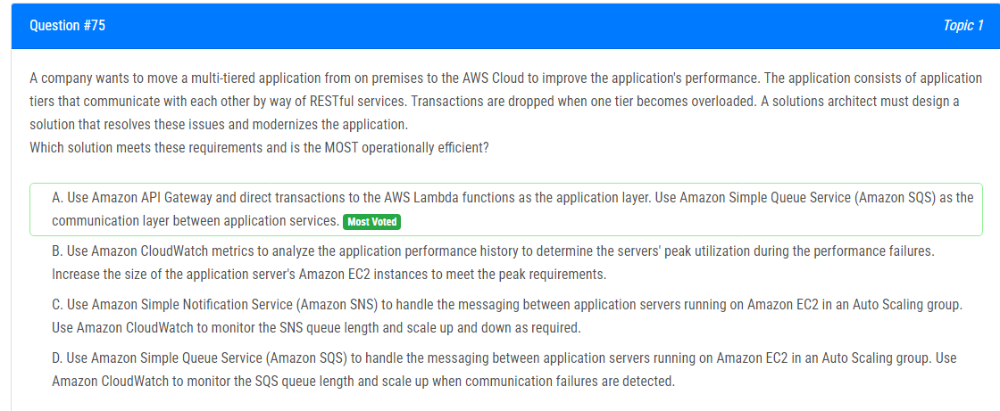
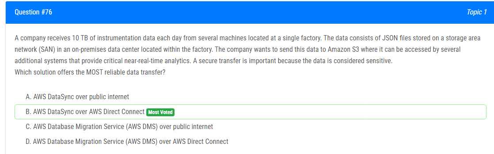
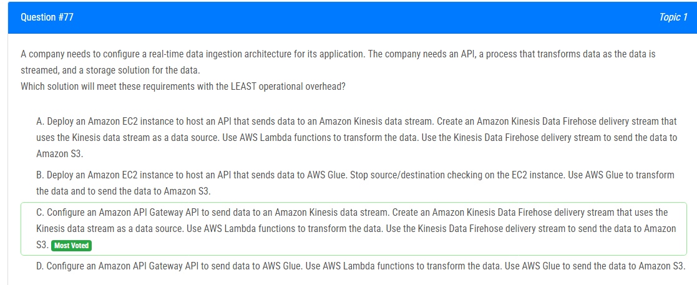
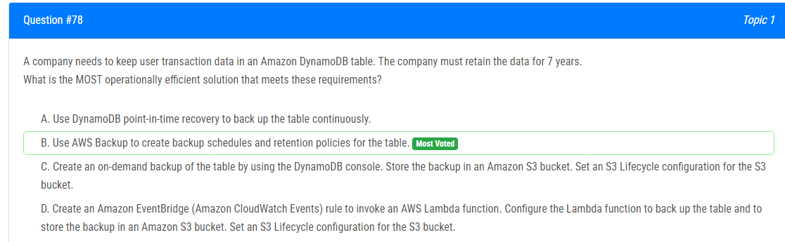
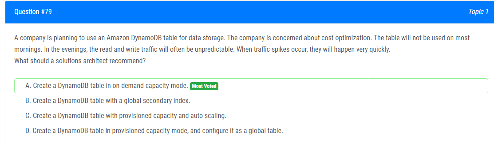
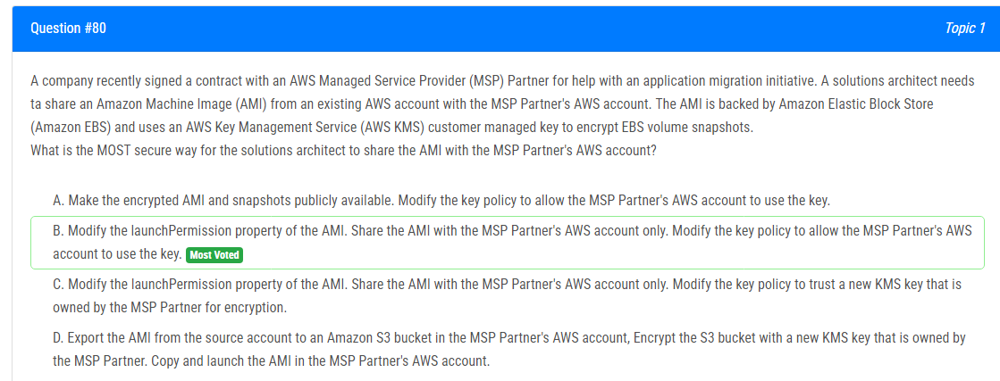

해설:

정답 B.

가장 적합한 RPO 및 RTO 요구 사항을 충족시키는 솔루션은 DynamoDB의 점별 복구(Point-in-Time Recovery, PITR)를 사용하는 것입니다. 이 기능은 지난 35일 동안의 어떤 시점으로든 DynamoDB 테이블을 복원할 수 있도록 허용하며, 초 단위의 정밀도로 작동합니다. 15분의 RPO 내에서 데이터를 복구하려면 단순히 지난 35일 동안의 원하는 시점으로 테이블을 복원하면 됩니다.

1시간의 RTO 요구 사항을 충족시키기 위해 DynamoDB 콘솔, AWS CLI 또는 AWS SDK를 사용하여 테이블에 PITR을 활성화할 수 있습니다. 활성화되면 PITR은 지속적으로 테이블 데이터의 점별 복사본을 S3 버킷에 캡처합니다. 그런 다음 이러한 점별 복사본을 사용하여 보존 기간 내에서 테이블을 어떤 시점으로든 복원할 수 있습니다.

A : DynamoDB 글로벌 테이블 구성은 RPO 요구 사항을 충족시키지 않습니다. 글로벌 테이블은 데이터를 여러 지역에 복제하여 고가용성을 제공하지만 특정 시점으로 데이터를 복원할 수 있는 방법을 제공하지 않습니다.

C : S3 Glacier로 데이터 내보내기는 RPO 또는 RTO 요구 사항을 충족시키지 않습니다. S3 Glacier는 검색 시간이 몇 시간 걸리는 Cold Storage 서비스입니다.

D : EBS 스냅샷 예약은 RPO 요구 사항을 충족시키지 않습니다. EBS 스냅샷은 일정에 따라 촬영되며 연속적으로 촬영되지 않습니다. 또한 EBS 스냅샷에서 DynamoDB 테이블을 복원하는 데 1시간보다 더 오래 걸릴 수 있어 RTO 요구 사항을 충족시키지 못합니다.

해설:

정답 D.

옵션 D가 올바른 답입니다. VPC에 S3 VPC 게이트웨이 엔드포인트를 배포하고 S3 버킷에 액세스를 허용하는 엔드포인트 정책을 연결합니다.

S3 VPC 게이트웨이 엔드포인트를 배포함으로써 응용 프로그램은 VPC 내에서 개인 네트워크 연결을 통해 S3 버킷에 액세스할 수 있으며, 인터넷을 통한 데이터 전송이 필요하지 않습니다. 이는 데이터 전송 비용을 줄이고 응용 프로그램의 성능을 향상시킬 수 있습니다. 엔드포인트 정책은 어떤 S3 버킷에 액세스할 수 있는지를 지정하는 데 사용될 수 있습니다.

A : 공용 서브넷에 Amazon API Gateway를 배포하고 라우트 테이블을 조정하는 것은 여전히 응용 프로그램이 인터넷을 통해 데이터를 전송해야 하므로 데이터 전송 비용 문제를 해결하지 않습니다.

B : 공용 서브넷에 NAT 게이트웨이를 배포하고 엔드포인트 정책을 연결하는 것도 NAT 게이트웨이는 사설 서브넷의 인스턴스가 인터넷으로 외부 연결을 활성화하는 데 사용되며 S3에 연결하는 데 사용되지 않기 때문에 데이터 전송 비용 문제를 해결하지 않습니다.

C : 공용 서브넷에 응용 프로그램을 배포하고 인터넷 게이트웨이를 통해 라우팅하는 것은 응용 프로그램이 여전히 인터넷을 통해 데이터를 전송해야 하므로 데이터 전송 비용을 줄이지 않습니다.

해설:

정답 C, D.

C 옵션은 옳습니다. 외부 네트워크에서 bastion으로 인터넷을 통해 접근할 때는 온프레미스 자원의 공개 IP 주소를 사용합니다.

D 옵션도 옳습니다. Bastion 호스트와 EC2 인스턴스가 동일한 VPC에 있기 때문에 bastion은 EC2에 대해 개인 IP 주소를 사용하여 통신할 수 있습니다.

해설:

정답 A, C.

A : 이 구성은 외부 사용자가 HTTPS(포트 443)를 통해 웹 티어에 액세스할 수 있도록 합니다. 그러나 일반적으로 소스 IP 범위를 0.0.0.0/0(어디서나)로 허용하는 대신 더 구체적인 범위로 제한하는 것이 권장됩니다. 이렇게 하면 신뢰할 수 있는 소스에만 액세스가 제한됩니다.

C : 웹 티어와 관련된 보안 그룹에서 포트 1433(Microsoft SQL Server의 기본 포트)로의 인바운드 트래픽을 허용함으로써 데이터베이스 티어는 웹 티어의 EC2 인스턴스만이 액세스할 수 있도록 보장합니다. 이는 격리 수준을 제공하며 외부 소스에서 데이터베이스 티어에 직접 액세스하는 것을 제한합니다.

해설:

정답 A.

해설:

정답 B.

가장 안전한 방법으로 데이터를 안전하게 전송하기 위한 가장 신뢰할 만한 솔루션은 옵션 B인 AWS DataSync을 AWS Direct Connect를 통해 사용하는 것입니다.

AWS DataSync은 네트워크 최적화 기술을 사용하여 온프레미스 저장 시스템과 Amazon S3 또는 다른 저장 대상 간에 데이터를 효율적으로 안전하게 전송하는 데이터 전송 서비스입니다. AWS Direct Connect를 통해 사용하면 DataSync는 온프레미스 데이터 센터와 AWS 간에 전용 및 안전한 네트워크 연결을 제공할 수 있습니다. 이를 통해 공개 인터넷을 사용하는 것보다 더 신뢰성 있고 안전한 데이터 전송을 보장할 수 있습니다.

A : 공개 인터넷을 통한 AWS DataSync은 Direct Connect를 사용하는 것만큼 신뢰성이 높지 않을 수 있으며 잠재적인 네트워크 문제나 혼잡에 영향을 받을 수 있습니다.

C : 공개 인터넷을 통한 AWS Database Migration Service (DMS)는 데이터베이스 이전을 위해 설계되었으며 대량의 데이터를 전송하기에는 적합하지 않습니다.

D : AWS DMS를 AWS Direct Connect를 통해 사용하는 것도 데이터베이스 이전을 위해 설계되었으며 대량의 데이터를 SAN(저장 영역 네트워크)에서 전송하는 데 효과적이지 않을 수 있습니다.

해설: 

정답 C.

옵션 C. 이러한 서비스를 함께 활용하면 최소한의 운영 오버헤드로 실시간 데이터 수집 아키텍처를 구현할 수 있습니다. 데이터는 API Gateway에서 Kinesis 데이터 스트림으로 흐르고, Lambda를 사용하여 변환되며, 그 후 Kinesis Data Firehose 전달 스트림을 통해 S3로 전송되어 저장됩니다.

A : EC2 관리, 스케일링 및 유지 관리를 처리해야 하므로 운영 오버헤드가 추가됩니다. API Gateway와 같은 서버리스 솔루션 사용에 비해 효율성이 낮습니다.

B : API를 호스팅하고 Glue를 구성하기 위해 EC2를 배포하고 관리해야 하므로 운영 오버헤드가 추가되며, EC2 관리 및 잠재적인 확장성 제한이 발생할 수 있습니다.

D : 여전히 Glue를 관리하고 구성해야 하므로 운영 오버헤드가 추가됩니다. 또한 Glue는 주로 ETL 시나리오에 사용되며 이 경우 실시간 데이터 변환이 필요하므로 가장 효율적인 솔루션이 아닐 수 있습니다.

해설:

정답 B.

가장 운영 효율적인 솔루션으로서 이러한 요구 사항을 충족하는 것은 옵션 B를 사용하는 것입니다. 이는 AWS Backup을 사용하여 테이블에 대한 백업 일정과 보존 정책을 만드는 것입니다.

AWS Backup은 AWS 리소스 전체에서 데이터를 중앙 집중화하고 자동화하는 데 사용되는 완전히 관리되는 백업 서비스입니다. 이를 사용하면 정기적으로 DynamoDB 테이블을 자동으로 백업하기 위한 백업 정책 및 일정을 생성할 수 있습니다. 또한 필요한 기간 동안 백업이 유지되도록 보존 정책을 지정할 수 있습니다. 이 솔루션은 완전히 자동화되어 최소한의 유지 관리만 필요하며, 이로써 운영 효율성이 가장 높은 옵션입니다.

A : DynamoDB 시점 복구를 사용하는 것도 실행 가능한 옵션입니다만, 지속적인 백업이 필요하므로 더 많은 리소스를 사용하고 AWS Backup을 사용하는 것에 비해 더 높은 비용이 발생할 수 있습니다.

C : 테이블의 온디맨드 백업을 생성하고 S3 버킷에 저장하는 것도 실행 가능한 옵션입니다만, 수동 개입이 필요하며 AWS Backup의 자동화 및 일정 기능을 제공하지 않습니다.

D : Amazon EventBridge (CloudWatch Events) 및 Lambda 함수를 사용하여 테이블을 백업하고 S3 버킷에 저장하는 것도 실행 가능한 옵션입니다만, AWS Backup을 사용하는 것에 비해 더 복잡한 설정 및 유지 관리가 필요할 수 있습니다.

해설:

정답 A.

답변 A가 선택된 이유는 상대적으로 예측 가능한 애플리케이션 트래픽, 일관된 트래픽을 처리하며 서서히 증가하거나 감소하는 애플리케이션의 경우 DynamoDB의 프로비저닝 용량이 가장 적합하기 때문입니다.

프로비저닝 용량 모드는 예상되는 수요를 충족하기 위해 읽기 및 쓰기 용량을 고정된 양으로 프로비저닝할 수 있는 경우에 적합합니다. 이 옵션은 안정적인 워크로드에 대한 비용을 최적화할 수 있도록 합니다.

반면에 온디맨드 용량 모드는 애플리케이션의 워크로드가 알려지지 않거나 매우 변동적인 경우에 적합합니다. 온디맨드 가격 책정을 사용하면 애플리케이션에서 실제로 사용되는 읽기 및 쓰기 용량만큼 지불하며 용량 계획이 필요하지 않습니다. 이는 트래픽이 몇 초 또는 몇 분 동안 급증할 수 있는 버스트 또는 예측할 수 없는 워크로드에 이상적입니다. 또한 프로비저닝 용량이 부족할 때 사용자 경험이 영향을 받을 때 유용합니다.

해설:

정답 B.

B. AMI의 launchPermission 속성을 수정합니다.

솔루션 아키텍트가 AMI를 MSP 파트너의 AWS 계정과 안전하게 공유하는 가장 안전한 방법은 AMI의 launchPermission 속성을 수정하고 MSP 파트너의 AWS 계정과만 공유하는 것입니다. 또한 키폴리시도 수정하여 MSP 파트너의 AWS 계정이 해당 키를 사용할 수 있도록 해야 합니다. 이렇게 함으로써 AMI가 MSP 파트너와만 공유되며, 그들이 사용 권한을 가진 키로 암호화되게 됩니다.

A : AMI 및 스냅샷을 공개로 만드는 것은 AMI에 액세스할 수 있는 누구나 사용할 수 있게 되므로 안전하지 않은 옵션입니다.

C : 새 KMS 키를 신뢰하도록 키폴리시를 수정하는 것은 MSP 파트너와 키를 공유해야 하므로 데이터의 보안을 위협할 수 있습니다.

D : AMI를 MSP 파트너의 AWS 계정에 있는 S3 버킷으로 내보내고 해당 버킷을 MSP 파트너 소유의 새 KMS 키로 암호화하는 것도 가장 안전한 옵션이 아닙니다. 이 방법은 AMI와 새로운 키를 MSP 파트너와 공유하게 되어 데이터의 보안을 위협할 수 있습니다.