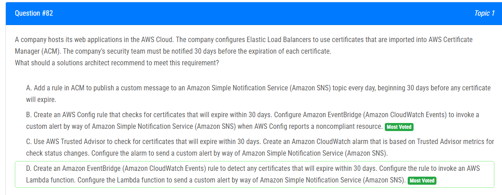
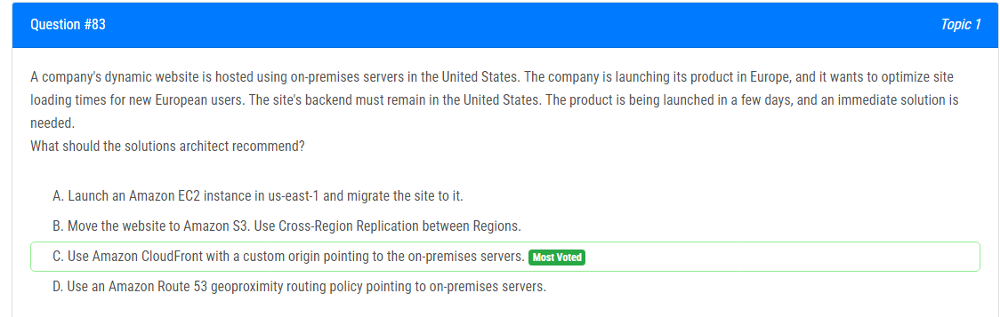
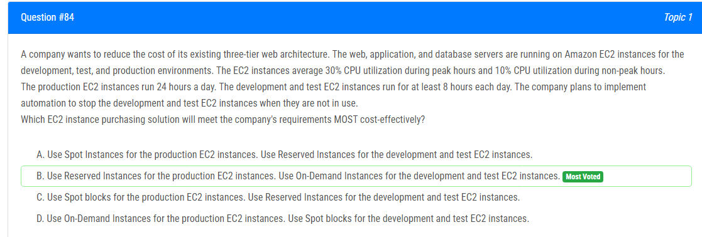
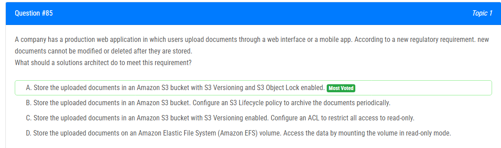
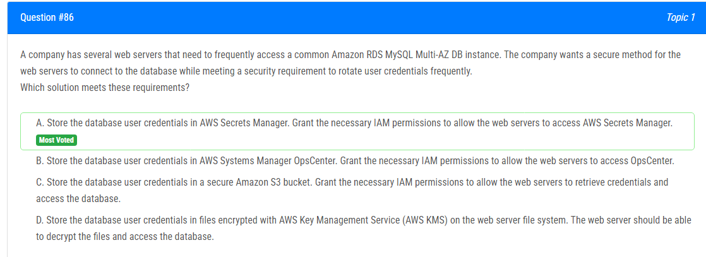
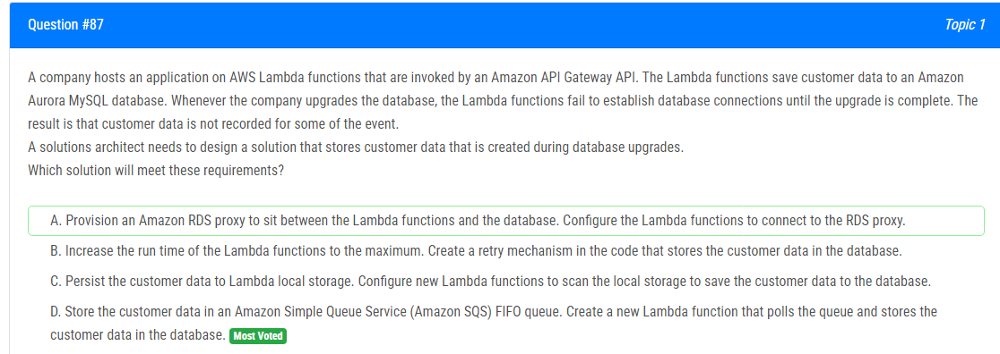
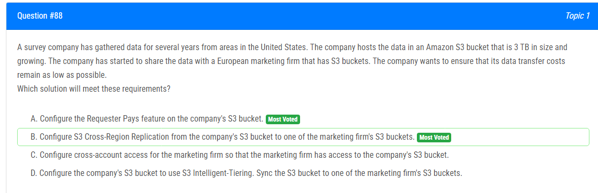
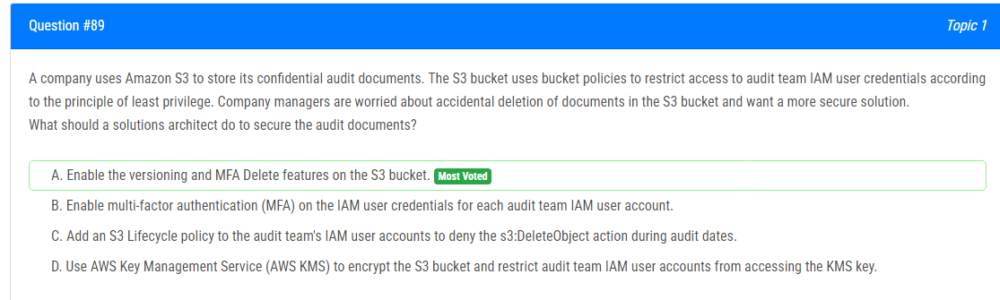
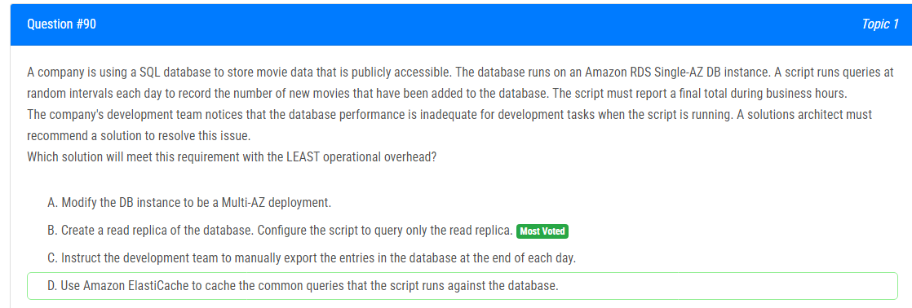

해설:

정답 C.

C가 올바른 설계입니다. 처리해야 할 작업을 보유하기 위해 Amazon SQS 대기열을 만듭니다. 프로세서 응용 프로그램으로 구성된 Amazon Machine Image (AMI)를 생성합니다. AMI를 사용하는 런치 템플릿을 생성합니다. 런치 템플릿을 사용하여 Auto Scaling 그룹을 생성합니다. Auto Scaling 그룹의 스케일링 정책을 SQS 대기열의 항목 수에 기반하여 노드를 추가 및 제거하도록 설정합니다.

이 설계는 Amazon Simple Queue Service (SQS)를 작업 항목의 내구성 저장소로 사용하고 Amazon Elastic Compute Cloud (EC2) Auto Scaling을 사용하여 대기열의 항목 수에 따라 노드를 추가하거나 제거함으로써 애플리케이션의 요구 사항을 충족합니다. 프로세서 응용 프로그램은 여러 노드에서 병렬로 실행될 수 있으며, 런치 템플릿의 사용은 EC2 인스턴스의 구성에서 유연성을 제공합니다.

A : SQS 대신 Amazon Simple Notification Service (SNS)를 사용하여 내구성이 없는 저장 솔루션을 사용하므로 올바르지 않습니다.

B : 대기열의 항목 수가 아닌 CPU 사용량을 스케일링 트리거로 사용하므로 올바르지 않습니다.

D : 옵션 A와 동일한 이유로 올바르지 않습니다.

해설:

정답 D.

D가 가장 적절한 답입니다. 완전히 관리되는 이벤트 버스인 Amazon EventBridge(이전에는 Amazon CloudWatch Events로 알려져 있음)를 사용하는 것이 주요 이유입니다. 이를 사용하면 이벤트 기반 애플리케이션을 쉽게 설정하고 실행할 수 있습니다. EventBridge를 사용하여 이벤트 발생에 따라 트리거되는 규칙을 생성할 수 있으며, 여기에는 인증서 만료와 같은 이벤트가 포함될 수 있습니다. 30일 이내에 만료될 모든 인증서를 감지하는 규칙을 만들면 보안 팀이 제때 통지를 받을 수 있습니다.

게다가, 옵션 D는 Amazon EventBridge 규칙에 의해 트리거될 때 사용되는 AWS Lambda 함수를 활용합니다. AWS Lambda는 서버를 프로비저닝하거나 관리하지 않고 코드를 실행할 수 있는 컴퓨팅 서비스입니다. Lambda 함수를 구성하여 EventBridge 규칙에 의해 트리거될 때 Amazon Simple Notification Service (Amazon SNS)를 통해 사용자 정의 경고를 보내도록 설정할 수 있습니다. 이를 통해 보안 팀에 대한 알림 프로세스를 자동화할 수 있습니다.

A : 필요하지 않거나 효율적이지 않을 수 있는 Amazon SNS 주제에 매일 메시지를 보내는 것을 포함하기 때문에 유효한 솔루션이 아닙니다.

B : AWS Config를 사용하여 만료된 인증서를 모니터링하기에는 적합하지 않습니다. AWS Config는 리소스 구성을 모니터링하고 기록하기 위해 설계되었으며, 인증서의 만료를 모니터링하기에는 적합하지 않습니다.

C : AWS Trusted Advisor를 사용하는 것으로, 이는 AWS 리소스를 최적화하는 데 도움을 주는 도구이지만, 인증서의 만료를 모니터링하기에는 적합하지 않습니다.

해설:

정답 C.

C. 옵션을 선택하는 것이 적절합니다. 이는 Amazon CloudFront를 사용하여 온프레미스 서버를 가리키는 사용자 지정 origin을 설정하는 내용입니다.

Amazon CloudFront는 정적 및 동적 웹 콘텐츠(HTML, CSS, JavaScript, 이미지 및 비디오 등)의 전송을 가속화하는 콘텐츠 전송 네트워크(CDN)입니다. CloudFront를 사용하면 회사는 유럽의 사용자에게 더 가까운 엣지 위치에서 웹 사이트 콘텐츠를 배포하여 이 사용자들의 로딩 시간을 줄일 수 있습니다.

CloudFront를 사용하려면 회사는 미국 내의 온프레미스 서버를 가리키는 사용자 지정 origin을 설정할 수 있습니다. 그러면 CloudFront는 전 세계의 엣지 위치에 웹 사이트 콘텐츠를 캐시하고 해당 사용자에게 가장 가까운 위치에서 콘텐츠를 제공합니다. 이를 통해 회사는 웹 사이트의 백엔드를 다른 지역으로 이동시키지 않고도 유럽 사용자의 로딩 시간을 최적화할 수 있습니다.

다른 옵션들의 경우:

A(미국 동부에 Amazon EC2 인스턴스를 시작하고 사이트를 이관): 유럽 사용자의 로딩 시간 최적화 문제를 해결하지 못합니다.

B(웹 사이트를 Amazon S3로 이동하고 지역 간 복제 사용): 설정 및 웹 사이트 이관에 시간이 필요하므로 즉시 해결책이 아닙니다.

D(Amazon Route 53 지오프록시 라우팅 정책을 사용하여 온프레미스 서버를 가리킴): 유럽 사용자의 로딩 시간을 개선하지 못합니다.

해설:

정답 B.

옵션 B가 실제로 가장 비용 효율적인 해결책일 것입니다. 예약 인스턴스는 일관되게 실행되는 인스턴스에 대한 비용 절감을 제공하며, 이 경우 프로덕션 환경에 해당합니다. 반면에 온디맨드 인스턴스는 유연성을 제공하며, 개발 및 테스트 환경과 같이 가변적인 사용 패턴을 가진 인스턴스에 적합합니다. 이 조합은 질문에서 설명한 특정 요구 사항과 사용 패턴을 기반으로 한 비용 최적화를 보장합니다.

해설:

정답 A.

A. Amazon S3 버킷에 S3 버전 관리와 S3 Object Lock을 활성화하여 업로드된 문서를 저장하는 것이 올바른 선택입니다.

S3 버전 관리는 동일한 버킷에 객체의 여러 버전을 저장할 수 있게 합니다. 이는 객체가 수정되거나 삭제될 때 이전 버전이 보존되는 것을 의미합니다. S3 Object Lock은 객체를 법적 보류 또는 보존 기간에 두어 삭제 또는 수정을 방지하는 추가적인 보호를 제공합니다. S3 버전 관리와 S3 Object Lock을 함께 사용하면 문서가 저장된 후에 수정 또는 삭제되지 않도록 하는 요구 사항을 충족시킬 수 있습니다.

다른 옵션들에 대한 설명:
B(S3 버킷에 문서를 저장하고 주기적으로 아카이브하는 S3 라이프사이클 정책 구성): 문서가 수정되거나 삭제되지 않습니다.

C(S3 버킷에 문서를 저장하고 S3 버전 관리를 활성화하며 모든 액세스를 읽기 전용으로 제한하는 ACL 구성): 문서가 수정되거나 삭제되지 않습니다. ACL은 객체에 대한 액세스만 제어하며 수정 또는 삭제를 방지하지 않습니다.

D(Amazon Elastic File System (Amazon EFS) 볼륨에 문서를 저장하고 읽기 전용 모드로 데이터에 액세스): 문서가 수정되지 않지만 삭제되는 것을 방지하지 않습니다.

해설:

정답 A.

Option A. AWS Secrets Manager에 데이터베이스 사용자 자격 증명을 저장하고 웹 서버가 AWS Secrets Manager에 액세스할 수 있도록 필요한 IAM 권한을 부여하는 것이 올바른 선택입니다.

옵션 A는 문제에서 명시된 요구 사항을 충족합니다: 웹 서버가 데이터베이스에 안전하게 연결하면서 사용자 자격 증명을 자주 로테이트하는 보안 요구 사항을 충족합니다. AWS Secrets Manager는 데이터베이스 자격 증명과 같은 시크릿을 저장하고 관리하기 위해 특별히 설계되었으며, 사용될 때마다 시크릿을 자동으로 로테이트하여 항상 신선하고 안전한 상태를 유지합니다. 이는 데이터베이스 사용자 자격 증명을 안전하게 저장하고 관리하기 위한 좋은 선택입니다.

다른 옵션들에 대한 설명:
B(AWS Systems Manager OpsCenter에 데이터베이스 사용자 자격 증명 저장): 시스템 관리 및 모니터링 도구인 OpsCenter는 비밀을 저장하고 관리하기 위해 설계되지 않았으므로 이 상황에 적합하지 않습니다.

C(안전한 Amazon S3 버킷에 데이터베이스 사용자 자격 증명 저장): S3 버킷은 시크릿을 저장하기 위해 설계되지 않았으며, 안전한 시크릿 관리 서비스로서의 역할을 하지 않습니다. S3에 시크릿을 저장하는 것은 권장되지 않습니다.

D(AWS Key Management Service (AWS KMS)로 암호화된 파일에 데이터베이스 사용자 자격 증명 저장): 이 옵션은 웹 서버 파일 시스템의 보안에 의존하므로 AWS Secrets Manager와 같은 전용 시크릿 관리 서비스만큼 안전하지 않습니다. 또한 이 옵션은 자격 증명을 자동으로 로테이트하는 자동화된 방법을 제공하지 않으므로 자주 로테이트되지 않습니다.

해설:

정답 D.

A : 이 옵션은 데이터베이스 업그레이드 중에 고객 데이터를 저장하는 문제에 대응하지 않습니다. Lambda가 업그레이드 중에 연결을 수립하지 못하는 문제가 있습니다.

B : Lambda 실행 시간을 증가시키고 재시도 메커니즘을 구현하면 몇 가지 실패를 완화할 수 있지만, 고객 데이터를 안전하게 저장하는 신뢰할 수 있는 해결책을 제공하지 않습니다. 문제는 Lambda 함수의 실행 시간이나 재시도 로직이 아니라 업그레이드 중에 발생하는 데이터베이스 연결 실패에 있습니다.

C : Lambda 로컬 스토리지는 일시적이며 내구성 있는 데이터 저장을 위해 설계되지 않았습니다. 특히 데이터베이스 업그레이드 중에 고객 데이터를 영구적으로 저장하는 믿을 수 없는 솔루션입니다.

요약하면, 옵션 D가 권장되는 솔루션입니다. SQS FIFO 대기열을 사용하여 고객 데이터를 저장합니다. 데이터 저장을 데이터베이스 연결에서 분리함으로써 Lambda는 업그레이드 중에도 대기열에 신뢰성 있게 데이터를 저장할 수 있습니다. 그런 다음 별도의 Lambda가 대기열을 폴링하고 고객 데이터를 데이터베이스에 저장하여 업그레이드 기간 동안 데이터 손실이 없도록 보장합니다.

해설:

정답 B.

B. 회사의 S3 버킷에서 마케팅 회사의 S3 버킷 중 하나로 S3 Cross-Region Replication을 구성하는 것이 올바른 선택입니다.

S3 Cross-Region Replication을 구성하면 회사는 데이터를 다른 지역의 마케팅 회사 S3 버킷으로 복제할 수 있으며, 이는 데이터 전송 비용을 줄이는 데 도움이 될 수 있습니다. S3 Cross-Region Replication을 사용하면 데이터가 자동으로 지역 간에 복제되므로 데이터가 항상 사용 가능하고 최신 상태임을 보장할 수 있습니다.

다른 옵션들에 대한 설명:

A(Requester Pays 기능 구성): 데이터 전송 비용을 직접적으로 줄이는 목표에 직접적으로 대응하지 않습니다. Requester Pays 기능은 S3 버킷 소유자가 해당 버킷의 객체에 대한 요청이 버킷 소유자가 아닌 요청자에게 청구되도록 지정할 수 있습니다. 이는 마케팅 회사가 회사의 S3 버킷의 데이터에 액세스할 때 데이터 전송 수수료를 지불해야 함을 의미합니다.

C(계정 간 액세스 구성): 마케팅 회사가 회사의 S3 버킷에 액세스할 수 있게 해주지만 데이터 전송 비용을 직접적으로 줄이는 목표에 직접적으로 대응하지 않습니다. 계정 간 액세스는 한 AWS 계정이 다른 AWS 계정의 리소스에 액세스할 수 있게 허용하지만 계정 간 데이터 전송 비용에는 영향을 미치지 않습니다.

해설:

정답 A.

옵션 A. S3에 버전 관리 및 MFA 삭제를 활성화하는 것이 감사 문서를 안전하게 보호하는 가장 적절한 해결책입니다.

버전 관리를 활성화하면 문서의 여러 버전이 저장되어 의도적 또는 실수로 삭제된 경우 이전 버전을 복원할 수 있습니다. MFA 삭제를 활성화하면 객체 버전을 영구적으로 삭제하려면 추가적인 인증이 필요하므로 실수로 삭제되는 것을 방지할 수 있습니다.

다른 옵션들에 대한 설명:
B(IAM 사용자 자격 증명에 MFA 활성화): 사용자 인증 프로세스에 추가적인 보안 레이어를 추가하지만 특별히 S3 버킷의 문서가 실수로 삭제되는 문제에 직접 대응하지는 않습니다.

C(감사 날짜 동안 삭제 작업 거부하는 S3 라이프사이클 정책 추가): 특정 시간 동안 의도적인 삭제를 방지하지만 언제든지 발생할 수 있는 실수로 인한 삭제에 대응하지는 않습니다.

D(KMS를 사용하여 암호화하고 KMS 키에 대한 액세스 제한): S3에 저장된 데이터에 대한 추가적인 보안을 제공하지만 S3에서 문서를 실수로 삭제하는 것을 직접적으로 방지하지는 않습니다.

해설:

정답 B.

옵션 B. 데이터베이스의 읽기 복제본을 생성하는 것이 가장 적절한 솔루션입니다. 이는 읽기 트래픽을 기본 데이터베이스에서 분산시켜 확장 가능한 솔루션을 제공합니다. 스크립트는 읽기 복제본에 쿼리할 수 있도록 구성되어 스크립트 실행 중 주 데이터베이스에 미치는 영향을 줄일 수 있습니다.

다른 옵션들에 대한 설명:
A(DB를 Multi-AZ 배포로 수정): 고가용성 및 내결함성을 향상시키지만 직접적으로 스크립트 실행 중의 성능 문제에 대응하지는 않습니다.

C(개발팀에게 데이터베이스 항목을 수동으로 내보내도록 지시): 수동 작업이 도입되며 확장 가능하거나 효율적인 해결책이 아닙니다.

D(캐싱을 위해 ElastiCache 사용): 일반적인 쿼리에 대한 읽기 성능을 향상시킬 수 있지만 해당 시나리오에 가장 적합한 해결책이 아닐 수 있습니다. 캐싱은 자주 액세스되는 데이터에 대한 데이터베이스의 부하를 줄이는 데 효과적이지만 스크립트 실행 중의 성능 문제에 직접적으로 대응하지는 않을 수 있습니다.